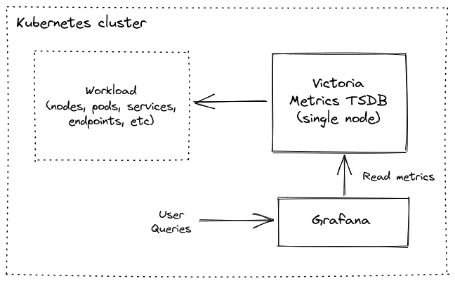
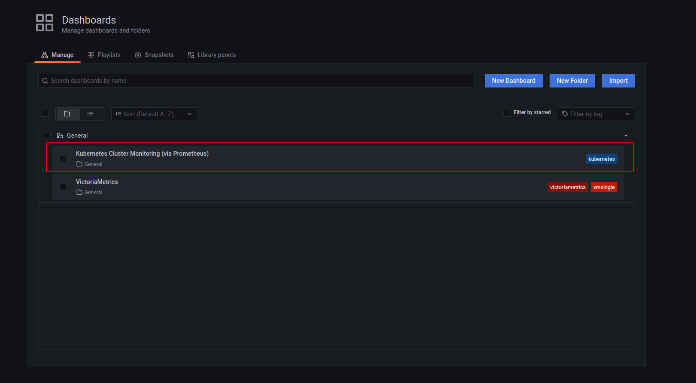
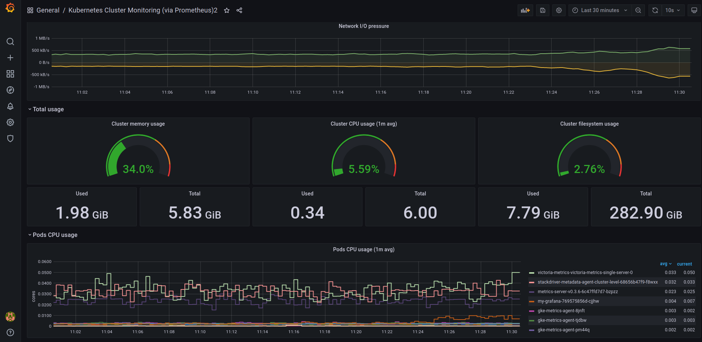
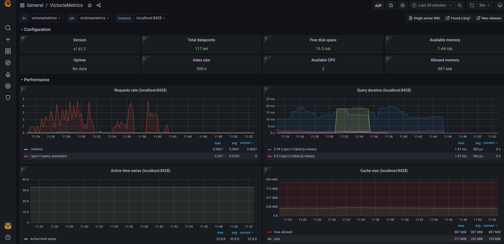

# Kubernetes monitoring with VictoriaMetrics Single


**This guide covers:**

* The setup of VictoriaMetrics single node in Kubernetes via helm charts
* How to store metrics 
* How to scrape metrics from k8s components using service discovery 
* How to Visualize stored data 


**Precondition**


We will use:
* [Kubernetes cluster 1.19.10-gke.1600](https://cloud.google.com/kubernetes-engine)
> We use GKE cluster from GCP but feel free to use any kubernetes setup eg [Amazon EKS](https://aws.amazon.com/ru/eks/)
* [helm 3 ](https://helm.sh/docs/intro/install)
* [kubectl 1.21](https://kubernetes.io/docs/tasks/tools/install-kubectl)

<p align="center">
  
</p>

**1. VictoriaMetrics helm repository**

> For this guide we will use helm 3 but if you already use helm 2 please see this [https://github.com/VictoriaMetrics/helm-charts#for-helm-v2](https://github.com/VictoriaMetrics/helm-charts#for-helm-v2)

You need to add the VictoriaMetrics helm repository to install VictoriaMetrics components. We’re going to use VictoriaMetrics single-node. You can do this by running the following command:

<div class="with-copy" markdown="1">

```bash
helm repo add vm https://victoriametrics.github.io/helm-charts/
```

</div>

Update helm repositories:

<div class="with-copy" markdown="1">

```bash
helm repo update
```

</div>

To verify that everything is set up correctly you may run this command:

<div class="with-copy" markdown="1">

```bash
helm search repo vm/
```

</div>

The expected output is:

```bash
NAME                          CHART VERSION APP VERSION DESCRIPTION                                       
vm/victoria-metrics-agent     0.7.20        v1.62.0     Victoria Metrics Agent - collects metrics from ...
vm/victoria-metrics-alert     0.3.34        v1.62.0     Victoria Metrics Alert - executes a list of giv...
vm/victoria-metrics-auth      0.2.23        1.62.0      Victoria Metrics Auth - is a simple auth proxy ...
vm/victoria-metrics-cluster   0.8.30        1.62.0      Victoria Metrics Cluster version - high-perform...
vm/victoria-metrics-k8s-stack 0.2.8         1.16.0      Kubernetes monitoring on VictoriaMetrics stack....
vm/victoria-metrics-operator  0.1.15        0.15.1      Victoria Metrics Operator                         
vm/victoria-metrics-single    0.7.4         1.62.0      Victoria Metrics Single version - high-performa...
```


**2. Install VictoriaMetrics Single from helm Chart**

Run this command in your terminal:

<div class="with-copy" markdown="1">

```yaml
cat <<EOF | helm install victoria-metrics vm/victoria-metrics-single -f -
server:
  scrape:
    enabled: true
EOF
```

</div>

* By running `helm install victoria-metrics vm/victoria-metrics-single` we will install `VictoriaMetrics Single` to default namespace inside your cluster
* By adding `scrape: enable: true` we add and enable autodiscovery scraping from kubernetes cluster to `VictoriaMetrics Single`


As a result of the command you will see the following output:

```bash
NAME: victoria-metrics
LAST DEPLOYED: Fri Jun 25 12:06:13 2021
NAMESPACE: default
STATUS: deployed
REVISION: 1
TEST SUITE: None
NOTES:
The VictoriaMetrics write api can be accessed via port 8428 on the following DNS name from within your cluster:
    victoria-metrics-victoria-metrics-single-server.default.svc.cluster.local


Metrics Ingestion:
  Get the Victoria Metrics service URL by running these commands in the same shell:
    export POD_NAME=$(kubectl get pods --namespace default -l "app=server" -o jsonpath="{.items[0].metadata.name}")
    kubectl --namespace default port-forward $POD_NAME 8428

  Write url inside the kubernetes cluster:
    http://victoria-metrics-victoria-metrics-single-server.default.svc.cluster.local:8428/api/v1/write

Metrics Scrape:
  Pull-based scrapes are enabled
  Scrape config can be displayed by running this command:
    kubectl get cm victoria-metrics-victoria-metrics-single-server-scrapeconfig -n default

  The target’s information is accessible via api:
    Inside cluster:
      http://victoria-metrics-victoria-metrics-single-server.default.svc.cluster.local:8428/atargets
    Outside cluster:
      You need to port-forward service (see instructions above) and call
      http://<service-host-port>/targets

Read Data:
  The following url can be used as the datasource url in Grafana:
    http://victoria-metrics-victoria-metrics-single-server.default.svc.cluster.local:8428

```

For us it’s important to remember the url for the datasource (copy lines from output).

Verify that VictoriaMetrics pod is up and running by executing the following command:

<div class="with-copy" markdown="1">

```bash
kubectl get pods
```

</div>

The expected output is:

```bash
NAME                                                READY   STATUS    RESTARTS   AGE
victoria-metrics-victoria-metrics-single-server-0   1/1     Running   0          22s
```


**3. Install and connect Grafana to VictoriaMetrics with helm**

Add the Grafana helm repository. 

<div class="with-copy" markdown="1">

```bash
helm repo add grafana https://grafana.github.io/helm-charts
helm repo update
```

</div>

See more info on Grafana ArtifactHUB [https://artifacthub.io/packages/helm/grafana/grafana](https://artifacthub.io/packages/helm/grafana/grafana)
By installing the Chart with the release name `my-grafana`, you add the VictoriaMetrics datasource with official dashboard and kubernetes dashboard:

<div class="with-copy" markdown="1">

```yaml
cat <<EOF | helm install my-grafana grafana/grafana -f -
  datasources:
    datasources.yaml:
      apiVersion: 1
      datasources:
        - name: victoriametrics
          type: prometheus
          orgId: 1
          url: http://victoria-metrics-victoria-metrics-single-server.default.svc.cluster.local:8428
          access: proxy
          isDefault: true
          updateIntervalSeconds: 10
          editable: true

  dashboardProviders:
   dashboardproviders.yaml:
     apiVersion: 1
     providers:
     - name: 'default'
       orgId: 1
       folder: ''
       type: file
       disableDeletion: true
       editable: true
       options:
         path: /var/lib/grafana/dashboards/default

  dashboards:
    default:
      victoriametrics:
        gnetId: 10229
        revision: 19
        datasource: victoriametrics
      kubernetes:
        gnetId: 14205
        revision: 1
        datasource: victoriametrics
EOF
```

</div>

By running this command we:
* Install Grafana from helm repository.
* Provision VictoriaMetrics datasource with the url from the output above which we copied before.
* Add this [https://grafana.com/grafana/dashboards/10229](https://grafana.com/grafana/dashboards/10229) dashboard for VictoriaMetrics.
* Add this [https://grafana.com/grafana/dashboards/14205](https://grafana.com/grafana/dashboards/14205) dashboard to see Kubernetes cluster metrics.


Check the output log in your terminal.
To see the password for Grafana `admin` user use the following command:

<div class="with-copy" markdown="1">

```bash
kubectl get secret --namespace default my-grafana -o jsonpath="{.data.admin-password}" | base64 --decode ; echo
```

</div>

Expose Grafana service on `127.0.0.1:3000`:

<div class="with-copy" markdown="1">

```bash
export POD_NAME=$(kubectl get pods --namespace default -l "app.kubernetes.io/name=grafana,app.kubernetes.io/instance=my-grafana" -o jsonpath="{.items[0].metadata.name}")

kubectl --namespace default port-forward $POD_NAME 3000
```

</div>

Now Grafana should be accessible on the [http://127.0.0.1:3000](http://127.0.0.1:3000) address.


**4. Check the obtained result in your browser**

To check that VictoriaMetrics has collected metrics from the k8s cluster open in browser [http://127.0.0.1:3000/dashboards](http://127.0.0.1:3000/dashboards) and choose `Kubernetes Cluster Monitoring (via Prometheus)` dashboard. Use `admin` for login and `password` that you previously obtained from kubectl. 

<p align="center">
  
</p>

You will see something like this:
<p align="center">
  
</p>

VictoriaMetrics dashboard also available to use:
<p align="center">
  
</p>

**5. Final thoughts**

* We have set up TimeSeries Database for your k8s cluster.
* We collected metrics from all running pods, nodes, … and stored them in VictoriaMetrics database.
* We can visualize the resources used in your Kubernetes cluster by using Grafana dashboards.
