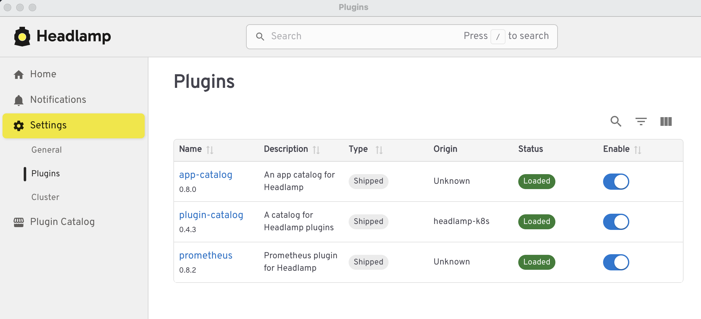
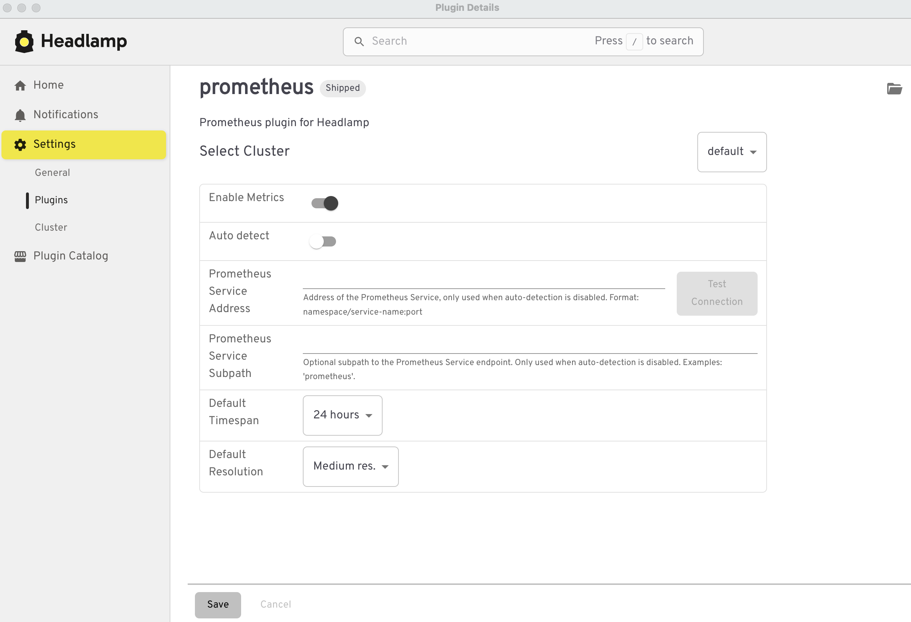
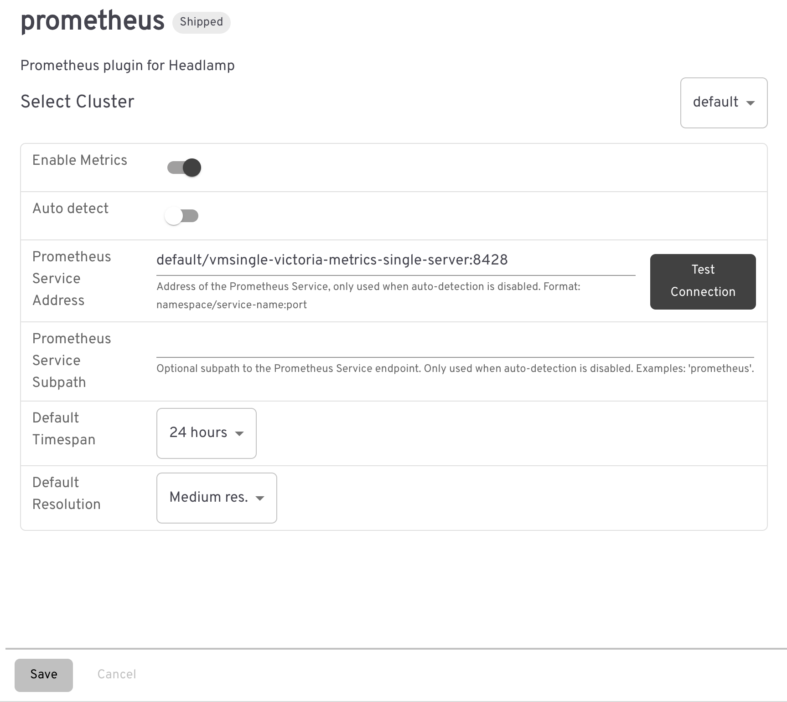

---
build:
  list: never
  publishResources: false
  render: never
sitemap:
  disable: true
---

Headlamp is a user-friendly Kubernetes UI with a built-in Prometheus plugin that can show metrics from VictoriaMetrics.

This guide shows how to point Headlamp’s Prometheus integration at VictoriaMetrics single node or VictoriaMetrics cluster to display CPU, memory, network, and filesystem graphs for your Kubernetes resources directly in the UI.

## 1. Install VictoriaMetrics

The VictoriaMetrics time-series database must be running in your Kubernetes cluster.

Install either of these versions:

- VictoriaMetrics single-node: [Kubernetes monitoring via VictoriaMetrics Single](https://docs.victoriametrics.com/guides/k8s-monitoring-via-vm-single/)
- VictoriaMetrics cluster: [Kubernetes monitoring with VictoriaMetrics Cluster](https://docs.victoriametrics.com/guides/k8s-monitoring-via-vm-cluster/)

Once installed and running, note the `NAME`, `PORT`, and the namespace where the service is running.

- For the single-node version:

    ```sh
    kubectl get svc -l app.kubernetes.io/instance=vmsingle

    NAME                                      TYPE        CLUSTER-IP   EXTERNAL-IP   PORT(S)    AGE
    vmsingle-victoria-metrics-single-server   ClusterIP   None         <none>        8428/TCP   15m
    ```

- For the cluster version:

    ```sh
    kubectl get svc -l app=vmselect

    NAME                                          TYPE        CLUSTER-IP     EXTERNAL-IP   PORT(S)    AGE
    vmcluster-victoria-metrics-cluster-vmselect   ClusterIP   10.43.41.195   <none>        8481/TCP   2m2s
    ```


## 2. Configure Headlamp

You can run Headlamp as a [desktop application](https://headlamp.dev/docs/latest/installation/desktop/) or as an [in-cluster service](https://headlamp.dev/docs/latest/installation/in-cluster/).

To configure the Prometheus plugin, go to **Settings** > **Plugins** and select Prometheus.


<figcaption style="text-align: center; font-style: italic;">Built-in plugins in Headlamp UI (desktop version)</figcaption>

Ensure **Enable metrics** is activated and **Auto-detect** is disabled. 


<figcaption style="text-align: center; font-style: italic;">Prometheus plugin: Enable metrics and disable auto-detect</figcaption>

Fill in the Prometheus Service Address in the following format:

```text
namespace/service-name:port
```

For example, in the single-node version running in the default namespace, the address looks like:

```text
default/vmsingle-victoria-metrics-single-server:8428
```


<figcaption style="text-align: center; font-style: italic;">Prometheus plugin configured for VictoriaMetrics single node</figcaption>

For the cluster version, the address looks like:

```text
default/vmcluster-victoria-metrics-cluster-vmselect:8481
```

In addition, only for the cluster version, you must fill in the following path in **Prometheus service subpath**, where `0` is the default [Tenant ID](https://docs.victoriametrics.com/victoriametrics/cluster-victoriametrics/#multitenancy):

```text
/select/0/prometheus
```


<figcaption style="text-align: center; font-style: italic;">Prometheus plugin configured for VictoriaMetrics cluster</figcaption>

Press **Save** to confirm your changes.

> [!NOTE]
> The **Test Connection** button does not work with VictoriaMetrics. You can ignore this error; metrics should still be displayed correctly in Headlamp.

You should now find the Show Prometheus metrics option on several pages.


<figcaption style="text-align: center; font-style: italic;">Headlamp showing CPU metrics for a pod</figcaption>

## See also

- [Kubernetes monitoring via VictoriaMetrics Single](https://docs.victoriametrics.com/guides/k8s-monitoring-via-vm-single/)
- [Kubernetes monitoring with VictoriaMetrics Cluster](https://docs.victoriametrics.com/guides/k8s-monitoring-via-vm-cluster/)


