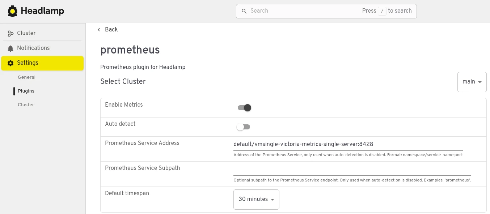
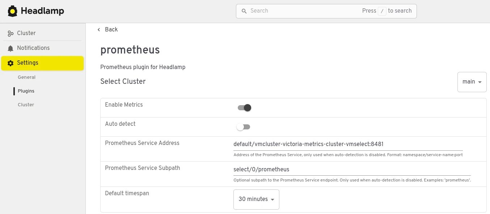

---
build:
  list: never
  publishResources: false
  render: never
sitemap:
  disable: true
---

Headlamp is a user-friendly Kubernetes UI focused on extensibility. It supports displaying metrics for Kubernetes resources via a built-in Prometheus plugin. Here's the plugin configuration to use in-cluster VictoriaMetrics Single - set Prometheus Service Address to `<namespace>/<vmsingle service name>:8428`:

In case of cluster installation, point to the vmselect service (
` <namespace>/<vmselect service name>:8481`) and specify the prometheus-compatible subpath `select/<tenant id>/prometheus`:

The plugin will display CPU/Memory/Network/Filesystem graphs for k8s resources:

