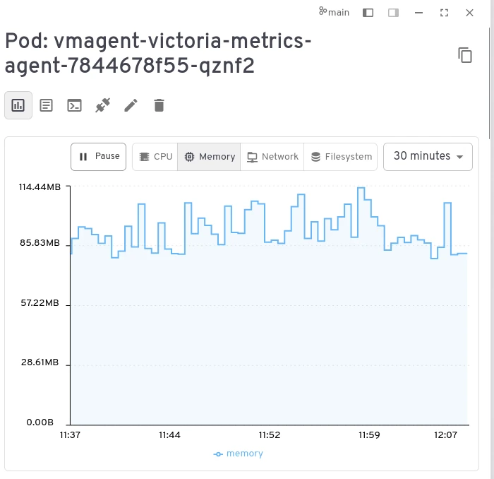

---
build:
  list: never
  publishResources: false
  render: never
sitemap:
  disable: true
---

Headlamp is a user-friendly Kubernetes UI focused on extensibility. It supports displaying metrics for Kubernetes resources via a built-in Prometheus plugin. Here's the plugin configuration to use in-cluster VictoriaMetrics Single - set Prometheus Service Address to `<namespace>/<vmsingle service name>:8428`:


In case of cluster installation, point to the vmselect service (
` <namespace>/<vmselect service name>:8481`) and specify the prometheus-compatible subpath `select/<tenant id>/prometheus`:


The plugin will display CPU/Memory/Network/Filesystem graphs for k8s resources:


STEPS:

```sh
helm repo add headlamp https://kubernetes-sigs.github.io/headlamp/
helm install my-headlamp headlamp/headlamp --namespace kube-system
```

```text
NAME: my-headlamp
LAST DEPLOYED: Tue Feb 10 17:11:26 2026
NAMESPACE: kube-system
STATUS: deployed
REVISION: 1
DESCRIPTION: Install complete
TEST SUITE: None
NOTES:
1. Get the application URL by running these commands:
  export POD_NAME=$(kubectl get pods --namespace kube-system -l "app.kubernetes.io/name=headlamp,app.kubernetes.io/instance=my-headlamp" -o jsonpath="{.items[0].metadata.name}")
  export CONTAINER_PORT=$(kubectl get pod --namespace kube-system $POD_NAME -o jsonpath="{.spec.containers[0].ports[0].containerPort}")
  echo "Visit http://127.0.0.1:8080 to use your application"
  kubectl --namespace kube-system port-forward $POD_NAME 8080:$CONTAINER_PORT
2. Get the token using
  kubectl create token my-headlamp --namespace kube-system
```


port-forward

```sh
export POD_NAME=$(kubectl get pods --namespace kube-system -l "app.kubernetes.io/name=headlamp,app.kubernetes.io/instance=my-headlamp" -o jsonpath="{.items[0].metadata.name}")

export CONTAINER_PORT=$(kubectl get pod --namespace kube-system $POD_NAME -o jsonpath="{.spec.containers[0].ports[0].containerPort}")

kubectl --namespace kube-system port-forward $POD_NAME 8080:$CONTAINER_PORT
```
