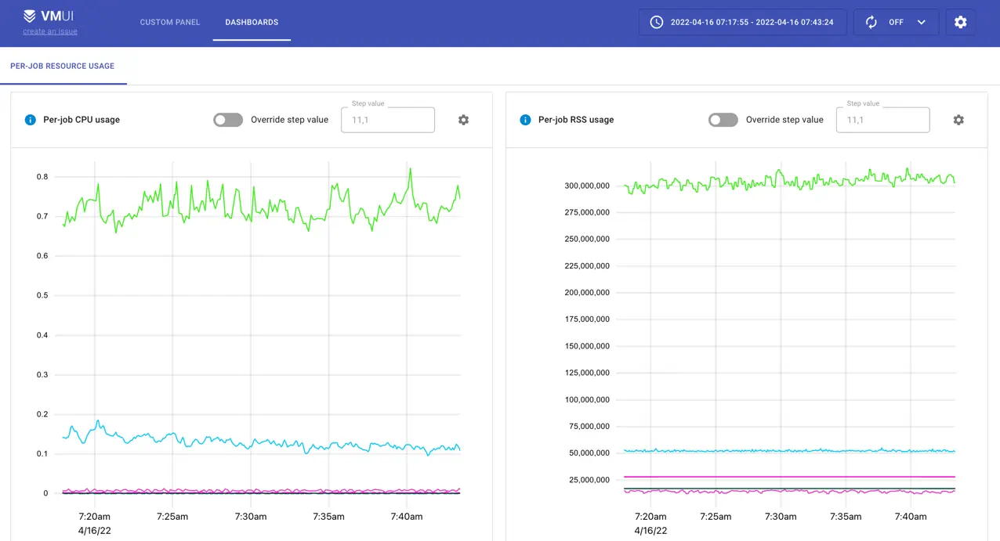
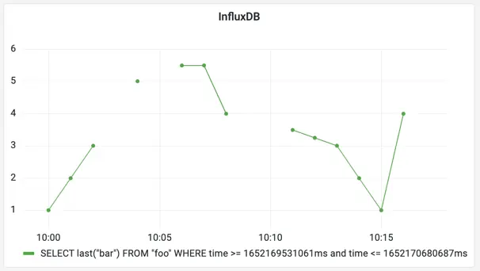
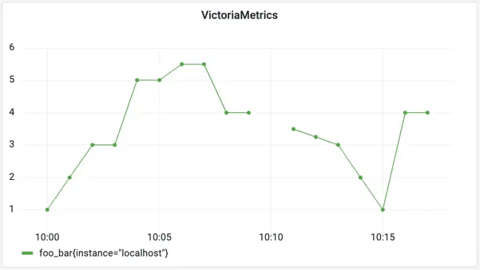

# Migrate from InfluxDB to VictoriaMetrics

InfluxDB is a well-known time series database built for
[IoT](https://en.wikipedia.org/wiki/Internet_of_things) monitoring, Application Performance Monitoring (APM) and
analytics. It has its query language, unique data model, and rich tooling for collecting and processing metrics.

Nowadays, the volume of time series data grows constantly, as well as requirements for durable time series storage. And
sometimes old known solutions just can't keep up with the new expectations.

VictoriaMetrics is a high-performance opensource time series database specifically designed to deal with huge volumes of
monitoring data while remaining cost-efficient at the same time. Many companies are choosing to migrate from InfluxDB to
VictoriaMetrics specifically for performance and scalability reasons. Along them see case studies provided by
[ARNES](https://docs.victoriametrics.com/casestudies/#arnes)
and [Brandwatch](https://docs.victoriametrics.com/casestudies/#brandwatch).

This guide will cover the differences between two solutions, most commonly asked questions, and approaches for migrating
from InfluxDB to VictoriaMetrics.

## Data model differences

While readers are likely familiar
with [InfluxDB key concepts](https://docs.influxdata.com/influxdb/v2.2/reference/key-concepts/), the data model of
VictoriaMetrics is something [new to explore](https://docs.victoriametrics.com/keyconcepts/#data-model). Let's start
with similarities and differences:

* both solutions are **schemaless**, which means there is no need to define metrics or their tags in advance;
* multidimensional data support is implemented
  via [tags](https://docs.influxdata.com/influxdb/v2.2/reference/key-concepts/data-elements/#tags)
  in InfluxDB and via [labels](https://docs.victoriametrics.com/keyconcepts/#structure-of-a-metric) in
  VictoriaMetrics. However, labels in VictoriaMetrics are always `strings`, while InfluxDB supports multiple data types;
* timestamps are stored with nanosecond resolution in InfluxDB, while in VictoriaMetrics it is **milliseconds**;
* in VictoriaMetrics metric value is always `float64`, while InfluxDB supports multiple data types.
* there are
  no [measurements](https://docs.influxdata.com/influxdb/v2.2/reference/key-concepts/data-elements/#measurement)
  or [fields](https://docs.influxdata.com/influxdb/v2.2/reference/key-concepts/data-elements/#field-key) in
  VictoriaMetrics, metric name contains it all. If measurement contains more than 1 field, then for VictoriaMetrics
  it will be multiple metrics;
* there are no [databases](https://docs.influxdata.com/influxdb/v1.8/concepts/glossary/#database), 
  [buckets](https://docs.influxdata.com/influxdb/v2.2/reference/key-concepts/data-elements/#bucket)
  or [organizations](https://docs.influxdata.com/influxdb/v2.2/reference/key-concepts/data-elements/#organization). All
  data in VictoriaMetrics is stored in a global namespace or within
  a [tenant](https://docs.victoriametrics.com/cluster-victoriametrics/#multitenancy). 
  See more about multi-tenancy [here](https://docs.victoriametrics.com/keyconcepts/#multi-tenancy). 

Let's consider the
following [sample data](https://docs.influxdata.com/influxdb/v2.2/reference/key-concepts/data-elements/#sample-data)
borrowed from InfluxDB docs as an example:

| _measurement | _field | location | scientist   | _value | _time                |
|--------------|--------|----------|-------------|--------|----------------------|
| census       | bees   | klamath  | anderson    | 23     | 2019-08-18T00:00:00Z |
| census       | ants   | portland | mullen      | 30     | 2019-08-18T00:00:00Z |
| census       | bees   | klamath  | anderson    | 28     | 2019-08-18T00:06:00Z |
| census       | ants   | portland | mullen      | 32     | 2019-08-18T00:06:00Z |

In VictoriaMetrics data model this sample will have the following form:

| metric name | labels                                       | value | time                 |
|-------------|:---------------------------------------------|-------|----------------------|
| census_bees | {location="klamath", scientist="anderson"}   | 23    | 2019-08-18T00:00:00Z |
| census_ants | {location="portland", scientist="mullen"}    | 30    | 2019-08-18T00:00:00Z |
| census_bees | {location="klamath", scientist="anderson"}   | 28    | 2019-08-18T00:06:00Z |
| census_ants | {location="portland", scientist="mullen"}    | 32    | 2019-08-18T00:06:00Z |

Actually, metric name for VictoriaMetrics is also a label with static name `__name__`, and example above can be
converted to `{__name__="census_bees", location="klamath", scientist="anderson"}`. All labels are indexed by
VictoriaMetrics, so lookups by names or labels have the same query speed.


## Write data

VictoriaMetrics
supports [InfluxDB line protocol](https://docs.victoriametrics.com/#how-to-send-data-from-influxdb-compatible-agents-such-as-telegraf)
for data ingestion. For example, to write a measurement to VictoriaMetrics we need to send an HTTP POST request with
payload in a line protocol format:

```sh
curl -d 'census,location=klamath,scientist=anderson bees=23 1566079200000' -X POST 'http://<victoriametric-addr>:8428/write'
```

_hint: timestamp in the example might be out of configured retention for VictoriaMetrics. Consider increasing the
retention period or changing the timestamp, if that is the case._

Please note, an arbitrary number of lines delimited by `\n` (aka newline char) can be sent in a single request.

To get the written data back let's export all series matching the `location="klamath"` filter:

```sh
curl -G 'http://<victoriametric-addr>:8428/api/v1/export' -d 'match={location="klamath"}'   
```

The expected response is the following:

```json
{
  "metric": {
    "__name__": "census_bees",
    "location": "klamath",
    "scientist": "anderson"
  },
  "values": [
    23
  ],
  "timestamps": [
    1566079200000
  ]
}
```

Please note, VictoriaMetrics performed additional
[data mapping](https://docs.victoriametrics.com/#how-to-send-data-from-influxdb-compatible-agents-such-as-telegraf)
to the data ingested via InfluxDB line protocol.

Support of InfluxDB line protocol also means VictoriaMetrics is compatible with
[Telegraf](https://github.com/influxdata/telegraf). To configure Telegraf, simply
add `http://<victoriametric-addr>:8428` URL to Telegraf configs:

```
[[outputs.influxdb]]
  urls = ["http://<victoriametrics-addr>:8428"]
```

In addition to InfluxDB line protocol, VictoriaMetrics supports many other ways for
[metrics collection](https://docs.victoriametrics.com/keyconcepts/#write-data).

## Query data

VictoriaMetrics does not have a command-line interface (CLI). Instead, it provides
an [HTTP API](https://docs.victoriametrics.com/single-server-victoriametrics/#prometheus-querying-api-usage)
for serving read queries. This API is used in various integrations such as
[Grafana](https://docs.victoriametrics.com/single-server-victoriametrics/#grafana-setup). The same API is also used
by [VMUI](https://docs.victoriametrics.com/single-server-victoriametrics/#vmui) - a graphical User Interface for
querying and visualizing metrics:



See more about [how to query data in VictoriaMetrics](https://docs.victoriametrics.com/keyconcepts/#query-data).

### Basic concepts

Let's take a closer look at querying specific with the following data sample:

```sql
foo
,instance=localhost bar=1.00 1652169600000000000
foo,instance=localhost bar=2.00 1652169660000000000
foo,instance=localhost bar=3.00 1652169720000000000
foo,instance=localhost bar=5.00 1652169840000000000
foo,instance=localhost bar=5.50 1652169960000000000
foo,instance=localhost bar=5.50 1652170020000000000
foo,instance=localhost bar=4.00 1652170080000000000
foo,instance=localhost bar=3.50 1652170260000000000
foo,instance=localhost bar=3.25 1652170320000000000
foo,instance=localhost bar=3.00 1652170380000000000
foo,instance=localhost bar=2.00 1652170440000000000
foo,instance=localhost bar=1.00 1652170500000000000
foo,instance=localhost bar=4.00 1652170560000000000
```

The data sample consists data points for a measurement `foo`
and a field `bar` with additional tag `instance=localhost`. If we would like plot this data as a time series in Grafana
it might have the following look:



The query used for this panel is written in
[InfluxQL](https://docs.influxdata.com/influxdb/v1.8/query_language/):

```sql
SELECT last ("bar")
FROM "foo"
WHERE ("instance" = 'localhost')
  AND $timeFilter
GROUP BY time (1m)
```

Having this, let's import the same data sample in VictoriaMetrics and plot it in Grafana as well. To understand how the
InfluxQL query might be translated to MetricsQL let's break it into components first:

* `SELECT last("bar") FROM "foo"` - all requests
  to [instant](https://docs.victoriametrics.com/keyconcepts/#instant-query)
  or [range](https://docs.victoriametrics.com/keyconcepts/#range-query) VictoriaMetrics APIs are reads, so no need
  to specify the `SELECT` statement. There are no `measurements` or `fields` in VictoriaMetrics, so the whole expression
  can be replaced with `foo_bar` in MetricsQL;
* `WHERE ("instance" = 'localhost')`- [filtering by labels](https://docs.victoriametrics.com/keyconcepts/#filtering)
  in MetricsQL requires specifying the filter in curly braces next to the metric name. So in MetricsQL filter expression
  will be translated to `{instance="localhost"}`;
* `WHERE $timeFilter` - filtering by time is done via request params sent along with query, so in MetricsQL no need to
  specify this filter;
* `GROUP BY time(1m)` - grouping by time is done by default
  in [range](https://docs.victoriametrics.com/keyconcepts/#range-query) API according to specified `step` param.
  This param is also a part of params sent along with request. See how to perform additional
  [aggregations and grouping via MetricsQL](https://docs.victoriametrics.com/keyconcepts/#aggregation-and-grouping-functions)
  .

In result, executing the `foo_bar{instance="localhost"}` MetricsQL expression with `step=1m` for the same set of data in
Grafana will have the following form:



Visualizations from both databases are a bit different - VictoriaMetrics shows some extra points
filling the gaps in the graph. This behavior is described in more
detail [here](https://docs.victoriametrics.com/keyconcepts/#range-query). In InfluxDB, we can achieve a similar
behavior by adding `fill(previous)` to the query.

VictoriaMetrics fills the gaps on the graph assuming time series are always continuous and not discrete.
To limit the interval on which VictoriaMetrics will try to fill the gaps, set `-search.setLookbackToStep`
command-line flag. This limits the gap filling to a single `step` interval passed to
[/api/v1/query_range](https://docs.victoriametrics.com/keyconcepts/#range-query).
This behavior is close to InfluxDB data model.


### Advanced usage

The good thing is that knowing the basics and some aggregation functions is often enough for using MetricsQL or PromQL.
Let's consider one of the most popular Grafana
dashboards [Node Exporter Full](https://grafana.com/grafana/dashboards/1860). It has almost 15 million downloads and
about 230 PromQL queries in it! But a closer look at those queries shows the following:

* ~120 queries are just selecting a metric with label filters,
  e.g. `node_textfile_scrape_error{instance="$node",job="$job"}`;
* ~80 queries are using [rate](https://docs.victoriametrics.com/metricsql/#rate) function for selected metric,
  e.g. `rate(node_netstat_Tcp_InSegs{instance=\"$node\",job=\"$job\"})`
* and the rest
  are [aggregation functions](https://docs.victoriametrics.com/keyconcepts/#aggregation-and-grouping-functions)
  like [sum](https://docs.victoriametrics.com/metricsql/#sum)
  or [count](https://docs.victoriametrics.com/metricsql/#count).

To get a better understanding of how MetricsQL works, see the following resources:

* [MetricsQL concepts](https://docs.victoriametrics.com/keyconcepts/#metricsql);
* [MetricsQL functions](https://docs.victoriametrics.com/metricsql/);
* [PromQL tutorial for beginners](https://valyala.medium.com/promql-tutorial-for-beginners-9ab455142085).

## How to migrate current data from InfluxDB to VictoriaMetrics

Migrating data from other TSDBs to VictoriaMetrics is as simple as importing data via any of
[supported formats](https://docs.victoriametrics.com/keyconcepts/#push-model).

But migration from InfluxDB might get easier when using [vmctl](https://docs.victoriametrics.com/vmctl/) -
VictoriaMetrics command-line tool. See more about
migrating [from InfluxDB v1.x versions](https://docs.victoriametrics.com/vmctl/#migrating-data-from-influxdb-1x).
Migrating data from InfluxDB v2.x is not supported yet. But there is
useful [3rd party solution](https://docs.victoriametrics.com/vmctl/#migrating-data-from-influxdb-2x) for this.

Please note, that data migration is a backfilling process. So, please
consider [backfilling tips](https://docs.victoriametrics.com/single-server-victoriametrics/#backfilling).

## Frequently asked questions

* How does VictoriaMetrics compare to InfluxDB?
    * _[Answer](https://docs.victoriametrics.com/faq/#how-does-victoriametrics-compare-to-influxdb)_
* Why don't VictoriaMetrics support Remote Read API, so I don't need to learn MetricsQL?
    * _[Answer](https://docs.victoriametrics.com/faq/#why-doesnt-victoriametrics-support-the-prometheus-remote-read-api)_
* The PromQL and MetricsQL are often mentioned together - why is that?
    * _MetricsQL - query language inspired by PromQL. MetricsQL is backward-compatible with PromQL, so Grafana
      dashboards backed by Prometheus datasource should work the same after switching from Prometheus to
      VictoriaMetrics. Both languages mostly share the same concepts with slight differences._
* Query returns more data points than expected - why?
    * _VictoriaMetrics may return non-existing data points if `step` param is lower than the actual data resolution. See
      more about this [here](https://docs.victoriametrics.com/keyconcepts/#range-query)._
* How do I get the `real` last data point, not `ephemeral`?
    * _[last_over_time](https://docs.victoriametrics.com/metricsql/#last_over_time) function can be used for
      limiting the lookbehind window for calculated data. For example, `last_over_time(metric[10s])` would return
      calculated samples only if the real samples are located closer than 10 seconds to the calculated timestamps
      according to
      `start`, `end` and `step` query args passed
      to [range query](https://docs.victoriametrics.com/keyconcepts/#range-query)._
* How do I get raw data points with MetricsQL?
    * _For getting raw data points specify the interval at which you want them in square brackets and send
      as [instant query](https://docs.victoriametrics.com/keyconcepts/#instant-query). For
      example, `GET api/v1/query?query=my_metric[5m]&time=<time>` will return raw samples for `my_metric` in interval
      from `<time>` to `<time>-5m`._
* Can you have multiple aggregators in a MetricsQL query, e.g. `SELECT MAX(field), MIN(field) ...`?
    * _Yes, try the following query `( alias(max(field), "max"), alias(min(field), "min") )`._
* How to translate Influx `percentile` function to MetricsQL?
    * _[Answer](https://stackoverflow.com/questions/66431990/translate-influx-percentile-function-to-promqlb)_
* How to translate Influx `stddev` function to MetricsQL?
    * _[Answer](https://stackoverflow.com/questions/66433143/translate-influx-stddev-to-promql)_
