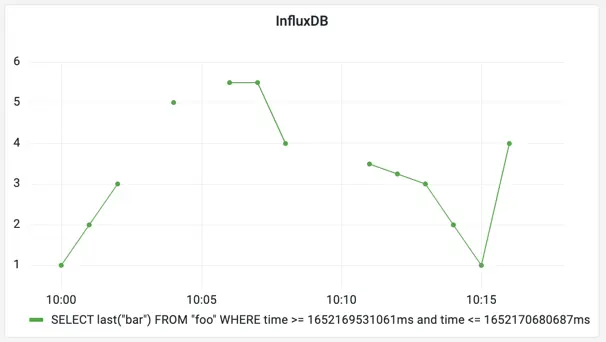
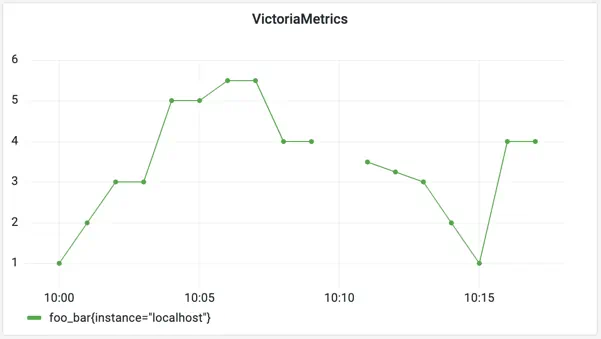

---
build:
  list: never
  publishResources: false
  render: never
sitemap:
  disable: true
---
InfluxDB is a well-known time series database built for
[IoT](https://en.wikipedia.org/wiki/Internet_of_things) monitoring, Application Performance Monitoring (APM) and
analytics. It has its query language, unique data model, and rich tooling for collecting and processing metrics.

VictoriaMetrics is a high-performance opensource time series database specifically designed to deal with huge volumes of
monitoring data while remaining cost-efficient at the same time. Many companies are choosing to migrate from InfluxDB to
VictoriaMetrics specifically for performance and scalability reasons. Along them see case studies provided by
[ARNES](https://docs.victoriametrics.com/victoriametrics/casestudies/#arnes)
and [Brandwatch](https://docs.victoriametrics.com/victoriametrics/casestudies/#brandwatch).

This guide covers the differences between two solutions, most commonly asked questions, and approaches for migrating
from InfluxDB to VictoriaMetrics.

## Data model differences

Readers are familiar with [InfluxDB key concepts](https://docs.influxdata.com/influxdb/v2.2/reference/key-concepts/).
The data model of VictoriaMetrics is [explained here](https://docs.victoriametrics.com/victoriametrics/keyconcepts/#data-model). 
Let's list similarities and differences:

* both databases are **schemaless**, which means there is no need to define metrics or their tags in advance;
* multidimensional data support is implemented
  via [tags](https://docs.influxdata.com/influxdb/v2.2/reference/key-concepts/data-elements/#tags)
  in InfluxDB and via [labels](https://docs.victoriametrics.com/victoriametrics/keyconcepts/#structure-of-a-metric) in
  VictoriaMetrics. However, labels in VictoriaMetrics are always [strings](https://docs.victoriametrics.com/victoriametrics/keyconcepts/#labels),
  while InfluxDB supports many data types;
* timestamps are stored with **nanosecond** resolution in InfluxDB, while in VictoriaMetrics it is **milliseconds**;
* in VictoriaMetrics metric value is always [float64](https://docs.victoriametrics.com/victoriametrics/keyconcepts/#raw-samples),
  while InfluxDB supports multiple data types.
* there are
  no [measurements](https://docs.influxdata.com/influxdb/v2.2/reference/key-concepts/data-elements/#measurement)
  or [fields](https://docs.influxdata.com/influxdb/v2.2/reference/key-concepts/data-elements/#field-key) in
  VictoriaMetrics, metric name contains it all. If measurement contains more than 1 field, then for VictoriaMetrics
  it will be multiple metrics;
* there are no [databases](https://docs.influxdata.com/influxdb/v1.8/concepts/glossary/#database), 
  [buckets](https://docs.influxdata.com/influxdb/v2.2/reference/key-concepts/data-elements/#bucket)
  or [organizations](https://docs.influxdata.com/influxdb/v2.2/reference/key-concepts/data-elements/#organization).
  All data in VictoriaMetrics is stored in a global namespace or within a [tenant](https://docs.victoriametrics.com/victoriametrics/keyconcepts/#multi-tenancy). 
* VictoriaMetrics query language is [MetricsQL](https://docs.victoriametrics.com/victoriametrics/metricsql/). Influx has multiple versions
  of query languages. VictoriaMetrics doesn't support any of them.

Let's consider the following [sample data](https://docs.influxdata.com/influxdb/v2.2/reference/key-concepts/data-elements/#sample-data)
borrowed from InfluxDB docs as an example:

| _measurement | _field | location | scientist   | _value | _time                |
|--------------|--------|----------|-------------|--------|----------------------|
| census       | bees   | klamath  | anderson    | 23     | 2019-08-18T00:00:00Z |
| census       | ants   | portland | mullen      | 30     | 2019-08-18T00:00:00Z |
| census       | bees   | klamath  | anderson    | 28     | 2019-08-18T00:06:00Z |
| census       | ants   | portland | mullen      | 32     | 2019-08-18T00:06:00Z |

In VictoriaMetrics data model it will have the following form:

| metric name | labels                                       | value | time                 |
|-------------|:---------------------------------------------|-------|----------------------|
| census_bees | {location="klamath", scientist="anderson"}   | 23    | 2019-08-18T00:00:00Z |
| census_ants | {location="portland", scientist="mullen"}    | 30    | 2019-08-18T00:00:00Z |
| census_bees | {location="klamath", scientist="anderson"}   | 28    | 2019-08-18T00:06:00Z |
| census_ants | {location="portland", scientist="mullen"}    | 32    | 2019-08-18T00:06:00Z |

Actually, metric name for VictoriaMetrics is also a label with static name `__name__`, and example above can be
converted to `{__name__="census_bees", location="klamath", scientist="anderson"}`. All labels are automatically indexed
by VictoriaMetrics, so lookups by names or labels have the same query speed.

## Write data

VictoriaMetrics supports [InfluxDB line protocol](https://docs.victoriametrics.com/victoriametrics/integrations/influxdb/)
for data ingestion. For example, to write a measurement to VictoriaMetrics we need to send an HTTP POST request with
payload in a line protocol format:
```sh
curl -d 'census,location=klamath,scientist=anderson bees=23' -X POST 'http://<victoriametrics-addr>:8428/write'
```

_An arbitrary number of lines delimited by `\n` (aka newline char) can be sent in a single request._

To check the written data export series matching the `location="klamath"` filter:
```sh
curl -G 'http://<victoriametrics-addr>:8428/api/v1/export' -d 'match={location="klamath"}'   
```

The expected response is the following:

```json
{
  "metric": {
    "__name__": "census_bees",
    "location": "klamath",
    "scientist": "anderson"
  },
  "values": [
    23
  ],
  "timestamps": [
    1566079200000
  ]
}
```

_VictoriaMetrics performs additional [data mapping](https://docs.victoriametrics.com/victoriametrics/integrations/influxdb/#data-transformations)
to the data ingested via InfluxDB line protocol._

VictoriaMetrics is also compatible with [Telegraf](https://github.com/influxdata/telegraf).
To make Telegraf sending data, simply add `http://<victoriametric-addr>:8428` URL to Telegraf configs:

```toml
[[outputs.influxdb]]
  urls = ["http://<victoriametrics-addr>:8428"]
```

In addition to InfluxDB line protocol, VictoriaMetrics supports many other ways for
[metrics collection](https://docs.victoriametrics.com/victoriametrics/keyconcepts/#write-data).

## Query data

VictoriaMetrics does not have a command-line interface (CLI). Instead, it provides
[VMUI](https://docs.victoriametrics.com/victoriametrics/single-server-victoriametrics/#vmui) - a graphical User Interface for
querying and visualizing metrics:


VictoriaMetrics can be configured as [Grafana datasource](https://docs.victoriametrics.com/victoriametrics/integrations/grafana/).
See more about [how to query data in VictoriaMetrics](https://docs.victoriametrics.com/victoriametrics/keyconcepts/#query-data).

### Basic concepts

Let's use the following data sample:

```text
foo,instance=localhost bar=1.00 1652169600000000000
foo,instance=localhost bar=2.00 1652169660000000000
foo,instance=localhost bar=3.00 1652169720000000000
foo,instance=localhost bar=5.00 1652169840000000000
foo,instance=localhost bar=5.50 1652169960000000000
foo,instance=localhost bar=5.50 1652170020000000000
foo,instance=localhost bar=4.00 1652170080000000000
foo,instance=localhost bar=3.50 1652170260000000000
foo,instance=localhost bar=3.25 1652170320000000000
foo,instance=localhost bar=3.00 1652170380000000000
foo,instance=localhost bar=2.00 1652170440000000000
foo,instance=localhost bar=1.00 1652170500000000000
foo,instance=localhost bar=4.00 1652170560000000000
```

This data sample consists of data points for a measurement `foo` and a field `bar` with additional 
tag `instance=localhost`. If we would like plot this data as a time series in Grafana it might have the following look:



The query used for this panel is written in [InfluxQL](https://docs.influxdata.com/influxdb/v1.8/query_language/):
```sql
SELECT last ("bar")
FROM "foo"
WHERE ("instance" = 'localhost')
  AND $timeFilter
GROUP BY time (1m)
```

Now, let's [import](https://docs.victoriametrics.com/victoriametrics/integrations/influxdb/#influxdb-compatible-agents-such-as-telegraf)
the same data sample in VictoriaMetrics and plot it in Grafana. To understand how the InfluxQL query might be translated
to [MetricsQL](https://docs.victoriametrics.com/victoriametrics/metricsql/) let's break it into components first:

* `SELECT last("bar") FROM "foo"` - all requests to [instant](https://docs.victoriametrics.com/victoriametrics/keyconcepts/#instant-query)
  or [range](https://docs.victoriametrics.com/victoriametrics/keyconcepts/#range-query) VictoriaMetrics APIs are reads, so no need
  to specify the `SELECT` statement. There are no `measurements` or `fields` in VictoriaMetrics, so the whole expression
  can be replaced with `foo_bar` in MetricsQL;
* `WHERE ("instance" = 'localhost')`- [filtering by labels](https://docs.victoriametrics.com/victoriametrics/keyconcepts/#filtering)
  in MetricsQL requires specifying the filter in curly braces next to the metric name. So in MetricsQL filter expression
  will be translated to `{instance="localhost"}`;
* `WHERE $timeFilter` - filtering by time is done via request params sent along with query, so in MetricsQL no need to
  specify this filter;
* `GROUP BY time(1m)` - grouping by time is done by default
  in [range](https://docs.victoriametrics.com/victoriametrics/keyconcepts/#range-query) API according to specified `step` param.
  This param is also a part of params sent along with request. See how to perform additional
  [aggregations and grouping via MetricsQL](https://docs.victoriametrics.com/victoriametrics/keyconcepts/#aggregation-and-grouping-functions).

In result, the MetricsQL expression will have the following form: `foo_bar{instance="localhost"}`. 
See its result executed with `step=1m` for the same set of data in Grafana below:



Visualizations from both databases are a bit different - VictoriaMetrics shows some extra points filling the gaps in the graph.
This behavior is described in more detail [here](https://docs.victoriametrics.com/victoriametrics/keyconcepts/#range-query). 
In InfluxDB, we can achieve a similar behavior by adding `fill(previous)` to the query.

VictoriaMetrics fills the gaps on the graph assuming time series are always continuous and not discrete.
To limit the interval on which VictoriaMetrics will try to fill the gaps, set `-search.setLookbackToStep`
command-line flag. This limits the gap filling to a single `step` interval passed to
[/api/v1/query_range](https://docs.victoriametrics.com/victoriametrics/keyconcepts/#range-query).

### Advanced usage

The good thing is that knowing the basics is often enough for using MetricsQL.
Let's consider one of the most popular Grafana dashboards [Node Exporter Full](https://grafana.com/grafana/dashboards/1860).
It has almost 15 million downloads and about 230 queries in it! But a closer look at those queries shows the following:

* ~120 queries are just selecting a metric with label filters, e.g. `node_textfile_scrape_error{instance="$node",job="$job"}`;
* ~80 queries are using [rate](https://docs.victoriametrics.com/victoriametrics/metricsql/#rate) function for selected metric,
  e.g. `rate(node_netstat_Tcp_InSegs{instance="$node",job="$job"}[5m])`
* and the rest are [aggregation functions](https://docs.victoriametrics.com/victoriametrics/keyconcepts/#aggregation-and-grouping-functions)
  like [sum](https://docs.victoriametrics.com/victoriametrics/metricsql/#sum) or [count](https://docs.victoriametrics.com/victoriametrics/metricsql/#count).

To get a better understanding of how MetricsQL works, see the following resources:
* [MetricsQL concepts](https://docs.victoriametrics.com/victoriametrics/keyconcepts/#metricsql);
* [MetricsQL functions](https://docs.victoriametrics.com/victoriametrics/metricsql/);
* [PromQL tutorial for beginners](https://valyala.medium.com/promql-tutorial-for-beginners-9ab455142085).

## How to migrate current data from InfluxDB to VictoriaMetrics

Migrating data from other databases to VictoriaMetrics is as simple as importing data via any of
[supported ingestion formats](https://docs.victoriametrics.com/victoriametrics/keyconcepts/#push-model).

But migration from InfluxDB might get easier with [vmctl](https://docs.victoriametrics.com/victoriametrics/vmctl/). See more about
migrating [from InfluxDB v1.x versions](https://docs.victoriametrics.com/victoriametrics/vmctl/influxdb/).
Migrating data from InfluxDB v2.x is not supported. But there is a useful [3rd party solution](https://docs.victoriametrics.com/victoriametrics/vmctl/influxdb/#influxdb-v2) 
for this.

Please note, data migration is a backfilling process, so read about [backfilling tips](https://docs.victoriametrics.com/victoriametrics/single-server-victoriametrics/#backfilling).

## Frequently asked questions

* How does VictoriaMetrics compare to InfluxDB?
    * _[VictoriaMetrics is way more resource efficient](https://docs.victoriametrics.com/victoriametrics/faq/#how-does-victoriametrics-compare-to-influxdb)._
* Why don't VictoriaMetrics support Remote Read API, so I don't need to learn MetricsQL?
    * _[Remote Read API has very high performance overhead](https://docs.victoriametrics.com/victoriametrics/faq/#why-doesnrsquot-victoriametrics-support-the-prometheus-remote-read-api)._
* PromQL and MetricsQL are often mentioned together - why is that?
    * _MetricsQL - query language inspired by PromQL. MetricsQL is backward-compatible with PromQL, so Grafana
      dashboards backed by Prometheus datasource should work the same after switching from Prometheus to
      VictoriaMetrics. Both languages share the same concepts with slight differences._
* Query returns more data points than expected - why?
    * _VictoriaMetrics may return non-existing data points if `step` param is lower than the actual data resolution. See
      more about this [here](https://docs.victoriametrics.com/victoriametrics/keyconcepts/#range-query)._
* How do I get the `real` last data point?
    * _[last_over_time](https://docs.victoriametrics.com/victoriametrics/metricsql/#last_over_time) function returns last value on 
      the given look-behind window. For example, `last_over_time(metric[10s])` would return
      sample values only if the real samples are located closer than 10 seconds to the calculated timestamps
      according to `start`, `end` and `step` query args passed
      to [range query](https://docs.victoriametrics.com/victoriametrics/keyconcepts/#range-query)._
    * _[tlast_over_time](https://docs.victoriametrics.com/victoriametrics/metricsql/#tlast_over_time) function returns last timestamp on
      the given look-behind window, similarly to [last_over_time](https://docs.victoriametrics.com/victoriametrics/metricsql/#last_over_time)._
* How do I get raw data points with MetricsQL?
    * _For getting raw data points specify the interval at which you want them in square brackets and send
      as [instant query](https://docs.victoriametrics.com/victoriametrics/keyconcepts/#instant-query). For
      example, `GET api/v1/query?query=my_metric[5m]&time=<time>` will return raw samples for `my_metric` in interval
      from `<time>` to `<time>-5m`._
* Can you have multiple aggregators in a MetricsQL query, e.g. `SELECT MAX(field), MIN(field) ...`?
    * _Yes, try the following query `( alias(max(field), "max"), alias(min(field), "min") )`._
* How to translate Influx `percentile` function to MetricsQL?
    * _[Use histogram_quantile and histogram_over_time functions](https://stackoverflow.com/questions/66431990/translate-influx-percentile-function-to-promqlb)._
* How to translate Influx `stddev` function to MetricsQL?
    * _[Use histogram_stddev and histogram_over_time functions](https://stackoverflow.com/questions/66433143/translate-influx-stddev-to-promql)._
