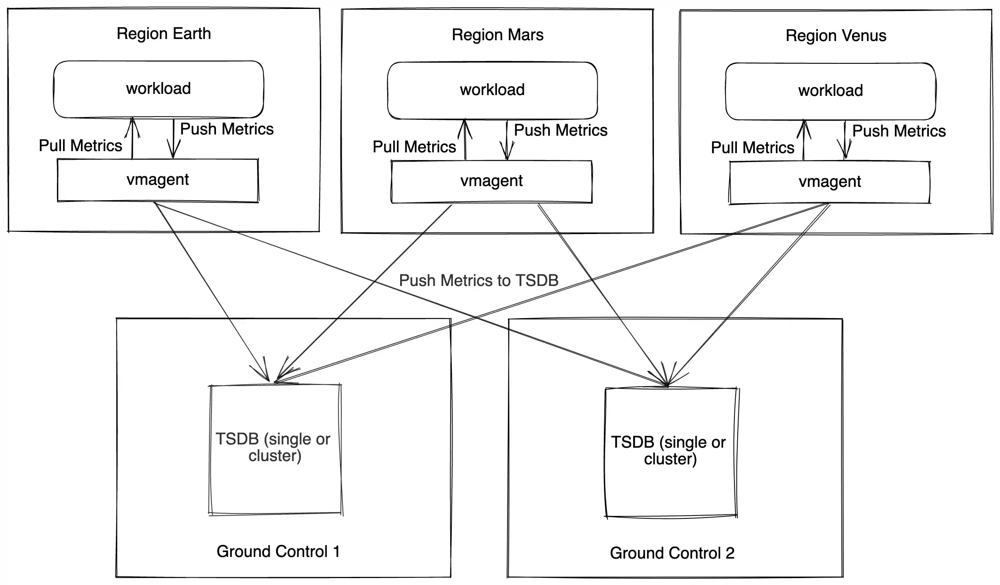

# Multi-regional setup with VictoriaMetrics: Dedicated regions for monitoring

### Scenario

Let's cover the case. You have multiple regions with workloads and want to collect metrics.

The monitoring setup is in the dedicated regions as shown below:



Every workload region (Earth, Mars, Venus) has a vmagent that sends data to multiple regions with a monitoring setup. 
The monitoring setup (Ground Control 1,2) contains VictoriaMetrics Time Series Database(TSDB) cluster or single.

Using this schema, you can achieve:

* Global Querying View
* Querying all metrics from one monitoring installation
* High Availability
* You can lose one region, but your experience will be the same.
* Of course, that means you duplicate your traffic twice.

### How to write the data to Ground Control regions

* You need to pass two `-remoteWrite.url` command-line options to `vmagent`:

```sh
/path/to/vmagent-prod \
  -remoteWrite.url=<ground-control-1-remote-write> \
  -remoteWrite.url=<ground-control-2-remote-write>
```

* If you scrape data from Prometheus-compatible targets, then please specify `-promscrape.config` parameter as well.

Here is a Quickstart guide for [vmagent](https://docs.victoriametrics.com/vmagent/#quick-start)

### How to read the data from Ground Control regions

You can use one of the following options:

1. Multi-level [vmselect setup](https://docs.victoriametrics.com/cluster-victoriametrics/#multi-level-cluster-setup) in cluster setup, top-level vmselect(s) reads data from cluster-level vmselects
   * Returns data in one of the clusters is unavailable  
   * Merges data from both sources. You need to turn on [deduplication](https://docs.victoriametrics.com/cluster-victoriametrics/#deduplication) to remove duplicates 
1. Regional endpoints - use one regional endpoint as default and switch to another if there is an issue.
1. Load balancer - that sends queries to a particular region. The benefit and disadvantage of this setup is that it's simple.
1. Promxy - proxy that reads data from multiple Prometheus-like sources. It allows reading data more intelligently to cover the region's unavailability out of the box. It doesn't support MetricsQL yet (please check this issue).
1. Global vmselect in cluster setup - you can set up an additional subset of vmselects that knows about all storages in all regions.
   * The [deduplication](https://docs.victoriametrics.com/cluster-victoriametrics/#deduplication) in 1ms on the vmselect side must be turned on. This setup allows you to query data using MetricsQL.
   * The downside is that vmselect waits for a response from all storages in all regions.


### High Availability

The data is duplicated twice, and every region contains a full copy of the data. That means one region can be offline.

You don't need to set up a replication factor using the VictoriaMetrics cluster.

### Alerting

You can set up vmalert in each Ground control region that evaluates recording and alerting rules. As every region contains a full copy of the data, you don't need to synchronize recording rules from one region to another.

For alert deduplication, please use [cluster mode in Alertmanager](https://prometheus.io/docs/alerting/latest/alertmanager/#high-availability).

We also recommend adopting the list of [alerting rules](https://github.com/VictoriaMetrics/VictoriaMetrics/tree/master/deployment/docker#alerts)
for VictoriaMetrics components.

### Monitoring

An additional VictoriaMetrics single can be set up in every region, scraping metrics from the main TSDB.

You also may evaluate the option to send these metrics to the neighbour region to achieve HA.

Additional context
* VictoriaMetrics Single - [https://docs.victoriametrics.com/single-server-victoriametrics/#monitoring](https://docs.victoriametrics.com/single-server-victoriametrics/#monitoring)
* VictoriaMetrics Cluster - [https://docs.victoriametrics.com/cluster-victoriametrics/#monitoring](https://docs.victoriametrics.com/cluster-victoriametrics/#monitoring)


### What more can we do?

Setup vmagents in Ground Control regions. That allows it to accept data close to storage and add more reliability if storage is temporarily offline.
g
