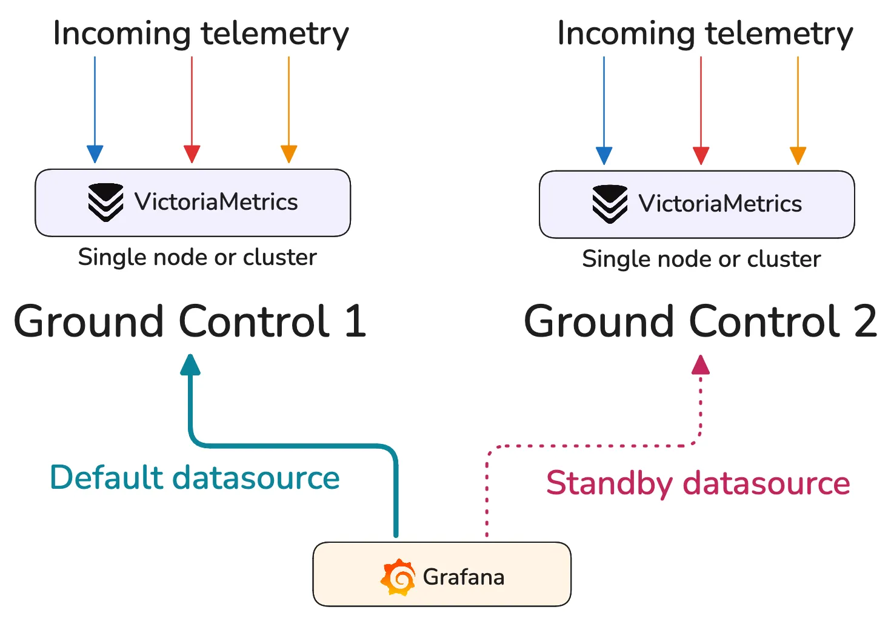
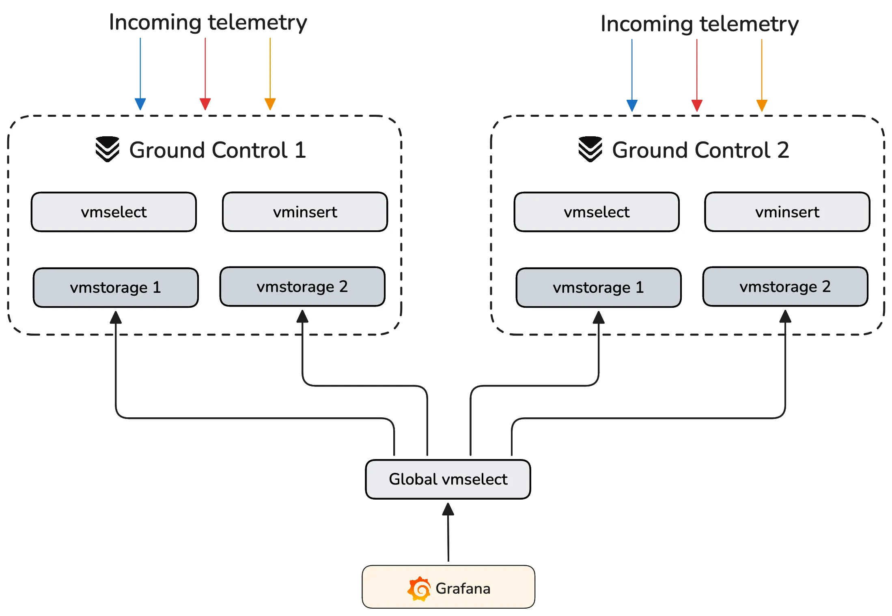

---
build:
  list: never
  publishResources: false
  render: never
sitemap:
  disable: true
---

## Overview {#scenario}

This guide shows how to run VictoriaMetrics across many regions in high-availability mode. Each workload runs a local vmagent and sends metrics to dedicated monitoring deployments, so metric data is duplicated and available even if one monitoring region is down.

Use this architecture when you need region-level resilience and want monitoring to keep working even if one region becomes unavailable.

This setup gives you:

* High availability of metric data across regions.
* A single global query endpoint.
* Simpler disaster recovery.

The trade-off is that you store and send the same data twice, so storage and compute requirements are increased.

## Architecture

The example architecture separates workloads into three regions, called Earth, Mars, and Venus. These represent the systems you want to monitor (e.g., your applications or your infrastructure). For monitoring there are two separate regions, Ground Control 1 and 2, each running its own VictoriaMetrics deployment. The workload regions (the planets) run a local vmagent that forwards the same metrics to the two dedicated Ground Control regions.


{width="700"}

The role of the Ground Controls can be filled by VictoriaMetrics in [single-node](https://docs.victoriametrics.com/victoriametrics/single-server-victoriametrics/) or [cluster mode](https://docs.victoriametrics.com/victoriametrics/cluster-victoriametrics/). Since vmagent keeps a separate queue for each remote-write destination, an outage in one Ground Control region does not block delivery to the other.

### High Availability

The architecture provides high availability by storing two full copies of the data: one in Ground Control 1 and the other in Ground Control 2. Since both store the same data, losing one region doesn't result in a monitoring outage. You can still run queries, view dashboards, and receive alerts.

Note that you do not need to use the VictoriaMetrics cluster `-replicationFactor` flag for this cross-region setup, as high availability comes from vmagent replicating writes to independent monitoring regions.

## How to write the data to Ground Control regions

Run a local vmagent in each workload region (Earth, Mars, Venus) and point it to the Ground Control URLs using the `-remoteWrite.url` flag. For example:

```sh
/path/to/vmagent-prod \
  -remoteWrite.url=https://<ground-control-1-remote-write>:8428 \
  -remoteWrite.url=https://<ground-control-2-remote-write>:8428
```

If you scrape Prometheus-compatible targets in your workloads, also pass a `-promscrape.config` file so vmagent knows what to scrape before it forwards the data.

```sh
/path/to/vmagent-prod \
  -promscrape.config=/path/to/scrape.yaml \
  -remoteWrite.url=https://ground-control-1:8428/api/v1/write \
  -remoteWrite.url=https://ground-control-2:8428/api/v1/write
```

For more details, see the [vmagent quickstart guide](https://docs.victoriametrics.com/victoriametrics/vmagent/#quick-start)

## How to read the data from Ground Control regions

You can read data from Ground Control regions in a few different ways. The best option depends on your needs and operational complexity:

* Regional endpoints: use one region endpoint as default and manually switch to the other during an outage. This is the simplest option but needs manual failover.
* Load balancer: put a load balancer in front of both Ground Control regions. Route traffic to a preferred region, with automatic failover to the other region in case of failure.
* Global vmselect: wire vmselect directly to the vmstorage nodes for both Ground Control regions (which must run in cluster mode).
* Multi-level vmselect: run a dedicated vmselect on top of the Ground Control local vmselect nodes. This setup also requires both Ground Control instances to run in cluster mode.

You can read more about choosing the right architecture in the [VictoriaMetrics topologies guide](https://docs.victoriametrics.com/guides/vm-architectures/).

### Regional endpoints

In this setup, Grafana, vmalert, or any other query client sends requests to one region. This is the default datasource. In case of an outage, you manually switch to the other region (standby datasource). For instance, use Ground Control 1 as the primary datasource and keep Ground Control 2 as a standby endpoint.


{width="700"}

Choose this option if you prioritize operational simplicity over automatic failover or a unified global query endpoint.

If you use VictoriaMetrics single-node, the endpoints should point directly to the single-node HTTP API. For example:

- Primary endpoint: `https://ground-control-1:8428/prometheus/api/v1/query`
- Standby endpoint: `https://ground-control-2:8428/prometheus/api/v1/query`

On the VictoriaMetrics cluster, the endpoints point to the cluster's vmselect HTTP API. For example:

- Primary endpoint: `https://ground-control-1-vmselect:8481/select/0/prometheus`
- Standby endpoint: `https://ground-control-2-vmselect:8481/select/0/prometheus`

### Load balancer

Use a load balancer when you want one stable query endpoint in front of your Ground Control regions. In this setup, dashboards and tools send queries to a single URL, and the load balancer routes them to the first available region. If that region becomes unavailable, the load balancer fails over to the next available region.


{width="700"}

This option provides a single endpoint for metric ingestion. You can use [vmauth](https://docs.victoriametrics.com/victoriametrics/vmauth/) as a load balancer. For VictoriaMetrics single node, you can run it with the following configuration:

```yaml
unauthorized_user:
  url_prefix:
    - "http://ground-control-1:8428/"
    - "http://ground-control-2:8428/"
  load_balancing_policy: first_available
```

On the VictoriaMetrics cluster, the URLs must point to the Ground Control vmselect nodes. For example:

```yaml
unauthorized_user:
  url_prefix:
    - "http://ground-control-1-vmselect:8481/select/0/prometheus/"
    - "http://ground-control-2-vmselect:8481/select/0/prometheus/"
  load_balancing_policy: first_available
```

The examples above show how to load balance requests without authentication. You can optionally configure authentication in several ways; for more details, read the [vmauth authorization section](https://docs.victoriametrics.com/victoriametrics/vmauth/#authorization).

To start vmauth with your configuration, use the `-auth.config` flag. For example:

```sh
/path/to/vmauth-prod -auth.config=/path/to/auth.yaml
```

### Global vmselect

> This option requires a [VictoriaMetrics cluster](https://docs.victoriametrics.com/victoriametrics/cluster-victoriametrics/) for the role of Ground Control.

You can use a global [vmselect](https://docs.victoriametrics.com/victoriametrics/quick-start/#installing-vmselect) when each Ground Control region runs a VictoriaMetrics cluster. In this setup, you run a global vmselect node that connects directly to the storage nodes in both Ground Control regions.


{width="700"}

Since the samples are duplicated across Ground Control regions, you must enable [deduplication](https://docs.victoriametrics.com/victoriametrics/cluster-victoriametrics/#deduplication) on the global vmselect. You must set `-dedup.minScrapeInterval=1ms` at a minimum or to the same value as the scrape interval if there is one.

For example:

```sh
/path/to/vmselect-prod \
  -storageNode=ground-control-1-vmstorage-1:8482,ground-control-1-vmstorage-2:8482,ground-controll-2-vmstorage-1:8482,ground-control-2-vmstorage-2:8482 \
  -dedup.minScrapeInterval=1ms
```

This option supports [MetricsQL](https://docs.victoriametrics.com/victoriametrics/metricsql/) and gives you a single query endpoint for all Ground Control regions. It can also continue to serve data during an outage of one Ground Control region.

The downside is query behavior during region failures or high latency. The global vmselect waits for responses from all storage nodes across regions, so a slow or unavailable backend can slow queries or lead to [partial responses](https://docs.victoriametrics.com/guides/vm-architectures/#query-consistency-partial-vs-complete-responses).

### Multi-level vmselect

> This option requires a [VictoriaMetrics cluster](https://docs.victoriametrics.com/victoriametrics/cluster-victoriametrics/) for the role of Ground Control.

In this setup, each Ground Control region has its own local vmselect. A top-level vmselect queries these instead of connecting directly to vmstorage nodes.


{width="700"}

This option is useful when direct access to vmstorage nodes is not practical or desirable. For example, when running on Kubernetes, the vmstorage services don't provide an HTTP query endpoint by default.

To enable this setup, each Ground Control regional vmselect must listen for requests from the top layer by setting the `-clusternativeListenAddr` flag. The top-level vmselect must then use `-storageNode` to point to the regional vmselect nodes and must set a [deduplication](https://docs.victoriametrics.com/victoriametrics/cluster-victoriametrics/#deduplication) interval to handle duplicated data.

For example, here's how we can run the local and top-level vmselect nodes:

```sh
# Ground Control 1 cluster vmselect
/path/to/vmselect-prod \
  -storageNode=ground-control-1-vmstorage-1:8482,ground-control-1-vmstorage-2:8482 \
  -clusternativeListenAddr=:8401

# Ground Control 2 cluster vmselect
/path/to/vmselect-prod \
  -storageNode=ground-control-2-vmstorage-1:8482,ground-control-2-vmstorage-2:8482 \
  -clusternativeListenAddr=:8401

# Top-level vmselect
/path/to/vmselect-prod \
  -storageNode=ground-control-1-vmselect:8481,ground-control-2-vmselect:8481 \
  -dedup.minScrapeInterval=1ms
```

This option supports MetricsQL and can keep serving queries during a regional outage because the top-level vmselect can still query the remaining Ground Control vmselect node. It also gives you a cleaner separation between regional and top-level query layers than a single global vmselect that talks to all vmstorage nodes directly.

The main trade-off is complexity. You add another query layer and more moving parts, so this setup is harder to deploy and operate than regional endpoints, a load balancer, or global vmselect.

## Alerting

Run a vmalert node in each Ground Control region and point it to the local VictoriaMetrics endpoint. Since each region stores the same data, you can deploy the same alerting and recording rules in every region without needing cross-region rule synchronization. Send alerts to an [Alertmanager cluster](https://prometheus.io/docs/alerting/latest/alertmanager/#high-availability) to deduplicate firing alerts.


{width="700"}

A simple vmalert example for a single-node VictoriaMetrics looks like this:

```sh
/path/to/vmalert \
  -rule=/path/to/rules.yaml \
  -datasource.url=http://ground-control-1:8428 \
  -notifier.url=http://alertmanager-1:9093,http://alertmanager-2:9093
```

In VictoriaMetrics cluster mode, point `-datasource.url` to the regional vmselect endpoint. For example:

```sh
/path/to/vmalert \
  -rule=/path/to/rules.yaml \
  -datasource.url=http://ground-control-1-vmselect:8481/select/0/prometheus \
  -notifier.url=http://alertmanager-1:9093,http://alertmanager-2:9093
```

If you want vmalert to preserve alert state and recording rule results across restarts, configure `-remoteWrite.url` and `-remoteRead.url` to point to VictoriaMetrics as well. For example, for a VictoriaMetrics cluster:

```sh
/path/to/vmalert \
  -rule=/path/to/rules.yaml \
  -datasource.url=http://ground-control-1-vmselect:8481/select/0/prometheus \
  -remoteRead.url=http://ground-control-1-vmselect:8481/select/0/prometheus \
  -remoteWrite.url=http://ground-control-1-vminsert:8480/insert/0/prometheus \
  -notifier.url=http://alertmanager-1:9093,http://alertmanager-2:9093
```

We recommend using the list of [VictoriaMetrics alerting rules](https://github.com/VictoriaMetrics/VictoriaMetrics/tree/master/deployment/docker#alerts).

## Monitoring

You can monitor Ground Control instances themselves using a separate monitoring path. In this setup, each region runs its own monitoring instance that scrapes metrics from the Ground Control components.


{width="700"}

You can optionally duplicate the monitored metrics to the neighboring region for extra resilience. That way, if a whole Ground Control region goes down, you still have access to the telemetry of the downed VictoriaMetrics instance, which can help you troubleshoot and restore service more easily.

Refer to the following pages on how to monitor your VictoriaMetrics deployments:

* [How to monitor VictoriaMetrics single node](https://docs.victoriametrics.com/victoriametrics/single-server-victoriametrics/#monitoring)
* [How to monitor a VictoriaMetrics cluster](https://docs.victoriametrics.com/victoriametrics/cluster-victoriametrics/#monitoring)

## What more can we do?

You can deploy extra vmagent instances in Ground Control regions and use them as regional ingestion proxies. This places the write endpoint closer to storage and adds another disk-backed buffer, which improves resilience when storage is temporarily unavailable.


{width="700"}

This pattern is useful when you want more reliable delivery, local relabeling, or a cleaner separation between cross-region traffic and local storage ingestion.

For a Ground Control running VictoriaMetrics single node, you can run vmagent as follows:

```sh
# vmagent next to Ground Control 1
/path/to/vmagent-prod \
  -remoteWrite.url=http://ground-control-1:8428/api/v1/write
```

If running in cluster mode, use this instead:

```sh
# vmagent next to Ground Control 1 for cluster mode
/path/to/vmagent-prod \
  -remoteWrite.url=http://ground-control-1-vminsert:8480/insert/0/prometheus
```

