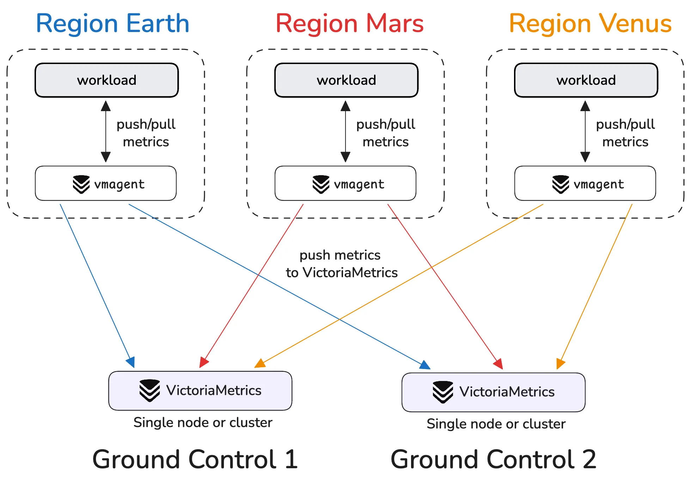
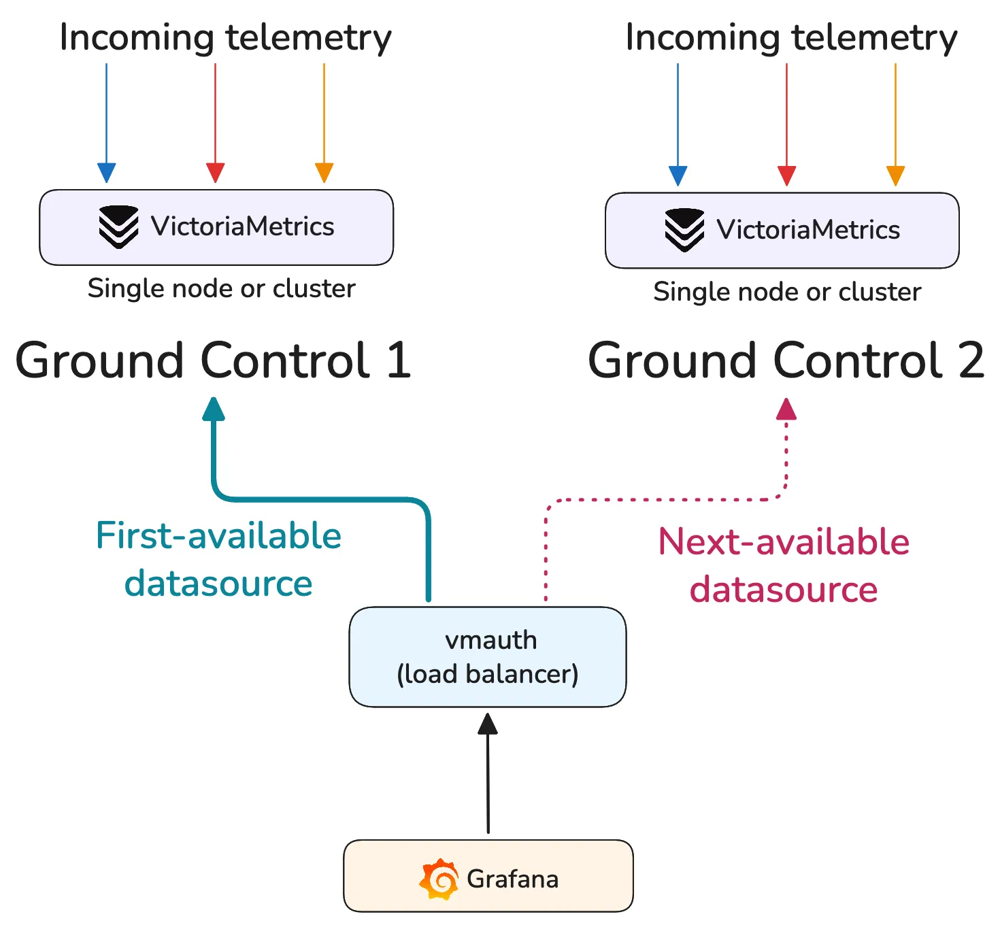
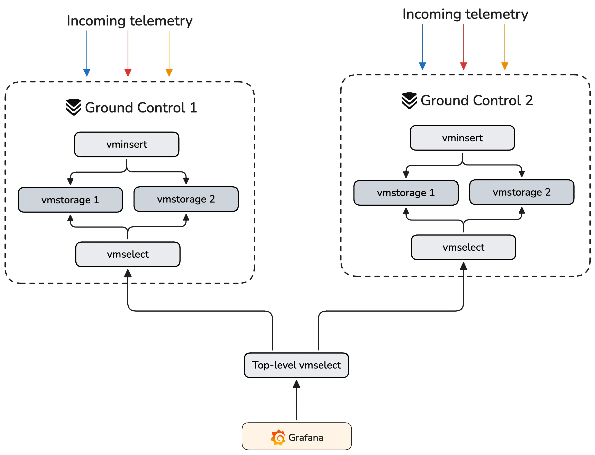
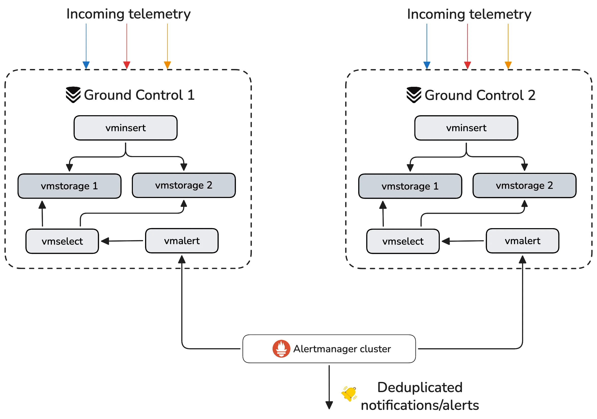
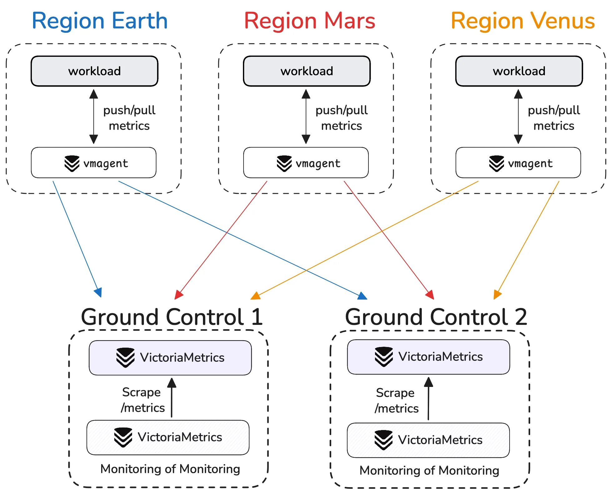
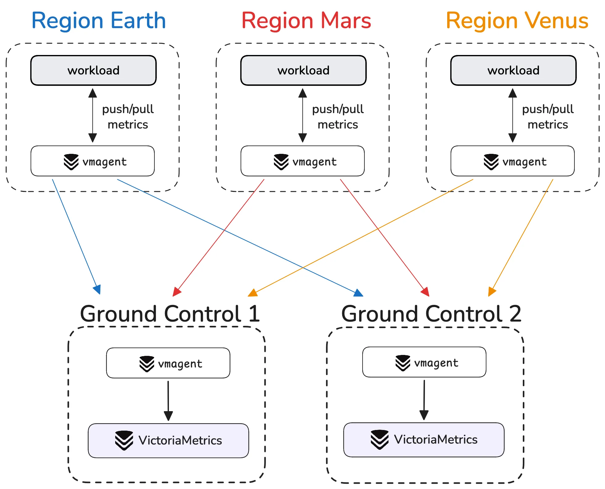

---
build:
  list: never
  publishResources: false
  render: never
sitemap:
  disable: true
---

## Overview {#scenario}

This guide shows how to run VictoriaMetrics across many regions in high-availability mode. Each workload runs a local vmagent and sends metrics to dedicated monitoring deployments, so metric data is duplicated and available even if one monitoring region is down.

Use this architecture when you need region-level resilience and want monitoring to keep working even if one region becomes unavailable.

This setup gives you:

* High availability of metric data across regions.
* A single global query endpoint.
* Simpler disaster recovery.

The trade-off is that you store and send the same data twice, so storage and compute requirements are increased.

## Architecture

The example architecture separates workloads into three regions, called Earth, Mars, and Venus. These represent the systems you want to monitor (e.g., your applications or your infrastructure). For monitoring, there are two separate regions, Ground Control 1 and 2, each running its own VictoriaMetrics deployment. The workload regions (the planets) run a local vmagent that forwards the same metrics to the two dedicated Ground Control regions.


{width="700"}

The role of the Ground Controls can be filled by VictoriaMetrics in [single-node](https://docs.victoriametrics.com/victoriametrics/single-server-victoriametrics/) or [cluster mode](https://docs.victoriametrics.com/victoriametrics/cluster-victoriametrics/).

## High Availability

The architecture provides high availability by storing two full copies of the data: one in Ground Control 1 and the other in Ground Control 2. Since both store the same data, losing one region doesn't result in a monitoring outage. You can still run queries, view dashboards, and receive alerts.

vmagent keeps a separate persistent queue for each `-remoteWrite.url` destination. If one Ground Control region is unavailable, vmagent continues sending data to the other region. The samples for the unavailable region stay in the file-based queue, and vmagent delivers them after the region recovers. The queue size is limited by disk space available to the vmagent or group of vmagents. This helps restore consistency across both regions.

This setup provides two logical copies of the data in separate monitoring regions. That lets you fail over to the healthy region if one region becomes unavailable, or spread read load across both regions if needed.

### How to write the data to Ground Control regions

Run one or more vmagent nodes in each workload region and configure them to send metrics to both Ground Control regions. This gives each workload region a local write path and keeps delivery going if one monitoring region is unavailable. 

For example, a vmagent that sends data to two single-node VictoriaMetrics instances looks like this:

```sh
/path/to/vmagent-prod \
  -remoteWrite.url=https://ground-control-1:8428/api/v1/write \
  -remoteWrite.url=https://ground-control-2:8428/api/v1/write
```

For a VictoriaMetrics cluster, use the following URLs for [`accountID=0`](https://docs.victoriametrics.com/victoriametrics/cluster-victoriametrics/#multitenancy)

```sh
/path/to/vmagent-prod \
  -remoteWrite.url=https://ground-control-1-vminsert:8480/insert/0/prometheus/api/v1/write \
  -remoteWrite.url=https://ground-control-2-vminsert:8480/insert/0/prometheus/api/v1/write
```
For more details, see [data ingestion with vmagent](https://docs.victoriametrics.com/victoriametrics/data-ingestion/vmagent/).
vmagent [alerting rules and dashboards](https://docs.victoriametrics.com/vmagent/index.html#monitoring) help to monitor 
the health state of each configured destination and its queue size.

### How to read the data from Ground Control regions

You can read data from Ground Control regions in a few different ways. The best option depends on your needs and operational complexity:

* Choose region via load balancer: put a load balancer in front of both Ground Control regions. Route traffic to a preferred region, with automatic failover to the other region in case of failure.
* Merge results from multiple regions via vmselect: run a dedicated vmselect that would be configured to read from both regions and merge the results.

You can read more about choosing the right architecture in the [VictoriaMetrics topologies guide](https://docs.victoriametrics.com/guides/vm-architectures/).

#### Load balancer

Use a load balancer when you want one stable query endpoint in front of your Ground Control regions. In this setup, dashboards and tools send queries to a single URL, and vmauth routes each request to one available region.

The following diagram shows [vmauth](https://docs.victoriametrics.com/victoriametrics/vmauth/) performing the role of [load balancer for HA setups](https://docs.victoriametrics.com/vmauth/index.html#high-availability).


{width="700"}

This approach is faster than [merging results with vmselect](#vmselect), because each query goes to only one region. It can also reduce query latency by roughly half compared with a topology that reads and merges data from both regions.

The main downside is that vmauth does not know whether a recovered region has already finished replaying delayed data from the vmagent queue. If you send queries to that region too early, recent data may still be incomplete. In that case, it is better to wait until the region catches up before routing traffic there.

For VictoriaMetrics single node, you can vmauth it with the following configuration:

```yaml
unauthorized_user:
  url_prefix:
    - "http://ground-control-1:8428"
    - "http://ground-control-2:8428"
  load_balancing_policy: first_available
```

On the VictoriaMetrics cluster, the URLs must point to the Ground Control vmselect nodes. For example:

```yaml
unauthorized_user:
  url_prefix:
    - "http://ground-control-1-vmselect:8481"
    - "http://ground-control-2-vmselect:8481"
  load_balancing_policy: first_available
```

The examples above show how to load balance requests without authentication. You can optionally configure authentication in several ways; for more details, read the [vmauth authorization section](https://docs.victoriametrics.com/victoriametrics/vmauth/#authorization).

To start vmauth with your configuration, use the `-auth.config` flag. For example:

```sh
/path/to/vmauth-prod -auth.config=/path/to/auth.yaml
```

You can test that queries work with curl:

```sh
# single node
curl http://vmauth-node:8427/api/v1/query?query=up

# cluster
curl http://vmauth-node:8427/select/0/prometheus/api/v1/query?query=up
```

For an example of this topology in Kubernetes, see the [`VMDistributed` resource](https://docs.victoriametrics.com/helm/victoriametrics-k8s-stack/#vmdistributed-enabled).

#### vmselect

> This option requires that Ground Control regions are deployed in one of these modes:
> - As a [VictoriaMetrics cluster](https://docs.victoriametrics.com/victoriametrics/cluster-victoriametrics/).
> - Or as VictoriaMetrics [single-node with multitenant support enabled](https://docs.victoriametrics.com/victoriametrics/single-server-victoriametrics/#multi-tenancy). In other words, VictoriaMetrics should be started with the optional `-vmselectAddr=:8401` command line flag to enable the vmselect RPC server.

In this setup, each Ground Control region has its own local vmselect. A top-level vmselect queries these instead of connecting directly to vmstorage nodes.


{width="700"}

This option is useful when direct access to vmstorage nodes is not practical or desirable. For example, when running on Kubernetes, the vmstorage services don't provide an HTTP query endpoint by default.

To enable this setup, each Ground Control regional vmselect must listen for requests from the top layer by setting the `-clusternativeListenAddr` flag. The top-level vmselect must then use `-storageNode` to point to the regional vmselect nodes and must set a [deduplication](https://docs.victoriametrics.com/victoriametrics/cluster-victoriametrics/#deduplication) interval to handle duplicated data.

For example, here's how we can run the local cluster vmselect nodes and a top-level vmselect node:

```sh
# Ground Control 1 cluster vmselect
/path/to/vmselect-prod \
  -storageNode=ground-control-1-vmstorage-1:8401,ground-control-1-vmstorage-2:8401 \
  -clusternativeListenAddr=:8401

# Ground Control 2 cluster vmselect
/path/to/vmselect-prod \
  -storageNode=ground-control-2-vmstorage-1:8401,ground-control-2-vmstorage-2:8401 \
  -clusternativeListenAddr=:8401

# Top-level vmselect
/path/to/vmselect-prod \
  -storageNode=ground-control-1-vmselect:8401,ground-control-2-vmselect:8401 \
  -dedup.minScrapeInterval=1ms \
  -replicationFactor=2
```

This option provides a single query endpoint for both Ground Control regions. If one region becomes unavailable, the global vmselect can still query the healthy region, so dashboards and queries can continue to work.

The main trade-off is performance. In a two-level vmselect topology, queries pass through two query layers, so they usually take longer than using regional endpoints directly, or through a load balancer. The benefit is that the topology is easy to understand; it keeps working if one region is lost, and it can merge data from both regions while one region is still catching up after recovery.

## Alerting

Run a vmalert node in each Ground Control region and point it to the local VictoriaMetrics endpoint. Since each region stores the same data, you can deploy the same alerting and recording rules in every region without needing cross-region rule synchronization. Send alerts to an [Alertmanager cluster](https://prometheus.io/docs/alerting/latest/alertmanager/#high-availability) to deduplicate firing alerts.


{width="700"}

A simple vmalert example for a single-node VictoriaMetrics looks like this:

```sh
/path/to/vmalert \
  -rule=/path/to/rules.yaml \
  -datasource.url=http://ground-control-1:8428 \
  -notifier.url=http://alertmanager-1:9093 \
  -notifier.url=http://alertmanager-2:9093
```

In VictoriaMetrics cluster mode, point `-datasource.url` to the regional vmselect endpoint. For example:

```sh
/path/to/vmalert \
  -rule=/path/to/rules.yaml \
  -datasource.url=http://ground-control-1-vmselect:8481/select/0/prometheus \
  -notifier.url=http://alertmanager-1:9093,http://alertmanager-2:9093
```

If you want vmalert to preserve alert state and recording rule results across restarts, configure `-remoteWrite.url` and `-remoteRead.url` to point to VictoriaMetrics as well. For example, for a VictoriaMetrics cluster:

```sh
/path/to/vmalert \
  -rule=/path/to/rules.yaml \
  -datasource.url=http://ground-control-1-vmselect:8481/select/0/prometheus \
  -remoteRead.url=http://ground-control-1-vmselect:8481/select/0/prometheus \
  -remoteWrite.url=http://ground-control-1-vminsert:8480/insert/0/prometheus \
  -notifier.url=http://alertmanager-1:9093,http://alertmanager-2:9093
```

We recommend using the list of [VictoriaMetrics alerting rules](https://github.com/VictoriaMetrics/VictoriaMetrics/tree/master/deployment/docker#alerts).

## Monitoring

You can monitor Ground Control instances themselves using a separate monitoring path. In this setup, each region runs its own monitoring instance that scrapes metrics from the Ground Control components.


{width="700"}

You can optionally duplicate the monitored metrics to the neighboring region for extra resilience. That way, if a whole Ground Control region goes down, you still have access to the telemetry of the downed VictoriaMetrics instance, which can help you troubleshoot and restore service more easily.

Refer to the following pages on how to monitor your VictoriaMetrics deployments:

* [How to monitor VictoriaMetrics single node](https://docs.victoriametrics.com/victoriametrics/single-server-victoriametrics/#monitoring)
* [How to monitor a VictoriaMetrics cluster](https://docs.victoriametrics.com/victoriametrics/cluster-victoriametrics/#monitoring)

## What more can we do?

You can deploy extra vmagent instances in Ground Control regions and use them as regional ingestion proxies. This places the write endpoint closer to storage and adds another disk-backed buffer, which improves resilience when storage is temporarily unavailable.


{width="700"}

This pattern is useful when you want more reliable delivery, local relabeling, or a cleaner separation between cross-region traffic and local storage ingestion.

For a Ground Control running VictoriaMetrics single node, you can run vmagent as follows:

```sh
# vmagent next to Ground Control 1
/path/to/vmagent-prod \
  -remoteWrite.url=http://ground-control-1:8428/api/v1/write
```

If running in cluster mode, use this instead:

```sh
# vmagent next to Ground Control 1 for cluster mode
/path/to/vmagent-prod \
  -remoteWrite.url=http://ground-control-1-vminsert:8480/insert/0/prometheus/api/v1/write
```

