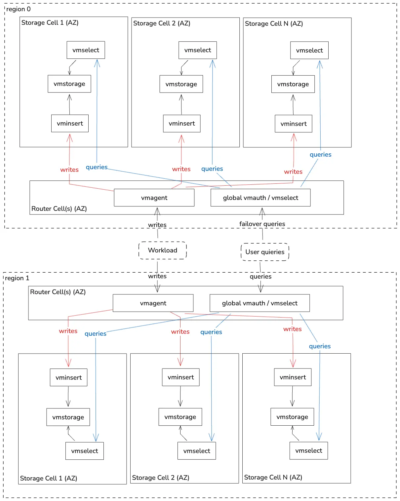

**This guide covers:**
- The setup of a [VictoriaMetrics Hyperscale cluster](https://docs.victoriametrics.com/guides/vm-architectures/#the-hyperscale-cell-based) in Kubernetes via Helm charts
* How to store metrics in [VictoriaMetrics](https://victoriametrics.com) tsdb
- How to check the obtained result


<p align="center">

</p>

The key of the Hyperscale topology lies in its `global route layer`, which sits above the multi-AZ clusters. This layer can be configured to intelligently distribute read and write requests based on the desired balance between read speed and data completeness. Please refer to [VictoriaMetrics topologies](https://docs.victoriametrics.com/guides/vm-architectures/)for detailed trade-offs. We can deploy the global route layer for each Region.

**Precondition**

We will use:
* Kubernetes cluster 1.31.1-gke.1678000
> We use GKE cluster from GCP but this guide is also applied on any Kubernetes cluster. For example Amazon EKS.
* Helm 3.14+
* kubectl 1.31

## 1. VictoriaMetrics Helm repository
Please refer to [VictoriaMetrics Helm repository](https://docs.victoriametrics.com/guides/k8s-monitoring-via-vm-cluster/#id-1-victoriametrics-helm-repository) to add VictoriaMetrics Helm repository
## 2. Install VictoriaMetrics Cluster in single AZ
Please implement [VictoriaMetrics cluster setup](https://docs.victoriametrics.com/guides/k8s-monitoring-via-vm-cluster/) to deploy the VictoraMetrics cluster in each AZ.

Specifically, we recommend to deploy `vmauth` in every AZ-cluster when we build hyperscale cluster, although it is marked as optional in the cluster setup docs. `vmauth` can provide a unified access point for the global route layer of hyperscale cluster. For example, for N AZ-clusters, we will have `http://az[1-N]-vmauth-addr>:8427`

## 3. Install vmagent in global route layer
vmagent resides in the global route layer. It is responsible for distributing write requests to various AZ-clusters within a region. It also enhances fault tolerance. When an AZ-cluster becomes unavailable, it can temporarily buffer data on the local storage instead of dropping it directly. Please refer to [On-disk persistence](https://docs.victoriametrics.com/victoriametrics/vmagent/#on-disk-persistence).

By default, vmagent replicates the full copy of data to every AZ-cluster indicated by `-remoteWrite.url`. We can also configure `-remoteWrite.shardByURLReplicas=N` to instruct `vmagent` to write every outgoing sample to N numbers of distinct AZ clusters, see [Sharding among remote storages](https://docs.victoriametrics.com/victoriametrics/vmagent/#sharding-among-remote-storages) for detail. The choice of write-path depends on the trade-off between availability and read speed.

Suppose we have 4 AZ-clusters. To deploy `vmagent`, we should prepare `vmagent.yaml`:
```yaml
remoteWrite:
    - url: http://<az1-vmauth-addr>:8427/insert/0/prometheus/
    - url: http://<az2-vmauth-addr>:8427/insert/0/prometheus/
    - url: http://<az3-vmauth-addr>:8427/insert/0/prometheus/
    - url: http://<az4-vmauth-addr>:8427/insert/0/prometheus/
podAnnotations:
    prometheus.io/scrape: "true"
    prometheus.io/port: "8429"
# config:
# For more configurations, please refer to https://docs.victoriametrics.com/helm/victoria-metrics-agent/
```
In this way, each AZ-cluster will store a full copy of data. So you can get the complete data from any AZ-cluster.

If you want to save the storage costs and have a certain degree of cluster-level fault tolerance, then you can use `-remoteWrite.shardByURLReplicas`, You only need to make a slight change in the yaml file:
```yaml
remoteWrite:
    - url: http://<az1-vmauth-addr>:8427/insert/0/prometheus/
    - url: http://<az2-vmauth-addr>:8427/insert/0/prometheus/
    - url: http://<az3-vmauth-addr>:8427/insert/0/prometheus/
    - url: http://<az4-vmauth-addr>:8427/insert/0/prometheus/
extraArgs:
    remoteWrite.shardByURLReplicas: 3
podAnnotations:
    prometheus.io/scrape: "true"
    prometheus.io/port: "8429"
# config:
# For more configurations, please refer to https://docs.victoriametrics.com/helm/victoria-metrics-agent/
```

Then the data will be replicated to 3 of these AZ clusters, as long as 2 AZs remain available, the complete data can be returned.

If you want to scrape metrics from Kubernetes to verify that the data is being written correctly later, you can refer to [guide-vmcluster-vmagent-values.yaml](https://github.com/VictoriaMetrics/VictoriaMetrics/blob/master/docs/guides/examples/guide-vmcluster-vmagent-values.yaml) to fill in the scrape config.

Run
```sh
helm install vmagent vm/victoria-metrics-agent -f vagent.yaml
```

Verify that `vmagent`’s pod is up and running by executing the following command:
```sh
kubectl get pods | grep vmagent
```
The expected output is:
```
vmagent-victoria-metrics-agent-69974b95b4-mhjph                1/1     Running   0          11m
```
`vmauth` runs on `:8429` by default.
## 4. Install global vmselect in global route layer
The `global vmselect` resides in the global route layer, it is a core component of the multi-level cluster architecture. The `global vmselect` receives user queries. In turn, it queries local `vmselect`s in each AZ and merges the results. For a comprehensive overview, please refer to [Multi level cluster setup](https://docs.victoriametrics.com/victoriametrics/cluster-victoriametrics/#multi-level-cluster-setup).

In this architecture, each second-level `vmselect` in AZ **must be configured with `-clusternativeListenAddr`** flag to expose its cluster-native API.

Prepare `vmselect.yaml`
```yaml
vmselect:
  extraArgs:
    clusternativeListenAddr: :8401
    globalReplicationFactor: 3    # only need to set when data is shared in AZs
    storageNode:
      - <az1-vmauth-addr>:8401
      - <az2-vmauth-addr>:8401
      - <az3-vmauth-addr>:8401
      - <az4-vmauth-addr>:8401
  
# only need vmselect in global layer
vminsert:
  enabled: false
vmstorage:
  enabled: false
```
`globalReplicationFactor` should be set only when data is sharded in AZ-clusters. And its value should align with `vmagent`'s `-remoteWrite.shardByURLReplicas=N`.

In this example, `globalReplicationFactor=3` means as long as 2 AZs remain available then the `global vmselect` can mark the returned data as complete.

Run
```sh
helm install global-vmselect vm/victoria-metrics-cluster -f vmselect.yaml
```
Verify that `vmselect` pod is up and running by executing the following command:
```sh
kubectl get pods | grep global-vmselect
```

The expected output is:
```
global-vmselect-victoria-metrics-cluster-vmselect-5f594665g66jb   1/1     Running   0          3m38s
```
## 5. Install vmauth in global route layer
We also deploy `vmauth` service in global route layer. It can work as a gateway, distributing requests to multiple AZ-clusters. Key capabilities include load balancing and failover. See [vmauth](https://docs.victoriametrics.com/victoriametrics/vmauth/).

If each AZ-cluster contains the full copy of data, then we can get the complete results from any AZ-cluster. The `global vmauth` can be configured with `first_available` mode to route user queries to the first available AZ-cluster.

Prepare `vmauth.yaml`:
```yaml
config:
    unauthorized_user:
      load_balancing_policy: first_available
      url_map: 
        - src_paths:
            - "/select/.*"
          url_prefix:
            - "http://<az1-vmauth-addr>:8427"
            - "http://<az2-vmauth-addr>:8427"
            - "http://<az3-vmauth-addr>:8427"
            - "http://<az4-vmauth-addr>:8427"
podAnnotations:
    prometheus.io/scrape: "true"
    prometheus.io/port: "8427"
# For more configurations, please refer to https://docs.victoriametrics.com/helm/victoria-metrics-auth/
```
Then run
```
helm install vmauth vm/victoria-metrics-auth -f vmauth.yaml
```
Verify that `vmauth` pod is up and running by executing the following command:
```
kubectl get pods | grep vmauth
```
The expected output is:
```
vmauth-victoria-metrics-auth-5b4b5bc869-prb5b                     1/1     Running   0          81s
```
`vmauth` runs on `:8427` by default.

## 6. Check the obtained result 
We can query the metrics through `vmauth` in the global routing layer.

```sh
export POD_NAME=$(kubectl get pods --namespace default -l "app.kubernetes.io/instance=vmauth" -o jsonpath="{.items[0].metadata.name}")
kubectl --namespace default port-forward $POD_NAME 8427
```

Execute the following command to get metrics via curl:
```
curl -sg 'http://127.0.0.1:8427/select/0/prometheus/api/v1/query_range?query=count(up{kubernetes_pod_name=~".*vmauth.*"})&start=-1m&step=10s' | jq
```

The expected output is:
```json
{
  "status": "success",
  "isPartial": false,
  "data": {
    "resultType": "matrix",
    "result": [
      {
        "metric": {},
        "values": [
          [
            1766373995.909,
            "1"
          ],
          [
            1766374005.909,
            "1"
          ],
          [
            1766374015.909,
            "1"
          ],
          [
            1766374025.909,
            "1"
          ],
          [
            1766374035.909,
            "1"
          ],
          [
            1766374045.909,
            "1"
          ]
        ]
      }
    ]
  },
  "stats": {
    "seriesFetched": "1",
    "executionTimeMsec": 12
  }
}
```

## 7. Final thoughts 
- We set up a VictorMetrics Hyperscale cluster.
- We check the installation by querying metrics from global route layer.
- Other topology installations:
  - [vmsingle](https://docs.victoriametrics.com/guides/k8s-monitoring-via-vm-single/)
  - [vmcluster](https://docs.victoriametrics.com/guides/k8s-monitoring-via-vm-cluster/)
  - [HA-vmcluster](https://docs.victoriametrics.com/guides/k8s-ha-monitoring-via-vm-cluster/)