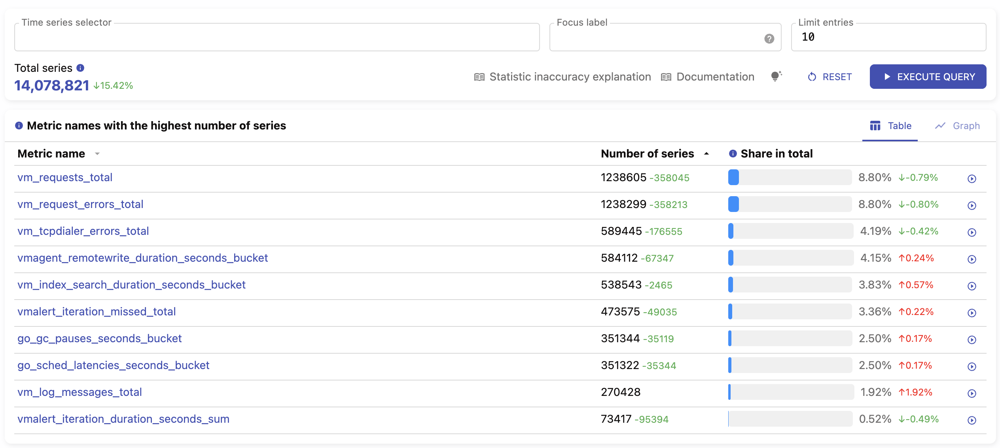

## Initial setup

Given HA VictoriaMetrics setup (see image below):
- 5 VMAgents behind a load balancer which receive metrics through remote write from multiple scraping agents.
- VMCluster (VMSelect, VMInsert, VMStorage)


Amount of metrics, produced by VMAgents grows gradually which leads increased resource usage,
which subsequently leads to a need to bump VMCluster resources.

It was decided to use stream aggregation instead, which should help to reduce amount of data sent to a cluster

## Find the most expensive metrics in [cardinality explorer](../../#cardinality-explorer)

Looking at cardinality explorer dashboards it's obvious which metrics streaming aggregation
should be applied to primarily:

Let's match these metrics to all MetricsQL queries for alerts and dashboards.

Here'a a list of matched ones:
```metricsql
sum(rate(vm_requests_total{job=~\"$job\", instance=~\"$instance\"}[$__rate_interval])) by(job, action, cluster)
```
```metricsql
sum(rate(vm_request_errors_total{job=~\"$job\", instance=~\"$instance\"}[$__rate_interval])) by(job, action, cluster)
```
```metricsql
sum(increase(vmagent_remotewrite_duration_seconds_bucket[5m])) by (url, job, vmrange)
```
```metricsql
sum(increase(vm_tcp_dialer_errors_total[1m]) by (job, cluster, type))
```
All these MetricsQL expressions can be converted to aggregation rules with a use of
[`rate_sum`](../configuration/#rate_sum) and [`increase`](../configuration/#increase) aggregation outputs

## Convert MetricsQL expressions to aggregation rules

For all supported aggregation outputs conversion from MetricsQL is straightforward.
All MetricsQL query arguments should be mapped to
[`streaming aggregation configuration`](../configuration/#configuration-file-reference] file parameters.

Below is a list of aggregation rules, which were crafted from MetricsQL expressions above:
```yaml
- interval: 1m
  match: vm_requests_total
  outputs:
  - rate_sum
  by:
  - job
  - action
  - cluster
- interval: 1m
  match: vm_request_errors_total
  outputs:
  - rate_sum
  url:
  - job
  - action
  - cluster
- interval: 5m
  match: vmagent_remotewrite_duration_seconds_bucket
  outputs:
  - increase
  by:
  - url
  - job
  - vmrange
- interval: 1m
  match: vm_tcp_dialer_errors_total
  outputs:
  - increase
  without:
  - job
  - cluster
  - type
```
As it's recommended [`here`](../common-mistakes/#create-separate-aggregator-for-each-recording-rule)
it's important to merge aggregation rules where it's possible.

**Aggregation rules are mergeable if they only differ in [`match`](../configuration/#match) expression**

In a given case first two aggregators can be merged:

```yaml
- interval: 1m
  match:
  - vm_requests_total
  - vm_request_errors_total
  outputs:
  - rate_sum
  by:
  - job
  - action
  - cluster
- interval: 5m
  match: vmagent_remotewrite_duration_seconds_bucket
  outputs:
  - increase
  by:
  - url
  - job
  - vmrange
- interval: 1m
  match: vm_tcp_dialer_errors_total
  outputs:
  - increase
  without:
  - job
  - cluster
  - type
```

## Compare aggregation results to MetricsQL

To enable aggregation on VMAgents please follow [`this documentation`](../configuration).

With aggregation enabled VMAgent by default drops all matched samples. We need to keep them temporary
to compare aggregation results with MetricsQL and to keep existing dashboards and alerts functioning.

`-streamAggr.keepInput` flag should be passed to VMAgent for this purpose.

After some time of working let's visualize data to compare:

Unfortunately due to load balancing, which is enabled in front of VMAgent we cannot get 
We're observing both metrics are having close enough values.

## Update alerts and dashboards

After we make sure aggregation works as expected, lets update all alerts and dashboards:

1. For `vm_requests_total` MetricsQL expression
```metricsql
sum(rate(vm_requests_total{job=~\"$job\", instance=~\"$instance\"}[$__rate_interval])) by(job, action, cluster)
```
should be replaced with
```metricsql
vm_requests_total:1m_by_job_action_cluster_rate_sum
```
2. For `vm_request_errors_total` MetricsQL expression
```metricsql
sum(rate(vm_request_errors_total{job=~\"$job\", instance=~\"$instance\"}[$__rate_interval])) by(job, action, cluster)
```
should be replaced with 
```metricsql
vm_request_errors_total:1m_by_job_action_cluster_rate_sum
```
3. For `vmagent_remotewrite_duration_seconds_bucket` MetricsQL expression
```metricsql
sum(increase(vmagent_remotewrite_duration_seconds_bucket[5m])) by (url, job, vmrange)
```
should be replaced with
```metricsql
vmagent_remotewrite_duration_seconds_bucket:5m_by_url_job_vmrange_increase
```
4. For `vm_tcp_dialer_errors_total` MetricsQL expression
```metricsql
sum(increase(vm_tcp_dialer_errors_total[1m]) by (job, cluster, type))
```
should be replaced with
```metricsql
vm_tcp_dialer_errors_total:1m_by_job_cluster_type
```
After alerts and dashboards are updated, now we can remove `-streamAggr.keepInput` flag.

## Assess achieved optimization

After we make sure, that aggregation works properly let's take a look at VMAgent and VMCluster resource usage.

Due to aggregation enabled resource usage on VMAgent was increased but instead we've dropped a load on:
- VMSelect, which now queries less data for alerts and dashboards
- VMInsert, which now has lower ingestion rate
- VMStorage, which now stores less data
