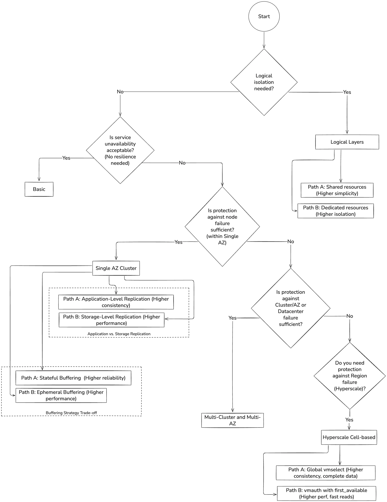
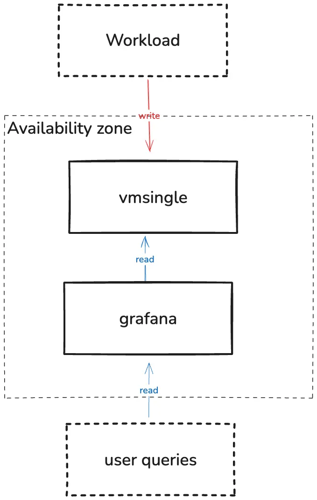
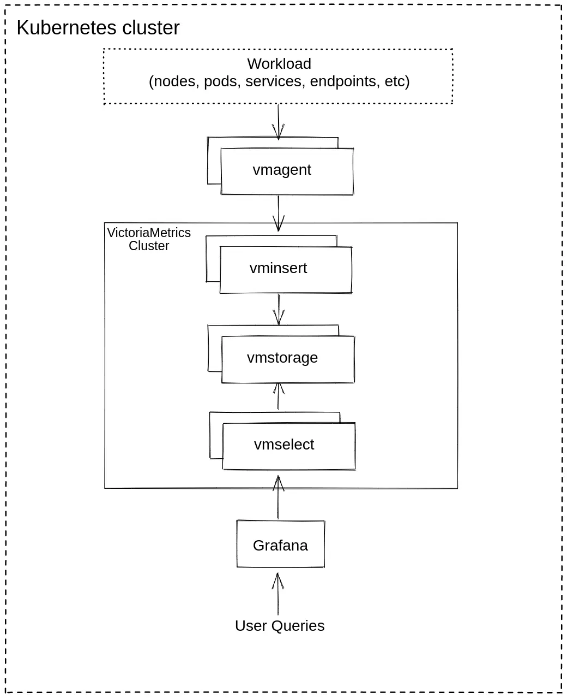
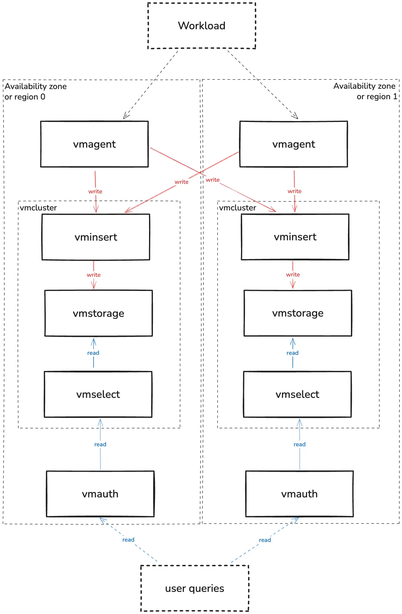
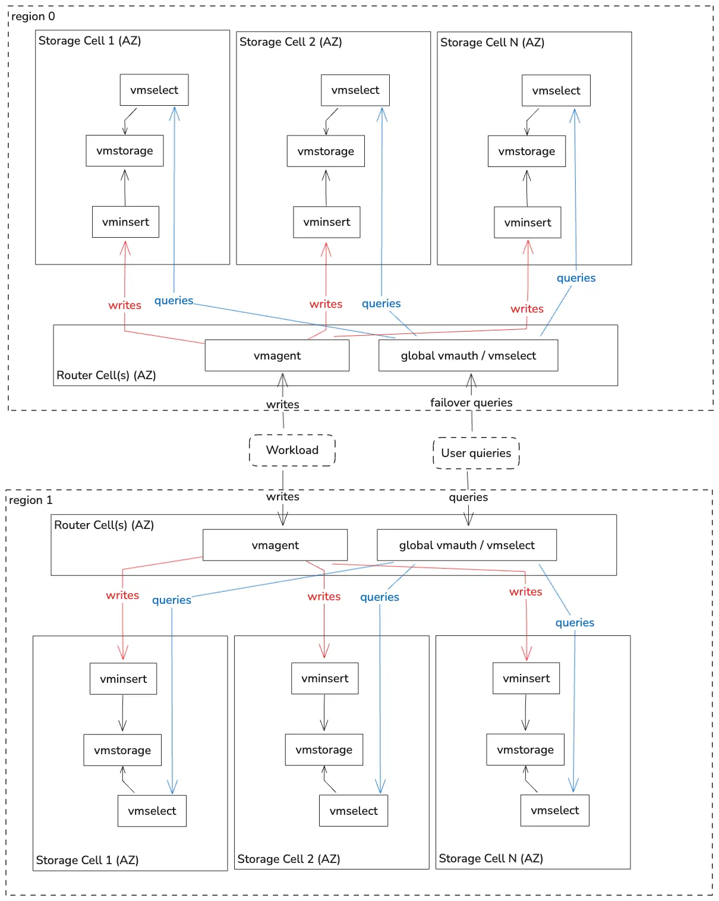
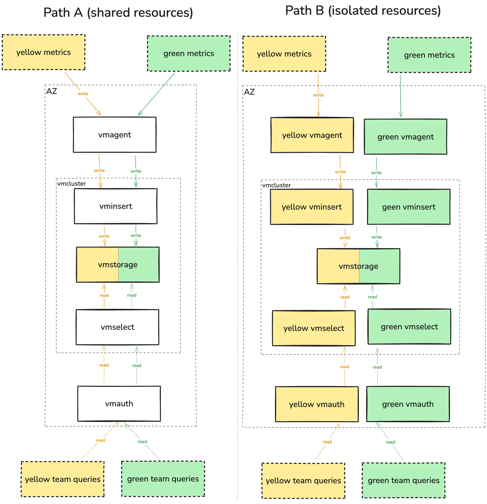

---
build:
  list: never
  publishResources: false
  render: never
sitemap:
  disable: true
---

## Matching Architecture to Risk

The complexity of any monitoring system is not an end in itself. It is a direct response to two questions: what risks are we protecting against, and how much performance do we need? This guide is designed to help you choose an architecture that precisely matches your answers.

### Availability as a Guarantee Against Risk

It's a common mistake to think of availability as a simple number. In reality, availability is a guarantee against a specific level of risk. For example, 99.9% ("three nines") availability allows for about 44 minutes of downtime per month. Before chasing higher nines, ask yourself: is this level of downtime acceptable for your defined risks? Remember that each additional 'nine' of availability often comes with an exponential increase in both system complexity and operational cost.

The scope of the failure you are designing for is your **"blast radius".** Before choosing an architecture, you must first define the blast radius you need to withstand.

### Resilience and Scalability

It is also crucial to distinguish between two fundamental goals:

* **Resilience (or Availability)** is about surviving failures. We achieve it by creating copies ([replicas](https://docs.victoriametrics.com/victoriametrics/cluster-victoriametrics/#replication-and-data-safety)) of our components and data.  
* **Scalability (or Performance)** is about handling load. We achieve it by [adding more components](https://docs.victoriametrics.com/victoriametrics/#scalability-and-cluster-version) on every layer to distribute the work.

The architectures in this guide are simply different combinations of these two approaches, designed to handle a specific blast radius.

### Architectures as Answers to Blast Radius

Each subsequent section of this guide presents an architecture designed to handle a specific blast radius, moving from the most straightforward setup to the most resilient.

* **[Basic](https://docs.victoriametrics.com/guides/vm-architectures/#basic) (No Resilience).** This architecture is the baseline for non-critical systems. It has no fault tolerance, and its blast radius is the instance itself. Any failure leads to a complete outage.  
* **[Single AZ Cluster](https://docs.victoriametrics.com/guides/vm-architectures/#single-availability-zone) (Node-Level Resilience).** This architecture protects against the failure of individual servers (nodes) or application instances within a single Availability Zone. However, its blast radius is the entire AZ; it will not survive a datacenter-wide outage.  
* **[Multi-Cluster and Multi-AZ](https://docs.victoriametrics.com/guides/vm-architectures/#multi-cluster-and-multi-az) (Cluster/AZ/Datacenter-Level Resilience).** Designed as a disaster recovery solution, this architecture can withstand the complete failure of an entire availability zone or data center.  
* **[Hyperscale](https://docs.victoriametrics.com/guides/vm-architectures/#the-hyperscale-cell-based) (Cell/AZ and Region-Level Resilience).** An advanced architecture is built to survive failures of entire Availability Zones or logical "cells" within a region, often degrading gracefully instead of failing.  
* **[Logical Layers](https://docs.victoriametrics.com/guides/vm-architectures/#logical-layers) (Logical Resilience).** This is not a physical resilience level but an architectural layer on top of any setup. It addresses the risk of data access conflicts by providing strong logical isolation between different teams or customers.

### The decision tree

## Basic

**Recommended for:** Pet projects, development/test stages, and non-critical systems monitoring.

Installation guide reference: [VictoriaMetrics Single](https://docs.victoriametrics.com/guides/k8s-monitoring-via-vm-single/)

**Key characteristics**: Single instance that does everything: stores, retrieves, and provides metrics.

**Pros**:

* **Straightforward.** Quick deployment without additional components  
* **Cost-efficient.** It avoids redundant work, such as writing or transmitting the same data twice, thereby reducing both computational and network expenses. Additionally, there are no extra copies of data.

**Cons**:

* **Single point of failure.** No fault tolerance and no availability

**Schema:**

### Unavailability Scenarios

In this simplest setup, any single-node failure leads to temporary data unavailability or loss until the instance restarts or storage is restored. There are no built-in redundancy or replication layers.

For this section, you can increase availability by utilizing backup and restore mechanisms on various levels: hardware, virtualization, persistence volume management, or application. VictoriaMetrics provides the [backup tools](https://docs.victoriametrics.com/victoriametrics/vmbackup/) to achieve that. 

## Single Availability Zone

**Recommended for:** Single availability zone hosted systems of any scale

Installation guide reference: [VictoriaMetrics Cluster](https://docs.victoriametrics.com/guides/k8s-monitoring-via-vm-cluster/)

High availability implementation: [HA VictoriaMetrics Cluster](https://docs.victoriametrics.com/guides/k8s-ha-monitoring-via-vm-cluster/)

**Key characteristics:** This is a complete VictoriaMetrics cluster, commonly running in a single Kubernetes cluster. Each component of the cluster: vminsert, vmselect, and vmstorage has multiple copies (replicas). The data is also copied and sharded between vmstorage nodes using the `--replicationFactor` setting on vminsert. [See the official documentation](https://docs.victoriametrics.com/victoriametrics/cluster-victoriametrics/#replication-and-data-safety) to determine the optimal replication factor for your needs.

**Pros**:

* **Reliability.** The system can survive a failure of any component without service disruption. If a single vmstorage node dies, other replicas continue to operate. And it is the same for other components.

**Cons**:

* **No disaster recovery.** If the entire Kubernetes cluster, availability zone, or data center fails, you lose the entire monitoring system.  
* **Increased Cost:** Storage cost grows linearly with the replicationFactor (e.g., RF=2 equals 2x storage, RF=3 equals 3x).   Compute components like vminsert or vmselect scale horizontally and increase throughput rather than duplicating data.

**Schema:**

### Application vs. Storage Replication

When building a resilient cluster, several replication options are available.

**Path A: Application-Level Replication.** This approach is enabled [by setting](https://docs.victoriametrics.com/victoriametrics/cluster-victoriametrics/#replication-and-data-safety) the `-replicationFactor=N` flag, where N is an integer representing the desired number of replicas. It makes the cluster components responsible for writing N copies of the data across different vmstorage nodes.

**Pros:**

* **Guaranteed Query Completeness on Node Failure.** The key advantage is that the cluster is aware of its replication. It can survive a complete vmstorage node failure and still guarantee 100% complete query responses from the remaining replicas (as long as the number of failed nodes is less than the replication factor).  
* **Infrastructure-Independent Logic.** The replication logic is part of the VictoriaMetrics application, ensuring the same predictable behavior whether you run on-premise or on any cloud provider.

**Cons:**

* **Latency sensitivity risks**. A slow or overloaded replica can increase write latency, since inserts must complete on multiple nodes. A larger number of nodes increases the risk of problems with one of them.

**Path B: Storage-Level Replication (The Cloud Provider Way)** In this model, VictoriaMetrics replication factor is set to 1, and the vmstorage data is backed up with cloud-provided and replicated volumes(i.e., AWS EBS replicated within AZ, Google Zonal PD). 

**Pros:**

* **Offloaded Resource Cost.** The data replication is no longer bound by application CPU and network performance, and is offloaded to the cloud provider's storage infrastructure. 

**Cons:**

* **No read resilience.** Any vmstorage restart (including planned maintenance) or failure makes its data temporarily unavailable for querying.
* **Failover duration.** When a node or disk fails, the PVC must be reattached to another node. For zonal volumes (single AZ), this can take seconds to minutes (e.g., 10-60 seconds for clean detach/attach; up to 5 minutes in force-detach cases), making data from that shard temporarily unavailable for querying until reschedule completes.

### Query Consistency Partial vs. Complete Responses

In a large, distributed system, partial failures are a common occurrence. A critical choice is how your read path should behave when only partial data can be retrieved.

**Path A: Allow Partial Responses (Focus on Availability)** By default, if a vmstorage node is down, vmselect will continue getting results from the healthy vmstorage nodes. If more than or equal to the replicationFactor vmstorage nodes fail to respond, the response will have the "isPartial" field set to true.

**Pros:** 

* **High Availability.** Some data, albeit incomplete, would still be available. The system degrades gracefully. It will continue to return available data from the remaining healthy nodes, rather than failing the entire query.

**Cons:**

* **Risk of incomplete data.** Users might not realize the "partial" warning and make decisions based on incomplete and possibly misleading graphs.

**Path B:** **Deny Partial Responses (Focus on Consistency)** You can configure vmselect with the `-search.denyPartialResponse` flag. If vmselect cannot fetch a complete result from all vmstorage nodes that hold the requested data according to the replication factor value, it will return an error instead of a partial result.

**Pros:**

* **Guaranteed data consistency.** This approach ensures that any successful query returns 100% of the requested data. If vmselect receives only a partial response from its vmstorage nodes, the entire query is marked as failed, preventing any misleading or incomplete results.

**Cons:**

* **Lower Availability.** This approach sacrifices availability to guarantee consistency. So if more than replicationFactor vmstorage nodes are unavailable, read queries will start returning errors.

### Buffering Strategy Trade-off

Once you have a vmagent sending data to the storage component (vmsingle or cluster), you face your first important trade-off: what should vmagent do when the storage is temporarily unavailable? This choice defines the trade-off between higher availability (by not losing data) and lower resource consumption (by not using disk). By default, vmagent acts as a durable queue: it persists compressed unsent data to the local filesystem. The size of the queue is controlled via \`--remoteWrite.maxDiskUsagePerURL\` and can be [estimated in advance](https://docs.victoriametrics.com/victoriametrics/vmagent/#calculating-disk-space-for-persistence-queue).

**Path A: Stateful Mode (Most Reliable).**  By default, [the operator uses ephemeral storage](https://docs.victoriametrics.com/operator/resources/vmagent/#statefulmode) for the vmagent queue. In production, we recommend explicitly configuring a PersistentVolumeClaim (PVC) for vmagent to ensure the buffer is stored on a persistent disk and survives pod restarts. [The documentation](https://docs.victoriametrics.com/victoriametrics/vmagent/#on-disk-persistence) about on-disk persistence.

**Pros:**

* **Improved reliability.** Unsent data is safe during vmagent restarts or when remote storage is down (until queue is full).

**Cons:**	

* **Requires additional resources.** Deployment becomes stateful, uses disk space, and I/O. The queue size can build extra pressure on remote storage once it becomes available.

For Enterprise users, the queueing can be offloaded to an external message broker, such as **Kafka**. In that case vmagent can [read or write into Kafka](https://docs.victoriametrics.com/victoriametrics/integrations/kafka/).

**Path B: Ephemeral Buffering (with tmpfs).** For maximum performance, the vmagent buffer directory can be mounted as a tmpfs volume, which is physically stored in the node's RAM. In Kubernetes, this is configured via `emptyDir: { medium: "Memory" }`.

**Pros:**

* **Fast I/O.** Buffering happens at RAM speed. This path safeguards against brief network outages without any loss of performance.

**Cons:**

* **Significant risk of data loss.** Unsent data is lost on vmagent restarts. The queue size is limited by the available memory.

### Unavailability Scenarios

**Blast radius:** Cluster

* **Instance/pod failure:**  
  * Path A (Application-level replication, RF ≥2): no impact; cluster continues with remaining replicas.  
  * Path B (Storage-level replication, RF=1): temporary data unavailability (can be around 1 minute regarding PVC detach/attach, depending on the type of replication).  
  * Path A (Buffering Strategy Trade-off, stateful): if vmagent uses a PersistentVolumeClaim, buffered data survives pod restarts and is replayed automatically.  
  * Path A (Buffering Strategy Trade-off, Ephemeral): if vmagent uses an in-memory (tmpfs) buffer, all unsent samples are lost on restart.  
* **Node/server failure:** pods rescheduled; impact depends on replication mode.  
* **AZ/datacenter failure:** complete outage; no cross-AZ protection.  
* **vminsert or vmstorage unavailability:**  
  * Path A, Path B (Buffering Strategy Trade-off) data replayed after reconnecting.

## Multi-Cluster and Multi-AZ

**Recommended for:** Large-scale workloads or services with high SLA requirements that must survive the complete failure of a datacenter or an Availability Zone (AZ).

High availability implementation: [VictoriaMetrics Multi-Regional Setup](https://docs.victoriametrics.com/guides/multi-regional-setup-dedicated-regions/)

**Key characteristics:** The core principle of this architecture is to run two or more independent, self-contained VictoriaMetrics clusters (from the [Single AZ](https://docs.victoriametrics.com/guides/vm-architectures/#single-availability-zone) section) in separate failure domains, such as different Availability Zones or geographic regions. A global, stateless layer is responsible for routing write and read traffic to these clusters. Each participating AZ must be provisioned to handle the entire workload if another AZ fails. 

There are no differences in the VictoriaMetrics clusters' topology regarding the multi-AZ approach. It can be Active-Active or Active-Passive - the schema will be the same.  

To ensure reliability, vmagent implements the bulkhead pattern: each destination URL configured via `--remoteWrite.url` is assigned a dedicated data queue and an isolated pool of workers. This isolates the data streams, ensuring that if one storage destination becomes slow or unavailable, it does not impact data delivery to the others.

**Pros:**

* **Disaster Recovery:** The system can survive a complete failure of one cluster's location (AZ or region).  
* **Isolation:** Incidents, maintenance, or configuration errors in one cluster do not affect the others.

**Cons:**

* **Increased Cost:** You are paying more for the infrastructure (compute, storage, and network). The capacity of vmstorage in each AZ is underutilized, since every AZ must be ready to absorb the full traffic load in case of failure. Overhead is ~100% with 2 AZs (50% utilization). For other components, it is possible to use [VPA](https://kubernetes.io/docs/concepts/workloads/autoscaling) or [HPA](https://kubernetes.io/docs/tasks/run-application/horizontal-pod-autoscale). 

**Schema:**

### Unavailability Scenarios

**Blast radius:** Availability zone

* **Primary region failure (Active-Passive):** switchover in minutes; stale reads until DNS/load balancer/BGP reroute.

* **Single AZ/cluster failure (Active-Active):** seamless reroute; read results may temporarily differ between clusters if cross-AZ replication lags.

* **Cross-region link failure:**

  * Writes: buffered by vmagent.  
  * Reads: may return stale data until the link is restored.

## The Hyperscale (Cell-based)

**Recommended for:** Systems that require extra reliability and scalability across multiple regions and zones.

**Key characteristics:** This architecture is built on two main ideas - cells and the separation of routing and storage paths

First, we have logical groups of Availability Zones (AZs). Think of these as our data pods. Inside these groups, we deploy our basic clusters. The data within these groups can be distributed in two ways:
- **Fully replicated:** An identical copy exists in each AZ.
- **Sharded:** Each AZ holds a portion of the data. For example, with replication factor 3 across 4 cells, each cell stores approximately 75% of all metrics.

Inside each Storage Cell, the VictoriaMetrics cluster is configured with a `-replicationFactor` of 1. High availability is achieved by replicating data across multiple cells by the global routing layer, not within the cell or the cluster.

Next, we have a separate, stateless layer of routing cells. Their only purpose is to manage traffic. They accept all incoming data and queries and intelligently route them to the correct storage groups. This separation of routing and storage is key to the design. 

For complete disaster recovery, this entire cell-based architecture is duplicated in a second geographic region.

**Pros:**

* **Maximum Fault Tolerance:** The system survives failures of servers, entire storage cells, and even availability zones within a region. It degrades gracefully instead of failing completely.  
* **Horizontal Scaling:** You can add new storage cells to increase capacity or new routing cells to handle more traffic.

**Cons / Trade-offs:**

* **Increased Complexity:** This architecture requires significant expertise and a large amount of automation (a control plane) to manage the routing and data placement.  
* **High Cost:** The number of components and the data redundancy make this the most expensive option.

**Schema:**

A global, stateless layer of routing cells (vmagent, vmauth) sits on top. It routes traffic to several logical groups of storage cells. Each storage group contains multiple AZs, and data is replicated or sharded across them. There are several approaches to implementing it.

### Choosing Your Read Path Strategy

When you build a system that spans multiple AZs or regions, you face a fundamental choice: how to read the data? The answer to this question will define the trade-offs in your architecture between data completeness, query speed, and cost. Your choice of how to write data directly impacts how you can read it. Let's look at two pairs of write/read strategies.

### Path A: Prioritize Data Completeness (The Global vmselect model)

In this model, your primary goal is to obtain as complete and consistent data as possible for every query, even if some storage cells are lagging behind.

**Write Path:** vmagent [shards data](https://docs.victoriametrics.com/victoriametrics/vmagent/#sharding-among-remote-storages) across your storage cells. Fault tolerance is configured via `-remoteWrite.shardByURL` and `-remoteWrite.shardByURLReplicas` (for example, writing each time series to 3 out of 4 cells). Redundancy is achieved across cells, not within a cell. This provides resilience against cell failures while saving storage compared to full copies.

**Read Path:** You use a two-level vmselect system. A global vmselect receives user queries. In turn, it queries local vmselects in each of your storage cells and merges the results. Exposing local VMSelects to a global one is necessary because there can be no possibility to connect directly to vmstorage on the local cell, especially if it is in Kubernetes, as there is no HTTP endpoint for querying vmstorage. And using NodePort may not be a good practice for production.

**Schema:**

Global vmselect -> Local vmselects (in each cell)

**Pros:**

* **High availability of complete data.** The global VMSelect can fill in any gaps from a lagging cell by retrieving data from another replica. The higher the replicationFactor, the more durable it is against storage failures.

**Cons:**

* **High resource overhead.** The global VMSelect performs a significant amount of redundant work, merging and aggregating data. This requires significant CPU and memory, and increases query latency.

### Path B: Focus on Read Speed (The vmauth with first_available mode)

In this model, your primary goal is to provide users with the fastest possible response, accepting certain risks associated with data freshness.

**Write Path:** This is where you face another choice. To make the `first_available` read path work, every storage cell must contain a full copy of all data. This is achieved by configuring the global vmagent to replicate 100% of the write traffic to every storage cell. This is achieved by providing all storage cell URLs in the `-remoteWrite.url` flags. If you provide another count of storage cells in the URL section, it will affect the completeness of the data on the read path.

**Read Path:** A global vmauth directs the user to the first available cell.

**Schema:**

Global vmauth -> Cell -> vmselect

**Pros:**

* **Very fast queries.** There is no overhead from merging results from multiple cells.  
* **Low cross-cell traffic for reads.** This can significantly reduce network costs.

**Cons:**

* **High storage cost.** You are storing redundant, full copies of data, which is an expensive approach.  
* **The Freshness Trap.** This is the greatest and most significant risk associated with this approach. If the write path to one storage cell slows down, vmagent will start buffering data for it. Internally, vmagent maintains a separate queue for each `-remoteWrite.url` target, so lag in a single cell can cause it to serve stale results under the `first_available` policy.  If vmauth sends a user to this cell while its queue is not empty, that user will receive stale data (data that is not 100% fresh). A certain automation could be used to disable reads from cells that are lagging behind.

### Alerting Strategy Trade-offs

Just like the read path, your alerting strategy in a hyperscale setup also involves critical trade-offs.

**Path A: Local vmalert (Fast Evaluation, High Traffic). In this model, you deploy vmalert inside each storage cell.**

**How it works:** Each vmalert queries its local vmselect for data. This is very fast and efficient. It then sends its firing alerts to a global Alertmanager cluster, which is likely located in the compute cells.

**Pros:**

* **Low latency for alert evaluation.** Query evaluation is always local and fast.

**Cons:**

* **Inconsistent alerts (if data is sharded).** This approach only works reliably if every storage cell has a full copy of the data (Read Path B from the upper tradeoff of this section). If data is sharded (Read Path A), no single vmalert has a complete picture, so global alerts cannot be evaluated correctly.   
* **High traffic cost.** Every vmalert instance must send its alerts to **every** Alertmanager instance in the global cluster. If you have many storage cells and alertmanagers in different AZs or regions, this creates a lot of expensive cross-network traffic, if you have many cells and Alertmanagers in different regions. This consideration is especially important for those who want to minimize cross-region traffic.

**Path B: Global vmalert (Consistent Alerts, Higher Latency) In this model, you move vmalert out of the storage cells and into the global compute cells.**

**How it works:** The global vmalert instances query the same entry point as users (either the global vmselect or vmauth). This provides them with a comprehensive view of all data. They then send alerts to their local Alertmanager instances in the same compute cell.

**Pros:**

* **Consistent, global view.** Alerts are always evaluated against the complete dataset. This works perfectly with the efficient sharded write path (Read Path A).  
* **Low alert traffic.** The communication between vmalert and Alertmanager is all local within the compute cell, which significantly reduces cross-AZ/region traffic.

**Cons:**

* **Slower alert evaluation.** Every evaluation now involves a cross-cell query, which has higher latency than a local query. In practice, alerting rules usually generate the majority of the read load.

### Unavailability Scenarios

**Blast radius:** Region / Cell

* **Single node failure within a cell:** degraded performance in that cell; global system continues normally.

* **Single cell failure:**

  * Path A (Global vmselect): queries still complete but slower (merging from healthy cells).

  * Path B (First-available vmauth): queries are routed to healthy cells; stale data is possible if a write lag exists.

* **Region outage:** the duplicated architecture in the standby region takes over, resulting in temporary degradation until the reroute is completed.

## Logical layers

**Recommended for:** Companies of any scale that need to serve multiple internal teams or external customers with separate data. Each tenant may have different requirements for data isolation and performance.

The other use case is a different retention across tenants, which is described in this guide: [VictoriaMetrics Cluster](https://docs.victoriametrics.com/guides/guide-vmcluster-multiple-retention-setup/) 

**Key characteristics:** This architecture introduces a logical layer of multitenancy on top of the physical architectures mentioned before.

* The main goal is to serve multiple tenants (datasets) on the same shared infrastructure while providing strong logical isolation. This solves the problem of ensuring that Team A cannot view data from Team B.  
* This is achieved using [URL-based multitenancy.](https://docs.victoriametrics.com/victoriametrics/cluster-victoriametrics/#url-format) Each tenant is assigned a unique AccountID.  
* This AccountID is used in the URL path to create a "virtual slice" or a separate "lane" for that tenant's data, from ingestion at vmagent all the way to querying at vmselect.

**How it works:**

1. **At the vmagent:** A vmagent receives data from all sources. It uses relabeling rules to identify which tenant the data belongs to. When vmagent sends the data to vminsert, it attaches the tenant ID as a label (see [docs](https://docs.victoriametrics.com/victoriametrics/cluster-victoriametrics/#multitenancy)).  
2. **At the vminsert and vmstorage:** These components natively separate data based on the tenant ID. The data from one tenant is logically isolated from another tenant.  
3. **At the vmauth and vmselect:** When a query comes in, vmauth checks if the user has permission to access the tenant ID in the URL. It only allows valid requests to pass through. vmselect will then only query the data for that specific, authorized tenant.

### Architectural Models for the isolation

This multitenancy approach gives us another trade-off in the isolation implementation.

**Schema:**

**Path A: Shared resources.** We have a single, shared pool of all cluster components.

**Pros:**

* **Resource efficient.** This is the cheapest way to run the ingestion layer.

**Cons:**

* **Noisy Neighbor Problem.** There is no performance isolation at the entry point. A single tenant sending too much data can slow down ingestion for everyone else.

**Path B: Dedicated processing layer.** For very important tenants, we can create a separate, dedicated layer of vmagents, vmselect, vminsert, and other components in use. 

**Pros:**

* **Full performance isolation.** The performance of important tenants is not affected by others.

**Cons:**

* **More expensive and complex** to manage multiple service pools.
