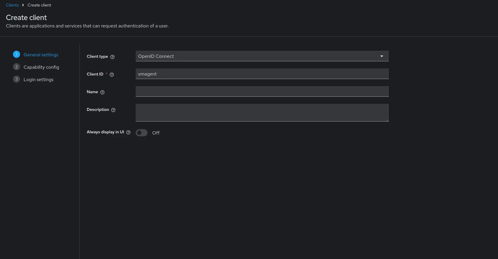
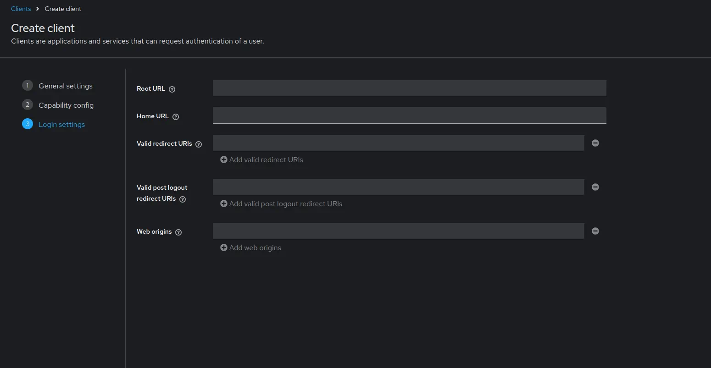
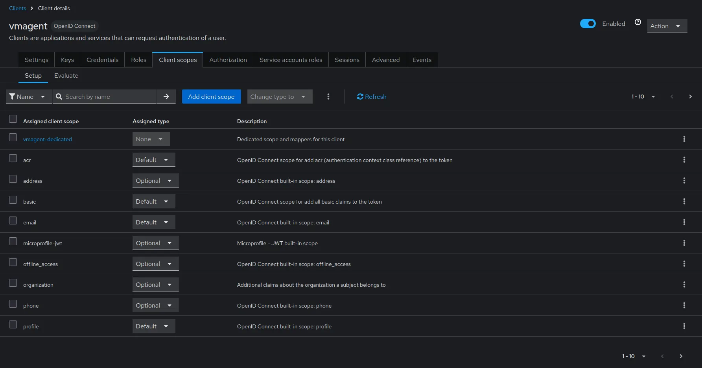
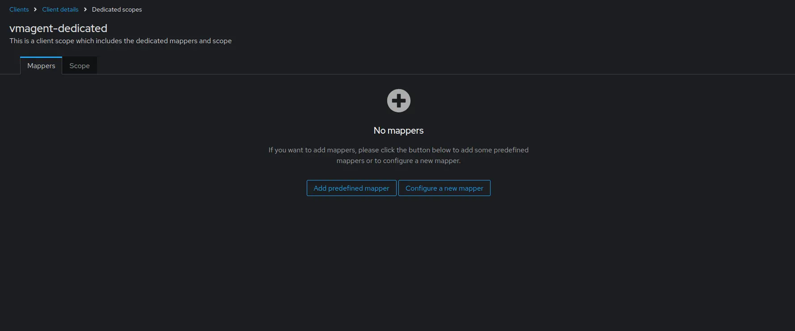
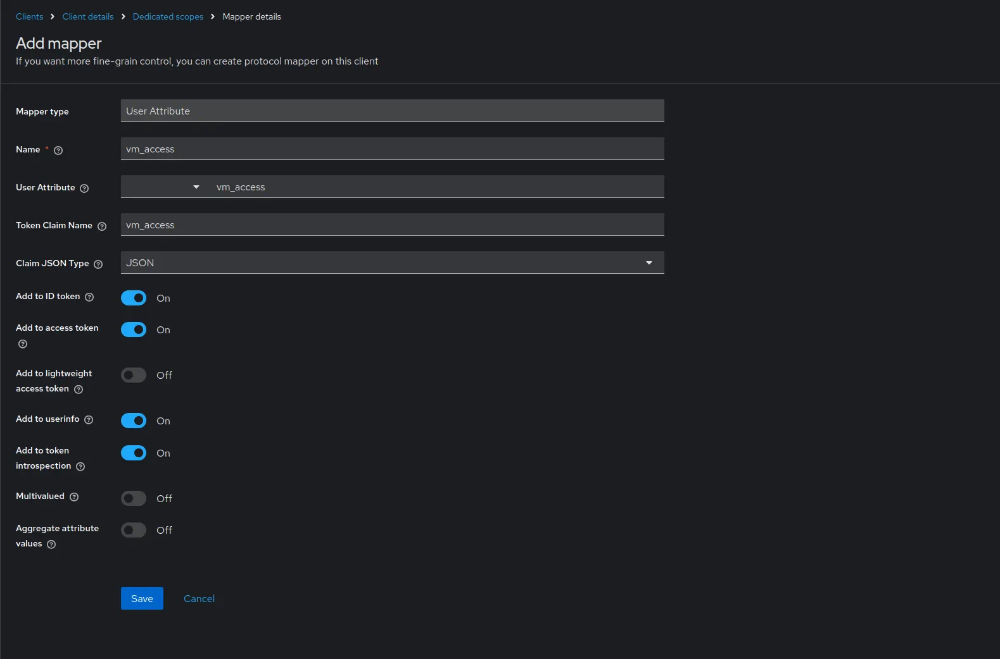
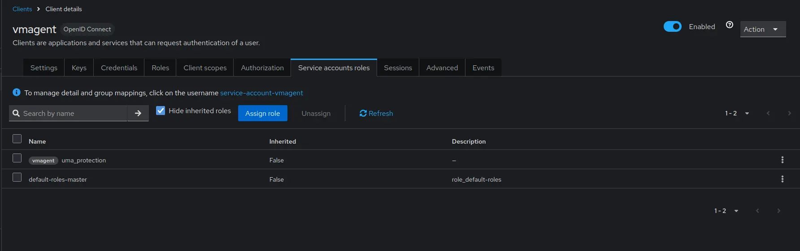
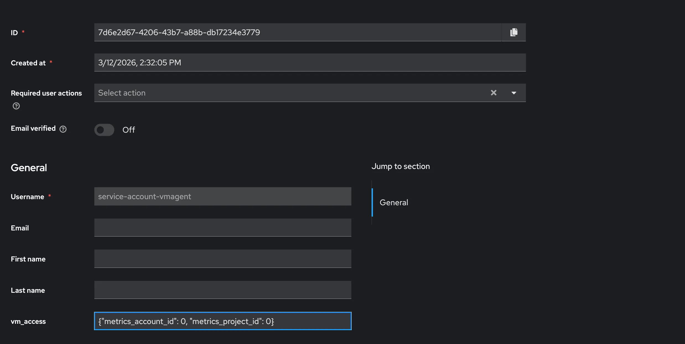

Using [vmagent](https://docs.victoriametrics.com/victoriametrics/vmagent/) with [vmauth](https://docs.victoriametrics.com/victoriametrics/vmauth/) OAuth authentication 
enables secure metric ingestion in [multi-tenant](https://docs.victoriametrics.com/victoriametrics/cluster-victoriametrics/#multitenancy) environments.
Vmagent can authenticate to vmauth using [JWT tokens](https://en.wikipedia.org/wiki/JSON_Web_Token) issued by an external identity provider.
These tokens can include tenant information, ensuring metrics are written to the correct tenant.
This guide provides step-by-step instructions for configuring vmagent to ingest metrics through vmauth with OIDC authorization enabled.

## Prerequisites

* An active license key. You can obtain a trial license key [here](https://victoriametrics.com/products/enterprise/trial/).
* [Docker](https://docs.docker.com/engine/install/) and Docker Compose must be installed.
* Add the `keycloak` host to the `/etc/hosts` file pointing to `127.0.0.1`.

```
# /etc/hosts

# Setup vmauth - Multi-Tenant Access with vmagent & OIDC
# https://docs.victoriametrics.com/guides/vmagent-openid-configuration/#prerequisites
127.0.0.1 keycloak
```

## Identity provider

The identity service must be able to issue JWT tokens with the following `vm_access` claim:

```json
{
  "vm_access": {
    "tenant_id": {
      "account_id": 0,
      "project_id": 0
    }
  }
}
```
> Note: if `project_id` is not specified, the default value `0` is used.

Some identity providers support only string claim values. vmauth also supports the claim value as a string:
```json
{
  "vm_access": "{\"tenant_id\": {\"account_id\": 0, \"project_id\": 0}}"
}
```

See details about all supported options in the [vmauth - oidc authorization](https://docs.victoriametrics.com/victoriametrics/vmauth/#oidc-authorization).

### Setup Keycloak

[Keycloak](https://www.keycloak.org/) is an open source identity service that can be used to issue JWT tokens.

Add the following section to your `compose.yaml` file to configure Keycloak:

```yaml
# compose.yaml
services:
  keycloak:
    image: quay.io/keycloak/keycloak:26.3
    command:
      - start-dev
      - --http-port=3001
    ports:
      - 127.0.0.1:3001:3001
    environment:
      KC_HOSTNAME_BACKCHANNEL_DYNAMIC: "true"
      KC_HOSTNAME: http://keycloak:3001/
      KC_BOOTSTRAP_ADMIN_USERNAME: admin
      KC_BOOTSTRAP_ADMIN_PASSWORD: change_me
    volumes:
      - keycloakdata:/opt/keycloak/data

volumes:
  keycloakdata: {}
```

Once Keycloak is available at `http://keycloak:3001`, follow the steps below to configure the OIDC client for vmagent:

### Create client

1. Log in with admin credentials to your Keycloak instance
1. Go to `Clients` -> `Create client`.<br>
   Use `OpenID Connect` as `Client Type`.<br>
   Specify `vmagent` as `Client ID`.<br>
   Click `Next`.<br>
   
1. Enable `Client authentication`.<br>
   Enable `Authorization`.<br>
   
   Click `Next`.<br>
1. Leave the URLs section empty as vmagent does not require any URLs.
   
   Click `Save`.<br>
1. Go to `Clients` -> `vmagent` -> `Credentials`.<br>
   
   Copy the value of `Client secret`. It will be used later in vmagent configuration.<br>
1. Go to `Clients` -> `vmagent` -> `Client scopes`.<br>
   Click on `vmagent-dedicated` -> `Configure a new mapper` -> `User attribute`.<br>
   
   
   Configure the mapper as follows:<br>
    - `Name` as `vm_access`.
    - `Token Claim Name` as `vm_access`.
    - `User Attribute` as `vm_access`.
    - `Claim JSON Type` as `JSON`.
      Enable `Add to ID token` and `Add to access token`.<br>

   
   Click `Save`.<br>

### Configure service account

1. Go to `Service account roles` -> click on `service-account-vmagent`.<br>
   
1. Go to the `Attributes` tab and add an attribute.
   Set the `vm_access` attribute value to `{"tenant_id" : {"account_id": 0, "project_id": 0}}`. <br>
   
   Click `Save`.

### Test identity provider

Start the service:
```sh
docker compose up
```

Test that everything is working by requesting a token using `curl`:

```sh
TOKEN=$(curl -s -X POST "http://keycloak:3001/realms/master/protocol/openid-connect/token" \
  -H "Content-Type: application/x-www-form-urlencoded" \
  -d "client_id=vmagent" \
  -d "client_secret={CLIENT_SECRET}" \
  -d "grant_type=client_credentials" \
  | jq -r '.access_token') && echo "$TOKEN"
```

The response should contain a valid JWT token with `vm_access` claim.
Use [jwt.io](https://jwt.io/) to decode and inspect the token.

## VictoriaMetrics

### Setup storage

Add the VictoriaMetrics cluster components to the `compose.yaml` file.
These services will store and query the metrics scraped by vmagent.

```yaml
# compose.yaml
services:
  vmstorage:
    image: victoriametrics/vmstorage:v1.124.0-cluster

  vminsert:
    image: victoriametrics/vminsert:v1.124.0-cluster
    command:
      - -storageNode=vmstorage:8400

  vmselect:
    image: victoriametrics/vmselect:v1.124.0-cluster
    command:
      - -storageNode=vmstorage:8401
    ports:
      - 8481:8481
```

### Setup vmauth

Create a vmauth configuration file `vm-auth.yaml` that enables OIDC authorization using the identity provider.
The `{{tenantID}}` placeholder will route requests to the correct tenant based on JWT claims.

```yaml
# vm-auth.yaml
oidc:
  realms:
    - name: keycloak
      issuer_url: http://keycloak:3001/realms/master
      # It's recommended to enable discovery in production
      skip_discovery: true
users:
  - client:
      # The value should match the "aud" claim from the JWT token
      # Use oidc.claims.client_id to change the claim used as client ID
      client_id: account
      realm: keycloak
    url_map:
      - src_paths:
          - "/insert/.*"
        drop_src_path_prefix_parts: 1
        url_prefix: "http://vminsert:8480/insert/{{tenantID}}/prometheus/"
```

Add the vmauth service to `compose.yaml`:

```yaml
# compose.yaml
services:
  vmauth:
    image: victoriametrics/vmauth:v1.124.0-enterprise
    ports:
      - 8427:8427
    volumes:
      - ./vm-license.key:/opt/vm-license.key
      - ./vm-auth.yaml:/etc/config.yaml
    command:
      - -licenseFile=/opt/vm-license.key
      - -auth.config=/etc/config.yaml
```

### Test vmauth

Start the services:

```sh
docker compose up
```

Use the token obtained in the [Test identity provider](https://docs.victoriametrics.com/guides/vmagent-openid-configuration/#test-identity-provider) section to test the vmauth configuration.

```sh
curl http://localhost:8427/insert/api/v1/write -H "Authorization: Bearer ${TOKEN}" -i
# Output
# HTTP/1.1 204 No Content
# ...
```

## Vmagent

### Setup

First, create a demo `scrape.yaml` file with basic scrape targets:

```yaml
# scrape.yaml
scrape_configs:
  - job_name: stat
    static_configs:
      - targets:
          - vmagent:8429
          - vmauth:8427
```

Now we'll configure vmagent to authenticate to vmauth using OAuth2 client credentials flow.
Vmagent will automatically obtain and refresh JWT tokens from the identity provider and include them in the `Authorization` header when sending metrics to vmauth.
This enables secure metric ingestion with proper tenant isolation based on the claims in the JWT token.

We'll use the `vmagent` client that was created in the [Create client](https://docs.victoriametrics.com/guides/vmagent-openid-configuration/#create-client) section.
The client secret obtained from that step will be used to authenticate vmagent with Keycloak.

Add the vmagent service to `compose.yaml` with OAuth2 configuration:

```yaml
# compose.yaml
services:
  vmagent:
    image: victoriametrics/vmagent:v1.124.0
    volumes:
      - ./scrape.yaml:/etc/vmagent/config.yaml
    command:
      - -promscrape.config=/etc/vmagent/config.yaml
      - -remoteWrite.url=http://vmauth:8427/insert/api/v1/write
      - -remoteWrite.oauth2.clientID=vmagent
      # This flag is used for demo purposes. In production, use -remoteWrite.oauth2.clientSecretFile instead
      - -remoteWrite.oauth2.clientSecret={CLIENT_SECRET}
      - -remoteWrite.oauth2.tokenUrl=http://keycloak:3001/realms/master/protocol/openid-connect/token
      - -remoteWrite.oauth2.scopes=openid
```

Use the client secret obtained in the [Create client](https://docs.victoriametrics.com/guides/vmagent-openid-configuration/#create-client) section.

### Test metrics

Go to `http://localhost:8481/select/0/vmui/` and query the `vm_app_version` metric. If the metric is present, then everything is working as expected.


## Summary

