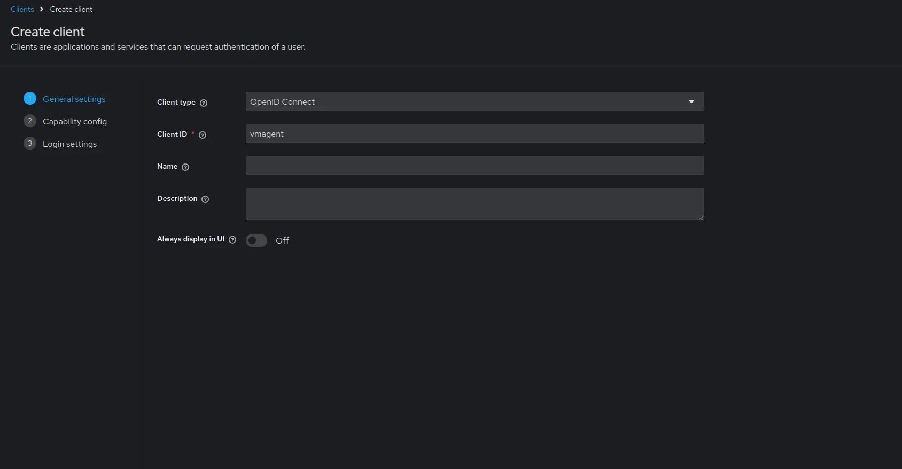
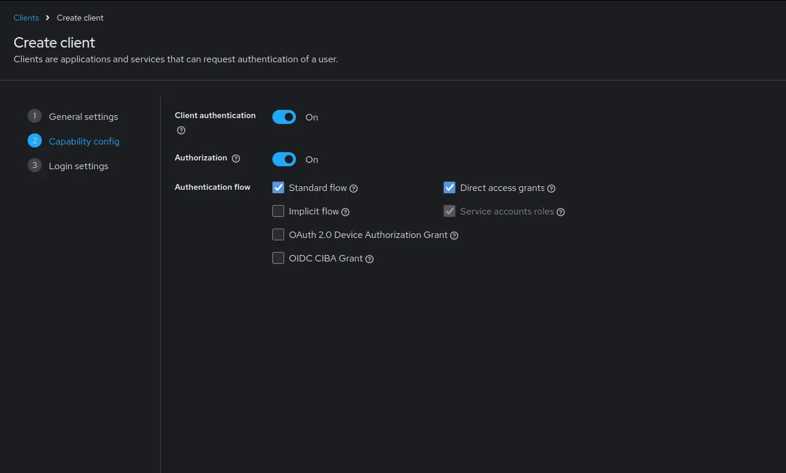
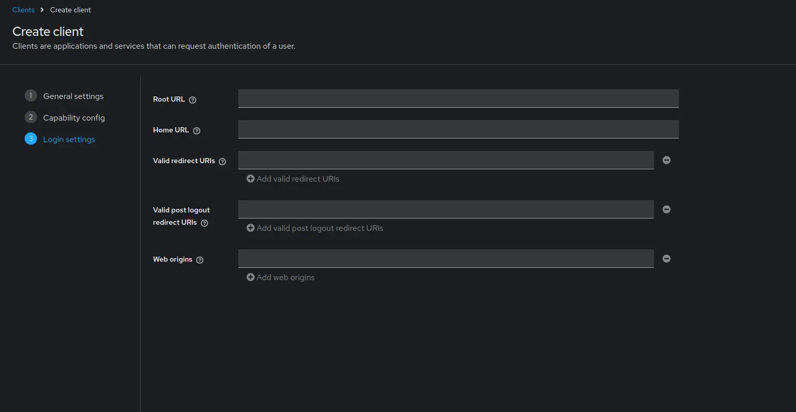
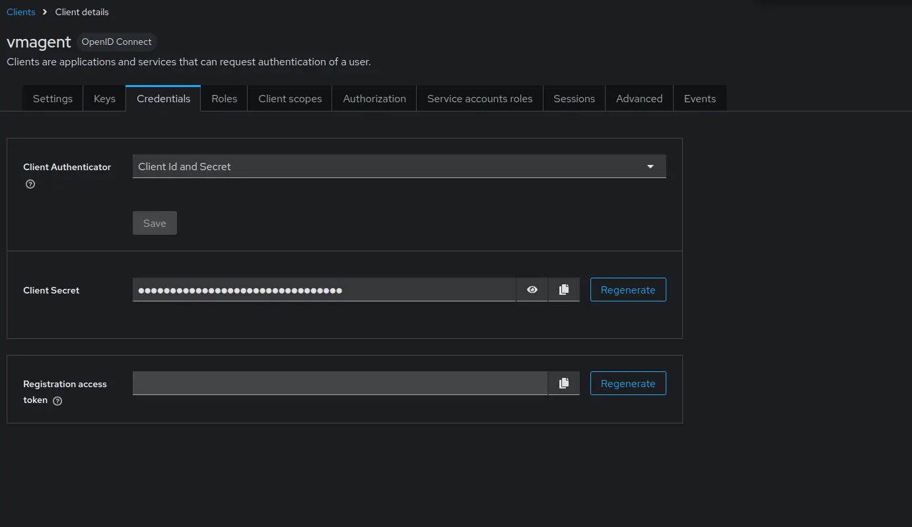
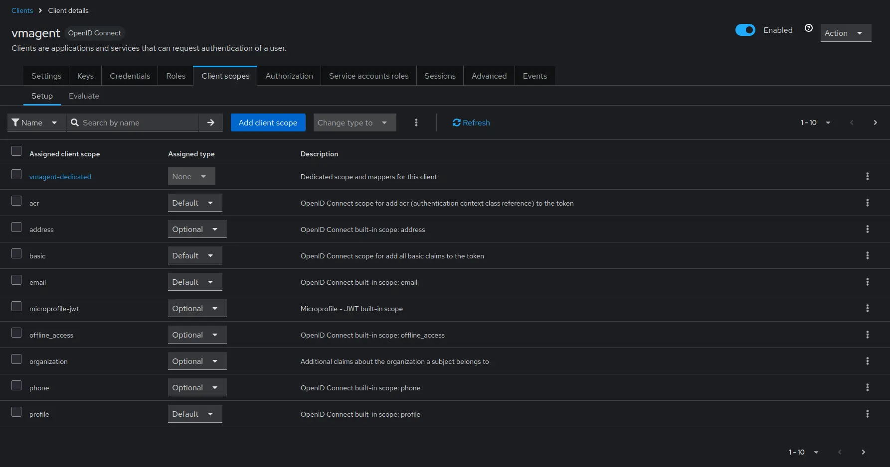
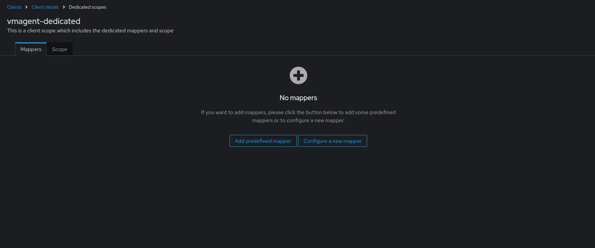
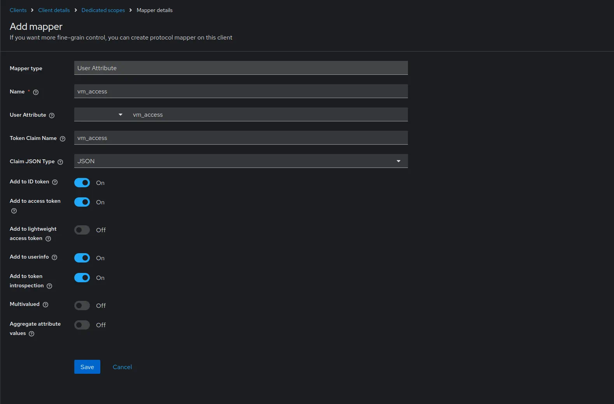
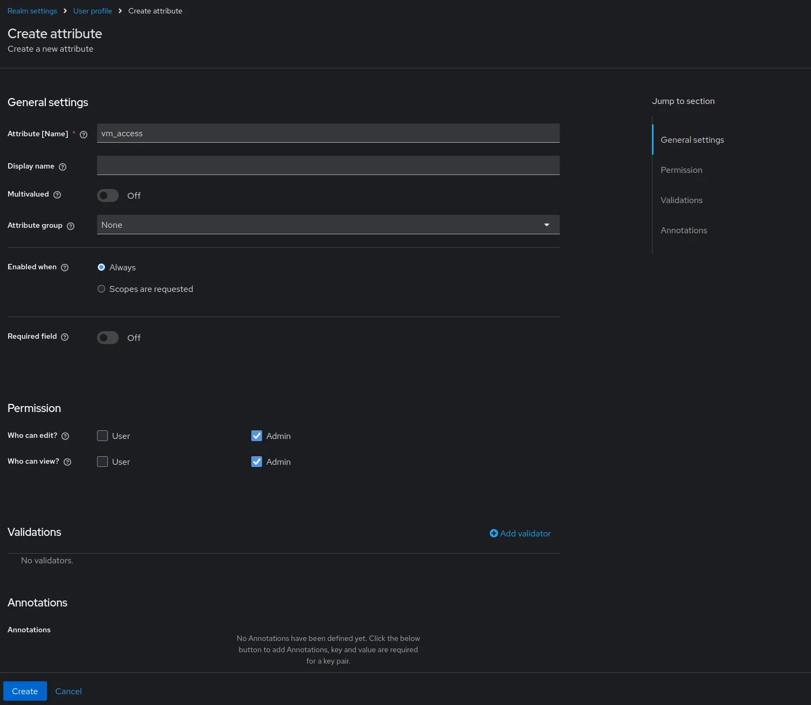
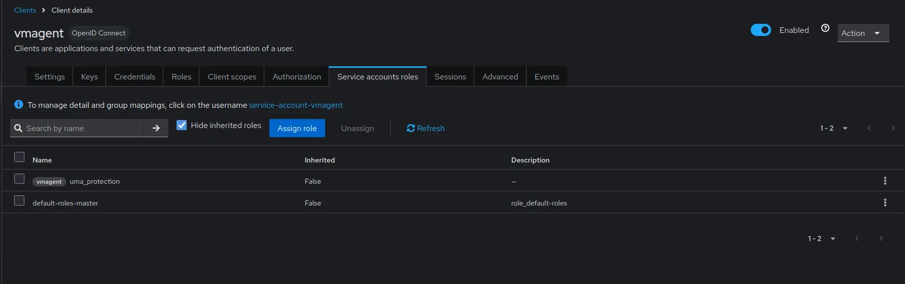
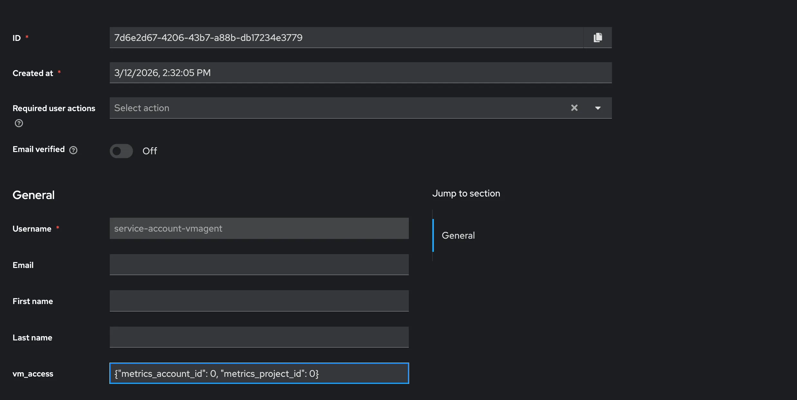

Using [vmagent](https://docs.victoriametrics.com/victoriametrics/vmagent/) with [vmauth](https://docs.victoriametrics.com/victoriametrics/vmauth/) and OAuth authentication enables secure metric ingestion in multi-tenant environments, where vmagent authenticates to vmauth using [JWT tokens](https://en.wikipedia.org/wiki/JSON_Web_Token) issued by an external identity provider. These tokens include tenant information so that metrics are written to the correct tenant.

This guide walks through configuring vmagent to ingest metrics through vmauth with OIDC authorization enabled.

## Prerequisites

* [Docker](https://docs.docker.com/engine/install/) and [docker compose](https://docs.docker.com/compose/) must be installed.
* [jq tool](https://jqlang.org/)
* Add the `keycloak` host to the `/etc/hosts` file pointing to `127.0.0.1`.

```
# /etc/hosts

# Setup vmagent - Multi-Tenant remote write & OIDC
# https://docs.victoriametrics.com/guides/vmagent-openid-configuration/#prerequisites
127.0.0.1 keycloak
```

## Identity provider

The identity service must be able to issue JWT tokens with the following `vm_access` claim:

```json
{
  "exp": 1772019469,
  "vm_access": {
    "metrics_account_id": 0,
    "metrics_project_id": 0
  }
}
```
> Note: if `metrics_account_id` or `metrics_project_id` are not specified, the default value `0` is used.

Some identity providers only support string-based claim values; vmauth supports those as well:
```json
{
   "exp": 1772019469,
   "vm_access": "{\"metrics_account_id\": 0, \"metrics_project_id\": 0}"
}
```

See details about all supported options in the [vmauth documentation](https://docs.victoriametrics.com/victoriametrics/vmauth/#jwt-token-auth-proxy).

### Setup Keycloak

[Keycloak](https://www.keycloak.org/) is an open-source identity service that can issue JWT tokens.

Add the following section to your `compose.yaml` file to configure Keycloak:

```yaml
# compose.yaml
services:
  keycloak:
    image: quay.io/keycloak/keycloak:26.3
    command:
      - start-dev
      - --http-port=3001
    ports:
      - 127.0.0.1:3001:3001
    environment:
      KC_HOSTNAME_BACKCHANNEL_DYNAMIC: "true"
      KC_HOSTNAME: http://keycloak:3001/
      KC_BOOTSTRAP_ADMIN_USERNAME: admin
      KC_BOOTSTRAP_ADMIN_PASSWORD: change_me
    volumes:
      - keycloakdata:/opt/keycloak/data

volumes:
  keycloakdata: {}
```

Run `docker compose up` to start Keycloak.

Once Keycloak is available at `http://keycloak:3001`, follow the steps below to configure the OIDC client for vmagent:

### Create client

1. Log in with admin credentials to your Keycloak instance
  - Username: `admin`
  - Password: `change_me`
1. Go to `Clients` -> `Create client`.
   - Use `OpenID Connect` as `Client Type`.
   - Specify `vmagent` as `Client ID`.
   - Click `Next`.
   
1. Enable `Client authentication`.
   - Enable `Authorization`.
   
   - Click `Next`.
1. Leave the URLs section empty as vmagent does not require any URLs.
   
   - Click `Save`.
1. Go to `Clients` -> `vmagent` -> `Credentials`.
   
   - Copy the value of `Client secret`. It will be used later in vmagent configuration.
1. Go to `Clients` -> `vmagent` -> `Client scopes`.
   
   - Click on `vmagent-dedicated` -> `Configure a new mapper` -> `User attribute`.
   
1. Configure the mapper as follows:
    - `Name` as `vm_access`.
    - `User Attribute` as `vm_access`.
    - `Token Claim Name` as `vm_access`.
    - `Claim JSON Type` as `JSON`.
    - Enable `Add to ID token` and `Add to access token`.

   
   - Click `Save`.

### Create User Attributes

1. Go to `Realm settings` -> `User profile`.
   - Click `Create attribute`.
   - Specify `vm_access` as `Attribute [Name]`.
   
   - Click `Create`.

### Configure service account

1. Go to `Client` -> `vmagent` -> `Service account roles` -> click on `service-account-vmagent`.
   
1. Set the `vm_access` attribute value to `{"metrics_account_id": 0, "metrics_project_id": 0}`.
   
   - Click `Save`.

### Test identity provider

Start the service:
```sh
docker compose up
```

Verify the setup by requesting a token with `curl`:

```sh
TOKEN=$(curl -s -X POST "http://keycloak:3001/realms/master/protocol/openid-connect/token" \
  -H "Content-Type: application/x-www-form-urlencoded" \
  -d "client_id=vmagent" \
  -d "client_secret={CLIENT_SECRET}" \
  -d "grant_type=client_credentials" \
  | jq -r '.access_token') && echo "$TOKEN"
```

The response should contain a valid JWT token with the `vm_access` claim.
Use [jwt.io](https://jwt.io/) to decode and inspect the token.

## VictoriaMetrics

### Setup storage

Add the VictoriaMetrics cluster components to the `compose.yaml` file.
These services will store and query the metrics scraped by vmagent.

```yaml
# compose.yaml
services:
  vmstorage:
    image: victoriametrics/vmstorage:v1.137.0-cluster

  vminsert:
    image: victoriametrics/vminsert:v1.137.0-cluster
    command:
      - -storageNode=vmstorage:8400

  vmselect:
    image: victoriametrics/vmselect:v1.137.0-cluster
    command:
      - -storageNode=vmstorage:8401
    ports:
      - 8481:8481
```

### Setup vmauth

Create a vmauth configuration file `vm-auth.yaml` that enables OIDC authorization using the identity provider.

The `{{.MetricsTenant}}` is expanded by vmauth into `accountID:projectID` derived from the vm_access claim, and defaults to `0:0` if not set.

```yaml
# vm-auth.yaml

users:
- jwt:
    oidc:
      issuer: 'http://keycloak:3001/realms/master'
  url_map:
    - src_paths:
        - "/insert/.*"
      drop_src_path_prefix_parts: 1
      url_prefix: "http://vminsert:8480/insert/{{.MetricsTenant}}/prometheus/"
```

Add the vmauth service to `compose.yaml`:

```yaml
# compose.yaml
services:
  vmauth:
    image: victoriametrics/vmauth:v1.137.0-enterprise
    ports:
      - 8427:8427
    volumes:
      - ./vm-auth.yaml:/etc/config.yaml
    command:
      - -auth.config=/etc/config.yaml
```

### Test vmauth

Start the services:

```sh
docker compose up
```

Use the token obtained in the [Test identity provider](https://docs.victoriametrics.com/guides/vmagent-openid-configuration/#test-identity-provider) section to test the vmauth configuration.

```sh
curl http://localhost:8427/insert/api/v1/write -H "Authorization: Bearer ${TOKEN}" -i
# Output
# HTTP/1.1 204 No Content
# ...
```

## Vmagent

### Setup

First, create a demo `scrape.yaml` file with basic scrape targets:

```yaml
# scrape.yaml
scrape_configs:
  - job_name: stat
    static_configs:
      - targets:
          - vmagent:8429
          - vmauth:8427
```

Now we'll configure vmagent to authenticate to vmauth using OAuth2 client credentials flow.
The vmagent service automatically obtains and refreshes JWT tokens from the identity provider and includes them in the `Authorization` header when sending metrics to vmauth.
This enables secure metric ingestion with proper tenant isolation based on the claims in the JWT token.

We'll use the `vmagent` client that was created in the [Create client](https://docs.victoriametrics.com/guides/vmagent-openid-configuration/#create-client) section.
The client secret obtained from that step will be used to authenticate vmagent with Keycloak.

Add the vmagent service to `compose.yaml` with OAuth2 configuration:

```yaml
# compose.yaml
services:
  vmagent:
    image: victoriametrics/vmagent:v1.137.0
    volumes:
      - ./scrape.yaml:/etc/vmagent/config.yaml
    command:
      - -promscrape.config=/etc/vmagent/config.yaml
      - -remoteWrite.url=http://vmauth:8427/insert/api/v1/write
      - -remoteWrite.oauth2.clientID=vmagent
      # This flag is used for demo purposes. In production, use -remoteWrite.oauth2.clientSecretFile instead to avoid exposing the secret in the command line/process list
      - -remoteWrite.oauth2.clientSecret={CLIENT_SECRET}
      - -remoteWrite.oauth2.tokenUrl=http://keycloak:3001/realms/master/protocol/openid-connect/token
      - -remoteWrite.oauth2.scopes=openid
```

Use the client secret obtained in the [Create client](https://docs.victoriametrics.com/guides/vmagent-openid-configuration/#create-client) section.

### Test metrics

Go to `http://localhost:8481/select/0/vmui/` and query the `vm_app_version` metric. If the metric is present, then everything is working as expected.

## Summary

This guide showed how to configure vmagent to ingest metrics into a VictoriaMetrics cluster through vmauth using OIDC authentication.
Vmagent uses the OAuth2 client credentials flow to obtain JWT tokens from Keycloak, which vmauth validates and uses to route requests to the correct tenant.

