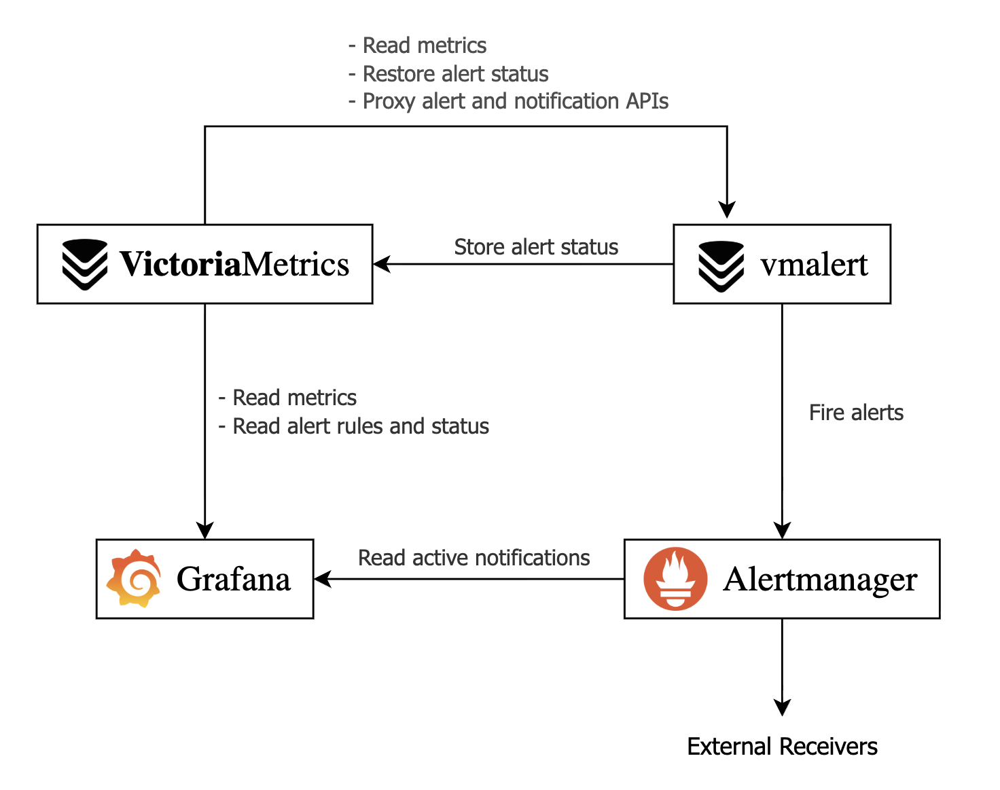
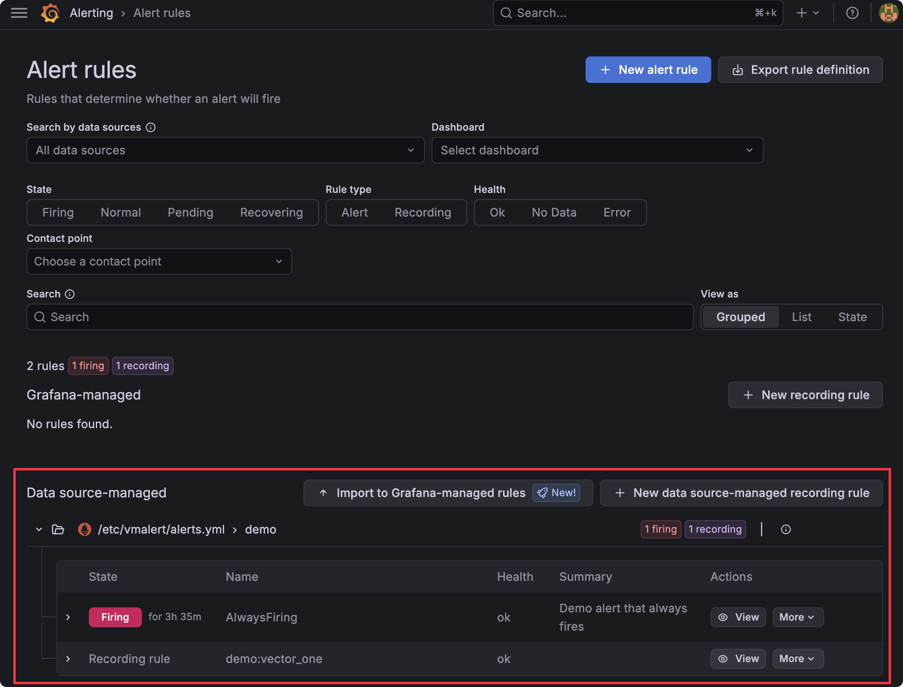
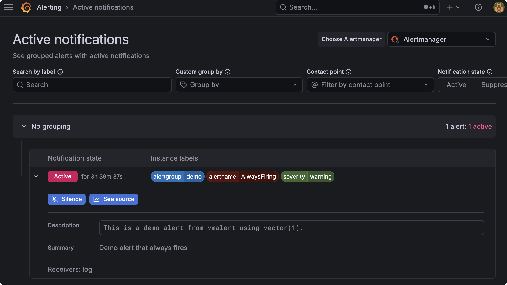
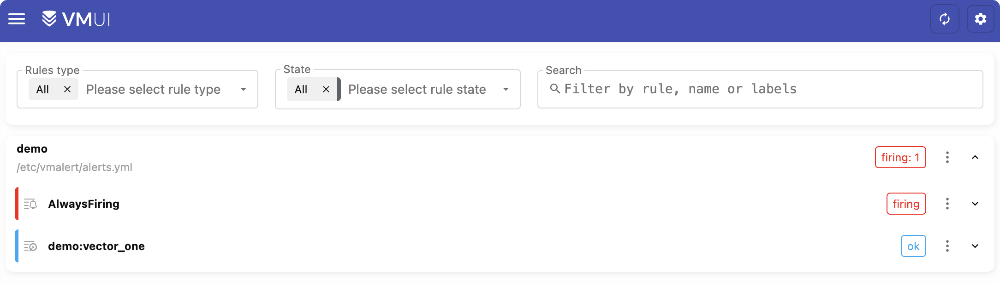
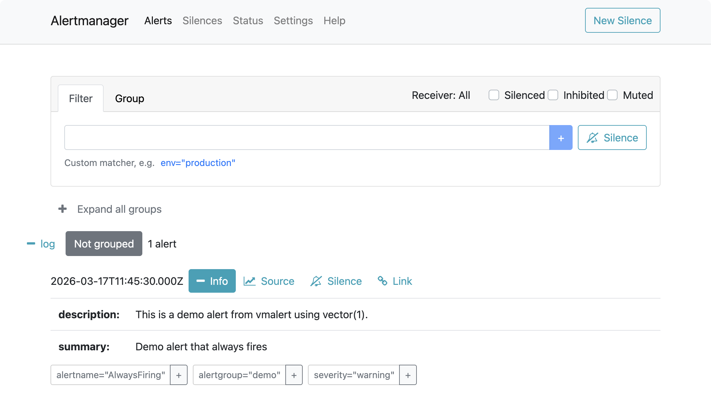
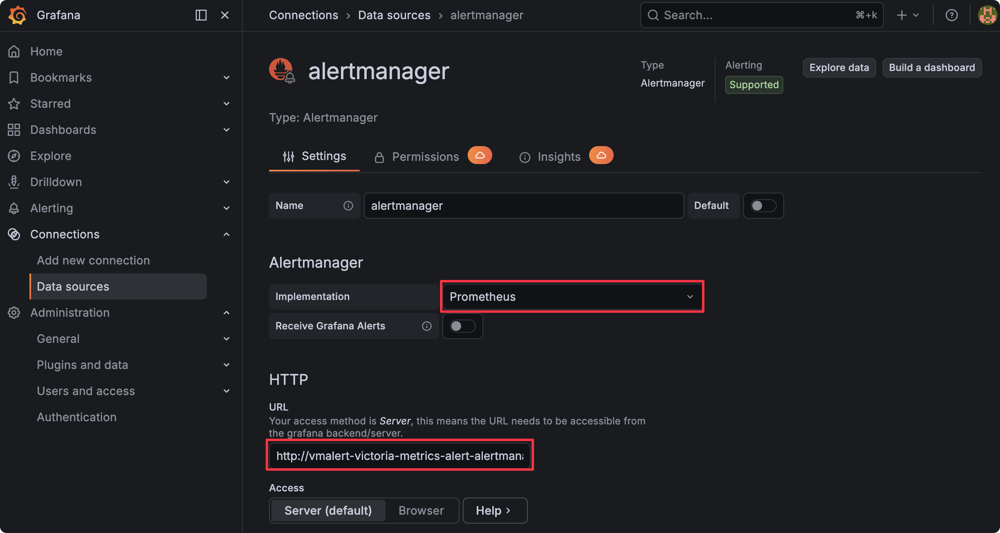

---
build:
  list: never
  publishResources: false
  render: never
sitemap:
  disable: true
---

Grafana offers a rich alerting UI, including rule grouping, silences, and notification history. While Grafana-managed alerts are easy to use, [they can hit performance issues without additional configuration since they depend on a relational database by default](https://grafana.com/blog/how-we-improved-grafanas-alert-state-history-to-provide-better-insights-into-your-alerting-data/).

By moving rule evaluation to [vmalert](https://docs.victoriametrics.com/victoriametrics/vmalert/), you can move past these limitations while retaining Grafana's unified alerting UI. This guide shows the ideal topology for scalable alerting using vmalert, Alertmanager, and Grafana datasource-managed alerts.

## Grafana Alert Modes

Grafana supports two alert modes, which can run side by side:
- Grafana-managed: alerts are created and evaluated entirely within Grafana itself. The alert state is stored in a SQL database by default, but [Grafana can be configured to store this data in a Prometheus-compatible database like VictoriaMetrics as well](https://grafana.com/docs/grafana/latest/alerting/set-up/configure-alert-state-history/#configure-prometheus-for-alert-state-grafana_alerts-metric).
- Datasource-managed: alerts have their rules defined, stored, and evaluated in an external system like vmalert and Alertmanager, with Grafana just providing the UI. State is stored in VictoriaMetrics.

The following table compares the two modes:

| Aspect              | Grafana-Managed                                    | Data Source-Managed           |
| ------------------- | -------------------------------------------------- | ----------------------------- |
| Where rules live    | Grafana's SQL database                             | vmalert's YAML config         |
| Evaluation          | Grafana's scheduler                                | vmalert                       |
| Horizontal Scaling  | Complex (requires HA SQL database)                 | Simple (add more pods)        |
| State storage       | SQL backend or a Prometheus datasource             | VictoriaMetrics               |
| UI Management       | Full create/edit in Grafana                        | View-only                     |
| Dependencies        | SQL + Grafana                                      | VictoriaMetrics               |
| Version control     | Complex (rules must be exported/imported)          | Easy (rules are in YAML file) |

## Datasource-managed Alert Topology

The proposed alert setup relies on the following services:

- VictoriaMetrics: provides the time-series database and persists alert status.
- vmalert: evaluates alerting rules from its config file against VictoriaMetrics data and forwards firing alerts to Alertmanager.
- Alertmanager: groups and routes alerts to the configured recipients.
- Grafana: serves as the unified UI, connecting to VictoriaMetrics for rules and metrics, and to Alertmanager for notifications/silences.



## vmalert Demo with Docker {#docker}

In this section, we'll describe how you can try datasource-managed alerts on Grafana with Docker Compose. Follow the steps in this section to see how the Grafana UI looks in datasource-managed alerts.

First, create `alerts.yml`. The following configuration file creates an always-firing alert, which you can use to test datasource-managed alerts in Grafana.

```yaml
# alerts.yml
groups:
  - name: demo
    rules:
      # Always-firing demo alert so you see something immediately
      - alert: AlwaysFiring
        expr: vector(1)
        for: 10s
        labels:
          severity: warning
        annotations:
          summary: "Demo alert that always fires"
          description: "This is a demo alert from vmalert using vector(1)."

      # Simple recording rule you can graph in Grafana
      - record: demo:vector_one
        expr: vector(1)
```

Next, create a basic Alertmanager config called `alertmanager.yml`. This example does not forward alerts anywhere, but serves as a source for Grafana:

```yaml
# alertmanager.yml
global:
  resolve_timeout: 5m

route:
  receiver: "log"

receivers:
  - name: "log"
```

Finally, create `grafana-datasources.yml` to configure Grafana to use VictoriaMetrics and Alertmanager as datasources for alerts and notifications:

```yaml
# grafana-datasources.yml
apiVersion: 1

datasources:
  - name: VictoriaMetrics
    type: prometheus
    access: proxy
    url: http://victoriametrics:8428
    isDefault: true

  - name: Alertmanager
    type: alertmanager
    access: proxy
    url: http://alertmanager:9093
    jsonData:
      implementation: prometheus
```

The final piece is the Docker Compose file. This ties all the services together and sets up the required command-line arguments:

```yaml
# compose.yml
services:
  victoriametrics:
    image: victoriametrics/victoria-metrics:v1.142.0
    command:
      - "--storageDataPath=/victoria-metrics-data"
      - "--selfScrapeInterval=10s"
      # Proxy vmalert APIs so Grafana can see rules via VictoriaMetrics
      - "--vmalert.proxyURL=http://vmalert:8880"
    ports:
      - "8428:8428"
    volumes:
      - vm-data:/victoria-metrics-data

  alertmanager:
    image: prom/alertmanager:v0.31.1
    command:
     - "--config.file=/etc/alertmanager/alertmanager.yml"
    ports:
      - "9093:9093"
    volumes:
      - ./alertmanager.yml:/etc/alertmanager/alertmanager.yml:ro

  vmalert:
    image: victoriametrics/vmalert:v1.142.0
    depends_on:
      - victoriametrics
      - alertmanager
    command:
      # read metrics from VictoriaMetrics
      - "--datasource.url=http://victoriametrics:8428"
      # store and retrieve alert state from VictoriaMetrics
      - "--remoteRead.url=http://victoriametrics:8428"
      - "--remoteWrite.url=http://victoriametrics:8428"
      # configure Alertmanager as the notifier
      - "--notifier.url=http://alertmanager:9093"
      - "--rule=/etc/vmalert/alerts.yml"
      - "--evaluationInterval=15s"
      # external settings link vmalerts and Alertmanager to Grafana
      - "--external.url=http://localhost:3000"
      - "--external.alert.source=explore?orgId=1&left={\"datasource\":\"VictoriaMetrics\",\"queries\":[{\"refId\":\"A\",\"expr\":\"{{.Expr|queryEscape}}\"}]}"
    ports:
      - "8880:8880"
    volumes:
      - ./alerts.yml:/etc/vmalert/alerts.yml:ro

  grafana:
    image: grafana/grafana:12.4
    depends_on:
      - victoriametrics
      - alertmanager
    environment:
      GF_SECURITY_ADMIN_USER: admin
      GF_SECURITY_ADMIN_PASSWORD: admin
      GF_PATHS_PROVISIONING: /etc/grafana/provisioning
    ports:
      - "3000:3000"
    volumes:
      - ./grafana-datasources.yml:/etc/grafana/provisioning/datasources/datasources.yml:ro
      - grafana-data:/var/lib/grafana

volumes:
  vm-data:
  grafana-data:
```

Let's break down the main command line arguments that connect every component:

- VictoriaMetrics
  - `-vmalert.proxyURL`: forwards Grafana requests for `/api/v1/rules` and `/api/v1/alerts` to vmalert, enabling rule visibility in Grafana UI

- vmalert
  - `-datasource.url`: configures VictoriaMetrics as the query source for rule evaluation
  - `-remoteWrite.url`: defines VictoriaMetrics as the backend used to persist rule state across restarts
  - `-remoteRead.url`: defines VictoriaMetrics as the backend used to read historical state for pending alerts
  - `-notifier.url`: directs firing alerts to Alertmanager
  - `-external.url`: defines the base URL for alert links so users see the public URL of Alertmanager, or an external alerting UI like Karma or Grafana in notifications.
  - `-external.alert.source`: creates a template for clickable alert links for Grafana. Allows Alertmanager UI to link directly to Grafana

Now, start the demo with:

```sh
docker compose up -d
```

Open your browser at `localhost:3000` and log in to Grafana with username `admin` and password `admin`.

If you open the sidebar and select **Alerting** > **Alert rules**, you should be able to see one alert pending or firing.


<figcaption style="text-align: center; font-style: italic;">Datasource-managed alert firing in Grafana</figcaption>

Open the sidebar again and go to **Alerting** > **Active notifications** to see the active alert reported by Alertmanager.



You can also see the alerts in VMUI by opening the browser in `http://localhost:8428/vmui/?#/rules`. This is possible only when we have configured `-vmalert.proxyURL` in VictoriaMetrics.


<figcaption style="text-align: center; font-style: italic;">Alerts can be visualized in VMUI directly</figcaption>

If you open the browser in `http://localhost:9093/#/alerts`, you will see the Alertmanager UI with the firing alert.


<figcaption style="text-align: center; font-style: italic;">Alertmanager UI showing the firing alert</figcaption>

Clicking **Source** should take you back to Grafana and display the query that generated the alert.

## vmalert and VictoriaMetrics Single on Kubernetes {#vmsingle}

This section explains how to configure datasource-managed alerts on the VictoriaMetrics single-node version on Kubernetes.

### Prerequisites

- A Kubernetes cluster
- VictoriaMetrics single-node
- Grafana
- Helm values or config files used for installation

You can follow this guide to install all required components: [Kubernetes monitoring via VictoriaMetrics single](https://docs.victoriametrics.com/guides/k8s-monitoring-via-vm-single/).

### 1. Ensure VictoriaMetrics and Grafana are installed

Ensure you have added and updated the VictoriaMetrics Helm repository:

```sh
helm repo add vm https://victoriametrics.github.io/helm-charts/
helm repo update

```

Confirm that the VictoriaMetrics single-node version is installed (assuming the release name `vmsingle` from the [installation guide](https://docs.victoriametrics.com/guides/k8s-monitoring-via-vm-single/))

```sh
kubectl get pods -l app.kubernetes.io/instance=vmsingle
```

You should get a single running pod:

```sh
NAME                                        READY   STATUS    RESTARTS   AGE
vmsingle-victoria-metrics-single-server-0   1/1     Running   0          48m
```

Do the same for Grafana:

```sh
kubectl get pod -l app.kubernetes.io/name=grafana
```

You should get the name of the Grafana pod running in your cluster:

```sh
NAME                          READY   STATUS    RESTARTS   AGE
my-grafana-65d6d4ccbc-nxkxq   1/1     Running   0          58m
```

### 2. Install vmalert and Alertmanager

Create a Helm values file for vmalert and Alertmanager called `vm-alerting-values.yml`. 

The example below comes with two demo alerts. Add your own vmalert [alerting rules](https://docs.victoriametrics.com/victoriametrics/vmalert/#rules) in the `config: alerts:` section below.

```sh
cat <<EOF > vm-alerting-values.yml
# Enable and configure Alertmanager
alertmanager:
  enabled: true
  config:
    global:
      resolve_timeout: 5m
    route:
      group_by: ["alertname"]
      group_wait: 30s
      group_interval: 5m
      repeat_interval: 12h
      receiver: "log"

    receivers:
      - name: "log"
        # place your default route here for notifications

# Configure vmalert ("server" section in this chart)
server:
  # vmalert evaluation datasource: point at vmsingle’s Prometheus-compatible API
  datasource:
    url: http://vmsingle-victoria-metrics-single-server.default.svc.cluster.local.:8428

  # Where vmalert stores and reads alert state (remote write/read)
  remote:
    write:
      url: http://vmsingle-victoria-metrics-single-server.default.svc.cluster.local.:8428
    read:
      url: http://vmsingle-victoria-metrics-single-server.default.svc.cluster.local.:8428

  # Configure Alertmanager as notifier
  notifier:
    alertmanager:
      # Adjust namespace/name if you install into a non-default namespace or change the release name
      url: http://vmalert-victoria-metrics-alert-alertmanager:9093

  # Inline demo rules. Add your alerting groups and rules here
  config:
    alerts:
      groups:
      - name: vm-health
        rules:
          - alert: TooManyRestarts
            expr: changes(process_start_time_seconds{job=~"victoriametrics|vmagent|vmalert"}[15m]) > 2
            labels:
              severity: critical
            annotations:
              summary: "{{ $labels.job }} too many restarts (instance {{ $labels.instance }})"
              description: "Job {{ $labels.job }} has restarted more than twice in the last 15 minutes. It might be crashlooping."
          - alert: ServiceDown
            expr: up{job=~"victoriametrics|vmagent|vmalert"} == 0
            for: 2m
            labels:
              severity: critical
            annotations:
              summary: "Service {{ $labels.job }} is down on {{ $labels.instance }}"
              description: "{{ $labels.instance }} of job {{ $labels.job }} has been down for more than 2 minutes."
EOF
```

Install `vmalert` and Alertmanager with:

```sh
helm install vmalert vm/victoria-metrics-alert -f vm-alerting-values.yml
```

### 3. Configure VictoriaMetrics single to proxy to vmalert

For datasource-managed alerts, Grafana talks to VictoriaMetrics, and VictoriaMetrics proxies alerting-related API calls to vmalert via the `-vmalert.proxyURL` flag.

First, check the service name for `vmalert`:

```sh
kubectl get svc -l app.kubernetes.io/instance=vmalert,app=server
```

Get the name of the `vmalert` service:

```sh
NAME                                    TYPE        CLUSTER-IP   EXTERNAL-IP   PORT(S)    AGE
vmalert-victoria-metrics-alert-server   ClusterIP   None         <none>        8880/TCP   58m
```

The internal DNS name for this service, in the default namespace, will be:

```text
vmalert-victoria-metrics-alert-server.default.svc.cluster.local:8880
```

Next, create a Helm values file with the internal Kubernetes URL for vmalert.

```sh
cat <<EOF > vm-vmalert-proxy-values.yml
# vm-vmalert-proxy-values.yaml
server:
  extraArgs:
    vmalert.proxyURL: http://vmalert-victoria-metrics-alert-server.default.svc.cluster.local:8880
EOF

```

Update the configuration of VictoriaMetrics single by applying both *your original Helm values* and this new overlay. In the example below, the original values file is called `vmsingle-values-file.yml` (this is the file you used when you first installed the cluster):

```sh
helm upgrade vmsingle vm/victoria-metrics-single \
  -f vmsingle-values-file.yml \
  -f vm-vmalert-proxy-values.yml
```

After this upgrade, vmsingle will start proxying `/api/v1/rules`, `/api/v1/alerts`, and other `vmalert` [endpoints](https://docs.victoriametrics.com/victoriametrics/vmalert/#web) to the vmalert service, enabling Grafana’s alerting UI and API to work through the VictoriaMetrics datasource. 

To finish the setup, jump to the [Configure Grafana](https://docs.victoriametrics.com/guides/vmalert-datasource-managed-alerts-grafana/#grafana) section

## vmalert and VictoriaMetrics Cluster on Kubernetes {#vmcluster}

This section explains how to configure datasource-managed alerts on the VictoriaMetrics cluster version on Kubernetes.

### Prerequisites

- A Kubernetes cluster  
- VictoriaMetrics cluster
- Grafana  
- Helm values or config files used for the installation of the cluster

You can follow this guide to install the cluster and Grafana first: [Kubernetes monitoring with VictoriaMetrics cluster](https://docs.victoriametrics.com/guides/k8s-monitoring-via-vm-cluster/).

### 1. Ensure VictoriaMetrics and Grafana are installed

Ensure you have added and updated the VictoriaMetrics Helm repository:

```sh
helm repo add vm https://victoriametrics.github.io/helm-charts/
helm repo update
```

Confirm that the VictoriaMetrics cluster is installed (assuming the release name `vmcluster` from the [installation guide](https://docs.victoriametrics.com/guides/k8s-monitoring-via-vm-cluster/)):

```sh
kubectl get pods -l app.kubernetes.io/instance=vmcluster
```

You should see pods for `vmselect`, `vminsert`, and `vmstorage`, for example:

```text
NAME                                                           READY   STATUS    RESTARTS   AGE
vmcluster-victoria-metrics-cluster-vminsert-b4d494b4c-cx2m5    1/1     Running   0          3m8s
vmcluster-victoria-metrics-cluster-vminsert-b4d494b4c-xdv76    1/1     Running   0          3m8s
vmcluster-victoria-metrics-cluster-vmselect-67979c98fc-7hfdl   1/1     Running   0          3m8s
vmcluster-victoria-metrics-cluster-vmselect-67979c98fc-ftpzn   1/1     Running   0          3m8s
vmcluster-victoria-metrics-cluster-vmstorage-0                 1/1     Running   0          3m8s
vmcluster-victoria-metrics-cluster-vmstorage-1                 1/1     Running   0          2m48s
```

VictoriaMetrics exposes its write API via the `vminsert` service on port 8480 and its read (Prometheus-compatible) API via the `vmselect` service on port 8481 by default. For a default installation, these DNS names are:

- Write: `vmcluster-victoria-metrics-cluster-vminsert.default.svc.cluster.local.:8480`  
- Read: `vmcluster-victoria-metrics-cluster-vmselect.default.svc.cluster.local.:8481`

Now, ensure Grafana is installed:

```sh
kubectl get pod -l app.kubernetes.io/name=grafana
```

You should get the name of the Grafana pod running in your cluster:

```sh
NAME                          READY   STATUS    RESTARTS   AGE
my-grafana-65d6d4ccbc-nxkxq   1/1     Running   0          58m
```

### 2. Install vmalert and Alertmanager

Create a Helm values file for vmalert and Alertmanager called `vm-alerting-values.yml`.  

The example below comes with two demo alerts. Add your own vmalert [alerting rules](https://docs.victoriametrics.com/victoriametrics/vmalert/#rules) in the `config: alerts:` section below.


```sh
cat <<EOF > vm-alerting-values.yml
# Enable and configure Alertmanager
alertmanager:
  enabled: true
  config:
    global:
      resolve_timeout: 5m
    route:
      group_by: ["alertname"]
      group_wait: 30s
      group_interval: 5m
      repeat_interval: 12h
      receiver: "log"

    receivers:
      - name: "log"
        # place your notification route here

# Configure vmalert ("server" section in this chart)
server:
  # vmalert evaluation datasource: point at vmselect’s Prometheus-compatible API
  datasource:
    url: http://vmcluster-victoria-metrics-cluster-vmselect.default.svc.cluster.local.:8481/select/multitenant/prometheus/

  # Where vmalert stores and reads alert state (remote write/read)
  remote:
    write:
      # send ALERTS / recording rule series into vminsert
      url: http://vmcluster-victoria-metrics-cluster-vminsert.default.svc.cluster.local.:8480/insert/0/prometheus/
    read:
      # read back alert state from vmselect
      url: http://vmcluster-victoria-metrics-cluster-vmselect.default.svc.cluster.local.:8481/select/0/prometheus/

  # Configure Alertmanager as notifier
  notifier:
    alertmanager:
      # Adjust namespace/name if you install into a non-default namespace or change the release name
      url: http://vmalert-victoria-metrics-alert-alertmanager:9093

  # Inline demo rules. Add your alerting groups and rules here
  config:
    alerts:
      groups:
      - name: vm-health
        rules:
          - alert: TooManyRestarts
            expr: changes(process_start_time_seconds{job=~"victoriametrics|vmagent|vmalert"}[15m]) > 2
            labels:
              severity: critical
            annotations:
              summary: "{{ $labels.job }} too many restarts (instance {{ $labels.instance }})"
              description: "Job {{ $labels.job }} has restarted more than twice in the last 15 minutes.
                It might be crashlooping."
          - alert: ServiceDown
            expr: up{job=~"victoriametrics|vmagent|vmalert"} == 0
            for: 2m
            labels:
              severity: critical
            annotations:
              summary: "Service {{ $labels.job }} is down on {{ $labels.instance }}"
              description: "{{ $labels.instance }} of job {{ $labels.job }} has been down for more than 2 minutes."
EOF
```


The key differences from the [single-node setup](https://docs.victoriametrics.com/guides/vmalert-datasource-managed-alerts-grafana/#vmsingle) section
- `server.datasource.url` and `server.remote.read.url` point to the `vmselect` read endpoint (`/select/multitenant/prometheus/`).
- `server.remote.write.url` points to the `vminsert` write endpoint (`/insert/multitenant/prometheus/`).

Install `vmalert` and Alertmanager with:

```sh
helm install vmalert vm/victoria-metrics-alert -f vm-alerting-values.yml
```

### 3. Configure VictoriaMetrics Cluster to proxy to vmalert

For datasource-managed alerts, Grafana talks to VictoriaMetrics, and VictoriaMetrics proxies alerting-related API calls to vmalert via the `-vmalert.proxyURL` flag. In the cluster version, set this flag on `vmselect` and point it to the vmalert service so Grafana can reach the alert state.

First, check the service name for vmalert:

```sh
kubectl get svc -l app.kubernetes.io/instance=vmalert,app=server
```

You should see something like:

```sh
NAME                                    TYPE        CLUSTER-IP   EXTERNAL-IP   PORT(S)    AGE
vmalert-victoria-metrics-alert-server   ClusterIP   None         <none>        8880/TCP   58m
```

The internal DNS name for this service, in the default namespace, will be:

```text
vmalert-victoria-metrics-alert-server.default.svc.cluster.local:8880
```

Create a Helm values overlay file for the cluster called `vmcluster-vmalert-proxy-values.yml`.  

The `vmselect.extraArgs` map in the `victoria-metrics-cluster` chart allows you to pass arbitrary command-line flags to vmselect, including `-vmalert.proxyURL`.

```sh
cat <<EOF > vmcluster-vmalert-proxy-values.yml
vmselect:
  extraArgs:
    vmalert.proxyURL: http://vmalert-victoria-metrics-alert-server.default.svc.cluster.local:8880
EOF
```

Update the VictoriaMetrics cluster configuration by applying both your *original Helm values* and this new overlay. In the example below, the original values file is called `vmcluster-values-file.yml` (this is the file you used when you first installed the cluster):

```sh
helm upgrade vmcluster vm/victoria-metrics-cluster \
  -f victoria-metrics-cluster-values.yml \
  -f vmcluster-vmalert-proxy-values.yml
```

After this upgrade, vmselect will start proxying `/api/v1/rules`, `/api/v1/alerts`, and other `vmalert` endpoints to the vmalert service, enabling Grafana’s alerting UI and API to work through the VictoriaMetrics datasource.

To finalize the setup, continue on to the next section, [Configure Grafana](#grafana).

## Configure Grafana {#grafana}

The last step on any Kubernetes-based installation is to add Alertmanager to Grafana so that Grafana can show notifications alongside the rules it discovers via the VictoriaMetrics datasource.

Get the service name for Alertmanager in your cluster:

```sh
kubectl get svc -l app.kubernetes.io/instance=vmalert,app=alertmanager
```

You should see something like:

```text
NAME                                          TYPE        CLUSTER-IP      EXTERNAL-IP   PORT(S)    AGE
vmalert-victoria-metrics-alert-alertmanager   ClusterIP   10.43.114.243   <none>        9093/TCP   68m
```

Next, add Alertmanager to Grafana:

1. Log in to your Grafana dashboard.  
2. Go to **Connections** > **Datasources**.  
3. Press **+ Add new data source**.  
4. Search and select “Alertmanager”.  
5. Fill in the following parameters (adjusting namespace/service name if needed):  
   - Implementation: Prometheus  
   - URL: `http://vmalert-victoria-metrics-alert-alertmanager.default.svc.cluster.local:9093`  

   Ensure the URL matches the Alertmanager service name you obtained earlier.

6. Press **Save & Test**.


<figcaption style="text-align: center; font-style: italic;">Adding Alertmanager to Grafana</figcaption>

With vmselect’s `vmalert.proxyURL` set and Alertmanager configured as a datasource, Grafana should now be able to display vmalert rules and alert instances from the VictoriaMetrics Cluster datasource and show notifications managed by Alertmanager in its UI.

## See also

- [YouTube: Mathias Palmersheim - Who will be your Ruler](https://youtu.be/NfhVOEkznFY)
- [Kubernetes monitoring via VictoriaMetrics single](https://docs.victoriametrics.com/guides/k8s-monitoring-via-vm-single/)
- [Kubernetes monitoring with VictoriaMetrics cluster](https://docs.victoriametrics.com/guides/k8s-monitoring-via-vm-cluster/)
- Learn more about [vmalert](https://docs.victoriametrics.com/victoriametrics/vmalert/)

