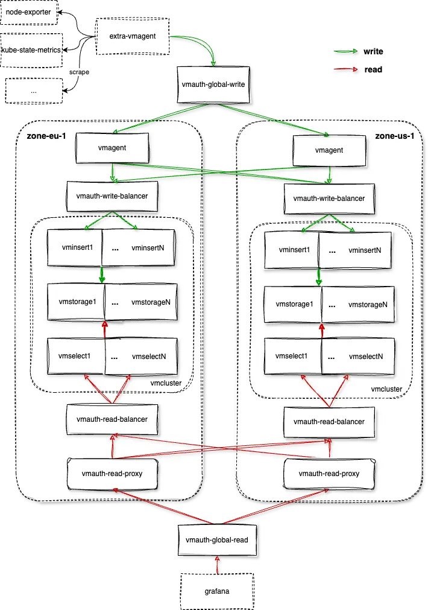

 
[](https://artifacthub.io/packages/helm/victoriametrics/victoria-metrics-distributed)
[](https://slack.victoriametrics.com/)

A Helm chart for Running VMCluster on Multiple Availability Zones

## Prerequisites

* Install the follow packages: ``git``, ``kubectl``, ``helm``, ``helm-docs``. See this [tutorial](https://docs.victoriametrics.com/helm/requirements/).

* PV support on underlying infrastructure.

* Multiple availability zones.

## Chart Details

This chart sets up multiple VictoriaMetrics cluster instances on multiple [availability zones](https://kubernetes.io/docs/setup/best-practices/multiple-zones/), provides both global write and read entrypoints.

The default setup is as shown below:



For write:
1. extra-vmagent(optional): scrapes external targets and all the components installed by this chart, sends data to global write entrypoint.
2. vmauth-global-write: global write entrypoint, proxies requests to one of the zone `vmagent` with `least_loaded` policy.
3. vmagent(per-zone): remote writes data to availability zones that enabled `.Values.availabilityZones[*].write.allow`, and [buffer data on disk](https://docs.victoriametrics.com/vmagent/#calculating-disk-space-for-persistence-queue) when zone is unavailable to ingest.
4. vmauth-write-balancer(per-zone): proxies requests to vminsert instances inside it's zone with `least_loaded` policy.
5. vmcluster(per-zone): processes write requests and stores data.

For read:
1. vmcluster(per-zone): processes query requests and returns results.
2. vmauth-read-balancer(per-zone): proxies requests to vmselect instances inside it's zone with `least_loaded` policy.
3. vmauth-read-proxy(per-zone): uses all the `vmauth-read-balancer` as servers if zone has `.Values.availabilityZones[*].read.allow` enabled, always prefer "local" `vmauth-read-balancer` to reduce cross-zone traffic with `first_available` policy.
4. vmauth-global-read: global query entrypoint, proxies requests to one of the zone `vmauth-read-proxy` with `first_available` policy.
5. grafana(optional): uses `vmauth-global-read` as default datasource.

>Note:
As the topology shown above, this chart doesn't include components like vmalert, alertmanager, etc by default.
You can install them using dependency [victoria-metrics-k8s-stack](https://github.com/VictoriaMetrics/helm-charts/tree/master/charts/victoria-metrics-k8s-stack) or having separate release.

### Why use `victoria-metrics-distributed` chart?

One of the best practice of running production kubernetes cluster is running with [multiple availability zones](https://kubernetes.io/docs/setup/best-practices/multiple-zones/). And apart from kubernetes control plane components, we also want to spread our application pods on multiple zones, to continue serving even if zone outage happens.

VictoriaMetrics supports [data replication](https://docs.victoriametrics.com/cluster-victoriametrics/#replication-and-data-safety) natively which can guarantees data availability when part of the vmstorage instances failed. But it doesn't works well if vmstorage instances are spread on multiple availability zones, since data replication could be stored on single availability zone, which will be lost when zone outage happens.
To avoid this, vmcluster must be installed on multiple availability zones, each containing a 100% copy of data. As long as one zone is available, both global write and read entrypoints should work without interruption.

### How to write data?

The chart provides `vmauth-global-write` as global write entrypoint, it supports [push-based data ingestion protocols](https://docs.victoriametrics.com/vmagent/#how-to-push-data-to-vmagent) as VictoriaMetrics does.
Optionally, you can push data to any of the per-zone vmagents, and they will replicate the received data across zones.

### How to query data?

The chart provides `vmauth-global-read` as global read entrypoint, it picks the first available zone (see [first_available](https://docs.victoriametrics.com/vmauth/#high-availability) policy) as it's preferred datasource and switches automatically to next zone if first one is unavailable, check [vmauth `first_available`](https://docs.victoriametrics.com/vmauth/#high-availability) for more details.
If you have services like [vmalert](https://docs.victoriametrics.com/vmalert) or Grafana deployed in each zone, then configure them to use local `vmauth-read-proxy`. Per-zone `vmauth-read-proxy` always prefers "local" vmcluster for querying and reduces cross-zone traffic.

You can also pick other proxies like kubernetes service which supports [Topology Aware Routing](https://kubernetes.io/docs/concepts/services-networking/topology-aware-routing/) as global read entrypoint.

### What happens if zone outage happen?

If availability zone `zone-eu-1` is experiencing an outage, `vmauth-global-write` and `vmauth-global-read` will work without interruption:
1. `vmauth-global-write` stops proxying write requests to `zone-eu-1` automatically;
2. `vmauth-global-read` and `vmauth-read-proxy` stops proxying read requests to `zone-eu-1` automatically;
3. `vmagent` on `zone-us-1` fails to send data to `zone-eu-1.vmauth-write-balancer`, starts to buffer data on disk(unless `-remoteWrite.disableOnDiskQueue` is specified, which is not recommended for this topology);
To keep data completeness for all the availability zones, make sure you have enough disk space on vmagent for buffer, see [this doc](https://docs.victoriametrics.com/vmagent/#calculating-disk-space-for-persistence-queue) for size recommendation.

And to avoid getting incomplete responses from `zone-eu-1` which gets recovered from outage, check vmagent on `zone-us-1` to see if persistent queue has been drained. If not, remove `zone-eu-1` from serving query by setting `.Values.availabilityZones.{zone-eu-1}.read.allow=false` and change it back after confirm all data are restored.

### How to use [multitenancy](https://docs.victoriametrics.com/cluster-victoriametrics/#multitenancy)?

By default, all the data that written to `vmauth-global-write` belong to tenant `0`. To write data to different tenants, set `.Values.enableMultitenancy=true` and create new tenant users for `vmauth-global-write`.
For example, writing data to tenant `1088` with following steps:
1. create tenant VMUser for vmauth `vmauth-global-write` to use:
```
apiVersion: operator.victoriametrics.com/v1beta1
kind: VMUser
metadata:
  name: tenant-1088-rw
  labels:
    tenant-test: "true"
spec:
  targetRefs:
  - static:
      ## list all the zone vmagent here
      url: "http://vmagent-vmagent-zone-eu-1:8429"
      url: "http://vmagent-vmagent-zone-us-1:8429"
    paths:
    - "/api/v1/write"
    - "/prometheus/api/v1/write"
    - "/write"
    - "/api/v1/import"
    - "/api/v1/import/.+"
    target_path_suffix: /insert/1088/
  username: tenant-1088
  password: secret
```

Add extra VMUser selector in vmauth `vmauth-global-write`
```
spec:
  userSelector:
    matchLabels:
      tenant-test: "true"
```

2. send data to `vmauth-global-write` using above token.
Example command using vmagent:
```
/path/to/vmagent -remoteWrite.url=http://vmauth-vmauth-global-write-$ReleaseName-vm-distributed:8427/prometheus/api/v1/write -remoteWrite.basicAuth.username=tenant-1088 -remoteWrite.basicAuth.password=secret
```

## How to install

Access a Kubernetes cluster.

### Setup chart repository (can be omitted for OCI repositories)

Add a chart helm repository with follow commands:

```console
helm repo add vm https://victoriametrics.github.io/helm-charts/

helm repo update
```
List versions of `vm/victoria-metrics-distributed` chart available to installation:

```console
helm search repo vm/victoria-metrics-distributed -l
```

### Install `victoria-metrics-distributed` chart

Export default values of `victoria-metrics-distributed` chart to file `values.yaml`:

  - For HTTPS repository

    ```console
    helm show values vm/victoria-metrics-distributed > values.yaml
    ```
  - For OCI repository

    ```console
    helm show values oci://ghcr.io/victoriametrics/helm-charts/victoria-metrics-distributed > values.yaml
    ```

Change the values according to the need of the environment in ``values.yaml`` file.

Test the installation with command:

  - For HTTPS repository

    ```console
    helm install vmd vm/victoria-metrics-distributed -f values.yaml -n NAMESPACE --debug --dry-run
    ```

  - For OCI repository

    ```console
    helm install vmd oci://ghcr.io/victoriametrics/helm-charts/victoria-metrics-distributed -f values.yaml -n NAMESPACE --debug --dry-run
    ```

Install chart with command:

  - For HTTPS repository

    ```console
    helm install vmd vm/victoria-metrics-distributed -f values.yaml -n NAMESPACE
    ```

  - For OCI repository

    ```console
    helm install vmd oci://ghcr.io/victoriametrics/helm-charts/victoria-metrics-distributed -f values.yaml -n NAMESPACE
    ```

Get the pods lists by running this commands:

```console
kubectl get pods -A | grep 'vmd'
```

Get the application by running this command:

```console
helm list -f vmd -n NAMESPACE
```

See the history of versions of `vmd` application with command.

```console
helm history vmd -n NAMESPACE
```

## How to upgrade

In order to serving query and ingestion while upgrading components version or changing configurations, it's recommended to perform maintenance on availability zone one by one.
First, performing update on availability zone `zone-eu-1`:
1. remove `zone-eu-1` from serving query by setting `.Values.availabilityZones.{zone-eu-1}.read.allow=false`;
2. run `helm upgrade vm-dis -n NAMESPACE` with updated configurations for `zone-eu-1` in `values.yaml`;
3. wait for all the components on zone `zone-eu-1` running;
4. wait `zone-us-1` vmagent persistent queue for `zone-eu-1` been drained, add `zone-eu-1` back to serving query by setting `.Values.availabilityZones.{zone-eu-1}.read.allow=true`.

Then, perform update on availability zone `zone-us-1` with the same steps1~4.

### Upgrade to 0.5.0

This release was refactored, names of the parameters was changed:

- `vmauthIngestGlobal` was changed to `write.global.vmauth`
- `vmauthQueryGlobal` was changed to `read.global.vmauth`
- `availabilityZones[*].allowIngest` was changed to `availabilityZones[*].write.allow`
- `availabilityZones[*].allowRead` was changed to `availabilityZones[*].read.allow`
- `availabilityZones[*].nodeSelector` was moved to `availabilityZones[*].common.spec.nodeSelector`
- `availabilityZones[*].extraAffinity` was moved to `availabilityZones[*].common.spec.affinity`
- `availabilityZones[*].topologySpreadConstraints` was moved to `availabilityZones[*].common.spec.topologySpreadConstraints`
- `availabilityZones[*].vmauthIngest` was moved to `availabilityZones[*].write.vmauth`
- `availabilityZones[*].vmauthQueryPerZone` was moved to `availabilityZones[*].read.perZone.vmauth`
- `availabilityZones[*].vmauthCrossAZQuery` was moved to `availabilityZones[*].read.crossZone.vmauth`

Example:

If before an upgrade you had given below configuration

```yaml
vmauthIngestGlobal:
  spec:
    extraArgs:
      discoverBackendIPs: "true"
vmauthQueryGlobal:
  spec:
    extraArgs:
      discoverBackendIPs: "true"
availabilityZones:
  - name: zone-eu-1
    vmauthIngest:
      spec:
        extraArgs:
          discoverBackendIPs: "true"
    vmcluster:
      spec:
        retentionPeriod: "14"
```

after upgrade it will look like this:

```yaml
write:
  global:
    vmauth:
      spec:
        extraArgs:
          discoverBackendIPs: "true"
read:
  global:
    vmauth:
      spec:
        extraArgs:
          discoverBackendIPs: "true"
availabilityZones:
  - name: zone-eu-1
    write:
      vmauth:
        spec:
          extraArgs:
            discoverBackendIPs: "true"
    vmcluster:
      spec:
        retentionPeriod: "14"
```

## How to uninstall

Remove application with command.

```console
helm uninstall vmd -n NAMESPACE
```

## Documentation of Helm Chart

Install ``helm-docs`` following the instructions on this [tutorial](https://docs.victoriametrics.com/helm/requirements/).

Generate docs with ``helm-docs`` command.

```bash
cd charts/victoria-metrics-distributed

helm-docs
```

The markdown generation is entirely go template driven. The tool parses metadata from charts and generates a number of sub-templates that can be referenced in a template file (by default ``README.md.gotmpl``). If no template file is provided, the tool has a default internal template that will generate a reasonably formatted README.

## Parameters

The following tables lists the configurable parameters of the chart and their default values.

Change the values according to the need of the environment in ``victoria-metrics-distributed`/values.yaml`` file.

<table class="helm-vars">
  <thead>
    <th class="helm-vars-key">Key</th>
    <th class="helm-vars-type">Type</th>
    <th class="helm-vars-default">Default</th>
    <th class="helm-vars-description">Description</th>
  </thead>
  <tbody>
    <tr>
      <td>availabilityZones</td>
      <td>list</td>
      <td><pre class="helm-vars-default-value language-yaml" lang="plaintext">
<code class="language-yaml">- name: zone-eu-1
- name: zone-us-1
</code>
</pre>
</td>
      <td><p>Config for all availability zones. Each element represents custom zone config, which overrides a default one from <code>zoneTpl</code></p>
</td>
    </tr>
    <tr>
      <td>availabilityZones[0].name</td>
      <td>string</td>
      <td><pre class="helm-vars-default-value language-yaml" lang="">
<code class="language-yaml">zone-eu-1
</code>
</pre>
</td>
      <td><p>Availability zone name</p>
</td>
    </tr>
    <tr>
      <td>availabilityZones[1].name</td>
      <td>string</td>
      <td><pre class="helm-vars-default-value language-yaml" lang="">
<code class="language-yaml">zone-us-1
</code>
</pre>
</td>
      <td><p>Availability zone name</p>
</td>
    </tr>
    <tr>
      <td>common.vmagent.spec</td>
      <td>object</td>
      <td><pre class="helm-vars-default-value language-yaml" lang="plaintext">
<code class="language-yaml">port: "8429"
</code>
</pre>
</td>
      <td><p>Common VMAgent spec, which can be overridden by each VMAgent configuration. Available parameters can be found <a href="https://docs.victoriametrics.com/operator/api/index.html#vmagentspec" target="_blank">here</a></p>
</td>
    </tr>
    <tr>
      <td>common.vmauth.spec.port</td>
      <td>string</td>
      <td><pre class="helm-vars-default-value language-yaml" lang="">
<code class="language-yaml">"8427"
</code>
</pre>
</td>
      <td></td>
    </tr>
    <tr>
      <td>common.vmcluster.spec</td>
      <td>object</td>
      <td><pre class="helm-vars-default-value language-yaml" lang="plaintext">
<code class="language-yaml">vminsert:
    port: "8480"
    serviceSpec:
        spec:
            clusterIP: None
            type: ClusterIP
vmselect:
    port: "8481"
</code>
</pre>
</td>
      <td><p>Common VMCluster spec, which can be overridden by each VMCluster configuration. Available parameters can be found <a href="https://docs.victoriametrics.com/operator/api/index.html#vmclusterspec" target="_blank">here</a></p>
</td>
    </tr>
    <tr>
      <td>enableMultitenancy</td>
      <td>bool</td>
      <td><pre class="helm-vars-default-value language-yaml" lang="">
<code class="language-yaml">false
</code>
</pre>
</td>
      <td><p>Enable multitenancy mode see <a href="https://github.com/VictoriaMetrics/helm-charts/tree/master/charts/victoria-metrics-distributed#how-to-use-multitenancy" target="_blank">here</a></p>
</td>
    </tr>
    <tr>
      <td>extra</td>
      <td>object</td>
      <td><pre class="helm-vars-default-value language-yaml" lang="plaintext">
<code class="language-yaml">vmagent:
    enabled: true
    name: test-vmagent
    spec:
        selectAllByDefault: true
</code>
</pre>
</td>
      <td><p>Set up an extra vmagent to scrape all the scrape objects by default, and write data to above write-global endpoint.</p>
</td>
    </tr>
    <tr>
      <td>fullnameOverride</td>
      <td>string</td>
      <td><pre class="helm-vars-default-value language-yaml" lang="">
<code class="language-yaml">""
</code>
</pre>
</td>
      <td><p>Overrides the chart&rsquo;s computed fullname.</p>
</td>
    </tr>
    <tr>
      <td>global</td>
      <td>object</td>
      <td><pre class="helm-vars-default-value language-yaml" lang="plaintext">
<code class="language-yaml">cluster:
    dnsDomain: cluster.local.
</code>
</pre>
</td>
      <td><p>Global chart properties</p>
</td>
    </tr>
    <tr>
      <td>global.cluster.dnsDomain</td>
      <td>string</td>
      <td><pre class="helm-vars-default-value language-yaml" lang="">
<code class="language-yaml">cluster.local.
</code>
</pre>
</td>
      <td><p>K8s cluster domain suffix, uses for building storage pods&rsquo; FQDN. Details are <a href="https://kubernetes.io/docs/tasks/administer-cluster/dns-custom-nameservers/" target="_blank">here</a></p>
</td>
    </tr>
    <tr>
      <td>nameOverride</td>
      <td>string</td>
      <td><pre class="helm-vars-default-value language-yaml" lang="">
<code class="language-yaml">vm-distributed
</code>
</pre>
</td>
      <td><p>Overrides the chart&rsquo;s name</p>
</td>
    </tr>
    <tr>
      <td>read.global.vmauth.enabled</td>
      <td>bool</td>
      <td><pre class="helm-vars-default-value language-yaml" lang="">
<code class="language-yaml">true
</code>
</pre>
</td>
      <td><p>Create vmauth as the global read entrypoint</p>
</td>
    </tr>
    <tr>
      <td>read.global.vmauth.name</td>
      <td>string</td>
      <td><pre class="helm-vars-default-value language-yaml" lang="">
<code class="language-yaml">vmauth-global-read-{{ .fullname }}
</code>
</pre>
</td>
      <td><p>Override the name of the vmauth object</p>
</td>
    </tr>
    <tr>
      <td>read.global.vmauth.spec</td>
      <td>object</td>
      <td><pre class="helm-vars-default-value language-yaml" lang="plaintext">
<code class="language-yaml">{}
</code>
</pre>
</td>
      <td><p>Spec for VMAuth CRD, see <a href="https://docs.victoriametrics.com/operator/api#vmauthspec" target="_blank">here</a></p>
</td>
    </tr>
    <tr>
      <td>victoria-metrics-k8s-stack</td>
      <td>object</td>
      <td><pre class="helm-vars-default-value language-yaml" lang="plaintext">
<code class="language-yaml">alertmanager:
    enabled: false
enabled: true
grafana:
    enabled: true
victoria-metrics-operator:
    enabled: true
vmagent:
    enabled: false
vmalert:
    enabled: false
vmcluster:
    enabled: false
vmsingle:
    enabled: false
</code>
</pre>
</td>
      <td><p>Set up vm operator and other resources like vmalert, grafana if needed</p>
</td>
    </tr>
    <tr>
      <td>write.global.vmauth.enabled</td>
      <td>bool</td>
      <td><pre class="helm-vars-default-value language-yaml" lang="">
<code class="language-yaml">true
</code>
</pre>
</td>
      <td><p>Create a vmauth as the global write entrypoint</p>
</td>
    </tr>
    <tr>
      <td>write.global.vmauth.name</td>
      <td>string</td>
      <td><pre class="helm-vars-default-value language-yaml" lang="">
<code class="language-yaml">vmauth-global-write-{{ .fullname }}
</code>
</pre>
</td>
      <td><p>Override the name of the vmauth object</p>
</td>
    </tr>
    <tr>
      <td>write.global.vmauth.spec</td>
      <td>object</td>
      <td><pre class="helm-vars-default-value language-yaml" lang="plaintext">
<code class="language-yaml">{}
</code>
</pre>
</td>
      <td><p>Spec for VMAuth CRD, see <a href="https://docs.victoriametrics.com/operator/api#vmauthspec" target="_blank">here</a></p>
</td>
    </tr>
    <tr>
      <td>zoneTpl</td>
      <td>object</td>
      <td><pre class="helm-vars-default-value language-yaml" lang="plaintext">
<code class="language-yaml">common:
    spec:
        affinity: {}
        nodeSelector:
            topology.kubernetes.io/zone: '{{ (.zone).name }}'
        topologySpreadConstraints:
            - maxSkew: 1
              topologyKey: kubernetes.io/hostname
              whenUnsatisfiable: ScheduleAnyway
read:
    allow: true
    crossZone:
        vmauth:
            enabled: true
            name: vmauth-read-proxy-{{ (.zone).name }}
            spec: {}
    perZone:
        vmauth:
            enabled: true
            name: vmauth-read-balancer-{{ (.zone).name }}
            spec:
                extraArgs:
                    discoverBackendIPs: "true"
vmagent:
    annotations: {}
    enabled: true
    name: vmagent-{{ (.zone).name }}
    spec: {}
vmcluster:
    enabled: true
    name: vmcluster-{{ (.zone).name }}
    spec:
        replicationFactor: 2
        retentionPeriod: "14"
        vminsert:
            extraArgs: {}
            replicaCount: 2
            resources: {}
        vmselect:
            extraArgs: {}
            replicaCount: 2
            resources: {}
        vmstorage:
            replicaCount: 2
            resources: {}
            storageDataPath: /vm-data
write:
    allow: true
    vmauth:
        enabled: true
        name: vmauth-write-balancer-{{ (.zone).name }}
        spec:
            extraArgs:
                discoverBackendIPs: "true"
</code>
</pre>
</td>
      <td><p>Default config for each availability zone components, including vmagent, vmcluster, vmauth etc. Defines a template for each availability zone, which can be overridden for each availability zone at <code>availabilityZones[*]</code></p>
</td>
    </tr>
    <tr>
      <td>zoneTpl.common.spec</td>
      <td>object</td>
      <td><pre class="helm-vars-default-value language-yaml" lang="plaintext">
<code class="language-yaml">affinity: {}
nodeSelector:
    topology.kubernetes.io/zone: '{{ (.zone).name }}'
topologySpreadConstraints:
    - maxSkew: 1
      topologyKey: kubernetes.io/hostname
      whenUnsatisfiable: ScheduleAnyway
</code>
</pre>
</td>
      <td><p>Common for <a href="https://docs.victoriametrics.com/operator/api/#vmagentspec" target="_blank">VMAgent</a>, <a href="https://docs.victoriametrics.com/operator/api/#vmauthspec" target="_blank">VMAuth</a>, <a href="https://docs.victoriametrics.com/operator/api/#vmclusterspec" target="_blank">VMCluster</a> spec params, like nodeSelector, affinity, topologySpreadConstraint, etc</p>
</td>
    </tr>
    <tr>
      <td>zoneTpl.read.allow</td>
      <td>bool</td>
      <td><pre class="helm-vars-default-value language-yaml" lang="">
<code class="language-yaml">true
</code>
</pre>
</td>
      <td><p>Allow data query from this zone through global query endpoint</p>
</td>
    </tr>
    <tr>
      <td>zoneTpl.read.crossZone.vmauth.enabled</td>
      <td>bool</td>
      <td><pre class="helm-vars-default-value language-yaml" lang="">
<code class="language-yaml">true
</code>
</pre>
</td>
      <td><p>Create a vmauth with all the zone with <code>allow: true</code> as query backends</p>
</td>
    </tr>
    <tr>
      <td>zoneTpl.read.crossZone.vmauth.name</td>
      <td>string</td>
      <td><pre class="helm-vars-default-value language-yaml" lang="">
<code class="language-yaml">vmauth-read-proxy-{{ (.zone).name }}
</code>
</pre>
</td>
      <td><p>Override the name of the vmauth object</p>
</td>
    </tr>
    <tr>
      <td>zoneTpl.read.crossZone.vmauth.spec</td>
      <td>object</td>
      <td><pre class="helm-vars-default-value language-yaml" lang="plaintext">
<code class="language-yaml">{}
</code>
</pre>
</td>
      <td><p>Spec for VMAuth CRD, see <a href="https://docs.victoriametrics.com/operator/api#vmauthspec" target="_blank">here</a></p>
</td>
    </tr>
    <tr>
      <td>zoneTpl.read.perZone.vmauth.enabled</td>
      <td>bool</td>
      <td><pre class="helm-vars-default-value language-yaml" lang="">
<code class="language-yaml">true
</code>
</pre>
</td>
      <td><p>Create vmauth as a local read endpoint</p>
</td>
    </tr>
    <tr>
      <td>zoneTpl.read.perZone.vmauth.name</td>
      <td>string</td>
      <td><pre class="helm-vars-default-value language-yaml" lang="">
<code class="language-yaml">vmauth-read-balancer-{{ (.zone).name }}
</code>
</pre>
</td>
      <td><p>Override the name of the vmauth object</p>
</td>
    </tr>
    <tr>
      <td>zoneTpl.read.perZone.vmauth.spec</td>
      <td>object</td>
      <td><pre class="helm-vars-default-value language-yaml" lang="plaintext">
<code class="language-yaml">extraArgs:
    discoverBackendIPs: "true"
</code>
</pre>
</td>
      <td><p>Spec for VMAuth CRD, see <a href="https://docs.victoriametrics.com/operator/api#vmauthspec" target="_blank">here</a></p>
</td>
    </tr>
    <tr>
      <td>zoneTpl.vmagent.annotations</td>
      <td>object</td>
      <td><pre class="helm-vars-default-value language-yaml" lang="plaintext">
<code class="language-yaml">{}
</code>
</pre>
</td>
      <td><p>VMAgent remote write proxy annotations</p>
</td>
    </tr>
    <tr>
      <td>zoneTpl.vmagent.enabled</td>
      <td>bool</td>
      <td><pre class="helm-vars-default-value language-yaml" lang="">
<code class="language-yaml">true
</code>
</pre>
</td>
      <td><p>Create VMAgent remote write proxy</p>
</td>
    </tr>
    <tr>
      <td>zoneTpl.vmagent.name</td>
      <td>string</td>
      <td><pre class="helm-vars-default-value language-yaml" lang="">
<code class="language-yaml">vmagent-{{ (.zone).name }}
</code>
</pre>
</td>
      <td><p>Override the name of the vmagent object</p>
</td>
    </tr>
    <tr>
      <td>zoneTpl.vmagent.spec</td>
      <td>object</td>
      <td><pre class="helm-vars-default-value language-yaml" lang="plaintext">
<code class="language-yaml">{}
</code>
</pre>
</td>
      <td><p>Spec for VMAgent CRD, see <a href="https://docs.victoriametrics.com/operator/api#vmagentspec" target="_blank">here</a></p>
</td>
    </tr>
    <tr>
      <td>zoneTpl.vmcluster.enabled</td>
      <td>bool</td>
      <td><pre class="helm-vars-default-value language-yaml" lang="">
<code class="language-yaml">true
</code>
</pre>
</td>
      <td><p>Create VMCluster</p>
</td>
    </tr>
    <tr>
      <td>zoneTpl.vmcluster.name</td>
      <td>string</td>
      <td><pre class="helm-vars-default-value language-yaml" lang="">
<code class="language-yaml">vmcluster-{{ (.zone).name }}
</code>
</pre>
</td>
      <td><p>Override the name of the vmcluster, by default is <zoneName></p>
</td>
    </tr>
    <tr>
      <td>zoneTpl.vmcluster.spec</td>
      <td>object</td>
      <td><pre class="helm-vars-default-value language-yaml" lang="plaintext">
<code class="language-yaml">replicationFactor: 2
retentionPeriod: "14"
vminsert:
    extraArgs: {}
    replicaCount: 2
    resources: {}
vmselect:
    extraArgs: {}
    replicaCount: 2
    resources: {}
vmstorage:
    replicaCount: 2
    resources: {}
    storageDataPath: /vm-data
</code>
</pre>
</td>
      <td><p>Spec for VMCluster CRD, see <a href="https://docs.victoriametrics.com/operator/api#vmclusterspec" target="_blank">here</a></p>
</td>
    </tr>
    <tr>
      <td>zoneTpl.write.allow</td>
      <td>bool</td>
      <td><pre class="helm-vars-default-value language-yaml" lang="">
<code class="language-yaml">true
</code>
</pre>
</td>
      <td><p>Allow data ingestion to this zone</p>
</td>
    </tr>
    <tr>
      <td>zoneTpl.write.vmauth.enabled</td>
      <td>bool</td>
      <td><pre class="helm-vars-default-value language-yaml" lang="">
<code class="language-yaml">true
</code>
</pre>
</td>
      <td><p>Create vmauth as a local write endpoint</p>
</td>
    </tr>
    <tr>
      <td>zoneTpl.write.vmauth.name</td>
      <td>string</td>
      <td><pre class="helm-vars-default-value language-yaml" lang="">
<code class="language-yaml">vmauth-write-balancer-{{ (.zone).name }}
</code>
</pre>
</td>
      <td><p>Override the name of the vmauth object</p>
</td>
    </tr>
    <tr>
      <td>zoneTpl.write.vmauth.spec</td>
      <td>object</td>
      <td><pre class="helm-vars-default-value language-yaml" lang="plaintext">
<code class="language-yaml">extraArgs:
    discoverBackendIPs: "true"
</code>
</pre>
</td>
      <td><p>Spec for VMAuth CRD, see <a href="https://docs.victoriametrics.com/operator/api#vmauthspec" target="_blank">here</a></p>
</td>
    </tr>
  </tbody>
</table>

