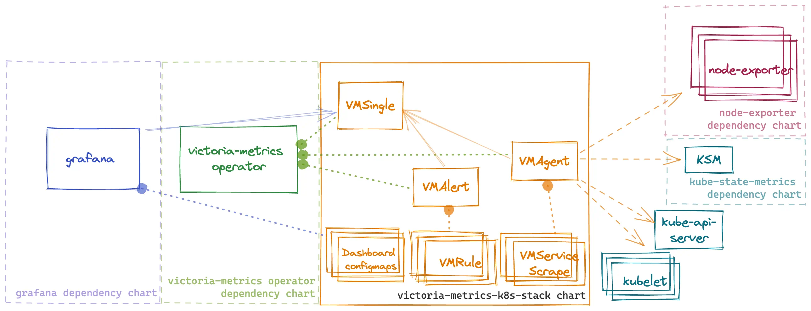

 
[](https://artifacthub.io/packages/helm/victoriametrics/victoria-metrics-k8s-stack)

Kubernetes monitoring on VictoriaMetrics stack. Includes VictoriaMetrics Operator, Grafana dashboards, ServiceScrapes and VMRules

* [Overview](#Overview)
* [Configuration](#Configuration)
* [Prerequisites](#Prerequisites)
* [Dependencies](#Dependencies)
* [Quick Start](#How-to-install)
* [Uninstall](#How-to-uninstall)
* [Version Upgrade](#Upgrade-guide)
* [Troubleshooting](#Troubleshooting)
* [Values](#Parameters)

## Overview
This chart is an All-in-one solution to start monitoring kubernetes cluster.
It installs multiple dependency charts like [grafana](https://github.com/grafana/helm-charts/tree/main/charts/grafana), [node-exporter](https://github.com/prometheus-community/helm-charts/tree/main/charts/prometheus-node-exporter), [kube-state-metrics](https://github.com/prometheus-community/helm-charts/tree/main/charts/kube-state-metrics) and [victoria-metrics-operator](https://github.com/VictoriaMetrics/helm-charts/tree/master/charts/victoria-metrics-operator).
Also it installs Custom Resources like [VMSingle](https://docs.victoriametrics.com/operator/quick-start#vmsingle), [VMCluster](https://docs.victoriametrics.com/operator/quick-start#vmcluster), [VMAgent](https://docs.victoriametrics.com/operator/quick-start#vmagent), [VMAlert](https://docs.victoriametrics.com/operator/quick-start#vmalert).

By default, the operator [converts all existing prometheus-operator API objects](https://docs.victoriametrics.com/operator/quick-start#migration-from-prometheus-operator-objects) into corresponding VictoriaMetrics Operator objects.

To enable metrics collection for kubernetes this chart installs multiple scrape configurations for kubernetes components like kubelet and kube-proxy, etc. Metrics collection is done by [VMAgent](https://docs.victoriametrics.com/operator/quick-start#vmagent). So if want to ship metrics to external VictoriaMetrics database you can disable VMSingle installation by setting `vmsingle.enabled` to `false` and setting `vmagent.vmagentSpec.remoteWrite.url` to your external VictoriaMetrics database.

This chart also installs bunch of dashboards and recording rules from [kube-prometheus](https://github.com/prometheus-operator/kube-prometheus) project.



## Configuration

Configuration of this chart is done through helm values.

### Dependencies

Dependencies can be enabled or disabled by setting `enabled` to `true` or `false` in `values.yaml` file.

**!Important:** for dependency charts anything that you can find in values.yaml of dependency chart can be configured in this chart under key for that dependency. For example if you want to configure `grafana` you can find all possible configuration options in [values.yaml](https://github.com/grafana/helm-charts/blob/main/charts/grafana/values.yaml) and you should set them in values for this chart under grafana: key. For example if you want to configure `grafana.persistence.enabled` you should set it in values.yaml like this:
```yaml
#################################################
###              dependencies               #####
#################################################
# Grafana dependency chart configuration. For possible values refer to https://github.com/grafana/helm-charts/tree/main/charts/grafana#configuration
grafana:
  enabled: true
  persistence:
    type: pvc
    enabled: false
```

### VictoriaMetrics components

This chart installs multiple VictoriaMetrics components using Custom Resources that are managed by [victoria-metrics-operator](https://docs.victoriametrics.com/operator/design)
Each resource can be configured using `spec` of that resource from API docs of [victoria-metrics-operator](https://docs.victoriametrics.com/operator/api). For example if you want to configure `VMAgent` you can find all possible configuration options in [API docs](https://docs.victoriametrics.com/operator/api#vmagent) and you should set them in values for this chart under `vmagent.spec` key. For example if you want to configure `remoteWrite.url` you should set it in values.yaml like this:
```yaml
vmagent:
  spec:
    remoteWrite:
      - url: "https://insert.vmcluster.domain.com/insert/0/prometheus/api/v1/write"
```

### ArgoCD issues

#### Operator self signed certificates
When deploying K8s stack using ArgoCD without Cert Manager (`.Values.victoria-metrics-operator.admissionWebhooks.certManager.enabled: false`)
it will rerender operator's webhook certificates on each sync since Helm `lookup` function is not respected by ArgoCD.
To prevent this please update you K8s stack Application `spec.syncPolicy` and `spec.ignoreDifferences` with a following:

```yaml
apiVersion: argoproj.io/v1alpha1
kind: Application
...
spec:
  ...
  syncPolicy:
    syncOptions:
    # https://argo-cd.readthedocs.io/en/stable/user-guide/sync-options/#respect-ignore-difference-configs
    # argocd must also ignore difference during apply stage
    # otherwise it ll silently override changes and cause a problem
    - RespectIgnoreDifferences=true
  ignoreDifferences:
    - group: ""
      kind: Secret
      name: <fullname>-validation
      namespace: kube-system
      jsonPointers:
        - /data
    - group: admissionregistration.k8s.io
      kind: ValidatingWebhookConfiguration
      name: <fullname>-admission
      jqPathExpressions:
      - '.webhooks[]?.clientConfig.caBundle'
```
where `<fullname>` is output of `{{ include "vm-operator.fullname" }}` for your setup

#### `metadata.annotations: Too long: must have at most 262144 bytes` on dashboards

If one of dashboards ConfigMap is failing with error `Too long: must have at most 262144 bytes`, please make sure you've added `argocd.argoproj.io/sync-options: ServerSideApply=true` annotation to your dashboards:

```yaml
grafana:
  sidecar:
    dashboards:
      additionalDashboardAnnotations
        argocd.argoproj.io/sync-options: ServerSideApply=true
```

argocd.argoproj.io/sync-options: ServerSideApply=true

### Rules and dashboards

This chart by default install multiple dashboards and recording rules from [kube-prometheus](https://github.com/prometheus-operator/kube-prometheus)
you can disable dashboards with `defaultDashboardsEnabled: false` and `experimentalDashboardsEnabled: false`
and rules can be configured under `defaultRules`

### Adding external dashboards

By default, this chart uses sidecar in order to provision default dashboards. If you want to add you own dashboards there are two ways to do it:

- Add dashboards by creating a ConfigMap. An example ConfigMap:
```yaml
apiVersion: v1
kind: ConfigMap
metadata:
  labels:
    grafana_dashboard: "1"
  name: grafana-dashboard
data:
  dashboard.json: |-
      {...}
```

- Use init container provisioning. Note that this option requires disabling sidecar and will remove all default dashboards provided with this chart. An example configuration:
```yaml
grafana:
  sidecar:
    dashboards:
      enabled: true
  dashboards:
    vmcluster:
      gnetId: 11176
      revision: 38
      datasource: VictoriaMetrics
```
When using this approach, you can find dashboards for VictoriaMetrics components published [here](https://grafana.com/orgs/victoriametrics).

### Prometheus scrape configs
This chart installs multiple scrape configurations for kubernetes monitoring. They are configured under `#ServiceMonitors` section in `values.yaml` file. For example if you want to configure scrape config for `kubelet` you should set it in values.yaml like this:
```yaml
kubelet:
  enabled: true
  # spec for VMNodeScrape crd
  # https://docs.victoriametrics.com/operator/api#vmnodescrapespec
  spec:
    interval: "30s"
```

### Using externally managed Grafana

If you want to use an externally managed Grafana instance but still want to use the dashboards provided by this chart you can set
 `grafana.enabled` to `false` and set `defaultDashboardsEnabled` to `true`. This will install the dashboards
 but will not install Grafana.

For example:
```yaml
defaultDashboardsEnabled: true

grafana:
  enabled: false
```

This will create ConfigMaps with dashboards to be imported into Grafana.

If additional configuration for labels or annotations is needed in order to import dashboard to an existing Grafana you can
set `.grafana.sidecar.dashboards.additionalDashboardLabels` or `.grafana.sidecar.dashboards.additionalDashboardAnnotations` in `values.yaml`:

For example:
```yaml
defaultDashboardsEnabled: true

grafana:
  enabled: false
  sidecar:
    dashboards:
      additionalDashboardLabels:
        key: value
      additionalDashboardAnnotations:
        key: value
```

## Prerequisites

* Install the follow packages: ``git``, ``kubectl``, ``helm``, ``helm-docs``. See this [tutorial](https://docs.victoriametrics.com/helm/requirements/).

* Add dependency chart repositories

```console
helm repo add grafana https://grafana.github.io/helm-charts
helm repo add prometheus-community https://prometheus-community.github.io/helm-charts
helm repo update
```

* PV support on underlying infrastructure.

## How to install

Access a Kubernetes cluster.

### Setup chart repository (can be omitted for OCI repositories)

Add a chart helm repository with follow commands:

```console
helm repo add vm https://victoriametrics.github.io/helm-charts/

helm repo update
```
List versions of `vm/victoria-metrics-k8s-stack` chart available to installation:

```console
helm search repo vm/victoria-metrics-k8s-stack -l
```

### Install `victoria-metrics-k8s-stack` chart

Export default values of `victoria-metrics-k8s-stack` chart to file `values.yaml`:

  - For HTTPS repository

    ```console
    helm show values vm/victoria-metrics-k8s-stack > values.yaml
    ```
  - For OCI repository

    ```console
    helm show values oci://ghcr.io/victoriametrics/helm-charts/victoria-metrics-k8s-stack > values.yaml
    ```

Change the values according to the need of the environment in ``values.yaml`` file.

Test the installation with command:

  - For HTTPS repository

    ```console
    helm install vmks vm/victoria-metrics-k8s-stack -f values.yaml -n NAMESPACE --debug --dry-run
    ```

  - For OCI repository

    ```console
    helm install vmks oci://ghcr.io/victoriametrics/helm-charts/victoria-metrics-k8s-stack -f values.yaml -n NAMESPACE --debug --dry-run
    ```

Install chart with command:

  - For HTTPS repository

    ```console
    helm install vmks vm/victoria-metrics-k8s-stack -f values.yaml -n NAMESPACE
    ```

  - For OCI repository

    ```console
    helm install vmks oci://ghcr.io/victoriametrics/helm-charts/victoria-metrics-k8s-stack -f values.yaml -n NAMESPACE
    ```

Get the pods lists by running this commands:

```console
kubectl get pods -A | grep 'vmks'
```

Get the application by running this command:

```console
helm list -f vmks -n NAMESPACE
```

See the history of versions of `vmks` application with command.

```console
helm history vmks -n NAMESPACE
```

### Install locally (Minikube)

To run VictoriaMetrics stack locally it's possible to use [Minikube](https://github.com/kubernetes/minikube). To avoid dashboards and alert rules issues please follow the steps below:

Run Minikube cluster

```
minikube start --container-runtime=containerd --extra-config=scheduler.bind-address=0.0.0.0 --extra-config=controller-manager.bind-address=0.0.0.0 --extra-config=etcd.listen-metrics-urls=http://0.0.0.0:2381
```

Install helm chart

```
helm install [RELEASE_NAME] vm/victoria-metrics-k8s-stack -f values.yaml -f values.minikube.yaml -n NAMESPACE --debug --dry-run
```

## How to uninstall

Remove application with command.

```console
helm uninstall vmks -n NAMESPACE
```

CRDs created by this chart are not removed by default and should be manually cleaned up:

```console
kubectl get crd | grep victoriametrics.com | awk '{print $1 }' | xargs -i kubectl delete crd {}
```

## Troubleshooting

- If you cannot install helm chart with error `configmap already exist`. It could happen because of name collisions, if you set too long release name.
  Kubernetes by default, allows only 63 symbols at resource names and all resource names are trimmed by helm to 63 symbols.
  To mitigate it, use shorter name for helm chart release name, like:
```bash
# stack - is short enough
helm upgrade -i stack vm/victoria-metrics-k8s-stack
```
  Or use override for helm chart release name:
```bash
helm upgrade -i some-very-long-name vm/victoria-metrics-k8s-stack --set fullnameOverride=stack
```

## Upgrade guide

Usually, helm upgrade doesn't requires manual actions. Just execute command:

```console
$ helm upgrade [RELEASE_NAME] vm/victoria-metrics-k8s-stack
```

But release with CRD update can only be patched manually with kubectl.
Since helm does not perform a CRD update, we recommend that you always perform this when updating the helm-charts version:

```console
# 1. check the changes in CRD
$ helm show crds vm/victoria-metrics-k8s-stack --version [YOUR_CHART_VERSION] | kubectl diff -f -

# 2. apply the changes (update CRD)
$ helm show crds vm/victoria-metrics-k8s-stack --version [YOUR_CHART_VERSION] | kubectl apply -f - --server-side
```

All other manual actions upgrades listed below:

### Upgrade to 0.13.0

- node-exporter starting from version 4.0.0 is using the Kubernetes recommended labels. Therefore you have to delete the daemonset before you upgrade.

```bash
kubectl delete daemonset -l app=prometheus-node-exporter
```
- scrape configuration for kubernetes components was moved from `vmServiceScrape.spec` section to `spec` section. If you previously modified scrape configuration you need to update your `values.yaml`

- `grafana.defaultDashboardsEnabled` was renamed to `defaultDashboardsEnabled` (moved to top level). You may need to update it in your `values.yaml`

### Upgrade to 0.6.0

 All `CRD` must be update to the lastest version with command:

```bash
kubectl apply -f https://raw.githubusercontent.com/VictoriaMetrics/helm-charts/master/charts/victoria-metrics-k8s-stack/crds/crd.yaml

```

### Upgrade to 0.4.0

 All `CRD` must be update to `v1` version with command:

```bash
kubectl apply -f https://raw.githubusercontent.com/VictoriaMetrics/helm-charts/master/charts/victoria-metrics-k8s-stack/crds/crd.yaml

```

### Upgrade from 0.2.8 to 0.2.9

 Update `VMAgent` crd

command:
```bash
kubectl apply -f https://raw.githubusercontent.com/VictoriaMetrics/operator/v0.16.0/config/crd/bases/operator.victoriametrics.com_vmagents.yaml
```

 ### Upgrade from 0.2.5 to 0.2.6

New CRD added to operator - `VMUser` and `VMAuth`, new fields added to exist crd.
Manual commands:
```bash
kubectl apply -f https://raw.githubusercontent.com/VictoriaMetrics/operator/v0.15.0/config/crd/bases/operator.victoriametrics.com_vmusers.yaml
kubectl apply -f https://raw.githubusercontent.com/VictoriaMetrics/operator/v0.15.0/config/crd/bases/operator.victoriametrics.com_vmauths.yaml
kubectl apply -f https://raw.githubusercontent.com/VictoriaMetrics/operator/v0.15.0/config/crd/bases/operator.victoriametrics.com_vmalerts.yaml
kubectl apply -f https://raw.githubusercontent.com/VictoriaMetrics/operator/v0.15.0/config/crd/bases/operator.victoriametrics.com_vmagents.yaml
kubectl apply -f https://raw.githubusercontent.com/VictoriaMetrics/operator/v0.15.0/config/crd/bases/operator.victoriametrics.com_vmsingles.yaml
kubectl apply -f https://raw.githubusercontent.com/VictoriaMetrics/operator/v0.15.0/config/crd/bases/operator.victoriametrics.com_vmclusters.yaml
```

## Documentation of Helm Chart

Install ``helm-docs`` following the instructions on this [tutorial](https://docs.victoriametrics.com/helm/requirements/).

Generate docs with ``helm-docs`` command.

```bash
cd charts/victoria-metrics-k8s-stack

helm-docs
```

The markdown generation is entirely go template driven. The tool parses metadata from charts and generates a number of sub-templates that can be referenced in a template file (by default ``README.md.gotmpl``). If no template file is provided, the tool has a default internal template that will generate a reasonably formatted README.

## Parameters

The following tables lists the configurable parameters of the chart and their default values.

Change the values according to the need of the environment in ``victoria-metrics-k8s-stack/values.yaml`` file.

<table class="helm-vars">
  <thead>
    <th class="helm-vars-key">Key</th>
    <th class="helm-vars-type">Type</th>
    <th class="helm-vars-default">Default</th>
    <th class="helm-vars-description">Description</th>
  </thead>
  <tbody>
    <tr>
      <td>additionalVictoriaMetricsMap</td>
      <td>string</td>
      <td><pre class="helm-vars-default-value" language-yaml" lang="">
<code class="language-yaml">null
</code>
</pre>
</td>
      <td><p>Provide custom recording or alerting rules to be deployed into the cluster.</p>
</td>
    </tr>
    <tr>
      <td>alertmanager.annotations</td>
      <td>object</td>
      <td><pre class="helm-vars-default-value" language-yaml" lang="plaintext">
<code class="language-yaml">{}
</code>
</pre>
</td>
      <td><p>Alertmanager annotations</p>
</td>
    </tr>
    <tr>
      <td>alertmanager.config</td>
      <td>object</td>
      <td><pre class="helm-vars-default-value" language-yaml" lang="plaintext">
<code class="language-yaml">receivers:
    - name: blackhole
route:
    receiver: blackhole
templates:
    - /etc/vm/configs/**/*.tmpl
</code>
</pre>
</td>
      <td><p>Alertmanager configuration</p>
</td>
    </tr>
    <tr>
      <td>alertmanager.enabled</td>
      <td>bool</td>
      <td><pre class="helm-vars-default-value" language-yaml" lang="">
<code class="language-yaml">true
</code>
</pre>
</td>
      <td><p>Create VMAlertmanager CR</p>
</td>
    </tr>
    <tr>
      <td>alertmanager.ingress</td>
      <td>object</td>
      <td><pre class="helm-vars-default-value" language-yaml" lang="plaintext">
<code class="language-yaml">annotations: {}
enabled: false
extraPaths: []
hosts:
    - alertmanager.domain.com
labels: {}
path: '{{ .Values.alertmanager.spec.routePrefix | default "/" }}'
pathType: Prefix
tls: []
</code>
</pre>
</td>
      <td><p>Alertmanager ingress configuration</p>
</td>
    </tr>
    <tr>
      <td>alertmanager.ingress.extraPaths</td>
      <td>list</td>
      <td><pre class="helm-vars-default-value" language-yaml" lang="plaintext">
<code class="language-yaml">[]
</code>
</pre>
</td>
      <td><p>Extra paths to prepend to every host configuration. This is useful when working with annotation based services.</p>
</td>
    </tr>
    <tr>
      <td>alertmanager.monzoTemplate</td>
      <td>object</td>
      <td><pre class="helm-vars-default-value" language-yaml" lang="plaintext">
<code class="language-yaml">enabled: true
</code>
</pre>
</td>
      <td><p>Better alert templates for <a href="https://gist.github.com/milesbxf/e2744fc90e9c41b47aa47925f8ff6512" target="_blank">slack source</a></p>
</td>
    </tr>
    <tr>
      <td>alertmanager.spec</td>
      <td>object</td>
      <td><pre class="helm-vars-default-value" language-yaml" lang="plaintext">
<code class="language-yaml">configSecret: ""
externalURL: ""
image:
    tag: v0.27.0
port: "9093"
replicaCount: 1
routePrefix: /
selectAllByDefault: true
</code>
</pre>
</td>
      <td><p>Full spec for VMAlertmanager CRD. Allowed values described <a href="https://docs.victoriametrics.com/operator/api#vmalertmanagerspec" target="_blank">here</a></p>
</td>
    </tr>
    <tr>
      <td>alertmanager.spec.configSecret</td>
      <td>string</td>
      <td><pre class="helm-vars-default-value" language-yaml" lang="">
<code class="language-yaml">""
</code>
</pre>
</td>
      <td><p>If this one defined, it will be used for alertmanager configuration and config parameter will be ignored</p>
</td>
    </tr>
    <tr>
      <td>alertmanager.templateFiles</td>
      <td>object</td>
      <td><pre class="helm-vars-default-value" language-yaml" lang="plaintext">
<code class="language-yaml">{}
</code>
</pre>
</td>
      <td><p>Extra alert templates</p>
</td>
    </tr>
    <tr>
      <td>argocdReleaseOverride</td>
      <td>string</td>
      <td><pre class="helm-vars-default-value" language-yaml" lang="">
<code class="language-yaml">""
</code>
</pre>
</td>
      <td><p>If this chart is used in &ldquo;Argocd&rdquo; with &ldquo;releaseName&rdquo; field then VMServiceScrapes couldn&rsquo;t select the proper services. For correct working need set value &lsquo;argocdReleaseOverride=$ARGOCD_APP_NAME&rsquo;</p>
</td>
    </tr>
    <tr>
      <td>coreDns.enabled</td>
      <td>bool</td>
      <td><pre class="helm-vars-default-value" language-yaml" lang="">
<code class="language-yaml">true
</code>
</pre>
</td>
      <td><p>Enabled CoreDNS metrics scraping</p>
</td>
    </tr>
    <tr>
      <td>coreDns.service.enabled</td>
      <td>bool</td>
      <td><pre class="helm-vars-default-value" language-yaml" lang="">
<code class="language-yaml">true
</code>
</pre>
</td>
      <td><p>Create service for CoreDNS metrics</p>
</td>
    </tr>
    <tr>
      <td>coreDns.service.port</td>
      <td>int</td>
      <td><pre class="helm-vars-default-value" language-yaml" lang="">
<code class="language-yaml">9153
</code>
</pre>
</td>
      <td><p>CoreDNS service port</p>
</td>
    </tr>
    <tr>
      <td>coreDns.service.selector</td>
      <td>object</td>
      <td><pre class="helm-vars-default-value" language-yaml" lang="plaintext">
<code class="language-yaml">k8s-app: kube-dns
</code>
</pre>
</td>
      <td><p>CoreDNS service pod selector</p>
</td>
    </tr>
    <tr>
      <td>coreDns.service.targetPort</td>
      <td>int</td>
      <td><pre class="helm-vars-default-value" language-yaml" lang="">
<code class="language-yaml">9153
</code>
</pre>
</td>
      <td><p>CoreDNS service target port</p>
</td>
    </tr>
    <tr>
      <td>coreDns.vmScrape</td>
      <td>object</td>
      <td><pre class="helm-vars-default-value" language-yaml" lang="plaintext">
<code class="language-yaml">spec:
    endpoints:
        - bearerTokenFile: /var/run/secrets/kubernetes.io/serviceaccount/token
          port: http-metrics
    jobLabel: jobLabel
    namespaceSelector:
        matchNames:
            - kube-system
</code>
</pre>
</td>
      <td><p>Spec for VMServiceScrape CRD is <a href="https://docs.victoriametrics.com/operator/api.html#vmservicescrapespec" target="_blank">here</a></p>
</td>
    </tr>
    <tr>
      <td>defaultDashboards.annotations</td>
      <td>object</td>
      <td><pre class="helm-vars-default-value" language-yaml" lang="plaintext">
<code class="language-yaml">{}
</code>
</pre>
</td>
      <td></td>
    </tr>
    <tr>
      <td>defaultDashboards.dashboards</td>
      <td>object</td>
      <td><pre class="helm-vars-default-value" language-yaml" lang="plaintext">
<code class="language-yaml">node-exporter-full:
    enabled: true
victoriametrics-operator:
    enabled: false
victoriametrics-vmalert:
    enabled: false
</code>
</pre>
</td>
      <td><p>Create dashboards as ConfigMap despite dependency it requires is not installed</p>
</td>
    </tr>
    <tr>
      <td>defaultDashboards.dashboards.node-exporter-full</td>
      <td>object</td>
      <td><pre class="helm-vars-default-value" language-yaml" lang="plaintext">
<code class="language-yaml">enabled: true
</code>
</pre>
</td>
      <td><p>In ArgoCD using client-side apply this dashboard reaches annotations size limit and causes k8s issues without server side apply See <a href="https://github.com/VictoriaMetrics/helm-charts/tree/disable-node-exporter-dashboard-by-default/charts/victoria-metrics-k8s-stack#metadataannotations-too-long-must-have-at-most-262144-bytes-on-dashboards" target="_blank">this issue</a></p>
</td>
    </tr>
    <tr>
      <td>defaultDashboards.defaultTimezone</td>
      <td>string</td>
      <td><pre class="helm-vars-default-value" language-yaml" lang="">
<code class="language-yaml">utc
</code>
</pre>
</td>
      <td></td>
    </tr>
    <tr>
      <td>defaultDashboards.enabled</td>
      <td>bool</td>
      <td><pre class="helm-vars-default-value" language-yaml" lang="">
<code class="language-yaml">true
</code>
</pre>
</td>
      <td><p>Enable custom dashboards installation</p>
</td>
    </tr>
    <tr>
      <td>defaultDashboards.grafanaOperator.enabled</td>
      <td>bool</td>
      <td><pre class="helm-vars-default-value" language-yaml" lang="">
<code class="language-yaml">false
</code>
</pre>
</td>
      <td><p>Create dashboards as CRDs (reuqires grafana-operator to be installed)</p>
</td>
    </tr>
    <tr>
      <td>defaultDashboards.grafanaOperator.spec.allowCrossNamespaceImport</td>
      <td>bool</td>
      <td><pre class="helm-vars-default-value" language-yaml" lang="">
<code class="language-yaml">false
</code>
</pre>
</td>
      <td></td>
    </tr>
    <tr>
      <td>defaultDashboards.grafanaOperator.spec.instanceSelector.matchLabels.dashboards</td>
      <td>string</td>
      <td><pre class="helm-vars-default-value" language-yaml" lang="">
<code class="language-yaml">grafana
</code>
</pre>
</td>
      <td></td>
    </tr>
    <tr>
      <td>defaultDashboards.labels</td>
      <td>object</td>
      <td><pre class="helm-vars-default-value" language-yaml" lang="plaintext">
<code class="language-yaml">{}
</code>
</pre>
</td>
      <td></td>
    </tr>
    <tr>
      <td>defaultDatasources.alertmanager</td>
      <td>object</td>
      <td><pre class="helm-vars-default-value" language-yaml" lang="plaintext">
<code class="language-yaml">datasources:
    - access: proxy
      jsonData:
        implementation: prometheus
      name: Alertmanager
perReplica: false
</code>
</pre>
</td>
      <td><p>List of alertmanager datasources. Alertmanager generated <code>url</code> will be added to each datasource in template if alertmanager is enabled</p>
</td>
    </tr>
    <tr>
      <td>defaultDatasources.alertmanager.perReplica</td>
      <td>bool</td>
      <td><pre class="helm-vars-default-value" language-yaml" lang="">
<code class="language-yaml">false
</code>
</pre>
</td>
      <td><p>Create per replica alertmanager compatible datasource</p>
</td>
    </tr>
    <tr>
      <td>defaultDatasources.extra</td>
      <td>list</td>
      <td><pre class="helm-vars-default-value" language-yaml" lang="plaintext">
<code class="language-yaml">[]
</code>
</pre>
</td>
      <td><p>Configure additional grafana datasources (passed through tpl). Check <a href="http://docs.grafana.org/administration/provisioning/#datasources" target="_blank">here</a> for details</p>
</td>
    </tr>
    <tr>
      <td>defaultDatasources.victoriametrics.datasources</td>
      <td>list</td>
      <td><pre class="helm-vars-default-value" language-yaml" lang="plaintext">
<code class="language-yaml">- isDefault: true
  name: VictoriaMetrics
  type: prometheus
- isDefault: false
  name: VictoriaMetrics (DS)
  type: victoriametrics-datasource
</code>
</pre>
</td>
      <td><p>List of prometheus compatible datasource configurations. VM <code>url</code> will be added to each of them in templates.</p>
</td>
    </tr>
    <tr>
      <td>defaultDatasources.victoriametrics.perReplica</td>
      <td>bool</td>
      <td><pre class="helm-vars-default-value" language-yaml" lang="">
<code class="language-yaml">false
</code>
</pre>
</td>
      <td><p>Create per replica prometheus compatible datasource</p>
</td>
    </tr>
    <tr>
      <td>defaultRules</td>
      <td>object</td>
      <td><pre class="helm-vars-default-value" language-yaml" lang="plaintext">
<code class="language-yaml">alerting:
    spec:
        annotations: {}
        labels: {}
annotations: {}
create: true
group:
    spec:
        params: {}
groups:
    alertmanager:
        create: true
        rules: {}
    etcd:
        create: true
        rules: {}
    general:
        create: true
        rules: {}
    k8sContainerCpuUsageSecondsTotal:
        create: true
        rules: {}
    k8sContainerMemoryCache:
        create: true
        rules: {}
    k8sContainerMemoryRss:
        create: true
        rules: {}
    k8sContainerMemorySwap:
        create: true
        rules: {}
    k8sContainerMemoryWorkingSetBytes:
        create: true
        rules: {}
    k8sContainerResource:
        create: true
        rules: {}
    k8sPodOwner:
        create: true
        rules: {}
    kubeApiserver:
        create: true
        rules: {}
    kubeApiserverAvailability:
        create: true
        rules: {}
    kubeApiserverBurnrate:
        create: true
        rules: {}
    kubeApiserverHistogram:
        create: true
        rules: {}
    kubeApiserverSlos:
        create: true
        rules: {}
    kubePrometheusGeneral:
        create: true
        rules: {}
    kubePrometheusNodeRecording:
        create: true
        rules: {}
    kubeScheduler:
        create: true
        rules: {}
    kubeStateMetrics:
        create: true
        rules: {}
    kubelet:
        create: true
        rules: {}
    kubernetesApps:
        create: true
        rules: {}
        targetNamespace: .*
    kubernetesResources:
        create: true
        rules: {}
    kubernetesStorage:
        create: true
        rules: {}
        targetNamespace: .*
    kubernetesSystem:
        create: true
        rules: {}
    kubernetesSystemApiserver:
        create: true
        rules: {}
    kubernetesSystemControllerManager:
        create: true
        rules: {}
    kubernetesSystemKubelet:
        create: true
        rules: {}
    kubernetesSystemScheduler:
        create: true
        rules: {}
    node:
        create: true
        rules: {}
    nodeNetwork:
        create: true
        rules: {}
    vmHealth:
        create: true
        rules: {}
    vmagent:
        create: true
        rules: {}
    vmcluster:
        create: true
        rules: {}
    vmoperator:
        create: true
        rules: {}
    vmsingle:
        create: true
        rules: {}
labels: {}
recording:
    spec:
        annotations: {}
        labels: {}
rule:
    spec:
        annotations: {}
        labels: {}
rules: {}
runbookUrl: https://runbooks.prometheus-operator.dev/runbooks
</code>
</pre>
</td>
      <td><p>Create default rules for monitoring the cluster</p>
</td>
    </tr>
    <tr>
      <td>defaultRules.alerting</td>
      <td>object</td>
      <td><pre class="helm-vars-default-value" language-yaml" lang="plaintext">
<code class="language-yaml">spec:
    annotations: {}
    labels: {}
</code>
</pre>
</td>
      <td><p>Common properties for VMRules alerts</p>
</td>
    </tr>
    <tr>
      <td>defaultRules.alerting.spec.annotations</td>
      <td>object</td>
      <td><pre class="helm-vars-default-value" language-yaml" lang="plaintext">
<code class="language-yaml">{}
</code>
</pre>
</td>
      <td><p>Additional annotations for VMRule alerts</p>
</td>
    </tr>
    <tr>
      <td>defaultRules.alerting.spec.labels</td>
      <td>object</td>
      <td><pre class="helm-vars-default-value" language-yaml" lang="plaintext">
<code class="language-yaml">{}
</code>
</pre>
</td>
      <td><p>Additional labels for VMRule alerts</p>
</td>
    </tr>
    <tr>
      <td>defaultRules.annotations</td>
      <td>object</td>
      <td><pre class="helm-vars-default-value" language-yaml" lang="plaintext">
<code class="language-yaml">{}
</code>
</pre>
</td>
      <td><p>Annotations for default rules</p>
</td>
    </tr>
    <tr>
      <td>defaultRules.group</td>
      <td>object</td>
      <td><pre class="helm-vars-default-value" language-yaml" lang="plaintext">
<code class="language-yaml">spec:
    params: {}
</code>
</pre>
</td>
      <td><p>Common properties for VMRule groups</p>
</td>
    </tr>
    <tr>
      <td>defaultRules.group.spec.params</td>
      <td>object</td>
      <td><pre class="helm-vars-default-value" language-yaml" lang="plaintext">
<code class="language-yaml">{}
</code>
</pre>
</td>
      <td><p>Optional HTTP URL parameters added to each rule request</p>
</td>
    </tr>
    <tr>
      <td>defaultRules.groups</td>
      <td>object</td>
      <td><pre class="helm-vars-default-value" language-yaml" lang="plaintext">
<code class="language-yaml">alertmanager:
    create: true
    rules: {}
etcd:
    create: true
    rules: {}
general:
    create: true
    rules: {}
k8sContainerCpuUsageSecondsTotal:
    create: true
    rules: {}
k8sContainerMemoryCache:
    create: true
    rules: {}
k8sContainerMemoryRss:
    create: true
    rules: {}
k8sContainerMemorySwap:
    create: true
    rules: {}
k8sContainerMemoryWorkingSetBytes:
    create: true
    rules: {}
k8sContainerResource:
    create: true
    rules: {}
k8sPodOwner:
    create: true
    rules: {}
kubeApiserver:
    create: true
    rules: {}
kubeApiserverAvailability:
    create: true
    rules: {}
kubeApiserverBurnrate:
    create: true
    rules: {}
kubeApiserverHistogram:
    create: true
    rules: {}
kubeApiserverSlos:
    create: true
    rules: {}
kubePrometheusGeneral:
    create: true
    rules: {}
kubePrometheusNodeRecording:
    create: true
    rules: {}
kubeScheduler:
    create: true
    rules: {}
kubeStateMetrics:
    create: true
    rules: {}
kubelet:
    create: true
    rules: {}
kubernetesApps:
    create: true
    rules: {}
    targetNamespace: .*
kubernetesResources:
    create: true
    rules: {}
kubernetesStorage:
    create: true
    rules: {}
    targetNamespace: .*
kubernetesSystem:
    create: true
    rules: {}
kubernetesSystemApiserver:
    create: true
    rules: {}
kubernetesSystemControllerManager:
    create: true
    rules: {}
kubernetesSystemKubelet:
    create: true
    rules: {}
kubernetesSystemScheduler:
    create: true
    rules: {}
node:
    create: true
    rules: {}
nodeNetwork:
    create: true
    rules: {}
vmHealth:
    create: true
    rules: {}
vmagent:
    create: true
    rules: {}
vmcluster:
    create: true
    rules: {}
vmoperator:
    create: true
    rules: {}
vmsingle:
    create: true
    rules: {}
</code>
</pre>
</td>
      <td><p>Rule group properties</p>
</td>
    </tr>
    <tr>
      <td>defaultRules.groups.etcd.rules</td>
      <td>object</td>
      <td><pre class="helm-vars-default-value" language-yaml" lang="plaintext">
<code class="language-yaml">{}
</code>
</pre>
</td>
      <td><p>Common properties for all rules in a group</p>
</td>
    </tr>
    <tr>
      <td>defaultRules.labels</td>
      <td>object</td>
      <td><pre class="helm-vars-default-value" language-yaml" lang="plaintext">
<code class="language-yaml">{}
</code>
</pre>
</td>
      <td><p>Labels for default rules</p>
</td>
    </tr>
    <tr>
      <td>defaultRules.recording</td>
      <td>object</td>
      <td><pre class="helm-vars-default-value" language-yaml" lang="plaintext">
<code class="language-yaml">spec:
    annotations: {}
    labels: {}
</code>
</pre>
</td>
      <td><p>Common properties for VMRules recording rules</p>
</td>
    </tr>
    <tr>
      <td>defaultRules.recording.spec.annotations</td>
      <td>object</td>
      <td><pre class="helm-vars-default-value" language-yaml" lang="plaintext">
<code class="language-yaml">{}
</code>
</pre>
</td>
      <td><p>Additional annotations for VMRule recording rules</p>
</td>
    </tr>
    <tr>
      <td>defaultRules.recording.spec.labels</td>
      <td>object</td>
      <td><pre class="helm-vars-default-value" language-yaml" lang="plaintext">
<code class="language-yaml">{}
</code>
</pre>
</td>
      <td><p>Additional labels for VMRule recording rules</p>
</td>
    </tr>
    <tr>
      <td>defaultRules.rule</td>
      <td>object</td>
      <td><pre class="helm-vars-default-value" language-yaml" lang="plaintext">
<code class="language-yaml">spec:
    annotations: {}
    labels: {}
</code>
</pre>
</td>
      <td><p>Common properties for all VMRules</p>
</td>
    </tr>
    <tr>
      <td>defaultRules.rule.spec.annotations</td>
      <td>object</td>
      <td><pre class="helm-vars-default-value" language-yaml" lang="plaintext">
<code class="language-yaml">{}
</code>
</pre>
</td>
      <td><p>Additional annotations for all VMRules</p>
</td>
    </tr>
    <tr>
      <td>defaultRules.rule.spec.labels</td>
      <td>object</td>
      <td><pre class="helm-vars-default-value" language-yaml" lang="plaintext">
<code class="language-yaml">{}
</code>
</pre>
</td>
      <td><p>Additional labels for all VMRules</p>
</td>
    </tr>
    <tr>
      <td>defaultRules.rules</td>
      <td>object</td>
      <td><pre class="helm-vars-default-value" language-yaml" lang="plaintext">
<code class="language-yaml">{}
</code>
</pre>
</td>
      <td><p>Per rule properties</p>
</td>
    </tr>
    <tr>
      <td>defaultRules.runbookUrl</td>
      <td>string</td>
      <td><pre class="helm-vars-default-value" language-yaml" lang="">
<code class="language-yaml">https://runbooks.prometheus-operator.dev/runbooks
</code>
</pre>
</td>
      <td><p>Runbook url prefix for default rules</p>
</td>
    </tr>
    <tr>
      <td>externalVM</td>
      <td>object</td>
      <td><pre class="helm-vars-default-value" language-yaml" lang="plaintext">
<code class="language-yaml">read:
    url: ""
vmauth:
    read:
        - src_paths:
            - /select/.*
          url_prefix:
            - /
    write:
        - src_paths:
            - /insert/.*
          url_prefix:
            - /
write:
    url: ""
</code>
</pre>
</td>
      <td><p>External VM read and write URLs</p>
</td>
    </tr>
    <tr>
      <td>externalVM.vmauth</td>
      <td>object</td>
      <td><pre class="helm-vars-default-value" language-yaml" lang="plaintext">
<code class="language-yaml">read:
    - src_paths:
        - /select/.*
      url_prefix:
        - /
write:
    - src_paths:
        - /insert/.*
      url_prefix:
        - /
</code>
</pre>
</td>
      <td><p>Custom VMAuth config, url_prefix requires only path, which will be appended to a read and write base URL. To disable auth for read or write empty list for component config <code>externalVM.vmauth.&lt;component&gt;: []</code></p>
</td>
    </tr>
    <tr>
      <td>extraObjects</td>
      <td>list</td>
      <td><pre class="helm-vars-default-value" language-yaml" lang="plaintext">
<code class="language-yaml">[]
</code>
</pre>
</td>
      <td><p>Add extra objects dynamically to this chart</p>
</td>
    </tr>
    <tr>
      <td>fullnameOverride</td>
      <td>string</td>
      <td><pre class="helm-vars-default-value" language-yaml" lang="">
<code class="language-yaml">""
</code>
</pre>
</td>
      <td><p>Resource full name prefix override</p>
</td>
    </tr>
    <tr>
      <td>global.clusterLabel</td>
      <td>string</td>
      <td><pre class="helm-vars-default-value" language-yaml" lang="">
<code class="language-yaml">cluster
</code>
</pre>
</td>
      <td><p>Cluster label to use for dashboards and rules</p>
</td>
    </tr>
    <tr>
      <td>global.license</td>
      <td>object</td>
      <td><pre class="helm-vars-default-value" language-yaml" lang="plaintext">
<code class="language-yaml">key: ""
keyRef: {}
</code>
</pre>
</td>
      <td><p>Global license configuration</p>
</td>
    </tr>
    <tr>
      <td>grafana</td>
      <td>object</td>
      <td><pre class="helm-vars-default-value" language-yaml" lang="plaintext">
<code class="language-yaml">enabled: true
forceDeployDatasource: false
ingress:
    annotations: {}
    enabled: false
    extraPaths: []
    hosts:
        - grafana.domain.com
    labels: {}
    path: /
    pathType: Prefix
    tls: []
sidecar:
    dashboards:
        defaultFolderName: default
        enabled: true
        folder: /var/lib/grafana/dashboards
        multicluster: false
        provider:
            name: default
            orgid: 1
    datasources:
        enabled: true
        initDatasources: true
vmScrape:
    enabled: true
    spec:
        endpoints:
            - port: '{{ .Values.grafana.service.portName }}'
        selector:
            matchLabels:
                app.kubernetes.io/name: '{{ include "grafana.name" .Subcharts.grafana }}'
</code>
</pre>
</td>
      <td><p>Grafana dependency chart configuration. For possible values refer <a href="https://github.com/grafana/helm-charts/tree/main/charts/grafana#configuration" target="_blank">here</a></p>
</td>
    </tr>
    <tr>
      <td>grafana.forceDeployDatasource</td>
      <td>bool</td>
      <td><pre class="helm-vars-default-value" language-yaml" lang="">
<code class="language-yaml">false
</code>
</pre>
</td>
      <td><p>Create datasource configmap even if grafana deployment has been disabled</p>
</td>
    </tr>
    <tr>
      <td>grafana.ingress.extraPaths</td>
      <td>list</td>
      <td><pre class="helm-vars-default-value" language-yaml" lang="plaintext">
<code class="language-yaml">[]
</code>
</pre>
</td>
      <td><p>Extra paths to prepend to every host configuration. This is useful when working with annotation based services.</p>
</td>
    </tr>
    <tr>
      <td>grafana.vmScrape</td>
      <td>object</td>
      <td><pre class="helm-vars-default-value" language-yaml" lang="plaintext">
<code class="language-yaml">enabled: true
spec:
    endpoints:
        - port: '{{ .Values.grafana.service.portName }}'
    selector:
        matchLabels:
            app.kubernetes.io/name: '{{ include "grafana.name" .Subcharts.grafana }}'
</code>
</pre>
</td>
      <td><p>Grafana VM scrape config</p>
</td>
    </tr>
    <tr>
      <td>grafana.vmScrape.spec</td>
      <td>object</td>
      <td><pre class="helm-vars-default-value" language-yaml" lang="plaintext">
<code class="language-yaml">endpoints:
    - port: '{{ .Values.grafana.service.portName }}'
selector:
    matchLabels:
        app.kubernetes.io/name: '{{ include "grafana.name" .Subcharts.grafana }}'
</code>
</pre>
</td>
      <td><p><a href="https://docs.victoriametrics.com/operator/api#vmservicescrapespec" target="_blank">Scrape configuration</a> for Grafana</p>
</td>
    </tr>
    <tr>
      <td>kube-state-metrics</td>
      <td>object</td>
      <td><pre class="helm-vars-default-value" language-yaml" lang="plaintext">
<code class="language-yaml">enabled: true
vmScrape:
    enabled: true
    spec:
        endpoints:
            - honorLabels: true
              metricRelabelConfigs:
                - action: labeldrop
                  regex: (uid|container_id|image_id)
              port: http
        jobLabel: app.kubernetes.io/name
        selector:
            matchLabels:
                app.kubernetes.io/instance: '{{ include "vm.release" . }}'
                app.kubernetes.io/name: '{{ include "kube-state-metrics.name" (index .Subcharts "kube-state-metrics") }}'
</code>
</pre>
</td>
      <td><p>kube-state-metrics dependency chart configuration. For possible values check <a href="https://github.com/prometheus-community/helm-charts/blob/main/charts/kube-state-metrics/values.yaml" target="_blank">here</a></p>
</td>
    </tr>
    <tr>
      <td>kube-state-metrics.vmScrape</td>
      <td>object</td>
      <td><pre class="helm-vars-default-value" language-yaml" lang="plaintext">
<code class="language-yaml">enabled: true
spec:
    endpoints:
        - honorLabels: true
          metricRelabelConfigs:
            - action: labeldrop
              regex: (uid|container_id|image_id)
          port: http
    jobLabel: app.kubernetes.io/name
    selector:
        matchLabels:
            app.kubernetes.io/instance: '{{ include "vm.release" . }}'
            app.kubernetes.io/name: '{{ include "kube-state-metrics.name" (index .Subcharts "kube-state-metrics") }}'
</code>
</pre>
</td>
      <td><p><a href="https://docs.victoriametrics.com/operator/api#vmservicescrapespec" target="_blank">Scrape configuration</a> for Kube State Metrics</p>
</td>
    </tr>
    <tr>
      <td>kubeApiServer.enabled</td>
      <td>bool</td>
      <td><pre class="helm-vars-default-value" language-yaml" lang="">
<code class="language-yaml">true
</code>
</pre>
</td>
      <td><p>Enable Kube Api Server metrics scraping</p>
</td>
    </tr>
    <tr>
      <td>kubeApiServer.vmScrape</td>
      <td>object</td>
      <td><pre class="helm-vars-default-value" language-yaml" lang="plaintext">
<code class="language-yaml">spec:
    endpoints:
        - bearerTokenFile: /var/run/secrets/kubernetes.io/serviceaccount/token
          port: https
          scheme: https
          tlsConfig:
            caFile: /var/run/secrets/kubernetes.io/serviceaccount/ca.crt
            serverName: kubernetes
    jobLabel: component
    namespaceSelector:
        matchNames:
            - default
    selector:
        matchLabels:
            component: apiserver
            provider: kubernetes
</code>
</pre>
</td>
      <td><p>Spec for VMServiceScrape CRD is <a href="https://docs.victoriametrics.com/operator/api.html#vmservicescrapespec" target="_blank">here</a></p>
</td>
    </tr>
    <tr>
      <td>kubeControllerManager.enabled</td>
      <td>bool</td>
      <td><pre class="helm-vars-default-value" language-yaml" lang="">
<code class="language-yaml">true
</code>
</pre>
</td>
      <td><p>Enable kube controller manager metrics scraping</p>
</td>
    </tr>
    <tr>
      <td>kubeControllerManager.endpoints</td>
      <td>list</td>
      <td><pre class="helm-vars-default-value" language-yaml" lang="plaintext">
<code class="language-yaml">[]
</code>
</pre>
</td>
      <td><p>If your kube controller manager is not deployed as a pod, specify IPs it can be found on</p>
</td>
    </tr>
    <tr>
      <td>kubeControllerManager.service.enabled</td>
      <td>bool</td>
      <td><pre class="helm-vars-default-value" language-yaml" lang="">
<code class="language-yaml">true
</code>
</pre>
</td>
      <td><p>Create service for kube controller manager metrics scraping</p>
</td>
    </tr>
    <tr>
      <td>kubeControllerManager.service.port</td>
      <td>int</td>
      <td><pre class="helm-vars-default-value" language-yaml" lang="">
<code class="language-yaml">10257
</code>
</pre>
</td>
      <td><p>Kube controller manager service port</p>
</td>
    </tr>
    <tr>
      <td>kubeControllerManager.service.selector</td>
      <td>object</td>
      <td><pre class="helm-vars-default-value" language-yaml" lang="plaintext">
<code class="language-yaml">component: kube-controller-manager
</code>
</pre>
</td>
      <td><p>Kube controller manager service pod selector</p>
</td>
    </tr>
    <tr>
      <td>kubeControllerManager.service.targetPort</td>
      <td>int</td>
      <td><pre class="helm-vars-default-value" language-yaml" lang="">
<code class="language-yaml">10257
</code>
</pre>
</td>
      <td><p>Kube controller manager service target port</p>
</td>
    </tr>
    <tr>
      <td>kubeControllerManager.vmScrape</td>
      <td>object</td>
      <td><pre class="helm-vars-default-value" language-yaml" lang="plaintext">
<code class="language-yaml">spec:
    endpoints:
        - bearerTokenFile: /var/run/secrets/kubernetes.io/serviceaccount/token
          port: http-metrics
          scheme: https
          tlsConfig:
            caFile: /var/run/secrets/kubernetes.io/serviceaccount/ca.crt
            serverName: kubernetes
    jobLabel: jobLabel
    namespaceSelector:
        matchNames:
            - kube-system
</code>
</pre>
</td>
      <td><p>Spec for VMServiceScrape CRD is <a href="https://docs.victoriametrics.com/operator/api.html#vmservicescrapespec" target="_blank">here</a></p>
</td>
    </tr>
    <tr>
      <td>kubeDns.enabled</td>
      <td>bool</td>
      <td><pre class="helm-vars-default-value" language-yaml" lang="">
<code class="language-yaml">false
</code>
</pre>
</td>
      <td><p>Enabled KubeDNS metrics scraping</p>
</td>
    </tr>
    <tr>
      <td>kubeDns.service.enabled</td>
      <td>bool</td>
      <td><pre class="helm-vars-default-value" language-yaml" lang="">
<code class="language-yaml">false
</code>
</pre>
</td>
      <td><p>Create Service for KubeDNS metrics</p>
</td>
    </tr>
    <tr>
      <td>kubeDns.service.ports</td>
      <td>object</td>
      <td><pre class="helm-vars-default-value" language-yaml" lang="plaintext">
<code class="language-yaml">dnsmasq:
    port: 10054
    targetPort: 10054
skydns:
    port: 10055
    targetPort: 10055
</code>
</pre>
</td>
      <td><p>KubeDNS service ports</p>
</td>
    </tr>
    <tr>
      <td>kubeDns.service.selector</td>
      <td>object</td>
      <td><pre class="helm-vars-default-value" language-yaml" lang="plaintext">
<code class="language-yaml">k8s-app: kube-dns
</code>
</pre>
</td>
      <td><p>KubeDNS service pods selector</p>
</td>
    </tr>
    <tr>
      <td>kubeDns.vmScrape</td>
      <td>object</td>
      <td><pre class="helm-vars-default-value" language-yaml" lang="plaintext">
<code class="language-yaml">spec:
    endpoints:
        - bearerTokenFile: /var/run/secrets/kubernetes.io/serviceaccount/token
          port: http-metrics-dnsmasq
        - bearerTokenFile: /var/run/secrets/kubernetes.io/serviceaccount/token
          port: http-metrics-skydns
    jobLabel: jobLabel
    namespaceSelector:
        matchNames:
            - kube-system
</code>
</pre>
</td>
      <td><p>Spec for VMServiceScrape CRD is <a href="https://docs.victoriametrics.com/operator/api.html#vmservicescrapespec" target="_blank">here</a></p>
</td>
    </tr>
    <tr>
      <td>kubeEtcd.enabled</td>
      <td>bool</td>
      <td><pre class="helm-vars-default-value" language-yaml" lang="">
<code class="language-yaml">true
</code>
</pre>
</td>
      <td><p>Enabled KubeETCD metrics scraping</p>
</td>
    </tr>
    <tr>
      <td>kubeEtcd.endpoints</td>
      <td>list</td>
      <td><pre class="helm-vars-default-value" language-yaml" lang="plaintext">
<code class="language-yaml">[]
</code>
</pre>
</td>
      <td><p>If your etcd is not deployed as a pod, specify IPs it can be found on</p>
</td>
    </tr>
    <tr>
      <td>kubeEtcd.service.enabled</td>
      <td>bool</td>
      <td><pre class="helm-vars-default-value" language-yaml" lang="">
<code class="language-yaml">true
</code>
</pre>
</td>
      <td><p>Enable service for ETCD metrics scraping</p>
</td>
    </tr>
    <tr>
      <td>kubeEtcd.service.port</td>
      <td>int</td>
      <td><pre class="helm-vars-default-value" language-yaml" lang="">
<code class="language-yaml">2379
</code>
</pre>
</td>
      <td><p>ETCD service port</p>
</td>
    </tr>
    <tr>
      <td>kubeEtcd.service.selector</td>
      <td>object</td>
      <td><pre class="helm-vars-default-value" language-yaml" lang="plaintext">
<code class="language-yaml">component: etcd
</code>
</pre>
</td>
      <td><p>ETCD service pods selector</p>
</td>
    </tr>
    <tr>
      <td>kubeEtcd.service.targetPort</td>
      <td>int</td>
      <td><pre class="helm-vars-default-value" language-yaml" lang="">
<code class="language-yaml">2379
</code>
</pre>
</td>
      <td><p>ETCD service target port</p>
</td>
    </tr>
    <tr>
      <td>kubeEtcd.vmScrape</td>
      <td>object</td>
      <td><pre class="helm-vars-default-value" language-yaml" lang="plaintext">
<code class="language-yaml">spec:
    endpoints:
        - bearerTokenFile: /var/run/secrets/kubernetes.io/serviceaccount/token
          port: http-metrics
          scheme: https
          tlsConfig:
            caFile: /var/run/secrets/kubernetes.io/serviceaccount/ca.crt
    jobLabel: jobLabel
    namespaceSelector:
        matchNames:
            - kube-system
</code>
</pre>
</td>
      <td><p>Spec for VMServiceScrape CRD is <a href="https://docs.victoriametrics.com/operator/api.html#vmservicescrapespec" target="_blank">here</a></p>
</td>
    </tr>
    <tr>
      <td>kubeProxy.enabled</td>
      <td>bool</td>
      <td><pre class="helm-vars-default-value" language-yaml" lang="">
<code class="language-yaml">false
</code>
</pre>
</td>
      <td><p>Enable kube proxy metrics scraping</p>
</td>
    </tr>
    <tr>
      <td>kubeProxy.endpoints</td>
      <td>list</td>
      <td><pre class="helm-vars-default-value" language-yaml" lang="plaintext">
<code class="language-yaml">[]
</code>
</pre>
</td>
      <td><p>If your kube proxy is not deployed as a pod, specify IPs it can be found on</p>
</td>
    </tr>
    <tr>
      <td>kubeProxy.service.enabled</td>
      <td>bool</td>
      <td><pre class="helm-vars-default-value" language-yaml" lang="">
<code class="language-yaml">true
</code>
</pre>
</td>
      <td><p>Enable service for kube proxy metrics scraping</p>
</td>
    </tr>
    <tr>
      <td>kubeProxy.service.port</td>
      <td>int</td>
      <td><pre class="helm-vars-default-value" language-yaml" lang="">
<code class="language-yaml">10249
</code>
</pre>
</td>
      <td><p>Kube proxy service port</p>
</td>
    </tr>
    <tr>
      <td>kubeProxy.service.selector</td>
      <td>object</td>
      <td><pre class="helm-vars-default-value" language-yaml" lang="plaintext">
<code class="language-yaml">k8s-app: kube-proxy
</code>
</pre>
</td>
      <td><p>Kube proxy service pod selector</p>
</td>
    </tr>
    <tr>
      <td>kubeProxy.service.targetPort</td>
      <td>int</td>
      <td><pre class="helm-vars-default-value" language-yaml" lang="">
<code class="language-yaml">10249
</code>
</pre>
</td>
      <td><p>Kube proxy service target port</p>
</td>
    </tr>
    <tr>
      <td>kubeProxy.vmScrape</td>
      <td>object</td>
      <td><pre class="helm-vars-default-value" language-yaml" lang="plaintext">
<code class="language-yaml">spec:
    endpoints:
        - bearerTokenFile: /var/run/secrets/kubernetes.io/serviceaccount/token
          port: http-metrics
          scheme: https
          tlsConfig:
            caFile: /var/run/secrets/kubernetes.io/serviceaccount/ca.crt
    jobLabel: jobLabel
    namespaceSelector:
        matchNames:
            - kube-system
</code>
</pre>
</td>
      <td><p>Spec for VMServiceScrape CRD is <a href="https://docs.victoriametrics.com/operator/api.html#vmservicescrapespec" target="_blank">here</a></p>
</td>
    </tr>
    <tr>
      <td>kubeScheduler.enabled</td>
      <td>bool</td>
      <td><pre class="helm-vars-default-value" language-yaml" lang="">
<code class="language-yaml">true
</code>
</pre>
</td>
      <td><p>Enable KubeScheduler metrics scraping</p>
</td>
    </tr>
    <tr>
      <td>kubeScheduler.endpoints</td>
      <td>list</td>
      <td><pre class="helm-vars-default-value" language-yaml" lang="plaintext">
<code class="language-yaml">[]
</code>
</pre>
</td>
      <td><p>If your kube scheduler is not deployed as a pod, specify IPs it can be found on</p>
</td>
    </tr>
    <tr>
      <td>kubeScheduler.service.enabled</td>
      <td>bool</td>
      <td><pre class="helm-vars-default-value" language-yaml" lang="">
<code class="language-yaml">true
</code>
</pre>
</td>
      <td><p>Enable service for KubeScheduler metrics scrape</p>
</td>
    </tr>
    <tr>
      <td>kubeScheduler.service.port</td>
      <td>int</td>
      <td><pre class="helm-vars-default-value" language-yaml" lang="">
<code class="language-yaml">10259
</code>
</pre>
</td>
      <td><p>KubeScheduler service port</p>
</td>
    </tr>
    <tr>
      <td>kubeScheduler.service.selector</td>
      <td>object</td>
      <td><pre class="helm-vars-default-value" language-yaml" lang="plaintext">
<code class="language-yaml">component: kube-scheduler
</code>
</pre>
</td>
      <td><p>KubeScheduler service pod selector</p>
</td>
    </tr>
    <tr>
      <td>kubeScheduler.service.targetPort</td>
      <td>int</td>
      <td><pre class="helm-vars-default-value" language-yaml" lang="">
<code class="language-yaml">10259
</code>
</pre>
</td>
      <td><p>KubeScheduler service target port</p>
</td>
    </tr>
    <tr>
      <td>kubeScheduler.vmScrape</td>
      <td>object</td>
      <td><pre class="helm-vars-default-value" language-yaml" lang="plaintext">
<code class="language-yaml">spec:
    endpoints:
        - bearerTokenFile: /var/run/secrets/kubernetes.io/serviceaccount/token
          port: http-metrics
          scheme: https
          tlsConfig:
            caFile: /var/run/secrets/kubernetes.io/serviceaccount/ca.crt
    jobLabel: jobLabel
    namespaceSelector:
        matchNames:
            - kube-system
</code>
</pre>
</td>
      <td><p>Spec for VMServiceScrape CRD is <a href="https://docs.victoriametrics.com/operator/api.html#vmservicescrapespec" target="_blank">here</a></p>
</td>
    </tr>
    <tr>
      <td>kubelet</td>
      <td>object</td>
      <td><pre class="helm-vars-default-value" language-yaml" lang="plaintext">
<code class="language-yaml">enabled: true
vmScrape:
    kind: VMNodeScrape
    spec:
        bearerTokenFile: /var/run/secrets/kubernetes.io/serviceaccount/token
        honorLabels: true
        honorTimestamps: false
        interval: 30s
        metricRelabelConfigs:
            - action: labeldrop
              regex: (uid)
            - action: labeldrop
              regex: (id|name)
            - action: drop
              regex: (rest_client_request_duration_seconds_bucket|rest_client_request_duration_seconds_sum|rest_client_request_duration_seconds_count)
              source_labels:
                - __name__
        relabelConfigs:
            - action: labelmap
              regex: __meta_kubernetes_node_label_(.+)
            - sourceLabels:
                - __metrics_path__
              targetLabel: metrics_path
            - replacement: kubelet
              targetLabel: job
        scheme: https
        scrapeTimeout: 5s
        tlsConfig:
            caFile: /var/run/secrets/kubernetes.io/serviceaccount/ca.crt
            insecureSkipVerify: true
vmScrapes:
    cadvisor:
        enabled: true
        spec:
            path: /metrics/cadvisor
    kubelet:
        spec: {}
    probes:
        enabled: true
        spec:
            path: /metrics/probes
</code>
</pre>
</td>
      <td><p>Component scraping the kubelets</p>
</td>
    </tr>
    <tr>
      <td>kubelet.vmScrape</td>
      <td>object</td>
      <td><pre class="helm-vars-default-value" language-yaml" lang="plaintext">
<code class="language-yaml">kind: VMNodeScrape
spec:
    bearerTokenFile: /var/run/secrets/kubernetes.io/serviceaccount/token
    honorLabels: true
    honorTimestamps: false
    interval: 30s
    metricRelabelConfigs:
        - action: labeldrop
          regex: (uid)
        - action: labeldrop
          regex: (id|name)
        - action: drop
          regex: (rest_client_request_duration_seconds_bucket|rest_client_request_duration_seconds_sum|rest_client_request_duration_seconds_count)
          source_labels:
            - __name__
    relabelConfigs:
        - action: labelmap
          regex: __meta_kubernetes_node_label_(.+)
        - sourceLabels:
            - __metrics_path__
          targetLabel: metrics_path
        - replacement: kubelet
          targetLabel: job
    scheme: https
    scrapeTimeout: 5s
    tlsConfig:
        caFile: /var/run/secrets/kubernetes.io/serviceaccount/ca.crt
        insecureSkipVerify: true
</code>
</pre>
</td>
      <td><p>Spec for VMNodeScrape CRD is <a href="https://docs.victoriametrics.com/operator/api.html#vmnodescrapespec" target="_blank">here</a></p>
</td>
    </tr>
    <tr>
      <td>kubelet.vmScrapes.cadvisor</td>
      <td>object</td>
      <td><pre class="helm-vars-default-value" language-yaml" lang="plaintext">
<code class="language-yaml">enabled: true
spec:
    path: /metrics/cadvisor
</code>
</pre>
</td>
      <td><p>Enable scraping /metrics/cadvisor from kubelet&rsquo;s service</p>
</td>
    </tr>
    <tr>
      <td>kubelet.vmScrapes.probes</td>
      <td>object</td>
      <td><pre class="helm-vars-default-value" language-yaml" lang="plaintext">
<code class="language-yaml">enabled: true
spec:
    path: /metrics/probes
</code>
</pre>
</td>
      <td><p>Enable scraping /metrics/probes from kubelet&rsquo;s service</p>
</td>
    </tr>
    <tr>
      <td>nameOverride</td>
      <td>string</td>
      <td><pre class="helm-vars-default-value" language-yaml" lang="">
<code class="language-yaml">""
</code>
</pre>
</td>
      <td><p>Resource full name suffix override</p>
</td>
    </tr>
    <tr>
      <td>prometheus-node-exporter</td>
      <td>object</td>
      <td><pre class="helm-vars-default-value" language-yaml" lang="plaintext">
<code class="language-yaml">enabled: true
extraArgs:
    - --collector.filesystem.ignored-mount-points=^/(dev|proc|sys|var/lib/docker/.+|var/lib/kubelet/.+)($|/)
    - --collector.filesystem.ignored-fs-types=^(autofs|binfmt_misc|bpf|cgroup2?|configfs|debugfs|devpts|devtmpfs|fusectl|hugetlbfs|iso9660|mqueue|nsfs|overlay|proc|procfs|pstore|rpc_pipefs|securityfs|selinuxfs|squashfs|sysfs|tracefs)$
service:
    labels:
        jobLabel: node-exporter
vmScrape:
    enabled: true
    spec:
        endpoints:
            - metricRelabelConfigs:
                - action: drop
                  regex: /var/lib/kubelet/pods.+
                  source_labels:
                    - mountpoint
              port: metrics
        jobLabel: jobLabel
        selector:
            matchLabels:
                app.kubernetes.io/name: '{{ include "prometheus-node-exporter.name" (index .Subcharts "prometheus-node-exporter") }}'
</code>
</pre>
</td>
      <td><p>prometheus-node-exporter dependency chart configuration. For possible values check <a href="https://github.com/prometheus-community/helm-charts/blob/main/charts/prometheus-node-exporter/values.yaml" target="_blank">here</a></p>
</td>
    </tr>
    <tr>
      <td>prometheus-node-exporter.vmScrape</td>
      <td>object</td>
      <td><pre class="helm-vars-default-value" language-yaml" lang="plaintext">
<code class="language-yaml">enabled: true
spec:
    endpoints:
        - metricRelabelConfigs:
            - action: drop
              regex: /var/lib/kubelet/pods.+
              source_labels:
                - mountpoint
          port: metrics
    jobLabel: jobLabel
    selector:
        matchLabels:
            app.kubernetes.io/name: '{{ include "prometheus-node-exporter.name" (index .Subcharts "prometheus-node-exporter") }}'
</code>
</pre>
</td>
      <td><p>Node Exporter VM scrape config</p>
</td>
    </tr>
    <tr>
      <td>prometheus-node-exporter.vmScrape.spec</td>
      <td>object</td>
      <td><pre class="helm-vars-default-value" language-yaml" lang="plaintext">
<code class="language-yaml">endpoints:
    - metricRelabelConfigs:
        - action: drop
          regex: /var/lib/kubelet/pods.+
          source_labels:
            - mountpoint
      port: metrics
jobLabel: jobLabel
selector:
    matchLabels:
        app.kubernetes.io/name: '{{ include "prometheus-node-exporter.name" (index .Subcharts "prometheus-node-exporter") }}'
</code>
</pre>
</td>
      <td><p><a href="https://docs.victoriametrics.com/operator/api#vmservicescrapespec" target="_blank">Scrape configuration</a> for Node Exporter</p>
</td>
    </tr>
    <tr>
      <td>prometheus-operator-crds</td>
      <td>object</td>
      <td><pre class="helm-vars-default-value" language-yaml" lang="plaintext">
<code class="language-yaml">enabled: false
</code>
</pre>
</td>
      <td><p>Install prometheus operator CRDs</p>
</td>
    </tr>
    <tr>
      <td>serviceAccount.annotations</td>
      <td>object</td>
      <td><pre class="helm-vars-default-value" language-yaml" lang="plaintext">
<code class="language-yaml">{}
</code>
</pre>
</td>
      <td><p>Annotations to add to the service account</p>
</td>
    </tr>
    <tr>
      <td>serviceAccount.create</td>
      <td>bool</td>
      <td><pre class="helm-vars-default-value" language-yaml" lang="">
<code class="language-yaml">true
</code>
</pre>
</td>
      <td><p>Specifies whether a service account should be created</p>
</td>
    </tr>
    <tr>
      <td>serviceAccount.name</td>
      <td>string</td>
      <td><pre class="helm-vars-default-value" language-yaml" lang="">
<code class="language-yaml">""
</code>
</pre>
</td>
      <td><p>The name of the service account to use. If not set and create is true, a name is generated using the fullname template</p>
</td>
    </tr>
    <tr>
      <td>tenant</td>
      <td>string</td>
      <td><pre class="helm-vars-default-value" language-yaml" lang="">
<code class="language-yaml">"0"
</code>
</pre>
</td>
      <td><p>Tenant to use for Grafana datasources and remote write</p>
</td>
    </tr>
    <tr>
      <td>victoria-metrics-operator</td>
      <td>object</td>
      <td><pre class="helm-vars-default-value" language-yaml" lang="plaintext">
<code class="language-yaml">crds:
    cleanup:
        enabled: true
        image:
            pullPolicy: IfNotPresent
            repository: bitnami/kubectl
    plain: true
enabled: true
operator:
    disable_prometheus_converter: false
serviceMonitor:
    enabled: true
</code>
</pre>
</td>
      <td><p>VictoriaMetrics Operator dependency chart configuration. More values can be found <a href="https://docs.victoriametrics.com/helm/victoriametrics-operator#parameters" target="_blank">here</a>. Also checkout <a href="https://docs.victoriametrics.com/operator/vars" target="_blank">here</a> possible ENV variables to configure operator behaviour</p>
</td>
    </tr>
    <tr>
      <td>victoria-metrics-operator.crds.plain</td>
      <td>bool</td>
      <td><pre class="helm-vars-default-value" language-yaml" lang="">
<code class="language-yaml">true
</code>
</pre>
</td>
      <td><p>added temporary, till new operator version released</p>
</td>
    </tr>
    <tr>
      <td>victoria-metrics-operator.operator.disable_prometheus_converter</td>
      <td>bool</td>
      <td><pre class="helm-vars-default-value" language-yaml" lang="">
<code class="language-yaml">false
</code>
</pre>
</td>
      <td><p>By default, operator converts prometheus-operator objects.</p>
</td>
    </tr>
    <tr>
      <td>vmagent.additionalRemoteWrites</td>
      <td>list</td>
      <td><pre class="helm-vars-default-value" language-yaml" lang="plaintext">
<code class="language-yaml">[]
</code>
</pre>
</td>
      <td><p>Remote write configuration of VMAgent, allowed parameters defined in a <a href="https://docs.victoriametrics.com/operator/api#vmagentremotewritespec" target="_blank">spec</a></p>
</td>
    </tr>
    <tr>
      <td>vmagent.annotations</td>
      <td>object</td>
      <td><pre class="helm-vars-default-value" language-yaml" lang="plaintext">
<code class="language-yaml">{}
</code>
</pre>
</td>
      <td><p>VMAgent annotations</p>
</td>
    </tr>
    <tr>
      <td>vmagent.enabled</td>
      <td>bool</td>
      <td><pre class="helm-vars-default-value" language-yaml" lang="">
<code class="language-yaml">true
</code>
</pre>
</td>
      <td><p>Create VMAgent CR</p>
</td>
    </tr>
    <tr>
      <td>vmagent.ingress</td>
      <td>object</td>
      <td><pre class="helm-vars-default-value" language-yaml" lang="plaintext">
<code class="language-yaml">annotations: {}
enabled: false
extraPaths: []
hosts:
    - vmagent.domain.com
labels: {}
path: ""
pathType: Prefix
tls: []
</code>
</pre>
</td>
      <td><p>VMAgent ingress configuration</p>
</td>
    </tr>
    <tr>
      <td>vmagent.spec</td>
      <td>object</td>
      <td><pre class="helm-vars-default-value" language-yaml" lang="plaintext">
<code class="language-yaml">externalLabels: {}
extraArgs:
    promscrape.dropOriginalLabels: "true"
    promscrape.streamParse: "true"
port: "8429"
scrapeInterval: 20s
selectAllByDefault: true
</code>
</pre>
</td>
      <td><p>Full spec for VMAgent CRD. Allowed values described <a href="https://docs.victoriametrics.com/operator/api#vmagentspec" target="_blank">here</a></p>
</td>
    </tr>
    <tr>
      <td>vmalert.additionalNotifierConfigs</td>
      <td>object</td>
      <td><pre class="helm-vars-default-value" language-yaml" lang="plaintext">
<code class="language-yaml">{}
</code>
</pre>
</td>
      <td><p>Allows to configure static notifiers, discover notifiers via Consul and DNS, see specification <a href="https://docs.victoriametrics.com/vmalert/#notifier-configuration-file" target="_blank">here</a>. This configuration will be created as separate secret and mounted to VMAlert pod.</p>
</td>
    </tr>
    <tr>
      <td>vmalert.annotations</td>
      <td>object</td>
      <td><pre class="helm-vars-default-value" language-yaml" lang="plaintext">
<code class="language-yaml">{}
</code>
</pre>
</td>
      <td><p>VMAlert annotations</p>
</td>
    </tr>
    <tr>
      <td>vmalert.enabled</td>
      <td>bool</td>
      <td><pre class="helm-vars-default-value" language-yaml" lang="">
<code class="language-yaml">true
</code>
</pre>
</td>
      <td><p>Create VMAlert CR</p>
</td>
    </tr>
    <tr>
      <td>vmalert.ingress</td>
      <td>object</td>
      <td><pre class="helm-vars-default-value" language-yaml" lang="plaintext">
<code class="language-yaml">annotations: {}
enabled: false
extraPaths: []
hosts:
    - vmalert.domain.com
labels: {}
path: ""
pathType: Prefix
tls: []
</code>
</pre>
</td>
      <td><p>VMAlert ingress config</p>
</td>
    </tr>
    <tr>
      <td>vmalert.ingress.extraPaths</td>
      <td>list</td>
      <td><pre class="helm-vars-default-value" language-yaml" lang="plaintext">
<code class="language-yaml">[]
</code>
</pre>
</td>
      <td><p>Extra paths to prepend to every host configuration. This is useful when working with annotation based services.</p>
</td>
    </tr>
    <tr>
      <td>vmalert.remoteWriteVMAgent</td>
      <td>bool</td>
      <td><pre class="helm-vars-default-value" language-yaml" lang="">
<code class="language-yaml">false
</code>
</pre>
</td>
      <td><p>Controls whether VMAlert should use VMAgent or VMInsert as a target for remotewrite</p>
</td>
    </tr>
    <tr>
      <td>vmalert.spec</td>
      <td>object</td>
      <td><pre class="helm-vars-default-value" language-yaml" lang="plaintext">
<code class="language-yaml">evaluationInterval: 15s
externalLabels: {}
extraArgs:
    http.pathPrefix: /
port: "8080"
selectAllByDefault: true
</code>
</pre>
</td>
      <td><p>Full spec for VMAlert CRD. Allowed values described <a href="https://docs.victoriametrics.com/operator/api#vmalertspec" target="_blank">here</a></p>
</td>
    </tr>
    <tr>
      <td>vmalert.templateFiles</td>
      <td>object</td>
      <td><pre class="helm-vars-default-value" language-yaml" lang="plaintext">
<code class="language-yaml">{}
</code>
</pre>
</td>
      <td><p>Extra VMAlert annotation templates</p>
</td>
    </tr>
    <tr>
      <td>vmauth.annotations</td>
      <td>object</td>
      <td><pre class="helm-vars-default-value" language-yaml" lang="plaintext">
<code class="language-yaml">{}
</code>
</pre>
</td>
      <td><p>VMAuth annotations</p>
</td>
    </tr>
    <tr>
      <td>vmauth.enabled</td>
      <td>bool</td>
      <td><pre class="helm-vars-default-value" language-yaml" lang="">
<code class="language-yaml">false
</code>
</pre>
</td>
      <td><p>Enable VMAuth CR</p>
</td>
    </tr>
    <tr>
      <td>vmauth.spec</td>
      <td>object</td>
      <td><pre class="helm-vars-default-value" language-yaml" lang="plaintext">
<code class="language-yaml">discover_backend_ips: true
port: "8427"
</code>
</pre>
</td>
      <td><p>Full spec for VMAuth CRD. Allowed values described <a href="https://docs.victoriametrics.com/operator/api#vmauthspec" target="_blank">here</a></p>
</td>
    </tr>
    <tr>
      <td>vmcluster.annotations</td>
      <td>object</td>
      <td><pre class="helm-vars-default-value" language-yaml" lang="plaintext">
<code class="language-yaml">{}
</code>
</pre>
</td>
      <td><p>VMCluster annotations</p>
</td>
    </tr>
    <tr>
      <td>vmcluster.enabled</td>
      <td>bool</td>
      <td><pre class="helm-vars-default-value" language-yaml" lang="">
<code class="language-yaml">false
</code>
</pre>
</td>
      <td><p>Create VMCluster CR</p>
</td>
    </tr>
    <tr>
      <td>vmcluster.ingress.insert.annotations</td>
      <td>object</td>
      <td><pre class="helm-vars-default-value" language-yaml" lang="plaintext">
<code class="language-yaml">{}
</code>
</pre>
</td>
      <td><p>Ingress annotations</p>
</td>
    </tr>
    <tr>
      <td>vmcluster.ingress.insert.enabled</td>
      <td>bool</td>
      <td><pre class="helm-vars-default-value" language-yaml" lang="">
<code class="language-yaml">false
</code>
</pre>
</td>
      <td><p>Enable deployment of ingress for server component</p>
</td>
    </tr>
    <tr>
      <td>vmcluster.ingress.insert.extraPaths</td>
      <td>list</td>
      <td><pre class="helm-vars-default-value" language-yaml" lang="plaintext">
<code class="language-yaml">[]
</code>
</pre>
</td>
      <td><p>Extra paths to prepend to every host configuration. This is useful when working with annotation based services.</p>
</td>
    </tr>
    <tr>
      <td>vmcluster.ingress.insert.hosts</td>
      <td>list</td>
      <td><pre class="helm-vars-default-value" language-yaml" lang="plaintext">
<code class="language-yaml">[]
</code>
</pre>
</td>
      <td><p>Array of host objects</p>
</td>
    </tr>
    <tr>
      <td>vmcluster.ingress.insert.ingressClassName</td>
      <td>string</td>
      <td><pre class="helm-vars-default-value" language-yaml" lang="">
<code class="language-yaml">""
</code>
</pre>
</td>
      <td><p>Ingress controller class name</p>
</td>
    </tr>
    <tr>
      <td>vmcluster.ingress.insert.labels</td>
      <td>object</td>
      <td><pre class="helm-vars-default-value" language-yaml" lang="plaintext">
<code class="language-yaml">{}
</code>
</pre>
</td>
      <td><p>Ingress extra labels</p>
</td>
    </tr>
    <tr>
      <td>vmcluster.ingress.insert.path</td>
      <td>string</td>
      <td><pre class="helm-vars-default-value" language-yaml" lang="">
<code class="language-yaml">'{{ dig "extraArgs" "http.pathPrefix" "/" .Values.vmcluster.spec.vminsert }}'
</code>
</pre>
</td>
      <td><p>Ingress default path</p>
</td>
    </tr>
    <tr>
      <td>vmcluster.ingress.insert.pathType</td>
      <td>string</td>
      <td><pre class="helm-vars-default-value" language-yaml" lang="">
<code class="language-yaml">Prefix
</code>
</pre>
</td>
      <td><p>Ingress path type</p>
</td>
    </tr>
    <tr>
      <td>vmcluster.ingress.insert.tls</td>
      <td>list</td>
      <td><pre class="helm-vars-default-value" language-yaml" lang="plaintext">
<code class="language-yaml">[]
</code>
</pre>
</td>
      <td><p>Array of TLS objects</p>
</td>
    </tr>
    <tr>
      <td>vmcluster.ingress.select.annotations</td>
      <td>object</td>
      <td><pre class="helm-vars-default-value" language-yaml" lang="plaintext">
<code class="language-yaml">{}
</code>
</pre>
</td>
      <td><p>Ingress annotations</p>
</td>
    </tr>
    <tr>
      <td>vmcluster.ingress.select.enabled</td>
      <td>bool</td>
      <td><pre class="helm-vars-default-value" language-yaml" lang="">
<code class="language-yaml">false
</code>
</pre>
</td>
      <td><p>Enable deployment of ingress for server component</p>
</td>
    </tr>
    <tr>
      <td>vmcluster.ingress.select.extraPaths</td>
      <td>list</td>
      <td><pre class="helm-vars-default-value" language-yaml" lang="plaintext">
<code class="language-yaml">[]
</code>
</pre>
</td>
      <td><p>Extra paths to prepend to every host configuration. This is useful when working with annotation based services.</p>
</td>
    </tr>
    <tr>
      <td>vmcluster.ingress.select.hosts</td>
      <td>list</td>
      <td><pre class="helm-vars-default-value" language-yaml" lang="plaintext">
<code class="language-yaml">[]
</code>
</pre>
</td>
      <td><p>Array of host objects</p>
</td>
    </tr>
    <tr>
      <td>vmcluster.ingress.select.ingressClassName</td>
      <td>string</td>
      <td><pre class="helm-vars-default-value" language-yaml" lang="">
<code class="language-yaml">""
</code>
</pre>
</td>
      <td><p>Ingress controller class name</p>
</td>
    </tr>
    <tr>
      <td>vmcluster.ingress.select.labels</td>
      <td>object</td>
      <td><pre class="helm-vars-default-value" language-yaml" lang="plaintext">
<code class="language-yaml">{}
</code>
</pre>
</td>
      <td><p>Ingress extra labels</p>
</td>
    </tr>
    <tr>
      <td>vmcluster.ingress.select.path</td>
      <td>string</td>
      <td><pre class="helm-vars-default-value" language-yaml" lang="">
<code class="language-yaml">'{{ dig "extraArgs" "http.pathPrefix" "/" .Values.vmcluster.spec.vmselect }}'
</code>
</pre>
</td>
      <td><p>Ingress default path</p>
</td>
    </tr>
    <tr>
      <td>vmcluster.ingress.select.pathType</td>
      <td>string</td>
      <td><pre class="helm-vars-default-value" language-yaml" lang="">
<code class="language-yaml">Prefix
</code>
</pre>
</td>
      <td><p>Ingress path type</p>
</td>
    </tr>
    <tr>
      <td>vmcluster.ingress.select.tls</td>
      <td>list</td>
      <td><pre class="helm-vars-default-value" language-yaml" lang="plaintext">
<code class="language-yaml">[]
</code>
</pre>
</td>
      <td><p>Array of TLS objects</p>
</td>
    </tr>
    <tr>
      <td>vmcluster.ingress.storage.annotations</td>
      <td>object</td>
      <td><pre class="helm-vars-default-value" language-yaml" lang="plaintext">
<code class="language-yaml">{}
</code>
</pre>
</td>
      <td><p>Ingress annotations</p>
</td>
    </tr>
    <tr>
      <td>vmcluster.ingress.storage.enabled</td>
      <td>bool</td>
      <td><pre class="helm-vars-default-value" language-yaml" lang="">
<code class="language-yaml">false
</code>
</pre>
</td>
      <td><p>Enable deployment of ingress for server component</p>
</td>
    </tr>
    <tr>
      <td>vmcluster.ingress.storage.extraPaths</td>
      <td>list</td>
      <td><pre class="helm-vars-default-value" language-yaml" lang="plaintext">
<code class="language-yaml">[]
</code>
</pre>
</td>
      <td><p>Extra paths to prepend to every host configuration. This is useful when working with annotation based services.</p>
</td>
    </tr>
    <tr>
      <td>vmcluster.ingress.storage.hosts</td>
      <td>list</td>
      <td><pre class="helm-vars-default-value" language-yaml" lang="plaintext">
<code class="language-yaml">[]
</code>
</pre>
</td>
      <td><p>Array of host objects</p>
</td>
    </tr>
    <tr>
      <td>vmcluster.ingress.storage.ingressClassName</td>
      <td>string</td>
      <td><pre class="helm-vars-default-value" language-yaml" lang="">
<code class="language-yaml">""
</code>
</pre>
</td>
      <td><p>Ingress controller class name</p>
</td>
    </tr>
    <tr>
      <td>vmcluster.ingress.storage.labels</td>
      <td>object</td>
      <td><pre class="helm-vars-default-value" language-yaml" lang="plaintext">
<code class="language-yaml">{}
</code>
</pre>
</td>
      <td><p>Ingress extra labels</p>
</td>
    </tr>
    <tr>
      <td>vmcluster.ingress.storage.path</td>
      <td>string</td>
      <td><pre class="helm-vars-default-value" language-yaml" lang="">
<code class="language-yaml">""
</code>
</pre>
</td>
      <td><p>Ingress default path</p>
</td>
    </tr>
    <tr>
      <td>vmcluster.ingress.storage.pathType</td>
      <td>string</td>
      <td><pre class="helm-vars-default-value" language-yaml" lang="">
<code class="language-yaml">Prefix
</code>
</pre>
</td>
      <td><p>Ingress path type</p>
</td>
    </tr>
    <tr>
      <td>vmcluster.ingress.storage.tls</td>
      <td>list</td>
      <td><pre class="helm-vars-default-value" language-yaml" lang="plaintext">
<code class="language-yaml">[]
</code>
</pre>
</td>
      <td><p>Array of TLS objects</p>
</td>
    </tr>
    <tr>
      <td>vmcluster.spec</td>
      <td>object</td>
      <td><pre class="helm-vars-default-value" language-yaml" lang="plaintext">
<code class="language-yaml">replicationFactor: 2
retentionPeriod: "1"
vminsert:
    extraArgs: {}
    port: "8480"
    replicaCount: 2
    resources: {}
vmselect:
    cacheMountPath: /select-cache
    extraArgs: {}
    port: "8481"
    replicaCount: 2
    resources: {}
    storage:
        volumeClaimTemplate:
            spec:
                resources:
                    requests:
                        storage: 2Gi
vmstorage:
    replicaCount: 2
    resources: {}
    storage:
        volumeClaimTemplate:
            spec:
                resources:
                    requests:
                        storage: 10Gi
    storageDataPath: /vm-data
</code>
</pre>
</td>
      <td><p>Full spec for VMCluster CRD. Allowed values described <a href="https://docs.victoriametrics.com/operator/api#vmclusterspec" target="_blank">here</a></p>
</td>
    </tr>
    <tr>
      <td>vmcluster.spec.retentionPeriod</td>
      <td>string</td>
      <td><pre class="helm-vars-default-value" language-yaml" lang="">
<code class="language-yaml">"1"
</code>
</pre>
</td>
      <td><p>Data retention period. Possible units character: h(ours), d(ays), w(eeks), y(ears), if no unit character specified - month. The minimum retention period is 24h. See these <a href="https://docs.victoriametrics.com/single-server-victoriametrics/#retention" target="_blank">docs</a></p>
</td>
    </tr>
    <tr>
      <td>vmcluster.vmauth</td>
      <td>object</td>
      <td><pre class="helm-vars-default-value" language-yaml" lang="plaintext">
<code class="language-yaml">vminsert:
    - src_paths:
        - /insert/.*
      url_prefix:
        - /
vmselect:
    - src_paths:
        - /select/.*
      url_prefix:
        - /
</code>
</pre>
</td>
      <td><p>Custom VMAuth config, url_prefix requires only path, which will be appended to a select and insert base URL. To disable auth for vmselect or vminsert empty list for component config <code>vmcluster.vmauth.&lt;component&gt;: []</code></p>
</td>
    </tr>
    <tr>
      <td>vmsingle.annotations</td>
      <td>object</td>
      <td><pre class="helm-vars-default-value" language-yaml" lang="plaintext">
<code class="language-yaml">{}
</code>
</pre>
</td>
      <td><p>VMSingle annotations</p>
</td>
    </tr>
    <tr>
      <td>vmsingle.enabled</td>
      <td>bool</td>
      <td><pre class="helm-vars-default-value" language-yaml" lang="">
<code class="language-yaml">true
</code>
</pre>
</td>
      <td><p>Create VMSingle CR</p>
</td>
    </tr>
    <tr>
      <td>vmsingle.ingress.annotations</td>
      <td>object</td>
      <td><pre class="helm-vars-default-value" language-yaml" lang="plaintext">
<code class="language-yaml">{}
</code>
</pre>
</td>
      <td><p>Ingress annotations</p>
</td>
    </tr>
    <tr>
      <td>vmsingle.ingress.enabled</td>
      <td>bool</td>
      <td><pre class="helm-vars-default-value" language-yaml" lang="">
<code class="language-yaml">false
</code>
</pre>
</td>
      <td><p>Enable deployment of ingress for server component</p>
</td>
    </tr>
    <tr>
      <td>vmsingle.ingress.extraPaths</td>
      <td>list</td>
      <td><pre class="helm-vars-default-value" language-yaml" lang="plaintext">
<code class="language-yaml">[]
</code>
</pre>
</td>
      <td><p>Extra paths to prepend to every host configuration. This is useful when working with annotation based services.</p>
</td>
    </tr>
    <tr>
      <td>vmsingle.ingress.hosts</td>
      <td>list</td>
      <td><pre class="helm-vars-default-value" language-yaml" lang="plaintext">
<code class="language-yaml">[]
</code>
</pre>
</td>
      <td><p>Array of host objects</p>
</td>
    </tr>
    <tr>
      <td>vmsingle.ingress.ingressClassName</td>
      <td>string</td>
      <td><pre class="helm-vars-default-value" language-yaml" lang="">
<code class="language-yaml">""
</code>
</pre>
</td>
      <td><p>Ingress controller class name</p>
</td>
    </tr>
    <tr>
      <td>vmsingle.ingress.labels</td>
      <td>object</td>
      <td><pre class="helm-vars-default-value" language-yaml" lang="plaintext">
<code class="language-yaml">{}
</code>
</pre>
</td>
      <td><p>Ingress extra labels</p>
</td>
    </tr>
    <tr>
      <td>vmsingle.ingress.path</td>
      <td>string</td>
      <td><pre class="helm-vars-default-value" language-yaml" lang="">
<code class="language-yaml">""
</code>
</pre>
</td>
      <td><p>Ingress default path</p>
</td>
    </tr>
    <tr>
      <td>vmsingle.ingress.pathType</td>
      <td>string</td>
      <td><pre class="helm-vars-default-value" language-yaml" lang="">
<code class="language-yaml">Prefix
</code>
</pre>
</td>
      <td><p>Ingress path type</p>
</td>
    </tr>
    <tr>
      <td>vmsingle.ingress.tls</td>
      <td>list</td>
      <td><pre class="helm-vars-default-value" language-yaml" lang="plaintext">
<code class="language-yaml">[]
</code>
</pre>
</td>
      <td><p>Array of TLS objects</p>
</td>
    </tr>
    <tr>
      <td>vmsingle.spec</td>
      <td>object</td>
      <td><pre class="helm-vars-default-value" language-yaml" lang="plaintext">
<code class="language-yaml">extraArgs: {}
port: "8429"
replicaCount: 1
retentionPeriod: "1"
storage:
    accessModes:
        - ReadWriteOnce
    resources:
        requests:
            storage: 20Gi
</code>
</pre>
</td>
      <td><p>Full spec for VMSingle CRD. Allowed values describe <a href="https://docs.victoriametrics.com/operator/api#vmsinglespec" target="_blank">here</a></p>
</td>
    </tr>
    <tr>
      <td>vmsingle.spec.retentionPeriod</td>
      <td>string</td>
      <td><pre class="helm-vars-default-value" language-yaml" lang="">
<code class="language-yaml">"1"
</code>
</pre>
</td>
      <td><p>Data retention period. Possible units character: h(ours), d(ays), w(eeks), y(ears), if no unit character specified - month. The minimum retention period is 24h. See these <a href="https://docs.victoriametrics.com/single-server-victoriametrics/#retention" target="_blank">docs</a></p>
</td>
    </tr>
  </tbody>
</table>

