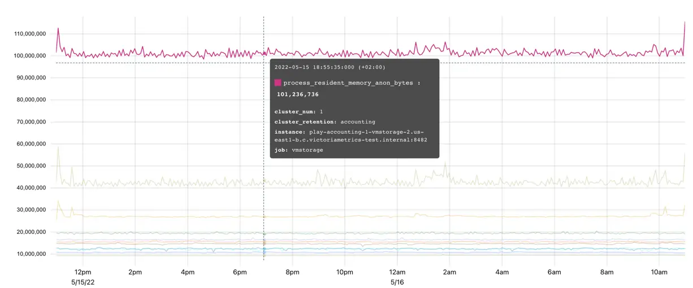
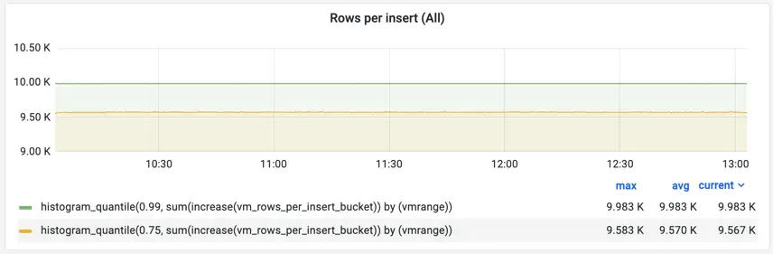
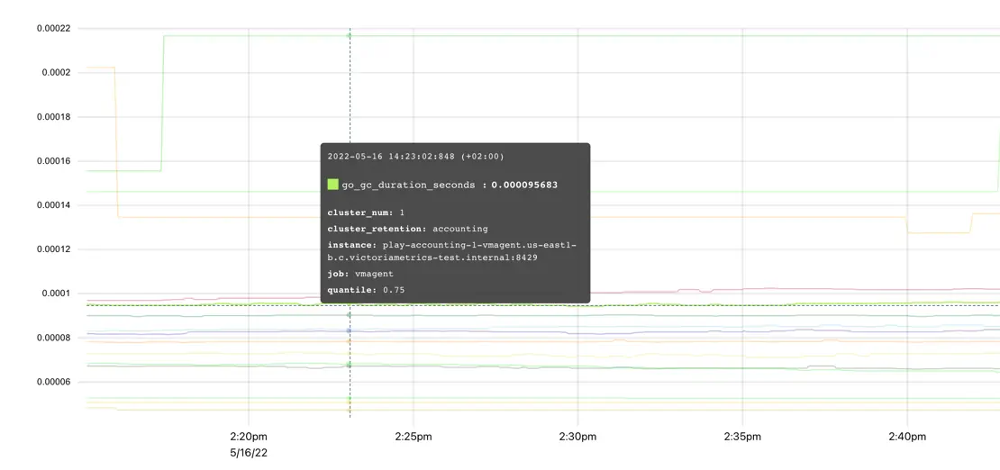
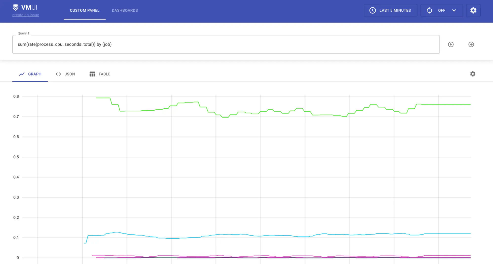

# Key concepts

## Data model

### What is a metric

Simply put, `metric` is a numeric measure or observation of something.

The most common use-cases for metrics are:

- check how the system behaves at the particular time period;
- correlate behavior changes to other measurements;
- observe or forecast trends;
- trigger events (alerts) if the metric exceeds a threshold.

### Structure of a metric

Let's start with an example. To track how many requests our application serves, we'll define a metric with the
name `requests_total`.

You can be more specific here by saying `requests_success_total` (for only successful requests)
or `request_errors_total` (for requests which failed). Choosing a metric name is very important and supposed to clarify
what is actually measured to every person who reads it, just like **variable names** in programming.

#### Labels

Every metric can contain additional meta-information in the form of label-value pairs:

```
requests_total{path="/", code="200"} 
requests_total{path="/", code="403"} 
```

The meta-information - a set of `labels` in curly braces - gives us a context for which `path` and with what `code`
the `request` was served. Label-value pairs are always of a `string` type. VictoriaMetrics data model is schemaless,
which means there is no need to define metric names or their labels in advance. User is free to add or change ingested
metrics anytime.

Actually, the metric name is also a label with a special name `__name__`. So the following two series are identical:

```
requests_total{path="/", code="200"} 
{__name__="requests_total", path="/", code="200"} 
```

Labels can be automatically attached to the [time series](#time-series) 
written via [vmagent](https://docs.victoriametrics.com/vmagent/#adding-labels-to-metrics) 
or [Prometheus](https://docs.victoriametrics.com/single-server-victoriametrics/#prometheus-setup).
VictoriaMetrics supports enforcing of label filters for [query API](https://docs.victoriametrics.com/single-server-victoriametrics/#prometheus-querying-api-enhancements)
to emulate data isolation. However, the real data isolation can be achieved via [multi-tenancy](https://docs.victoriametrics.com/cluster-victoriametrics/#multitenancy).

#### Time series

A combination of a metric name and its labels defines a `time series`. For example,
`requests_total{path="/", code="200"}` and `requests_total{path="/", code="403"}`
are two different time series because they have different values for `code` label.

The number of unique time series has an impact on database resource usage.
See [what is an active time series](https://docs.victoriametrics.com/faq/#what-is-an-active-time-series) and
[what is high churn rate](https://docs.victoriametrics.com/faq/#what-is-high-churn-rate) docs for details.

#### Cardinality

The number of unique [time series](#time-series) is named `cardinality`. Too big number of unique time series is named `high cardinality`.
High cardinality may result in increased resource usage at VictoriaMetrics.
See [these docs](https://docs.victoriametrics.com/faq/#what-is-high-cardinality) for more details.

#### Raw samples

Every unique time series may consist of an arbitrary number of `(value, timestamp)` data points (aka `raw samples`) sorted by `timestamp`.
VictoriaMetrics stores all the `values` as [float64](https://en.wikipedia.org/wiki/Double-precision_floating-point_format)
with [extra compression](https://faun.pub/victoriametrics-achieving-better-compression-for-time-series-data-than-gorilla-317bc1f95932) applied.
This allows storing precise integer values with up to 12 decimal digits and any floating-point values with up to 12 significant decimal digits.
If the value has more than 12 significant decimal digits, then the less significant digits can be lost when storing them in VictoriaMetrics.

The `timestamp` is a [Unix timestamp](https://en.wikipedia.org/wiki/Unix_time) with millisecond precision.

Below is an example of a single raw sample
in [Prometheus text exposition format](https://github.com/prometheus/docs/blob/main/content/docs/instrumenting/exposition_formats.md#text-based-format):

```
requests_total{path="/", code="200"} 123 4567890
```

- The `requests_total{path="/", code="200"}` identifies the associated time series for the given sample.
- The `123` is a sample value.
- The `4567890` is an optional timestamp for the sample. If it is missing,
  then the current timestamp is used when storing the sample in VictoriaMetrics.

#### Time series resolution

Resolution is the minimum interval between [raw samples](https://docs.victoriametrics.com/keyconcepts/#raw-samples)
of the [time series](https://docs.victoriametrics.com/keyconcepts/#time-series). Consider the following example:
```
----------------------------------------------------------------------
|              <time series>                 | <value> | <timestamp> |
| requests_total{path="/health", code="200"} |    1    |  1676297640 |
| requests_total{path="/health", code="200"} |    2    |  1676297670 |
| requests_total{path="/health", code="200"} |    3    |  1676297700 |
| requests_total{path="/health", code="200"} |    4    |  1676297730 |
....
```
Here we have a time series `requests_total{path="/health", code="200"}` which has a value update each `30s`.
This means, its resolution is also a `30s`.

> In terms of [pull model](https://docs.victoriametrics.com/keyconcepts/#pull-model), resolution is equal 
> to `scrape_interval` and is controlled by the monitoring system (server).
> For [push model](https://docs.victoriametrics.com/keyconcepts/#push-model), resolution is an interval between
> samples timestamps and is controlled by a client (metrics collector).

Try to keep time series resolution consistent, since some [MetricsQL](#metricsql) functions may expect it to be so.


### Types of metrics

Internally, VictoriaMetrics does not have the notion of a metric type. The concept of a metric
type exists specifically to help users to understand how the metric was measured. There are 4 common metric types.

#### Counter

Counter is a metric, which counts some events. Its value increases or stays the same over time.
It cannot decrease in general case. The only exception is e.g. `counter reset`,
when the metric resets to zero. The `counter reset` can occur when the service, which exposes the counter, restarts.
So, the `counter` metric shows the number of observed events since the service start.

In programming, `counter` is a variable that you **increment** each time something happens.


`vm_http_requests_total` is a typical example of a counter. The interpretation of a graph
above is that time series `vm_http_requests_total{instance="localhost:8428", job="victoriametrics", path="api/v1/query_range"}`
was rapidly changing from 1:38 pm to 1:39 pm, then there were no changes until 1:41 pm.

Counter is used for measuring the number of events, like the number of requests, errors, logs, messages, etc.
The most common [MetricsQL](#metricsql) functions used with counters are:

* [rate](https://docs.victoriametrics.com/metricsql/#rate) - calculates the average per-second speed of metric change.
  For example, `rate(requests_total)` shows how many requests are served per second on average;
* [increase](https://docs.victoriametrics.com/metricsql/#increase) - calculates the growth of a metric on the given
  time period specified in square brackets.
  For example, `increase(requests_total[1h])` shows the number of requests served over the last hour.

It is OK to have fractional counters. For example, `request_duration_seconds_sum` counter may sum the durations of all the requests.
Every duration may have a fractional value in seconds, e.g. `0.5` of a second. So the cumulative sum of all the request durations
may be fractional too.

It is recommended to put `_total`, `_sum` or `_count` suffix to `counter` metric names, so such metrics can be easily differentiated
by humans from other metric types.

#### Gauge

Gauge is used for measuring a value that can go up and down:



The metric `process_resident_memory_anon_bytes` on the graph shows the memory usage of the application at every given time.
It is changing frequently, going up and down showing how the process allocates and frees the memory.
In programming, `gauge` is a variable to which you **set** a specific value as it changes.

Gauge is used in the following scenarios:

* measuring temperature, memory usage, disk usage etc;
* storing the state of some process. For example, gauge `config_reloaded_successful` can be set to `1` if everything is
  good, and to `0` if configuration failed to reload;
* storing the timestamp when the event happened. For example, `config_last_reload_success_timestamp_seconds`
  can store the timestamp of the last successful configuration reload.

The most common [MetricsQL](#metricsql) functions used with gauges are [aggregation functions](#aggregation-and-grouping-functions)
and [rollup functions](https://docs.victoriametrics.com/metricsql/#rollup-functions).

#### Histogram

Histogram is a set of [counter](#counter) metrics with different `vmrange` or `le` labels.
The `vmrange` or `le` labels define measurement boundaries of a particular bucket.
When the observed measurement hits a particular bucket, then the corresponding counter is incremented.

Histogram buckets usually have `_bucket` suffix in their names.
For example, VictoriaMetrics tracks the distribution of rows processed per query with the `vm_rows_read_per_query` histogram.
The exposition format for this histogram has the following form:

```
vm_rows_read_per_query_bucket{vmrange="4.084e+02...4.642e+02"} 2
vm_rows_read_per_query_bucket{vmrange="5.275e+02...5.995e+02"} 1
vm_rows_read_per_query_bucket{vmrange="8.799e+02...1.000e+03"} 1
vm_rows_read_per_query_bucket{vmrange="1.468e+03...1.668e+03"} 3
vm_rows_read_per_query_bucket{vmrange="1.896e+03...2.154e+03"} 4
vm_rows_read_per_query_sum 15582
vm_rows_read_per_query_count 11
```

The `vm_rows_read_per_query_bucket{vmrange="4.084e+02...4.642e+02"} 2` line means
that there were 2 queries with the number of rows in the range `(408.4 - 464.2]`
since the last VictoriaMetrics start.

The counters ending with `_bucket` suffix allow estimating arbitrary percentile
for the observed measurement with the help of [histogram_quantile](https://docs.victoriametrics.com/metricsql/#histogram_quantile)
function. For example, the following query returns the estimated 99th percentile
on the number of rows read per each query during the last hour (see `1h` in square brackets):

```metricsql
histogram_quantile(0.99, sum(increase(vm_rows_read_per_query_bucket[1h])) by (vmrange))
```

This query works in the following way:

1. The `increase(vm_rows_read_per_query_bucket[1h])` calculates per-bucket per-instance
   number of events over the last hour.
1. The `sum(...) by (vmrange)` calculates per-bucket events by summing per-instance buckets
   with the same `vmrange` values.
1. The `histogram_quantile(0.99, ...)` calculates 99th percentile over `vmrange` buckets returned at step 2.

Histogram metric type exposes two additional counters ending with `_sum` and `_count` suffixes:

- the `vm_rows_read_per_query_sum` is a sum of all the observed measurements,
  e.g. the sum of rows served by all the queries since the last VictoriaMetrics start.

- the `vm_rows_read_per_query_count` is the total number of observed events,
  e.g. the total number of observed queries since the last VictoriaMetrics start.

These counters allow calculating the average measurement value on a particular lookbehind window.
For example, the following query calculates the average number of rows read per query
during the last 5 minutes (see `5m` in square brackets):

```metricsql
increase(vm_rows_read_per_query_sum[5m]) / increase(vm_rows_read_per_query_count[5m])
```

The `vm_rows_read_per_query` histogram may be used in Go application in the following way
by using the [github.com/VictoriaMetrics/metrics](https://github.com/VictoriaMetrics/metrics) package:

```go
// define the histogram
rowsReadPerQuery := metrics.NewHistogram(`vm_rows_read_per_query`)

// use the histogram during processing
for _, query := range queries {
    rowsReadPerQuery.Update(float64(len(query.Rows)))
}
```

Now let's see what happens each time when `rowsReadPerQuery.Update` is called:

* counter `vm_rows_read_per_query_sum` is incremented by value of `len(query.Rows)` expression;
* counter `vm_rows_read_per_query_count` increments by 1;
* counter `vm_rows_read_per_query_bucket` gets incremented only if observed value is within the
  range (`bucket`) defined in `vmrange`.

Such a combination of `counter` metrics allows
plotting [Heatmaps in Grafana](https://grafana.com/docs/grafana/latest/visualizations/heatmap/)
and calculating [quantiles](https://prometheus.io/docs/practices/histograms/#quantiles):



Grafana doesn't understand buckets with `vmrange` labels, so the [prometheus_buckets](https://docs.victoriametrics.com/metricsql/#prometheus_buckets)
function must be used for converting buckets with `vmrange` labels to buckets with `le` labels before building heatmaps in Grafana.

Histograms are usually used for measuring the distribution of latency, sizes of elements (batch size, for example) etc. There are two
implementations of a histogram supported by VictoriaMetrics:

1. [Prometheus histogram](https://prometheus.io/docs/practices/histograms/). The canonical histogram implementation is
   supported by most of
   the [client libraries for metrics instrumentation](https://prometheus.io/docs/instrumenting/clientlibs/). Prometheus
   histogram requires a user to define ranges (`buckets`) statically.
1. [VictoriaMetrics histogram](https://valyala.medium.com/improving-histogram-usability-for-prometheus-and-grafana-bc7e5df0e350)
   supported by [VictoriaMetrics/metrics](https://github.com/VictoriaMetrics/metrics) instrumentation library.
   Victoriametrics histogram automatically handles bucket boundaries, so users don't need to think about them.

We recommend reading the following articles before you start using histograms:

1. [Prometheus histogram](https://prometheus.io/docs/concepts/metric_types/#histogram)
1. [Histograms and summaries](https://prometheus.io/docs/practices/histograms/)
1. [How does a Prometheus Histogram work?](https://www.robustperception.io/how-does-a-prometheus-histogram-work)
1. [Improving histogram usability for Prometheus and Grafana](https://valyala.medium.com/improving-histogram-usability-for-prometheus-and-grafana-bc7e5df0e350)

#### Summary

Summary metric type is quite similar to [histogram](#histogram) and is used for
[quantiles](https://prometheus.io/docs/practices/histograms/#quantiles) calculations. The main difference
is that calculations are made on the client-side, so metrics exposition format already contains pre-defined
quantiles:

```
go_gc_duration_seconds{quantile="0"} 0
go_gc_duration_seconds{quantile="0.25"} 0
go_gc_duration_seconds{quantile="0.5"} 0
go_gc_duration_seconds{quantile="0.75"} 8.0696e-05
go_gc_duration_seconds{quantile="1"} 0.001222168
go_gc_duration_seconds_sum 0.015077078
go_gc_duration_seconds_count 83
```

The visualization of summaries is pretty straightforward:



Such an approach makes summaries easier to use but also puts significant limitations compared to [histograms](#histogram):

- It is impossible to calculate quantile over multiple summary metrics, e.g. `sum(go_gc_duration_seconds{quantile="0.75"})`,
  `avg(go_gc_duration_seconds{quantile="0.75"})` or `max(go_gc_duration_seconds{quantile="0.75"})`
  won't return the expected 75th percentile over `go_gc_duration_seconds` metrics collected from multiple instances
  of the application. See [this article](https://latencytipoftheday.blogspot.de/2014/06/latencytipoftheday-you-cant-average.html) for details.

- It is impossible to calculate quantiles other than the already pre-calculated quantiles.

- It is impossible to calculate quantiles for measurements collected over an arbitrary time range. Usually, `summary`
  quantiles are calculated over a fixed time range such as the last 5 minutes.

Summaries are usually used for tracking the pre-defined percentiles for latency, sizes of elements (batch size, for example) etc.

### Instrumenting application with metrics

As was said at the beginning of the [types of metrics](#types-of-metrics) section, metric type defines how it was
measured. VictoriaMetrics TSDB doesn't know about metric types. All it sees are metric names, labels, values, and timestamps.
What are these metrics, what do they measure, and how - all this depends on the application which emits them.

To instrument your application with metrics compatible with VictoriaMetrics we recommend
using [github.com/VictoriaMetrics/metrics](https://github.com/VictoriaMetrics/metrics) package.
See more details on how to use it in [this article](https://victoriametrics.medium.com/how-to-monitor-go-applications-with-victoriametrics-c04703110870).

VictoriaMetrics is also compatible with [Prometheus client libraries for metrics instrumentation](https://prometheus.io/docs/instrumenting/clientlibs/).

#### Naming

We recommend following [Prometheus naming convention for metrics](https://prometheus.io/docs/practices/naming/). There
are no strict restrictions, so any metric name and labels are accepted by VictoriaMetrics.
But the convention helps to keep names meaningful, descriptive, and clear to other people.
Following convention is a good practice.

#### Labels

Every measurement can contain an arbitrary number of `key="value"` labels. The good practice is to keep this number limited.
Otherwise, it would be difficult to deal with measurements containing a big number of labels.
By default, VictoriaMetrics limits the number of labels per measurement to `30` and drops other labels.
This limit can be changed via `-maxLabelsPerTimeseries` command-line flag if necessary (but this isn't recommended).

Every label value can contain an arbitrary string value. The good practice is to use short and meaningful label values to
describe the attribute of the metric, not to tell the story about it. For example, label-value pair
`environment="prod"` is ok, but `log_message="long log message with a lot of details..."` is not ok. By default,
VictoriaMetrics limits label's value size with 1kB. This limit can be changed via `-maxLabelValueLen` command-line flag.

It is very important to keep under control the number of unique label values, since every unique label value
leads to a new [time series](#time-series). Try to avoid using volatile label values such as session ID or query ID in order to
avoid excessive resource usage and database slowdown.

### Multi-tenancy

[Cluster version](https://docs.victoriametrics.com/cluster-victoriametrics/) of VictoriaMetrics 
supports [multi-tenancy](https://docs.victoriametrics.com/cluster-victoriametrics/#multitenancy)
for data isolation.

Multi-tenancy can be emulated for [single-server](https://docs.victoriametrics.com/single-server-victoriametrics/) 
version of VictoriaMetrics by adding [labels](#labels) on [write path](#write-data)
and enforcing [labels filtering](https://docs.victoriametrics.com/single-server-victoriametrics/#prometheus-querying-api-enhancements) 
on [read path](#query-data).


## Write data

VictoriaMetrics supports both models used in modern monitoring applications: [push](#push-model) and [pull](#pull-model).

### Push model

Client regularly sends the collected metrics to the server in the push model:


The client (application) decides when and where to send its metrics. VictoriaMetrics supports many protocols
for data ingestion (aka `push protocols`) - see [the full list here](https://docs.victoriametrics.com/#how-to-import-time-series-data).
All the protocols are fully compatible with VictoriaMetrics [data model](#data-model) and can be used in production.
We recommend using the [github.com/VictoriaMetrics/metrics](https://github.com/VictoriaMetrics/metrics) package
for pushing application metrics to VictoriaMetrics.
It is also possible to use already existing clients compatible with the protocols listed above
like [Telegraf](https://github.com/influxdata/telegraf)
for [InfluxDB line protocol](https://docs.victoriametrics.com/single-server-victoriametrics/#how-to-send-data-from-influxdb-compatible-agents-such-as-telegraf).

Creating custom clients or instrumenting the application for metrics writing is as easy as sending a POST request:

```sh
curl -d '{"metric":{"__name__":"foo","job":"node_exporter"},"values":[0,1,2],"timestamps":[1549891472010,1549891487724,1549891503438]}' -X POST 'http://localhost:8428/api/v1/import'
```

It is allowed to push/write metrics to [single-node VictoriaMetrics](https://docs.victoriametrics.com/single-server-victoriametrics/),
to [cluster component vminsert](https://docs.victoriametrics.com/cluster-victoriametrics/#architecture-overview)
and to [vmagent](https://docs.victoriametrics.com/vmagent/).

The pros of push model:

* Simpler configuration at VictoriaMetrics side - there is no need to configure VictoriaMetrics with locations of the monitored applications.
  There is no need in complex [service discovery schemes](https://docs.victoriametrics.com/sd_configs/).
* Simpler security setup - there is no need to set up access from VictoriaMetrics to each monitored application.

See [Foiled by the Firewall: A Tale of Transition From Prometheus to VictoriaMetrics](https://www.percona.com/blog/2020/12/01/foiled-by-the-firewall-a-tale-of-transition-from-prometheus-to-victoriametrics/)
elaborating more on why Percona switched from pull to push model.

The cons of push protocol:

* Increased configuration complexity for monitored applications.
  Every application needs to be individually configured with the address of the monitoring system
  for metrics delivery. It also needs to be configured with the interval between metric pushes
  and the strategy in case of metric delivery failure.
* Non-trivial setup for metrics' delivery into multiple monitoring systems.
* It may be hard to tell whether the application went down or just stopped sending metrics for a different reason.
* Applications can overload the monitoring system by pushing metrics at too short intervals.

### Pull model

Pull model is an approach popularized by [Prometheus](https://prometheus.io/), where the monitoring system decides when
and where to pull metrics from:


In pull model, the monitoring system needs to be aware of all the applications it needs to monitor. The metrics are
scraped (pulled) from the known applications (aka `scrape targets`) via HTTP protocol on a regular basis (aka `scrape_interval`).

VictoriaMetrics supports discovering Prometheus-compatible targets and scraping metrics from them in the same way as Prometheus does -
see [these docs](https://docs.victoriametrics.com/#how-to-scrape-prometheus-exporters-such-as-node-exporter).

Metrics scraping is supported by [single-node VictoriaMetrics](https://docs.victoriametrics.com/#how-to-scrape-prometheus-exporters-such-as-node-exporter)
and by [vmagent](https://docs.victoriametrics.com/vmagent/).

The pros of the pull model:

* Easier to debug - VictoriaMetrics knows about all the monitored applications (aka `scrape targets`).
  The `up == 0` query instantly shows unavailable scrape targets.
  The actual information about scrape targets is available at `http://victoriametrics:8428/targets` and `http://vmagent:8429/targets`.
* Monitoring system controls the frequency of metrics' scrape, so it is easier to control its load.
* Applications aren't aware of the monitoring system and don't need to implement the logic for metrics delivery.

The cons of the pull model:

* Harder security setup - monitoring system needs to have access to applications it monitors.
* Pull model needs non-trivial [service discovery schemes](https://docs.victoriametrics.com/sd_configs/).

### Common approaches for data collection

VictoriaMetrics supports both [push](#push-model) and [pull](#pull-model)
models for data collection. Many installations use exclusively one of these models, or both at once.

The most common approach for data collection is using both models:


In this approach the additional component is used - [vmagent](https://docs.victoriametrics.com/vmagent/). Vmagent is
a lightweight agent whose main purpose is to collect, filter, relabel and deliver metrics to VictoriaMetrics.
It supports all [push](#push-model) and [pull](#pull-model) protocols mentioned above.

The basic monitoring setup of VictoriaMetrics and vmagent is described
in the [example docker-compose manifest](https://github.com/VictoriaMetrics/VictoriaMetrics/tree/master/deployment/docker).
In this example vmagent [scrapes a list of targets](https://github.com/VictoriaMetrics/VictoriaMetrics/blob/master/deployment/docker/prometheus.yml)
and [forwards collected data to VictoriaMetrics](https://github.com/VictoriaMetrics/VictoriaMetrics/blob/9d7da130b5a873be334b38c8d8dec702c9e8fac5/deployment/docker/docker-compose.yml#L15).
VictoriaMetrics is then used as a [datasource for Grafana](https://github.com/VictoriaMetrics/VictoriaMetrics/tree/master/deployment/docker/provisioning/datasources)
installation for querying collected data.

VictoriaMetrics components allow building more advanced topologies. For example, vmagents can push metrics from separate datacenters to the central VictoriaMetrics:


VictoriaMetrics in this example may be either [single-node VictoriaMetrics](https://docs.victoriametrics.com/single-server-victoriametrics/)
or [VictoriaMetrics Cluster](https://docs.victoriametrics.com/cluster-victoriametrics/). Vmagent also allows
[replicating the same data to multiple destinations](https://docs.victoriametrics.com/vmagent/#replication-and-high-availability).

## Query data

VictoriaMetrics provides
an [HTTP API](https://docs.victoriametrics.com/single-server-victoriametrics/#prometheus-querying-api-usage)
for serving read queries. The API is used in various integrations such as
[Grafana](https://docs.victoriametrics.com/single-server-victoriametrics/#grafana-setup). The same API is also used by
[VMUI](https://docs.victoriametrics.com/single-server-victoriametrics/#vmui) - a graphical User Interface for querying
and visualizing metrics.

The API consists of two main handlers for serving [instant queries](#instant-query) and [range queries](#range-query).

### Instant query

Instant query executes the `query` expression at the given `time`:

```
GET | POST /api/v1/query?query=...&time=...&step=...&timeout=...
```

Params:

* `query` - [MetricsQL](https://docs.victoriametrics.com/metricsql/) expression.
* `time` - optional, [timestamp](https://docs.victoriametrics.com/single-server-victoriametrics/#timestamp-formats)
  in second precision to evaluate the `query` at. If omitted, `time` is set to `now()` (current timestamp).
  The `time` param can be specified in [multiple allowed formats](https://docs.victoriametrics.com/#timestamp-formats).
* `step` - optional [interval](https://prometheus.io/docs/prometheus/latest/querying/basics/#time-durations)
  for searching for raw samples in the past when executing the `query` (used when a sample is missing at the specified `time`).
  For example, the request `/api/v1/query?query=up&step=1m` looks for the last written raw sample for the metric `up`
  in the interval between `now()` and `now()-1m`. If omitted, `step` is set to `5m` (5 minutes) by default.
* `timeout` - optional query timeout. For example, `timeout=5s`. Query is canceled when the timeout is reached.
  By default the timeout is set to the value of `-search.maxQueryDuration` command-line flag passed to single-node VictoriaMetrics
  or to `vmselect` component of VictoriaMetrics cluster.

The result of Instant query is a list of [time series](https://docs.victoriametrics.com/keyconcepts/#time-series)
matching the filter in `query` expression. Each returned series contains exactly one `(timestamp, value)` entry,
where `timestamp` equals to the `time` query arg, while the `value` contains `query` result at the requested `time`.

To understand how instant queries work, let's begin with a data sample:

```
foo_bar 1.00 1652169600000 # 2022-05-10 10:00:00
foo_bar 2.00 1652169660000 # 2022-05-10 10:01:00
foo_bar 3.00 1652169720000 # 2022-05-10 10:02:00
foo_bar 5.00 1652169840000 # 2022-05-10 10:04:00, one point missed
foo_bar 5.50 1652169960000 # 2022-05-10 10:06:00, one point missed
foo_bar 5.50 1652170020000 # 2022-05-10 10:07:00
foo_bar 4.00 1652170080000 # 2022-05-10 10:08:00
foo_bar 3.50 1652170260000 # 2022-05-10 10:11:00, two points missed
foo_bar 3.25 1652170320000 # 2022-05-10 10:12:00
foo_bar 3.00 1652170380000 # 2022-05-10 10:13:00
foo_bar 2.00 1652170440000 # 2022-05-10 10:14:00
foo_bar 1.00 1652170500000 # 2022-05-10 10:15:00
foo_bar 4.00 1652170560000 # 2022-05-10 10:16:00
```

The data above contains a list of samples for the `foo_bar` time series with time intervals between samples
ranging from 1m to 3m. If we plot this data sample on the graph, it will have the following form:


    
To get the value of the `foo_bar` series at some specific moment of time, for example `2022-05-10 10:03:00`, in
VictoriaMetrics we need to issue an **instant query**:

```sh
curl "http://<victoria-metrics-addr>/api/v1/query?query=foo_bar&time=2022-05-10T10:03:00.000Z"
```

```json
{
  "status": "success",
  "data": {
    "resultType": "vector",
    "result": [
      {
        "metric": {
          "__name__": "foo_bar"
        },
        "value": [
          1652169780, // 2022-05-10 10:03:00
          "3"
        ]
      }
    ]
  }
}
```

In response, VictoriaMetrics returns a single sample-timestamp pair with a value of `3` for the series
`foo_bar` at the given moment in time `2022-05-10 10:03`. But, if we take a look at the original data sample again,
we'll see that there is no raw sample at `2022-05-10 10:03`. When there is no raw sample at the
requested timestamp, VictoriaMetrics will try to locate the closest sample before the requested timestamp:


The time range in which VictoriaMetrics will try to locate a replacement for a missing data sample is equal to `5m`
by default and can be overridden via the `step` parameter.

Instant queries can return multiple time series, but always only one data sample per series. Instant queries are used in
the following scenarios:

* Getting the last recorded value;
* For [rollup functions](https://docs.victoriametrics.com/metricsql/#rollup-functions) such as `count_over_time`;
* For alerts and recording rules evaluation;
* Plotting Stat or Table panels in Grafana.

### Range query

Range query executes the `query` expression at the given [`start`...`end`] time range with the given `step`:

```
GET | POST /api/v1/query_range?query=...&start=...&end=...&step=...&timeout=...
```

Params:
* `query` - [MetricsQL](https://docs.victoriametrics.com/metricsql/) expression.
* `start` - the starting [timestamp](https://docs.victoriametrics.com/single-server-victoriametrics/#timestamp-formats)
  of the time range for `query` evaluation.
* `end` - the ending [timestamp](https://docs.victoriametrics.com/single-server-victoriametrics/#timestamp-formats)
  of the time range for `query` evaluation.
  If the `end` isn't set, then the `end` is automatically set to the current time.
* `step` - the [interval](https://prometheus.io/docs/prometheus/latest/querying/basics/#time-durations) 
  between data points, which must be returned from the range query.
  The `query` is executed at `start`, `start+step`, `start+2*step`, ..., `end` timestamps.
  If the `step` isn't set, then it default to `5m` (5 minutes).
* `timeout` - optional query timeout. For example, `timeout=5s`. Query is canceled when the timeout is reached.
  By default the timeout is set to the value of `-search.maxQueryDuration` command-line flag passed to single-node VictoriaMetrics
  or to `vmselect` component in VictoriaMetrics cluster.

The result of Range query is a list of [time series](https://docs.victoriametrics.com/keyconcepts/#time-series)
matching the filter in `query` expression. Each returned series contains `(timestamp, value)` results for the `query` executed
at `start`, `start+step`, `start+2*step`, ..., `end` timestamps. In other words, Range query is an [Instant query](#instant-query)
executed independently at `start`, `start+step`, ..., `end` timestamps.

For example, to get the values of `foo_bar` during the time range from `2022-05-10 09:59:00` to `2022-05-10 10:17:00`,
we need to issue a range query:

```sh
curl "http://<victoria-metrics-addr>/api/v1/query_range?query=foo_bar&step=1m&start=2022-05-10T09:59:00.000Z&end=2022-05-10T10:17:00.000Z"
```

```json
{
  "status": "success",
  "data": {
    "resultType": "matrix",
    "result": [
      {
        "metric": {
          "__name__": "foo_bar"
        },
        "values": [
          [
            1652169600,
            "1"
          ],
          [
            1652169660,
            "2"
          ],
          [
            1652169720,
            "3"
          ],
          [
            1652169780,
            "3"
          ],
          [
            1652169840,
            "7"
          ],
          [
            1652169900,
            "7"
          ],
          [
            1652169960,
            "7.5"
          ],
          [
            1652170020,
            "7.5"
          ],
          [
            1652170080,
            "6"
          ],
          [
            1652170140,
            "6"
          ],
          [
            1652170260,
            "5.5"
          ],
          [
            1652170320,
            "5.25"
          ],
          [
            1652170380,
            "5"
          ],
          [
            1652170440,
            "3"
          ],
          [
            1652170500,
            "1"
          ],
          [
            1652170560,
            "4"
          ],
          [
            1652170620,
            "4"
          ]
        ]
      }
    ]
  }
}
```

In response, VictoriaMetrics returns `17` sample-timestamp pairs for the series `foo_bar` at the given time range
from `2022-05-10 09:59:00` to `2022-05-10 10:17:00`. But, if we take a look at the original data sample again, we'll
see that it contains only 13 raw samples. What happens here is that the range query is actually
an [instant query](#instant-query) executed `1 + (start-end)/step` times on the time range from `start` to `end`. If we plot
this request in VictoriaMetrics the graph will be shown as the following:


The blue dotted lines in the figure are the moments when the instant query was executed. Since the instant query retains the
ability to return replacements for missing points, the graph contains two types of data points: `real` and `ephemeral`.
`ephemeral` data points always repeat the closest raw sample that occurred before (see red arrow on the pic above).

This behavior of adding ephemeral data points comes from the specifics of the [pull model](#pull-model):

* Metrics are scraped at fixed intervals.
* Scrape may be skipped if the monitoring system is overloaded.
* Scrape may fail due to network issues.

According to these specifics, the range query assumes that if there is a missing raw sample then it is likely a missed
scrape, so it fills it with the previous raw sample. The same will work for cases when `step` is lower than the actual
interval between samples. In fact, if we set `step=1s` for the same request, we'll get about 1 thousand data points in
response, where most of them are `ephemeral`.

Sometimes, the lookbehind window for locating the datapoint isn't big enough and the graph will contain a gap. For range
queries, lookbehind window isn't equal to the `step` parameter. It is calculated as the median of the intervals between
the first 20 raw samples in the requested time range. In this way, VictoriaMetrics automatically adjusts the lookbehind
window to fill gaps and detect stale series at the same time.

Range queries are mostly used for plotting time series data over specified time ranges. These queries are extremely
useful in the following scenarios:

* Track the state of a metric on the given time interval;
* Correlate changes between multiple metrics on the time interval;
* Observe trends and dynamics of the metric change.

If you need to export raw samples from VictoriaMetrics, then take a look at [export APIs](https://docs.victoriametrics.com/#how-to-export-time-series).

### Query latency

By default, Victoria Metrics does not immediately return the recently written samples. Instead, it retrieves the last results
written prior to the time specified by the `-search.latencyOffset` command-line flag, which has a default offset of 30 seconds.
This is true for both `query` and `query_range` and may give the impression that data is written to the VM with a 30-second delay.

This flag prevents from non-consistent results due to the fact that only part of the values are scraped in the last scrape interval.

Here is an illustration of a potential problem when `-search.latencyOffset` is set to zero:


When this flag is set, the VM will return the last metric value collected before the `-search.latencyOffset`
duration throughout the `-search.latencyOffset` duration:


It can be overridden on per-query basis via `latency_offset` query arg.

VictoriaMetrics buffers recently ingested samples in memory for up to a few seconds and then periodically flushes these samples to disk.
This bufferring improves data ingestion performance. The buffered samples are invisible in query results, even if `-search.latencyOffset` command-line flag is set to 0,
or if `latency_offset` query arg is set to 0.
You can send GET request to `/internal/force_flush` http handler at single-node VictoriaMetrics
or to `vmstorage` at [cluster version of VictoriaMetrics](https://docs.victoriametrics.com/cluster-victoriametrics/)
in order to forcibly flush the buffered samples to disk, so they become visible for querying. The `/internal/force_flush` handler
is provided for debugging and testing purposes only. Do not call it in production, since this may significantly slow down data ingestion
performance and increase resource usage.

### MetricsQL

VictoriaMetrics provide a special query language for executing read queries - [MetricsQL](https://docs.victoriametrics.com/metricsql/).
It is a [PromQL](https://prometheus.io/docs/prometheus/latest/querying/basics)-like query language with a powerful set of
functions and features for working specifically with time series data. MetricsQL is backward-compatible with PromQL,
so it shares most of the query concepts. The basic concepts for PromQL and MetricsQL are
described [here](https://valyala.medium.com/promql-tutorial-for-beginners-9ab455142085).

#### Filtering

In sections [instant query](#instant-query) and [range query](#range-query) we've already used MetricsQL to get data for
metric `foo_bar`. It is as simple as just writing a metric name in the query:

```metricsql
foo_bar
```

A single metric name may correspond to multiple time series with distinct label sets. For example:

```metricsql
requests_total{path="/", code="200"} 
requests_total{path="/", code="403"} 
```

To select only time series with specific label value specify the matching filter in curly braces:

```metricsql
requests_total{code="200"} 
```

The query above returns all time series with the name `requests_total` and label `code="200"`. We use the operator `=` to
match label value. For negative match use `!=` operator. Filters also support positive regex matching via `=~`
and negative regex matching via `!~`:

```metricsql
requests_total{code=~"2.*"}
```

Filters can also be combined:

```metricsql
requests_total{code=~"200", path="/home"}
```

The query above returns all time series with `requests_total` name, which simultaneously have labels `code="200"` and `path="/home"`.

#### Filtering by name

Sometimes it is required to return all the time series for multiple metric names. As was mentioned in
the [data model section](#data-model), the metric name is just an ordinary label with a special name - `__name__`. So
filtering by multiple metric names may be performed by applying regexps on metric names:

```metricsql
{__name__=~"requests_(error|success)_total"}
```

The query above returns series for two metrics: `requests_error_total` and `requests_success_total`.

#### Filtering by multiple "or" filters

[MetricsQL](https://docs.victoriametrics.com/metricsql/) supports selecting time series, which match at least one of multiple "or" filters.
Such filters must be delimited by `or` inside curly braces. For example, the following query selects time series with
`{job="app1",env="prod"}` or `{job="app2",env="dev"}` labels:

```metricsql
{job="app1",env="prod" or job="app2",env="dev"}
```

The number of `or` groups can be arbitrary. The number of `,`-delimited label filters per each `or` group can be arbitrary.
Per-group filters are applied with `and` operation, e.g. they select series simultaneously matching all the filters in the group.

This functionality allows passing the selected series to [rollup functions](https://docs.victoriametrics.com/metricsql/#rollup-functions)
such as [rate()](https://docs.victoriametrics.com/metricsql/#rate)
without the need to use [subqueries](https://docs.victoriametrics.com/metricsql/#subqueries):

```metricsql
rate({job="app1",env="prod" or job="app2",env="dev"}[5m])

```

If you need to select series matching multiple filters for the same label, then it is better from performance PoV
to use regexp filter `{label=~"value1|...|valueN"}` instead of `{label="value1" or ... or label="valueN"}`.


#### Arithmetic operations

MetricsQL supports all the basic arithmetic operations:

* addition - `+`
* subtraction - `-`
* multiplication - `*`
* division - `/`
* modulo - `%`
* power - `^`

This allows performing various calculations across multiple metrics.
For example, the following query calculates the percentage of error requests:

```metricsql
(requests_error_total / (requests_error_total + requests_success_total)) * 100
```

#### Combining multiple series

Combining multiple time series with arithmetic operations requires an understanding of matching rules. Otherwise, the
query may break or may lead to incorrect results. The basics of the matching rules are simple:

* MetricsQL engine strips metric names from all the time series on the left and right side of the arithmetic operation
  without touching labels.
* For each time series on the left side MetricsQL engine searches for the corresponding time series on the right side
  with the same set of labels, applies the operation for each data point and returns the resulting time series with the
  same set of labels. If there are no matches, then the time series is dropped from the result.
* The matching rules may be augmented with `ignoring`, `on`, `group_left` and `group_right` modifiers.
  See [these docs](https://prometheus.io/docs/prometheus/latest/querying/operators/#vector-matching) for details.

#### Comparison operations

MetricsQL supports the following comparison operators:

* equal - `==`
* not equal - `!=`
* greater - `>`
* greater-or-equal - `>=`
* less - `<`
* less-or-equal - `<=`

These operators may be applied to arbitrary MetricsQL expressions as with arithmetic operators. The result of the
comparison operation is time series with only matching data points. For instance, the following query would return
series only for processes where memory usage exceeds `100MB`:

```metricsql
process_resident_memory_bytes > 100*1024*1024
```

#### Aggregation and grouping functions

MetricsQL allows aggregating and grouping of time series. Time series are grouped by the given set of labels and then the
given aggregation function is applied individually per each group. For instance, the following query returns
summary memory usage for each `job`:

```metricsql
sum(process_resident_memory_bytes) by (job)
```

See [docs for aggregate functions in MetricsQL](https://docs.victoriametrics.com/metricsql/#aggregate-functions).

#### Calculating rates

One of the most widely used functions for [counters](#counter)
is [rate](https://docs.victoriametrics.com/metricsql/#rate). It calculates the average per-second increase rate individually
per each matching time series. For example, the following query shows the average per-second data receive speed
per each monitored `node_exporter` instance, which exposes the `node_network_receive_bytes_total` metric:

```metricsql
rate(node_network_receive_bytes_total)
```

By default, VictoriaMetrics calculates the `rate` over [raw samples](#raw-samples) on the lookbehind window specified in the `step` param
passed either to [instant query](#instant-query) or to [range query](#range-query).
The interval on which `rate` needs to be calculated can be specified explicitly
as [duration](https://prometheus.io/docs/prometheus/latest/querying/basics/#time-durations) in square brackets:

```metricsql
 rate(node_network_receive_bytes_total[5m])
```

In this case VictoriaMetrics uses the specified lookbehind window - `5m` (5 minutes) - for calculating the average per-second increase rate.
Bigger lookbehind windows usually lead to smoother graphs.

`rate` strips metric name while leaving all the labels for the inner time series. If you need to keep the metric name,
then add [keep_metric_names](https://docs.victoriametrics.com/metricsql/#keep_metric_names) modifier
after the `rate(..)`. For example, the following query leaves metric names after calculating the `rate()`:

```metricsql
rate(node_network_receive_bytes_total) keep_metric_names
```

`rate()` must be applied only to [counters](#counter). The result of applying the `rate()` to [gauge](#gauge) is undefined.

### Visualizing time series

VictoriaMetrics has a built-in graphical User Interface for querying and visualizing metrics -
[VMUI](https://docs.victoriametrics.com/single-server-victoriametrics/#vmui).
Open `http://victoriametrics:8428/vmui` page, type the query and see the results:



VictoriaMetrics supports [Prometheus HTTP API](https://docs.victoriametrics.com/single-server-victoriametrics/#prometheus-querying-api-usage)
which makes it possible to [query it with Grafana](https://docs.victoriametrics.com/single-server-victoriametrics/#grafana-setup)
in the same way as Grafana queries Prometheus.

## Modify data

VictoriaMetrics stores time series data in [MergeTree](https://en.wikipedia.org/wiki/Log-structured_merge-tree)-like
data structures. While this approach is very efficient for write-heavy databases, it applies some limitations on data
updates. In short, modifying already written [time series](#time-series) requires re-writing the whole data block where
it is stored. Due to this limitation, VictoriaMetrics does not support direct data modification.

### Deletion

See [How to delete time series](https://docs.victoriametrics.com/single-server-victoriametrics/#how-to-delete-time-series)
.

### Relabeling

Relabeling is a powerful mechanism for modifying time series before they have been written to the database. Relabeling
may be applied for both [push](#push-model) and [pull](#pull-model) models. See more
details [here](https://docs.victoriametrics.com/single-server-victoriametrics/#relabeling).

### Deduplication

VictoriaMetrics supports data deduplication. See [these docs](https://docs.victoriametrics.com/single-server-victoriametrics/#deduplication).


### Downsampling

VictoriaMetrics supports data downsampling. See [these docs](https://docs.victoriametrics.com/single-server-victoriametrics/#downsampling).
