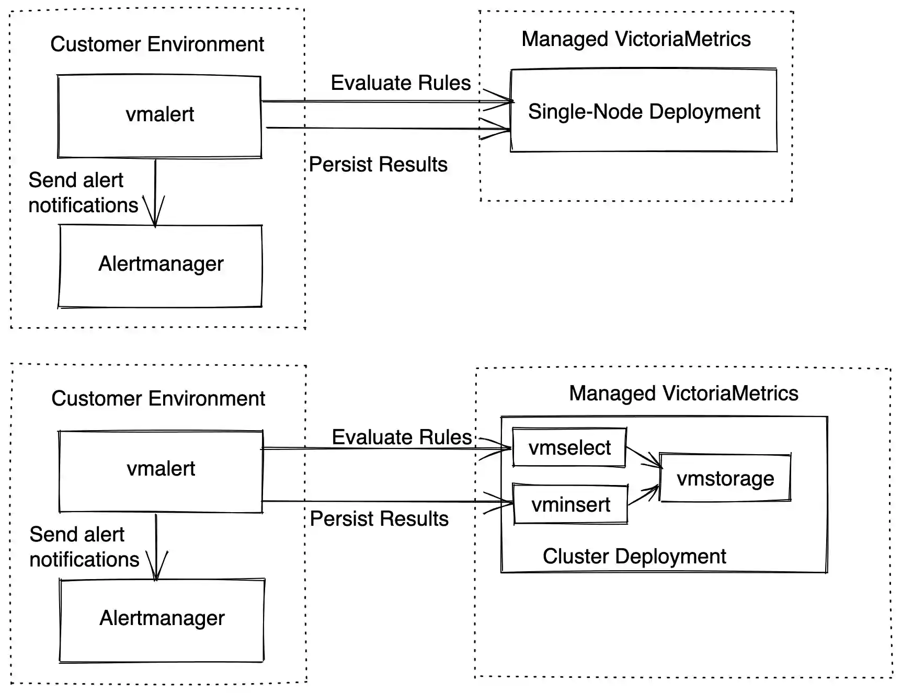
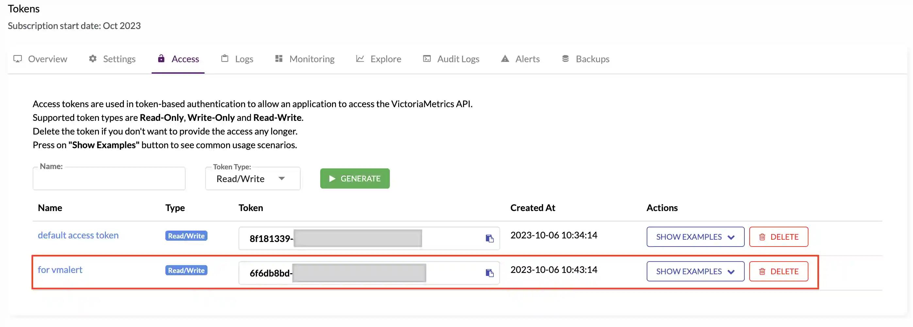
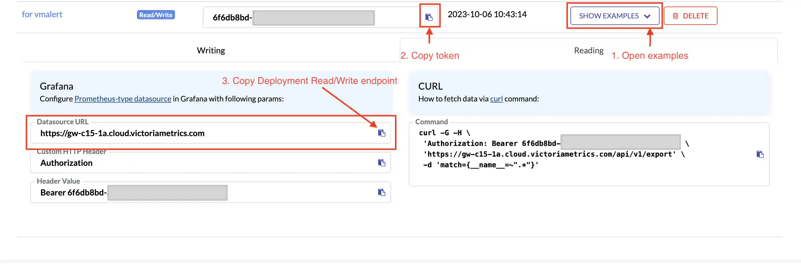
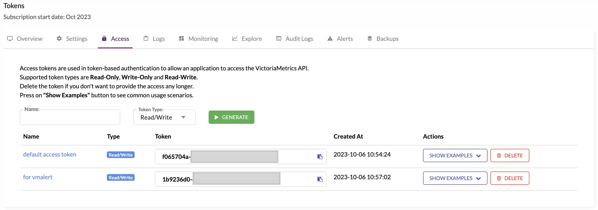
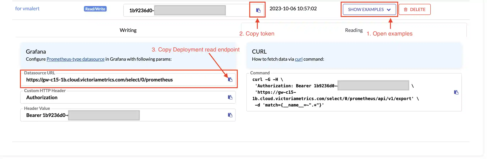
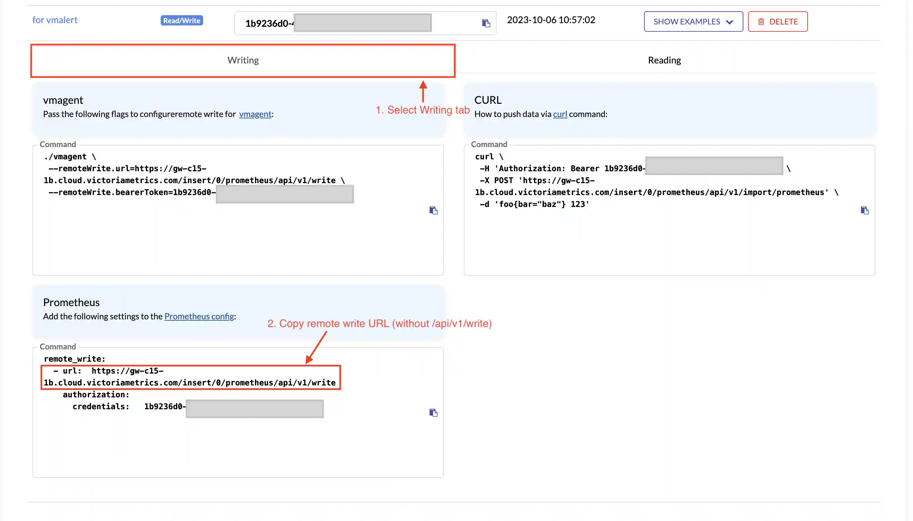

# Alerting with vmalert and Managed VictoriaMetrics

This guide explains the different ways in which you can use vmalert in conjunction with Managed VictoriaMetrics



## Preconditions 

* [vmalert](https://docs.victoriametrics.com/vmalert/) is installed. You can obtain it by building it from [source](https://docs.victoriametrics.com/vmalert/#quickstart), downloading it from the [GitHub releases page](https://github.com/VictoriaMetrics/VictoriaMetrics/releases/latest), or using the [docker image](https://hub.docker.com/r/victoriametrics/vmalert) for the container ecosystem (such as docker, k8s, etc.).
* [Alertmanager](https://prometheus.io/docs/alerting/latest/alertmanager/) is installed.
* You have a [single or cluster](https://docs.victoriametrics.com/managed-victoriametrics/quickstart.html#creating-deployment) deployment in [Managed VictoriaMetrics](https://docs.victoriametrics.com/managed-victoriametrics/overview.html).
* If you are using helm, add the [VictoriaMetrics helm chart](https://github.com/VictoriaMetrics/helm-charts/tree/master/charts/victoria-metrics-alert#how-to-install) repository to your helm repositories. This step is optional.
* If you are using [vmoperator](https://docs.victoriametrics.com/operator/quick-start.html#quick-start), make sure that it and its CRDs are installed. This step is also optional.

## Setup

### Alerting and recording rules file(s)

You need to prepare file(s) with alerting or recording rules.

An example file with one alerting rule. 

alerts.yml

```yaml
groups:
  - name: common
    rules:
    - alert: instanceIsDown
      for: 1m
      expr: up == 0
      labels:
        severity: critical
      annotations:
        summary: "{{ $labels.job }} instance: {{$labels.instance }} is not up"
        description: "Job {{ $labels.job }}  instance: {{$labels.instance }} is not up for the last 1 minute"
```

### Managed VictoriaMetrics access token and deployment endpoint

To use vmalert with Managed VictoriaMetrics, you must create a read/write token, or use an existing one. The token must have write access to ingest recording rules, ALERTS and ALERTS_FOR_STATE metrics, and read access for rules evaluation.

For instructions on how to create tokens, please refer to this section of the [documentation](https://docs.victoriametrics.com/managed-victoriametrics/quickstart.html#deployment-access).

#### Single-Node




#### Cluster





### vmalert configuration 

#### Single-Node

##### Binary 

```sh
export TOKEN=81e8226e-****-****-****-************ 
export MANAGED_VM_URL=https://gw-c15-1c.cloud.victoriametrics.com
export ALERTMANAGER_URL=http://localhost:9093 
./vmalert -rule=alerts.yml -datasource.url=$MANAGED_VM_URL -datasource.bearerToken=$TOKEN -notifier.url=$ALERTMANAGER_URL -remoteWrite.url=$MANAGED_VM_URL -remoteWrite.bearerToken=$TOKEN -remoteRead.url=$MANAGED_VM_URL -remoteRead.bearerToken=$TOKEN
```

##### Docker 

```sh
export TOKEN=81e8226e-****-****-****-************ 
export MANAGED_VM_URL=https://gw-c15-1c.cloud.victoriametrics.com
export ALERTMANAGER_URL=http://alertmanager:9093 
docker run -it -p 8080:8080 -v $(pwd)/alerts.yml:/etc/alerts/alerts.yml victoriametrics/vmalert:v1.87.1 -datasource.url=$MANAGED_VM_URL -datasource.bearerToken=$TOKEN -remoteRead.url=$MANAGED_VM_URL -remoteRead.bearerToken=$TOKEN  -remoteWrite.url=$MANAGED_VM_URL -remoteWrite.bearerToken=$TOKEN  -notifier.url=$ALERTMANAGER_URL -rule="/etc/alerts/*.yml"
```

##### Helm Chart

```sh
export TOKEN=81e8226e-****-****-****-************
export MANAGED_VM_URL=https://gw-c15-1c.cloud.victoriametrics.com
export ALERTMANAGER=http://alertmanager:9093
cat <<EOF | helm install vmalert vm/victoria-metrics-alert -f -
server:
 datasource:
   url: $MANAGED_VM_URL
   bearer:
     token: $TOKEN
 remote:
   write:
     url: $MANAGED_VM_URL
     bearer:
       token: $TOKEN
   read:
     url: $MANAGED_VM_URL
     bearer:
       token: $TOKEN
 notifier:
   alertmanager:
     url: $ALERTMANAGER
 config:
   alerts:
     groups:
       - name: common
         rules:
           - alert: instanceIsDown
             for: 1m
             expr: up == 0
             labels:
               severity: critical
             annotations:
               summary: "{{ $labels.job }} instance: {{$labels.instance }} is not up"
               description: "Job {{ $labels.job }}  instance: {{$labels.instance }} is not up for the last 1 minute"
EOF
```

##### VMalert CRD for vmoperator

```sh
export TOKEN=81e8226e-****-****-****-************
export MANAGED_VM_URL=https://gw-c15-1c.cloud.victoriametrics.com
export ALERTMANAGER=http://alertmanager:9093
cat << EOF | kubectl apply -f -
apiVersion: operator.victoriametrics.com/v1beta1
kind: VMAlert
metadata:
 name: vmalert-managed-vm
spec:
 replicaCount: 1
 datasource:
   url: $MANAGED_VM_URL
   bearerTokenSecret:
     name: managed-token
     key: token
 remoteWrite:
   url: $MANAGED_VM_URL
   bearerTokenSecret:
     name: managed-token
     key: token
 remoteRead:
   url: $MANAGED_VM_URL
   bearerTokenSecret:
     name: managed-token
     key: token
 notifier:
   url: $ALERTMANAGER
 ruleSelector:
   matchLabels:
     type: managed
---
apiVersion: v1
kind: Secret
metadata:
 name: managed-token
stringData:
 token: $TOKEN
EOF
```

##### Testing  

You can ingest metric that will raise an alert 

```sh
export TOKEN=81e8226e-****-****-****-*************
export MANAGED_VM_URL=https://gw-c15-1c.cloud.victoriametrics.com/
curl -H "Authorization: Bearer $TOKEN" -X POST "$MANAGED_VM_URLapi/v1/import/prometheus" -d 'up{job="vmalert-test", instance="localhost"} 0'
```

#### Cluster

##### Binary

```sh
export TOKEN=76bc5470-****-****-****-************
export MANAGED_VM_READ_URL=https://gw-c15-1a.cloud.victoriametrics.com/select/0/prometheus/
export MANAGED_VM_WRITE_URL=https://gw-c15-1a.cloud.victoriametrics.com/insert/0/prometheus/
export ALERTMANAGER_URL=http://localhost:9093 
./vmalert -rule=alerts.yml -datasource.url=$MANAGED_VM_READ_URL -datasource.bearerToken=$TOKEN -notifier.url=$ALERTMANAGER_URL -remoteWrite.url=$MANAGED_VM_WRITE_URL -remoteWrite.bearerToken=$TOKEN -remoteRead.url=$MANAGED_VM_READ_URL -remoteRead.bearerToken=$TOKEN
```

##### Docker

```sh
export TOKEN=76bc5470-****-****-****-************
export MANAGED_VM_READ_URL=https://gw-c15-1a.cloud.victoriametrics.com/select/0/prometheus/
export MANAGED_VM_WRITE_URL=https://gw-c15-1a.cloud.victoriametrics.com/insert/0/prometheus/
export ALERTMANAGER_URL=http://alertmanager:9093 
docker run -it -p 8080:8080 -v $(pwd)/alerts.yml:/etc/alerts/alerts.yml victoriametrics/vmalert:v1.87.1 -datasource.url=$MANAGED_VM_READ_URL -datasource.bearerToken=$TOKEN -remoteRead.url=$MANAGED_VM_READ_URL -remoteRead.bearerToken=$TOKEN  -remoteWrite.url=$MANAGED_VM_WRITE_URL -remoteWrite.bearerToken=$TOKEN  -notifier.url=$ALERTMANAGER_URL -rule="/etc/alerts/*.yml"
```

##### Helm Chart

```sh
export TOKEN=76bc5470-****-****-****-************
export MANAGED_VM_READ_URL=https://gw-c15-1a.cloud.victoriametrics.com/select/0/prometheus/
export MANAGED_VM_WRITE_URL=https://gw-c15-1a.cloud.victoriametrics.com/insert/0/prometheus/
export ALERTMANAGER=http://alertmanager:9093
cat <<EOF | helm install vmalert vm/victoria-metrics-alert -f -
server:
 datasource:
   url: $MANAGED_VM_READ_URL
   bearer:
     token: $TOKEN
 remote:
   write:
     url: $MANAGED_VM_WRITE_URL
     bearer:
       token: $TOKEN
   read:
     url: $MANAGED_VM_READ_URL
     bearer:
       token: $TOKEN
 notifier:
   alertmanager:
     url: $ALERTMANAGER
 config:
   alerts:
     groups:
       - name: common
         rules:
           - alert: instanceIsDown
             for: 1m
             expr: up == 0
             labels:
               severity: critical
             annotations:
               summary: "{{ $labels.job }} instance: {{$labels.instance }} is not up"
               description: "Job {{ $labels.job }}  instance: {{$labels.instance }} is not up for the last 1 minute"
EOF
```

##### VMalert CRD for vmoperator

```sh
export TOKEN=76bc5470-****-****-****-************
export MANAGED_VM_READ_URL=https://gw-c15-1a.cloud.victoriametrics.com/select/0/prometheus/
export MANAGED_VM_WRITE_URL=https://gw-c15-1a.cloud.victoriametrics.com/insert/0/prometheus/
export ALERTMANAGER=http://alertmanager:9093
cat << EOF | kubectl apply -f -
apiVersion: operator.victoriametrics.com/v1beta1
kind: VMAlert
metadata:
 name: vmalert-managed-vm
spec:
 replicaCount: 1
 datasource:
   url: $MANAGED_VM_READ_URL
   bearerTokenSecret:
     name: managed-token
     key: token
 remoteWrite:
   url: $MANAGED_VM_WRITE_URL
   bearerTokenSecret:
     name: managed-token
     key: token
 remoteRead:
   url: $MANAGED_VM_READ_URL
   bearerTokenSecret:
     name: managed-token
     key: token
 notifier:
   url: $ALERTMANAGER
 ruleSelector:
   matchLabels:
     type: managed
---
apiVersion: v1
kind: Secret
metadata:
 name: managed-token
stringData:
 token: $TOKEN
EOF
```

##### Testing  

You can ingest metric that will raise an alert

```sh
export TOKEN=76bc5470-****-****-****-************
export MANAGED_VM_WRITE_URL=https://gw-c15-1a.cloud.victoriametrics.com/insert/0/prometheus/
curl -H "Authorization: Bearer $TOKEN" -X POST "$MANAGED_VM_WRITE_URLapi/v1/import/prometheus" -d 'up{job="vmalert-test", instance="localhost"} 0'
```
