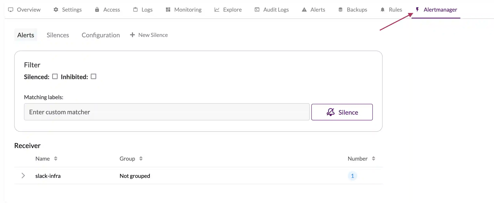
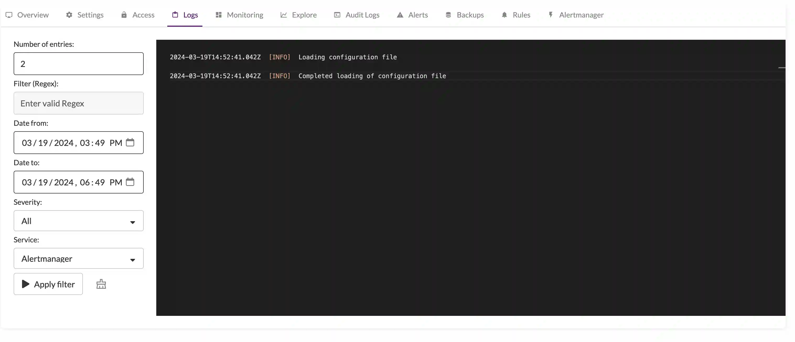

## Alerting stack configuration and Managed VictoriaMetrics

Managed VictoriaMetrics supports configuring alerting rules, powered by vmalert, and sending notifications with hosted Alertmanager.

## Configure Alertmanager

Managed VictoriaMetrics supports Alertmanager with standard [configuration](https://prometheus.io/docs/alerting/latest/configuration/).
Configuration menu is located under `Alertmanager` section of your deployment.



Please check the configuration options and limitations:

### Allowed receivers

* `discord_configs`
* `pagerduty_configs`
* `slack_configs`
* `webhook_configs`
* `opsgenie_configs`
* `wechat_configs`
* `pushover_configs`
* `victorops_configs`
* `telegram_configs`
* `webex_configs`
* `msteams_configs`

### Limitation

All configuration params with `_file` suffix are not allowed for security reasons.

### Configuration example

```yaml
route:
 receiver: slack-infra
 repeat_interval: 1m
 group_interval: 30s
 routes:
 - matchers:
   - team = team-1 
   receiver: dev-team-1
   continue: true
 - matchers:
   - team = team-2
   receiver: dev-team-2
   continue: true
receivers:
- name: slack-infra
  slack_configs:
  - api_url: https://hooks.slack.com/services/valid-url
    channel: infra
    title: |-
        [{{ .Status | toUpper -}}
        {{ if eq .Status "firing" }}:{{ .Alerts.Firing | len }}{{- end -}}
        ]
        {{ if ne .Status "firing" -}}
          :lgtm:
          {{- else if eq .CommonLabels.severity "critical" -}}
          :fire:
          {{- else if eq .CommonLabels.severity "warning" -}}
          :warning:
          {{- else if eq .CommonLabels.severity "info" -}}
          :information_source:
          {{- else -}}
          :question:
        {{- end }}
    text: |
        {{ range .Alerts }}
        {{- if .Annotations.summary }}
           Summary:  {{ .Annotations.summary }}
        {{- end }}
        {{- if .Annotations.description }}
            Description: {{ .Annotations.description }}
        {{- end }}
        {{- end }}
    actions:
    - type: button
      text: 'Query :mag:'
      url: '{{ (index .Alerts 0).GeneratorURL }}'
    - type: button
      text: 'Silence :no_bell:'
      url: '{{ template "__silenceURL" . }}'
- name: dev-team-1 
  slack_configs:
  - api_url: https://hooks.slack.com/services/valid-url
    channel: dev-alerts
- name: dev-team-2
  slack_configs:
  - api_url: https://hooks.slack.com/services/valid-url
    channel: dev-alerts
```

## Configure alerting rules

Alerting and recording rules could be configured via API calls.

### Managed VictoriaMetrics rules API

Managed VictoriaMetrics has the following APIs for rules:

* POST: `/api/v1/deployments/{deploymentId}/rule-sets/files/{fileName}`
* DELETE `/api/v1/deployments/{deploymentId}/rule-sets/files/{fileName}`

For more details, please check [OpenAPI Reference](https://cloud.victoriametrics.com/api-docs)

### Rules creation with API

Let's create two example rules for deployment in `testing-rules.yaml`

```yaml
groups:
  - name: examples
    concurrency: 2
    interval: 10s
    rules:
      - alert: never-firing
        expr: foobar > 0
        for: 30s
        labels:
          severity: warning
        annotations:
          summary: empty result rule
      - alert: always-firing
        expr: vector(1) > 0 
        for: 30s
        labels:
          severity: critical
        annotations:
          summary: "rule must be always at firing state"
```

Upload rules to the Managed VictoriaMetrics using the following command:

```sh
curl https://cloud.victoriametrics.com/api/v1/deployments/<DEPLOYMENT_ID>/rule-sets/files/testing-rules -v -H 'X-VM-Cloud-Access: <CLOUD_API_TOKEN>' -XPOST --data-binary '@testing-rules.yaml'
```

## Troubleshooting

### Rules execution state

The state of created rules is located in the `Rules` section of your deployment:


### Debug

It's possible to debug the alerting stack with logs for vmalert and Alertmanager, which are accessible in the `Logs` section of the deployment.



### Monitoring

Alertmanager and vmalert errors are tracked by a built-in monitoring system. 
Deployment's `Alerts` section has information about active incidents and incident history log.
