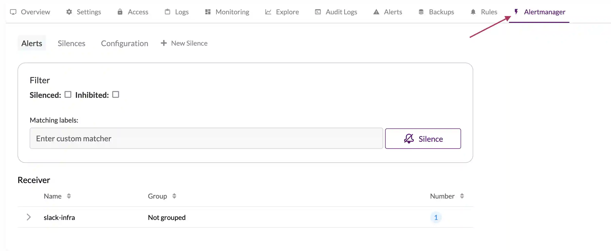
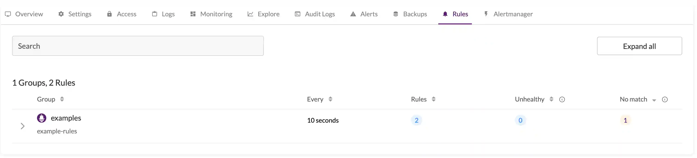
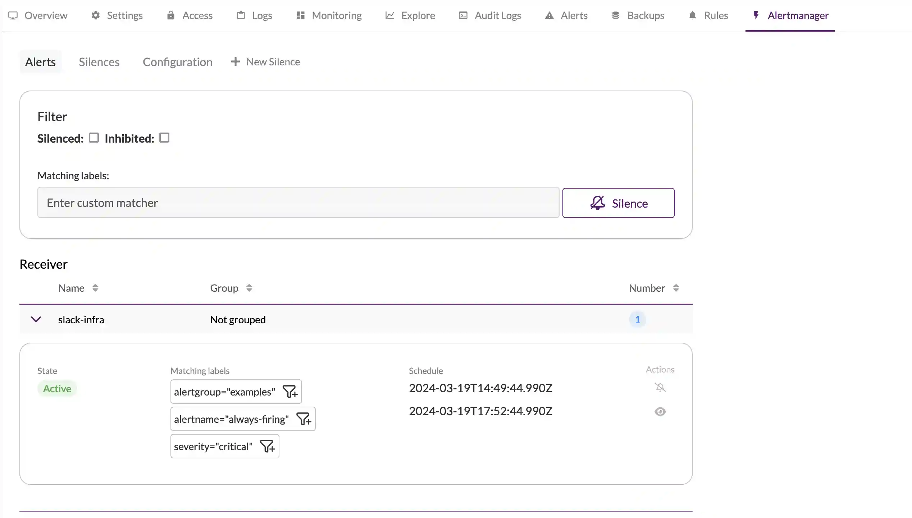

## Alerting stack configuration and Managed VictoriaMetrics

 Managed VictoriaMetrics supports configuration for alerting rules and notifications for it with alertmanager.

## Configure alertmanager

 Managed VictoriaMetrics supports alertmanager with standard [configuration](https://prometheus.io/docs/alerting/latest/configuration/).
Configuration menu located at `deployment` page under `Alertmanager` section.


 Configuration parameters have following limitations:

### allowed receivers

* `discord_configs`
* `pagerduty_configs`
* `slack_configs`
* `webhook_configs`
* `opsgenie_configs`
* `wechat_configs`
* `pushover_configs`
* `victorops_configs`
* `telegram_configs`
* `webex_configs`
* `msteams_configs`

### forbidden keys

 All configuration params with `_file` suffix is not allowed for security reasons.

### Configuration example

```yaml

route:
 receiver: slack-infra
 repeat_interval: 1m
 group_interval: 30s
 routes:
 - matchers:
   - team = team-1 
   receiver: dev-team-1
   continue: true
 - matchers:
   - team = team-2
   receiver: dev-team-2
   continue: true
receivers:
- name: slack-infra
  slack_configs:
  - api_url: https://hooks.slack.com/services/valid-url
    channel: infra
    title: |-
        [{{ .Status | toUpper -}}
        {{ if eq .Status "firing" }}:{{ .Alerts.Firing | len }}{{- end -}}
        ]
        {{ if ne .Status "firing" -}}
          :lgtm:
          {{- else if eq .CommonLabels.severity "critical" -}}
          :fire:
          {{- else if eq .CommonLabels.severity "warning" -}}
          :warning:
          {{- else if eq .CommonLabels.severity "info" -}}
          :information_source:
          {{- else -}}
          :question:
        {{- end }}
    text: |
        {{ range .Alerts }}
        {{- if .Annotations.summary }}
           Summary:  {{ .Annotations.summary }}
        {{- end }}
        {{- if .Annotations.description }}
            Description: {{ .Annotations.description }}
        {{- end }}
        {{- end }}
    actions:
    - type: button
      text: 'Query :mag:'
      url: '{{ (index .Alerts 0).GeneratorURL }}'
    - type: button
      text: 'Silence :no_bell:'
      url: '{{ template "__silenceURL" . }}'
- name: dev-team-1 
  slack_configs:
  - api_url: https://hooks.slack.com/services/valid-url
    channel: dev-alerts
- name: dev-team-2
  slack_configs:
  - api_url: https://hooks.slack.com/services/valid-url
    channel: dev-alerts

```

## Configure alerting rules
 Alerting and recording rules could be configured via API calls.

### Managed VictoriaMetrics rules API

 Managed VictoriaMetrics has following APIs for rules:

* POST: `/api/v1/deployments/{deploymentId}/rule-sets/files/{fileName}`
* DELETE `/api/v1/deployments/{deploymentId}/rule-sets/files/{fileName}`

 Swagger API examples [link](https://cloud.victoriametrics.com/api-docs)

### rules creation with API

Lets create a 2 simple rules for deployment at `testing-rules.yaml`

```yaml
groups:
  - name: examples
    concurrency: 2
    interval: 10s
    rules:
      - alert: never-firing
        expr: foobar > 0
        for: 30s
        labels:
          severity: warning
        annotations:
          summary: empty result rule
      - alert: always-firing
        expr: vector(1) > 0 
        for: 30s
        labels:
          severity: critical
        annotations:
          summary: "rule must be always at firing state"
```

 Upload rules into the Managed VictoriaMetrics with following command:

```sh
curl https://https://cloud.victoriametrics.com/api/v1/deployments/DEPLOYMENT_ID/rule-sets/files/testing-rules -v -H 'X-VM-Cloud-Access: CLOUD_API_TOKEN' -XPOST --data-binary '@testing-rules.yaml'
```

## Troubleshooting

### rules state check

 Created rules state located at `rules` section for Deployment:



### alerts state check

 Alerts and silences could be found at alertmanager section.



### debug

 It's possible to debug alerting stack with logs for `vmalert` and `alertmanager` exposed at `Logs` section of deployment.


 Alertmanager integration errors are also tracked by internal cloud monitoring system.
