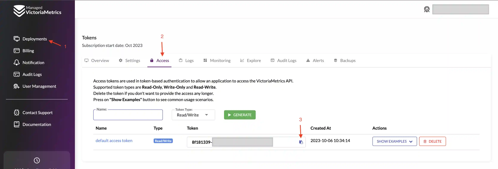
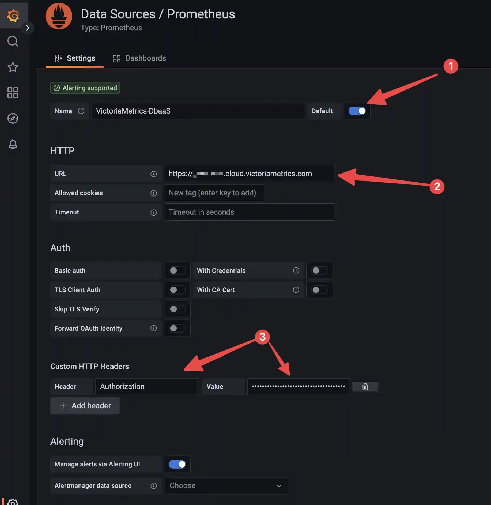

# Kubernetes Monitoring with Managed VictoriaMetrics

Monitoring kubernetes cluster is necessary to build SLO/SLI, to analyze performance and cost-efficiency of your workloads. 

To enable kubernetes cluster monitoring, we will be collecting metrics about cluster performance and utilization from kubernetes components like `kube-api-server`, `kube-controller-manager`, `kube-scheduler`, `kube-state-metrics`,  `etcd`, `core-dns`, `kubelet` and `kube-proxy`. We will also install some recording rules, alert rules and dashboards to provide visibility of cluster performance, as well as alerting for cluster metrics.
For node resource utilization we will be collecting metrics from `node-exporter`. We will also install dashboard and alerts for node related metrics

For workloads monitoring in kubernetes cluster we will have [VictoriaMetrics Operator](https://docs.victoriametrics.com/operator/VictoriaMetrics-Operator.html). It enables us to define scrape jobs using kubernetes CRDs [VMServiceScrape](https://docs.victoriametrics.com/operator/design.html#vmservicescrape), [VMPodScrape](https://docs.victoriametrics.com/operator/design.html#vmpodscrape). To add alerts or recording rules for workloads we can use [VMRule](https://docs.victoriametrics.com/operator/design.html#vmrule) CRD

## Overview

In this guide we will be using [victoria-metrics-k8s-stack](https://github.com/VictoriaMetrics/helm-charts/tree/master/charts/victoria-metrics-k8s-stack) helm chart

This chart will install `VMOperator`, `VMAgent`, `NodeExporter`, `kube-state-metrics`, `grafana` and some service scrape configurations to start monitoring kubernetes cluster components

## Prerequisites

- Active Managed VictoriaMetrics instance. You can learn how to sign up for Managed VictoriaMetrics [here](https://docs.victoriametrics.com/managed-victoriametrics/quickstart.html#how-to-register). 
- Access to your kubernetes cluster
- Helm binary. You can find installation [here](https://helm.sh/docs/intro/install/)

## Installation steps
Install the Helm chart in a custom namespace

1. Create a unique Kubernetes namespace, for example `monitoring`

   ```shell
   kubectl create namespace monitoring
   ```
   
1. Create kubernetes-secrets with token to access your dbaas deployment

   ```shell
   kubectl --namespace monitoring create secret generic dbaas-write-access-token --from-literal=bearerToken=your-token
   kubectl --namespace monitoring create secret generic dbaas-read-access-token --from-literal=bearerToken=your-token
   ```
   
   You can find your access token on the "Access" tab of your deployment
   
1. Set up a Helm repository using the following commands:

   ```shell
   helm repo add grafana https://grafana.github.io/helm-charts
   helm repo add prometheus-community https://prometheus-community.github.io/helm-charts
   helm repo add vm https://victoriametrics.github.io/helm-charts
   helm repo update
   ```
   
1. Create a YAML file of Helm values called dbaas.yaml with following content

   ```yaml
   externalVM:
     read:
       url: <reading url, you can find it in examples on Access page>
       bearerTokenSecret:
         name: dbaas-write-access-token
         key: bearerToken
     write:
       url: <reading url, you can find it in examples on Access page>
       bearerTokenSecret:
         name: dbaas-read-access-token
         key: bearerToken

   vmsingle:
     enabled: false

   vmcluster:
     enabled: false

   vmalert:
     enabled: true
     spec:
       evaluationInterval: 15s

   vmagent:
     enabled: true

     spec:
       scrapeInterval: 30s
       externalLabels:
         cluster: <your cluster name>

   # dependencies  
   # Grafana dependency chart configuration. For possible values refer to https://github.com/grafana/helm-charts/tree/main/charts/grafana#configuration
   grafana:
     enabled: true
   ```
   
1. Install VictoriaMetrics-k8s-stack helm chart

   ```shell
   helm --namespace monitoring install vm vm/victoria-metrics-k8s-stack -f dbaas.yaml -n monitoring
   ```
   

## Connect grafana

Connect to grafana and create your datasource

> If you are using external grafana, you can skip steps 1-3 and you will need to import dashboards that can be found here manually

1. Get grafana password

   ```shell
   kubectl --namespace monitoring get secret vm-grafana  -o jsonpath="{.data.admin-password}" | base64 -d
   ```
   
1. Connect to grafana

   ```shell
   kubectl --namespace monitoring port-forward service/vm-grafana 3000:80
   ```
   
1. Open grafana in your browser [http://localhost:3000/datasources](http://localhost:3000/datasources)
   
   Use admin as username and password from previous step
1. Click on add datasource
   Choose VictoriaMetrics or Prometheus as datasource type. Make sure you made this datasource as default for dashboards to work.
   > You can find token and URL in your deployment, on Access tab
  
   

## Test it


- You should be able to see data that was sent to your dbaas using VMAgent dashboard [http://localhost:3000/d/G7Z9GzMGz/victoriametrics-vmagent/](http://localhost:3000/d/G7Z9GzMGz/victoriametrics-vmagent/)
- You also will be able to see bunch of kubernetes dashboards in your grafana
