# Quick Start in Managed VictoriaMetrics

Managed VictoriaMetrics - is a database-as-a-service platform, where users can run the VictoriaMetrics 
that they know and love on AWS without the need to perform typical DevOps tasks such as proper configuration, 
monitoring, logs collection, access protection, software updates, backups, etc.

The document covers the following topics
1. [How to register](#how-to-register)
1. [How to restore password](#how-to-restore-password)
1. [Creating deployment](#creating-deployment)
1. [Deployment access](#deployment-access)
1. [Modifying deployment](#modifying-deployment)

## How to register

Managed VictoriaMetrics id distributed via <a href="https://aws.amazon.com/marketplace/pp/prodview-4tbfq5icmbmyc" target="_blank">AWS Marketplace</a>.
Please note, that initial registering is only possible via link from <a href="https://aws.amazon.com/marketplace/pp/prodview-4tbfq5icmbmyc" target="_blank">AWS Marketplace</a>.
To start using the service, one should have already registered AWS account 
and visit <a href="https://aws.amazon.com/marketplace/pp/prodview-4tbfq5icmbmyc" target="_blank">VictoriaMetrics product page</a>.
On that page click on `View purchase option` and you will be redirected to login page or to subscribe page.

  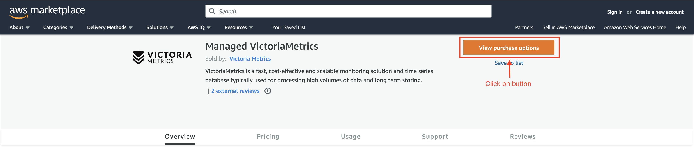

Then, go to the
<a href="https://aws.amazon.com/marketplace/pp/prodview-4tbfq5icmbmyc">VictoriaMetrics product page</a>
and click `Continue to Subscribe` button:

  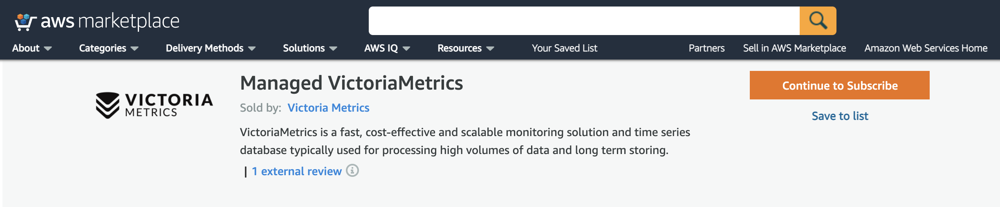

Then on product page press the `Subscribe` button:

  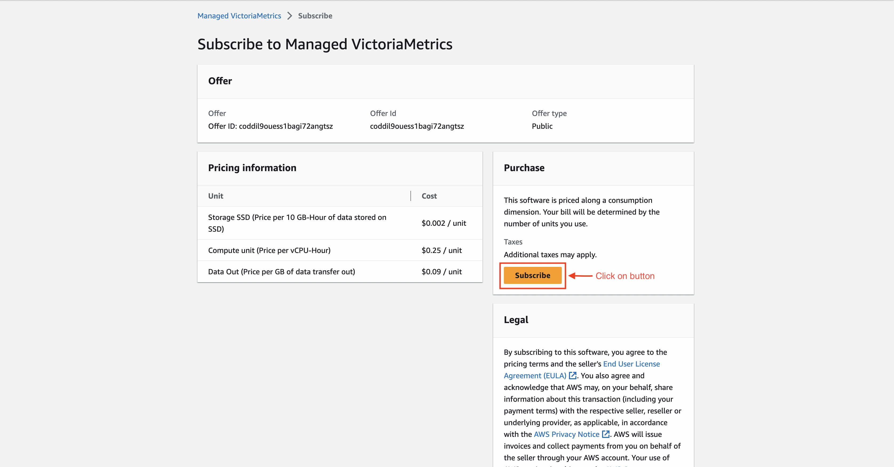

After that action you will be able to see success message where you should click `Set up your account` button:

  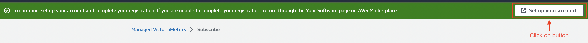

You'll be taken to <a href="https://dbaas.victoriametrics.com//signUp">Managed VictoriaMetrics sign up page</a>:

  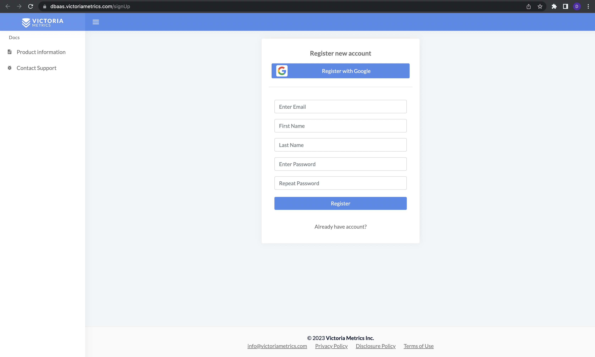

Choose to register manually or via Google Auth.

If it was chosen manually registration, confirmation email wil be sent to your email address.

  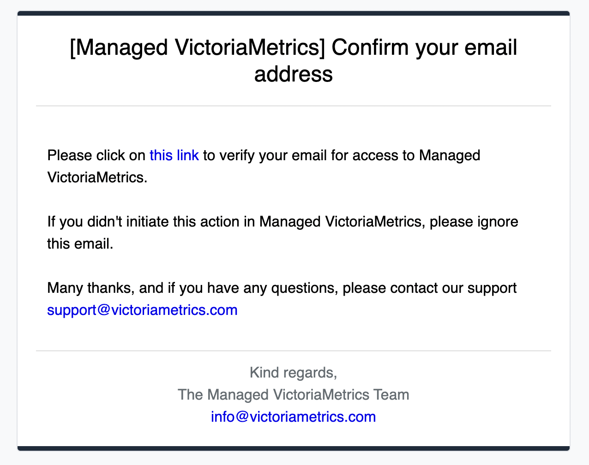

After Google Auth process will redirect automatically to the main page.

## How to restore password

If you forgot password, it can be restored in the following way:

1. Click `Forgot your password?` link at [this page](https://dbaas.victoriametrics.com/signIn):

   

     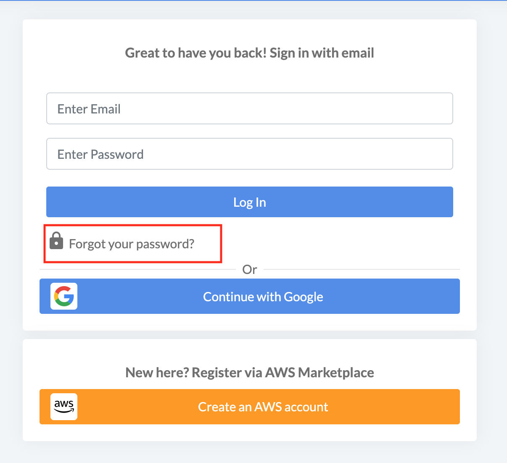
   

1. Enter your email in the field and click `Send Email` button:

   

     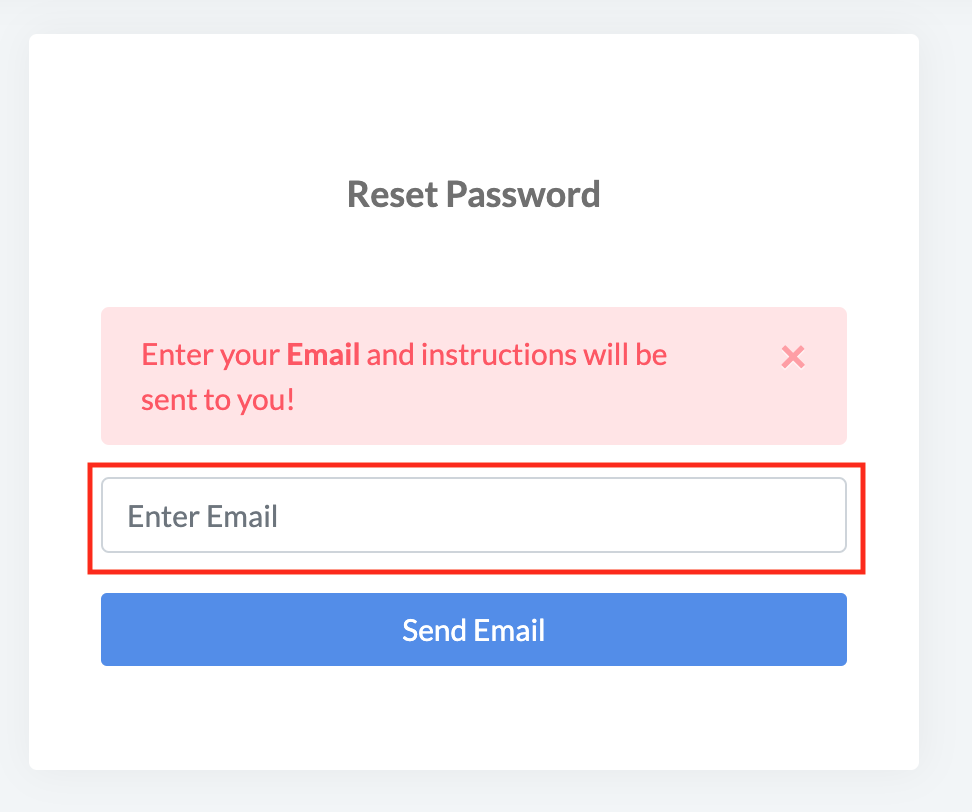
   

1. Follow the instruction sent to your email in order to gain access to your VictoriaMetrics cloud account:

   

     
   

1. Navigate to the Profile page by clicking the corresponding link at the top right corner:

   

     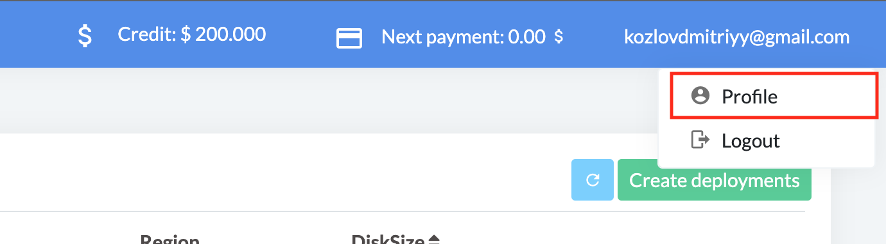
   

1. Enter new password at the Profile page and press `Save` button:

   

     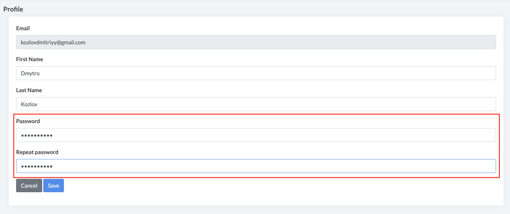
   

## Creating deployment

Deployments is a page where user can list and manage VictoriaMetrics deployments. 
To create a deployment click on the button `Create Deployment` button or link in the message:

  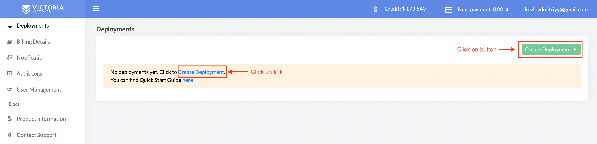

In the opened form, choose parameters of the new deployment such as:

* `Deployment type` from preset single or cluster deployments;
* `Region` where deployment should run;
* Desired `storage capacity` for storing metrics (you always can expand disk size later);
* `Retention` period for stored metrics.
* `Size` of your deployment

  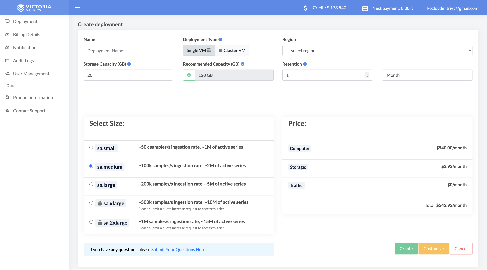

When all parameters are entered, click on the `Create` button, and deployment will be created

Once created, deployment will remain for a short period of time in `PROVISIONING` status 
while the hardware spins-up, just wait for a couple of minutes and reload the page. 
You'll also be notified via email once provisioning is finished:

  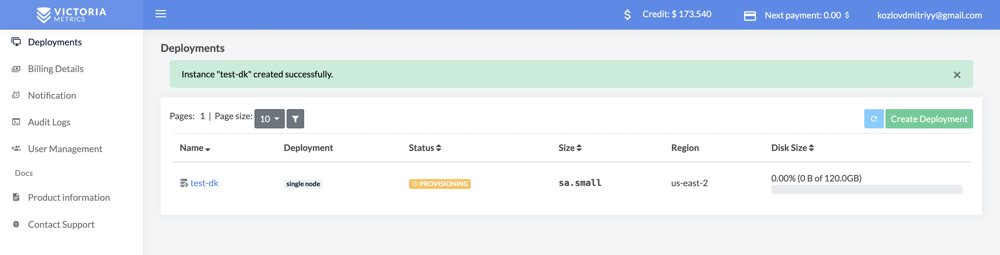

  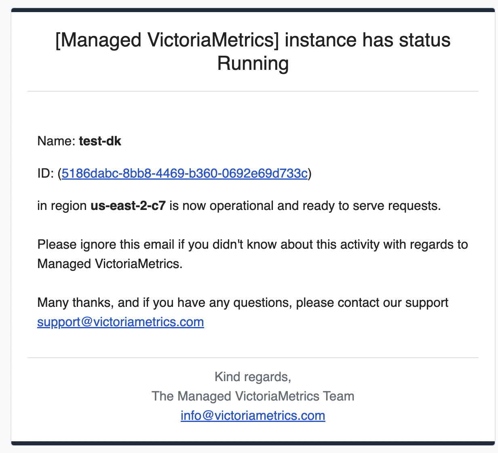

## Deployment access

After transition from `PROVISIONING` to `RUNNING` state, VictoriaMetrics is fully operational 
and ready to accept write or read requests. But first, click on deployment name to get the access token:

  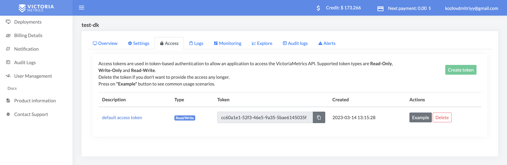

Access tokens are used in token-based authentication to allow an application to access the VictoriaMetrics API. 
Supported token types are `Read-Only`, `Write-Only` and `Read-Write`. Click on token created by default 
to see usage examples:

  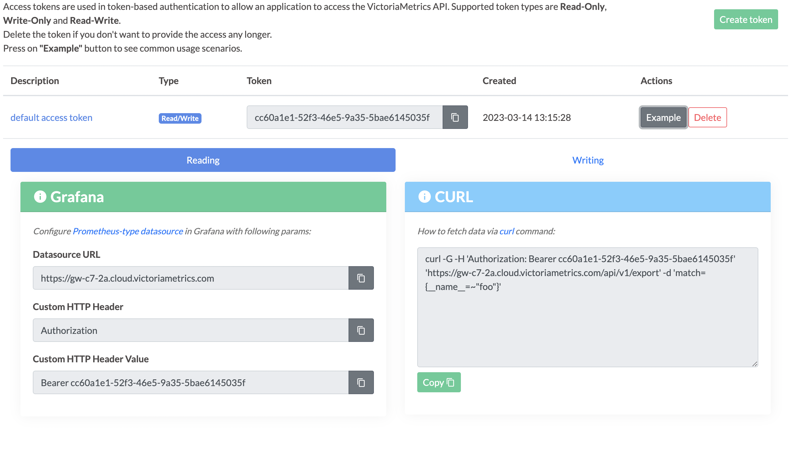

  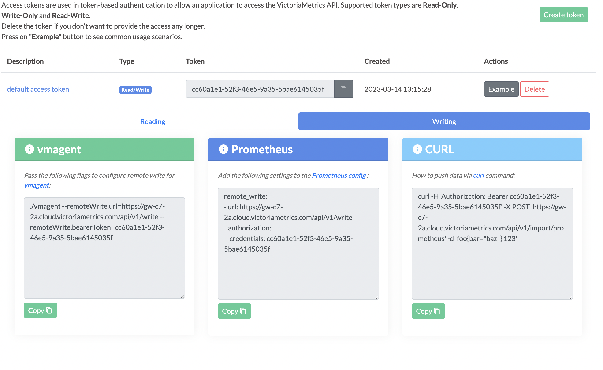

Follow usage example in order to configure access to VictoriaMetrics for your Prometheus, 
Grafana or any other software.

## Modifying deployment

Remember, you always can add, remove or modify existing deployment by changing their size or any parameters on the 
update form.

  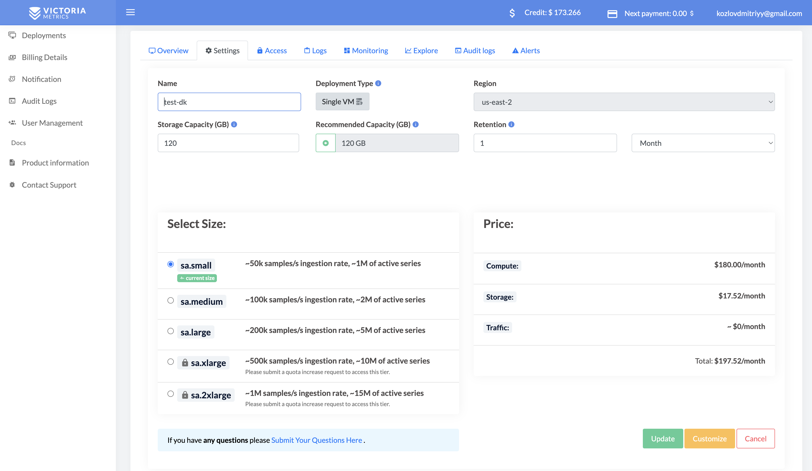

There is another options present to customise you deployment setup. 
To discover them click on `Customise` button

  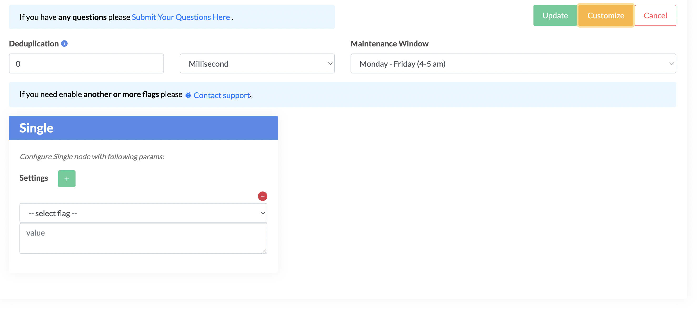

In that section additional params can be set:

* `Deduplication` defines interval when deployment leaves a single raw sample with the biggest timestamp per each discrete interval;
* `Maintenance Window` when deployment should start upgrade process if needed;
* `Settings` allow to define different flags for the deployment.

However, such an update requires a deployment restart and may result into a couple of minutes of downtime.
