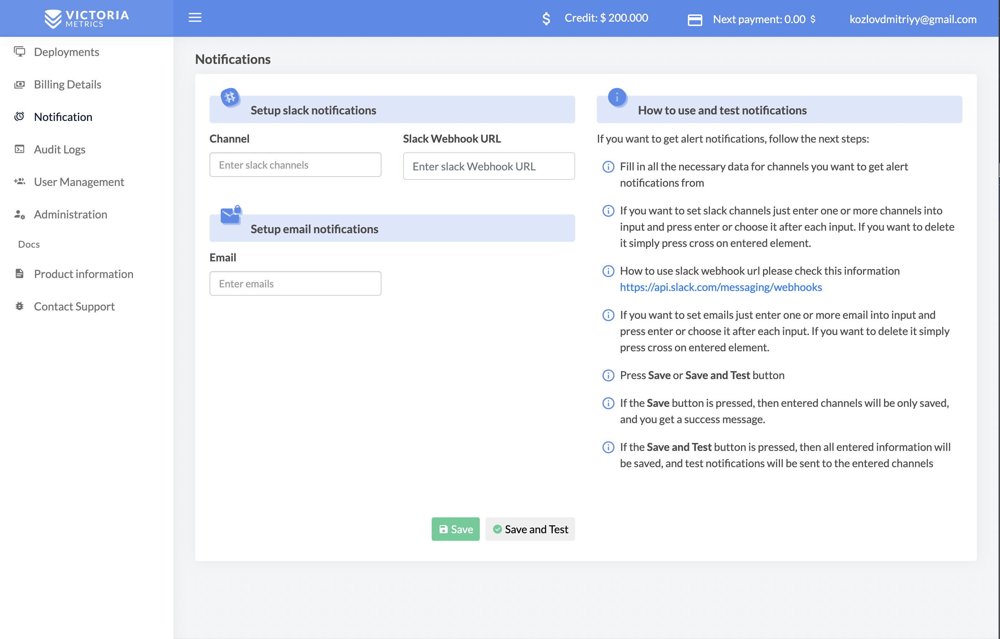
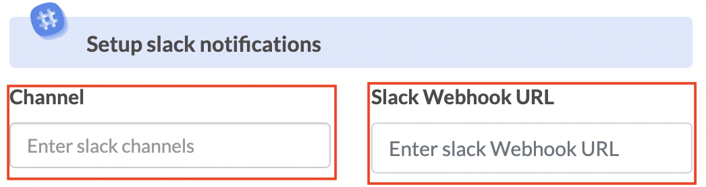
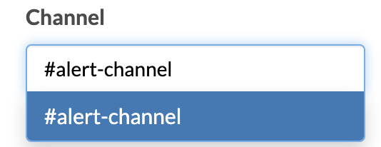
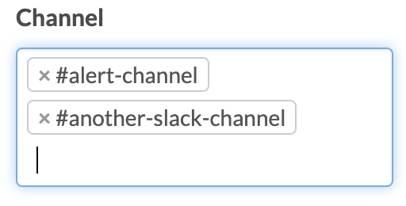
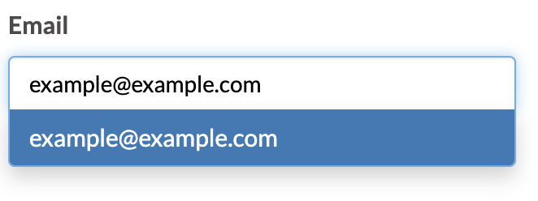
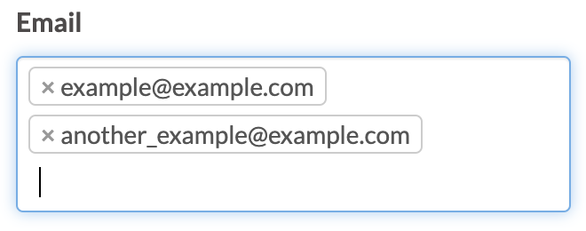
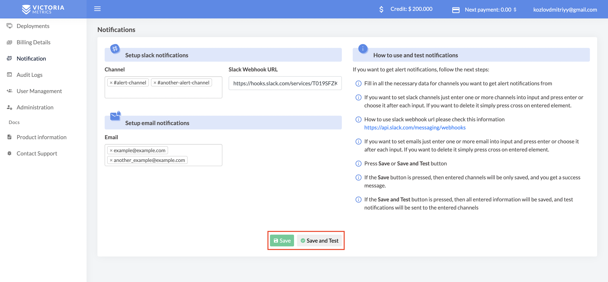
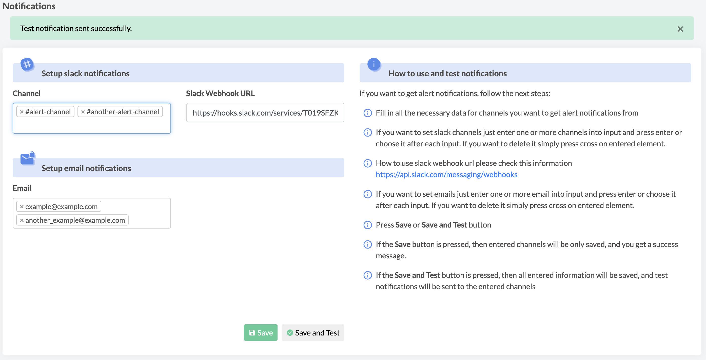
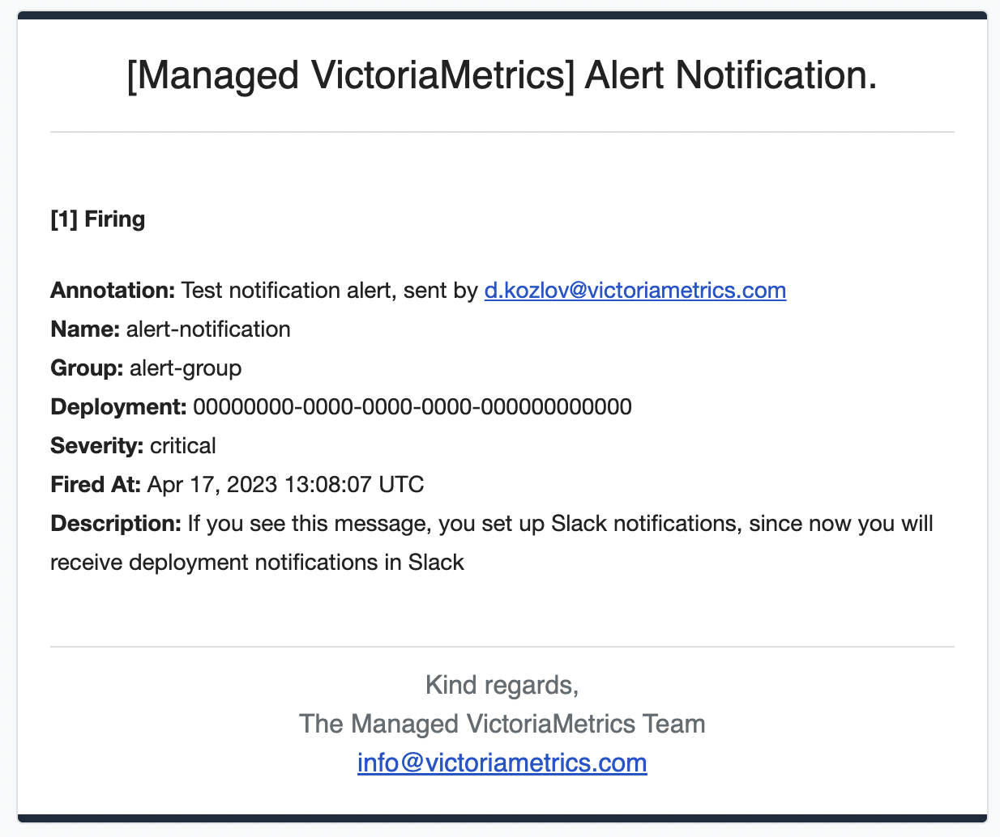

# Notifications in Managed VictoriaMetrics

The guide covers how to enable email and Slack notifications.

Table of content:
1. [Setup Slack notifications](#setup-slack-notifications)
1. [Setup emails notifications](#setup-emails-notifications)
1. [Send test notification](#send-test-notification)

When you enter the notification section, you will be able to fill in the channels in which you
want to receive notifications

  

## Setup Slack notifications

1. Setup Slack webhook
   How to do this is indicated on the following link https://api.slack.com/messaging/webhooks

   

     
   

1. Specify Slack channels

   Enter one or more channels into input and press enter or choose it after each input.

   

     
   

   

     
   

## Setup emails notifications

You can specify one or multiple emails for notifications in the input field. By default, 
email notifications are enabled for the account owner

  

  

## Send test notification

To test your notification settings, press Save and Test.

If only Slack channels and webhook are specified correctly, you will receive the notification in the Slack channels.
If only the emails are specified, you will receive notifications to those emails.
When both notifications are specified, all notifications will be sent to Slack channels and emails.

  

If the Save button is pressed, then entered channels will be only saved, and you get a success message.

  

If the Save and Test button is pressed, then all entered information will be saved, 
and test notifications will be sent to the entered channels

  

Examples of the test notification messages:

  

  

