# Notifications in Managed VictoriaMetrics

This section add ability to setup channels for sending alerting notifications.

The document covers the following topics
1. [Setup slack channels](#setup-slack-channels)
2. [Setup emails](#setup-emails)
3. [Send test notification](#send-test-notification)

When you entered to the notification section you will be able to fill in the channels in which you 
want to receive notifications

  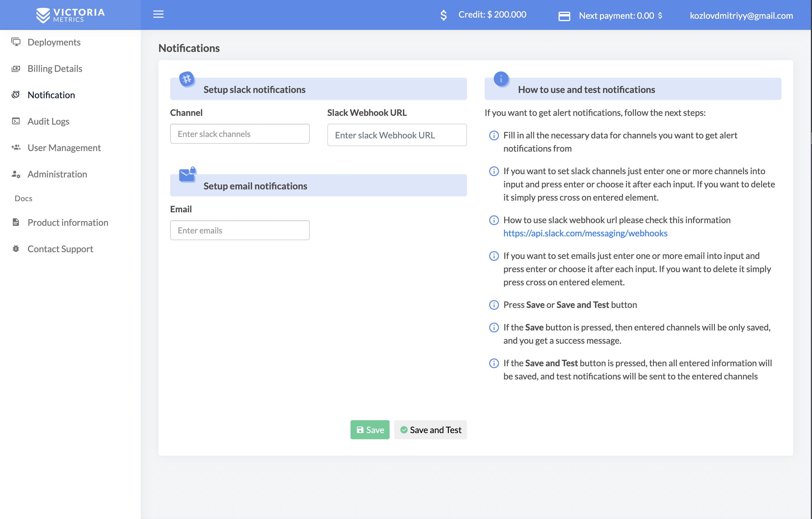

## Setup slack channels

To send alerts to Slack, it is required to set up a webhook. How to do this is indicated on the following 
link <a href="https://api.slack.com/messaging/webhooks" target="_blank">https://api.slack.com/messaging/webhooks</a>

When webhook enabled correctly the next step is fill channels and webhook fields in the managed-victoriametrics.

  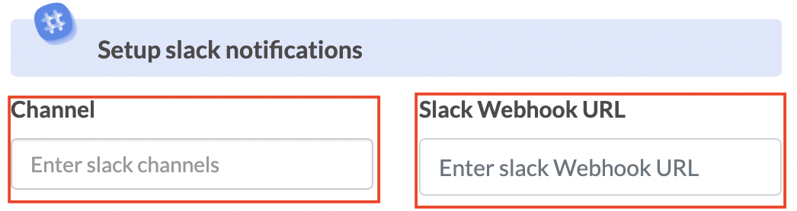

If you want to set slack channels just enter one or more channels into input and press enter or choose it after each input.

  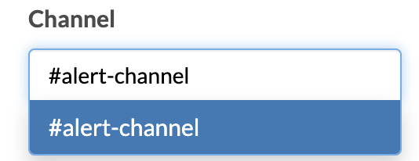

  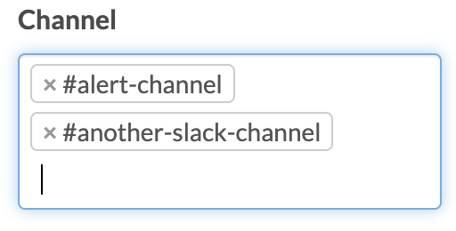

If you want to delete it simply press cross on entered element.

  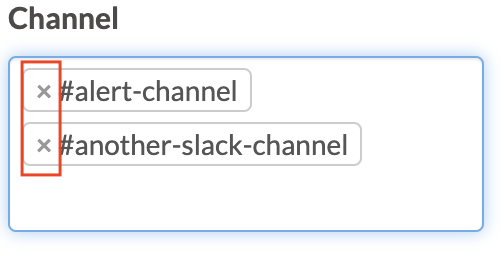

## Setup emails

If you want to set emails just enter one or more email into input and press enter or choose it after each input. 
By default, account holder will be present in the email field. 

  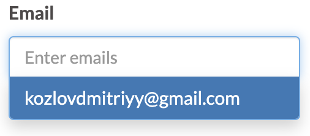

  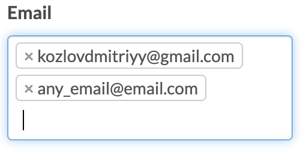

If you want to delete it simply press cross on entered element.

  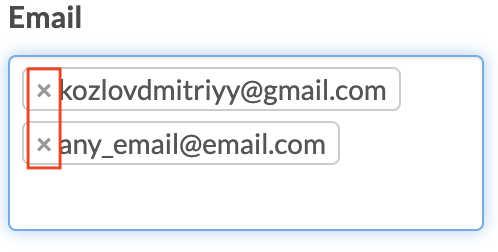

## Send test notification

When all fields are filled in correctly, all entered information should be saved.

Press Save or Save and Test button.

  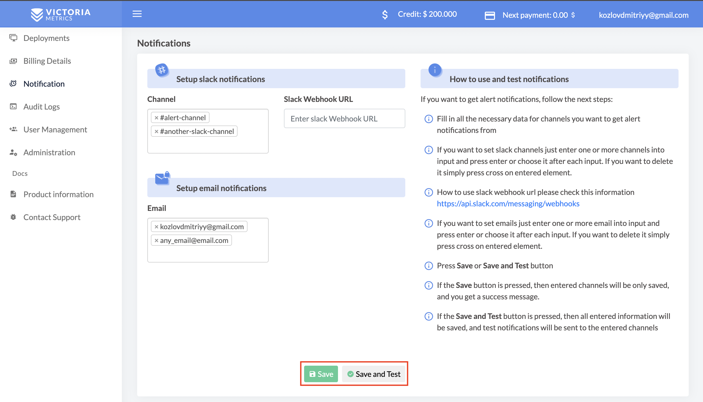

If the Save button is pressed, then entered channels will be only saved, and you get a success message.

  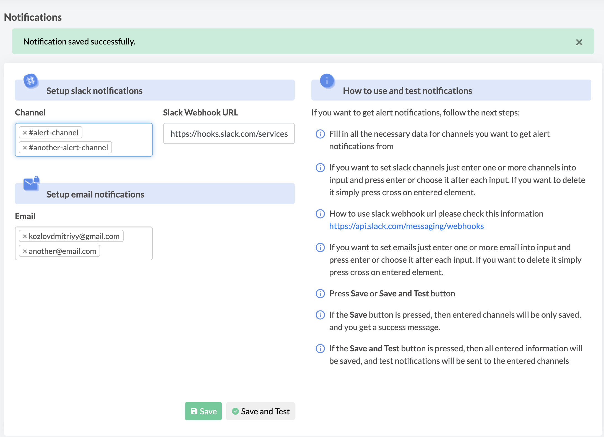

If the Save and Test button is pressed, then all entered information will be saved, 
and test notifications will be sent to the entered channels

  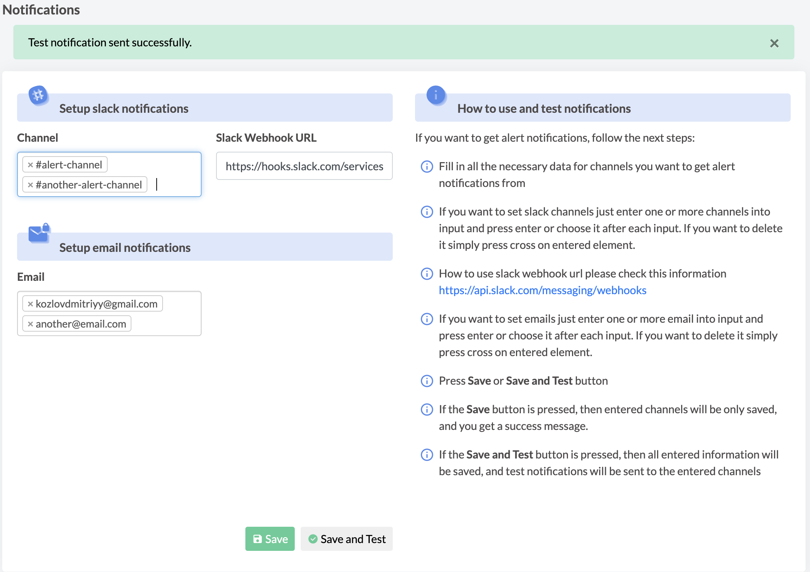

All test notifications will be sent to the defined channels.

  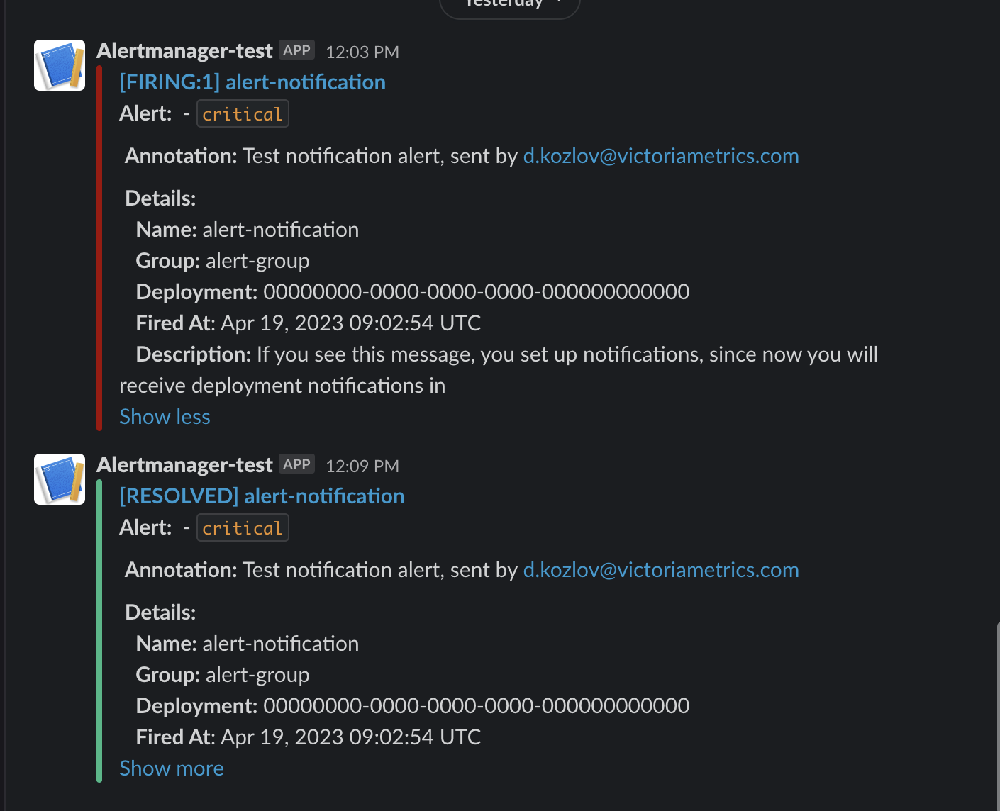

  

