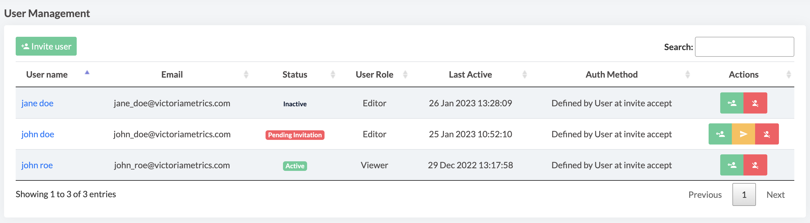
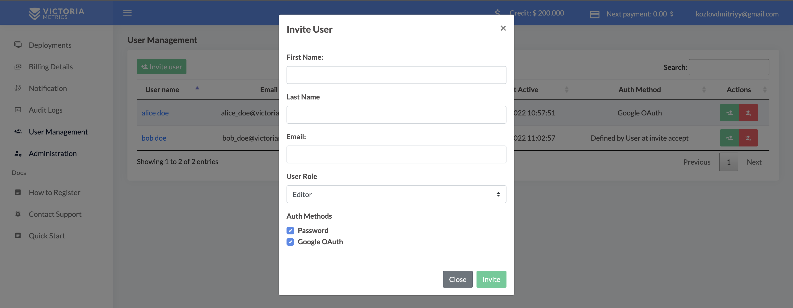
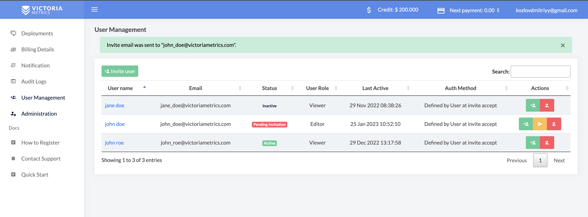
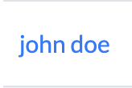
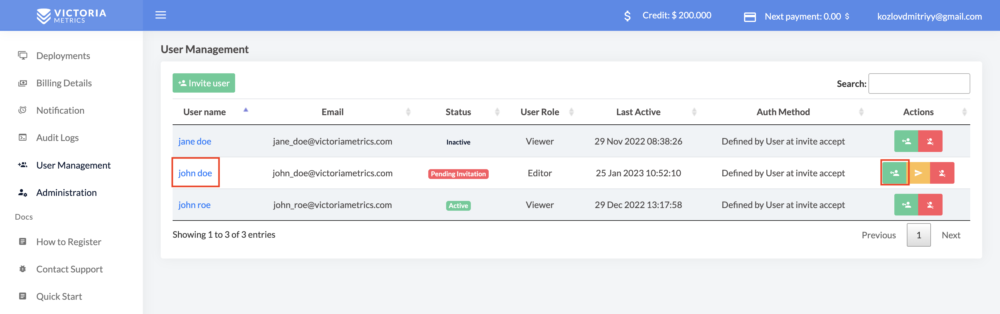
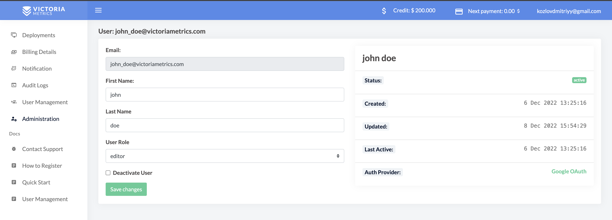
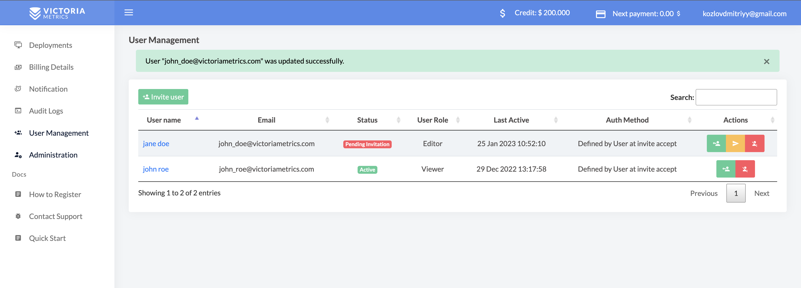
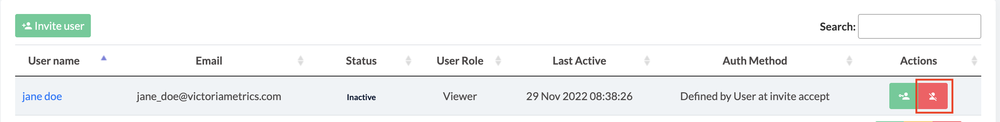
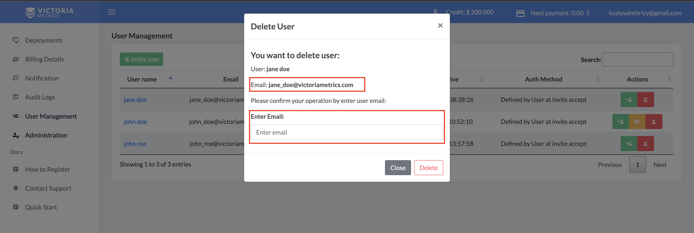

# User Management in Managed VictoriaMetrics 

The user management system enables admins to control user access and onboard and offboard users to the Managed VictoriaMetrics. It organizes users according to their needs and role.

The document covers the following topics
1. [User Roles](#user-roles)
1. [User List](#user-list)
1. [How to Add User](#how-to-add-user)
1. [How to Update User](#how-to-update-user)
1. [How to Delete User](#how-to-delete-user)

## User roles

Managed VictoriaMetrics provides different levels of user access. It defines what information users can access and edit in your account.

You assign the role to the user during the user creation procedure. You can change the role after the creation

### Roles definition

<table>
  <tr>
   <td><strong>User Role</strong></td>
   <td><strong>Categories</strong></td>
   <td><strong>Description</strong></td>
  </tr>
  <tr>
   <td rowspan="5" ><strong>Admin</strong></td>
   <td>Deployments</td>
   <td>
    Access to all deployments tabs and information
    
Create, update and delete deployment

   </td>
  </tr>
  <tr>
   <td>Billing Details</td>
   <td>Check billing information</td>
  </tr>
  <tr>
   <td>Notifications</td>
   <td>Create and update notifications</td>
  </tr>
  <tr>
   <td>Audit Logs</td>
   <td>Can check all information in audit logs</td>
  </tr>
  <tr>
   <td>User Management</td>
   <td>Add, edit and  delete users</td>
  </tr>
  <tr>
   <td rowspan="3"><strong>Editor</strong></td>
   <td>Deployments</td>
   <td>
    Access to all deployments tabs and information
    
Create, update and delete deployment

   </td>
  </tr>
  <tr>
   <td>Notifications</td>
   <td>Create and update notifications</td>
  </tr>
  <tr>
   <td>Audit Logs</td>
   <td>Can check all information in audit logs</td>
  </tr>
  <tr>
   <td><strong>Viewer</strong></td>
   <td>Deployments</td>
   <td>Access to Overview, Monitoring, Explore and Alerts deployments tabs and information</td>
  </tr>
</table>

### User statuses

<table>
  <tr>
   <td class="highlight"><strong class="sr">Active</strong></td>
   <td>The user can log in and use Managed VictoriaMetrics. The user role defines the access level.</td>
  </tr>
  <tr>
   <td class="highlight"><strong class="s1">Pending Invitation</strong></td>
   <td>An invitation was sent. The user must accept this.</td>
  </tr>
  <tr>
   <td class="highlight"><strong class="nn">Inactive</strong></td>
   <td>The user is registered in the Managed VictoriaMetrics but has no access to perform any actions. Admin can activate or completely delete the user.</td>
  </tr>
</table>

## User list

It shows all users with different roles, and you can apply provided actions with them.

  

In the table, there is additional information about the users:

<table>
  <tr>
   <td>User Name:</td>
   <td>First name and last name</td>
  </tr>
  <tr>
   <td>Email:</td>
   <td>Registration user email</td>
  </tr>
  <tr>
   <td>Status:</td>
   <td>Active, Inactive or Pending Invitation</td>
  </tr>
  <tr>
   <td>User Role:</td>
   <td>Admin, Editor or Viewer</td>
  </tr>
  <tr>
   <td>Last Active:</td>
   <td>Last login date and time</td>
  </tr>
  <tr>
   <td>Auth method:</td>
   <td>Auth options to login into the Managed VictoriaMetrics</td>
  </tr>
</table>

## How to Add User

Click on

    

the user invitation button and fill out the form in the modal, which will appear after you click. All fields are mandatory.

    

After filling out the form, click on the

    

button. The user will be saved, and an invitation email to the provided email address will be sent. As a confirmation, you will see the success message.

**The invitation link is only active for 24 hours.**

The user will be at Pending Invitation status. After accepting the invitation user status changes to Active.

    

## How to Update User

To edit the user role and details, activate or deactivate a user, and click on

    

or

    

to edit the user.

    

User editing form:

    

To save changes, click the

    

button. If changes are saved successfully, you will see a message at the top of the page.

    

## How to Delete User

You can delete a user from your account. However, you will need to invite them again if you want to give them access.

Click on

    

to delete the user.

    

To confirm the deletion of a user, you will need to re-enter their email address and press the **Delete** button

    

You will be redirected to the main page with a success or error message

    

