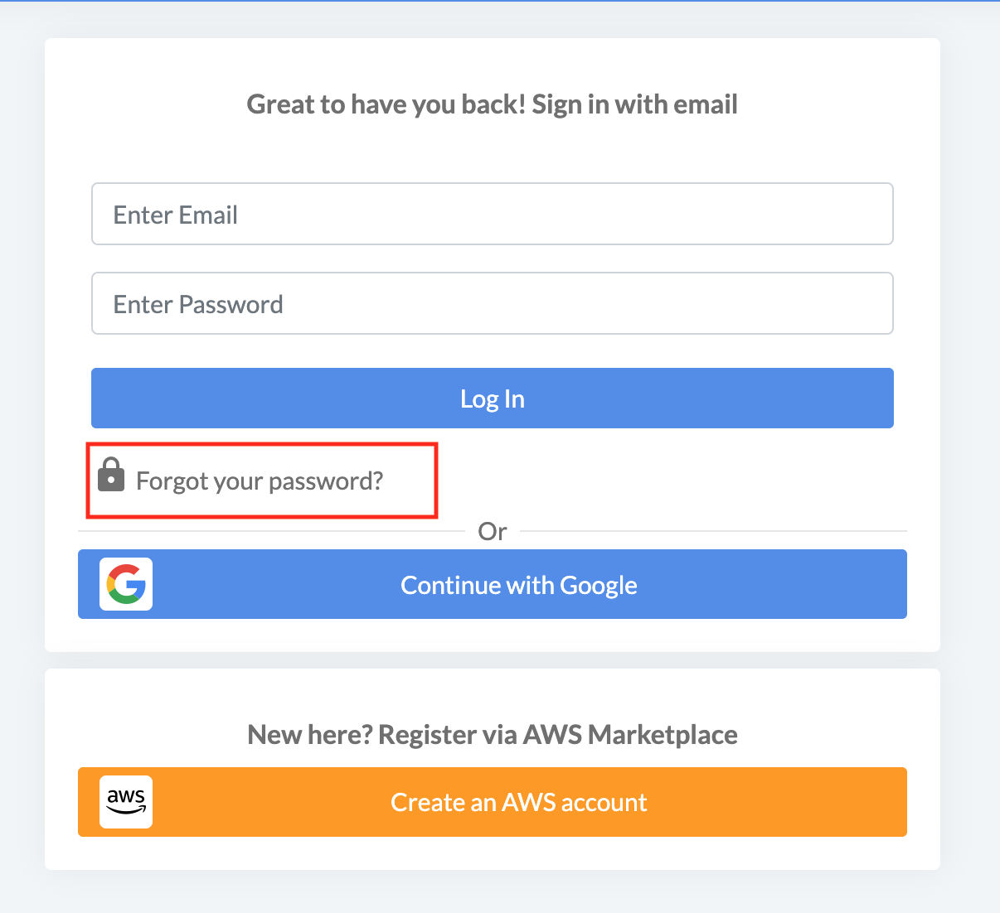
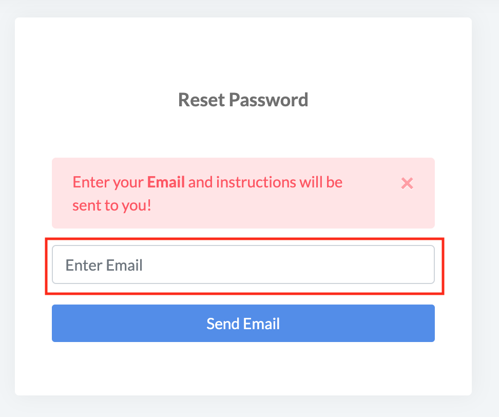
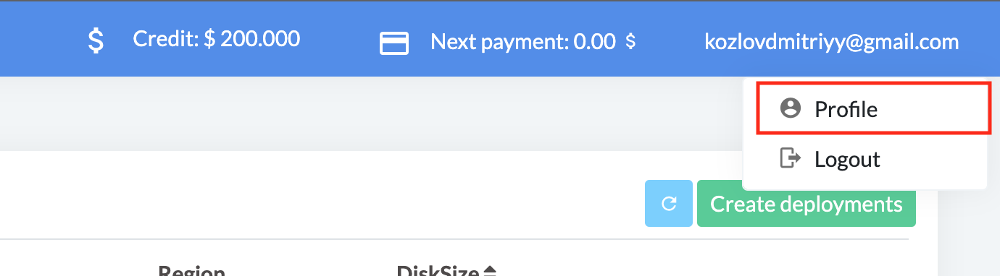
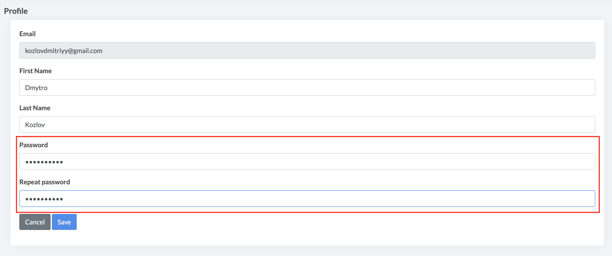
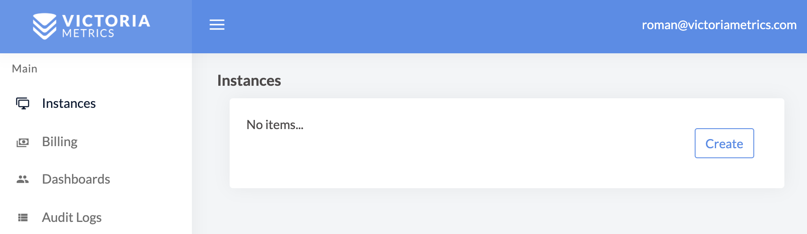
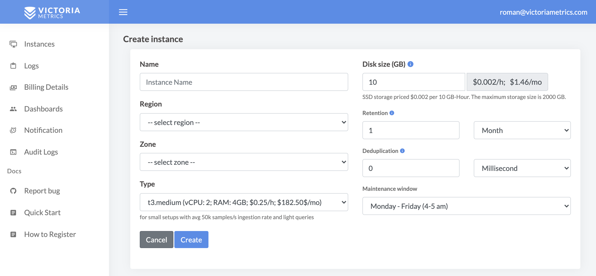
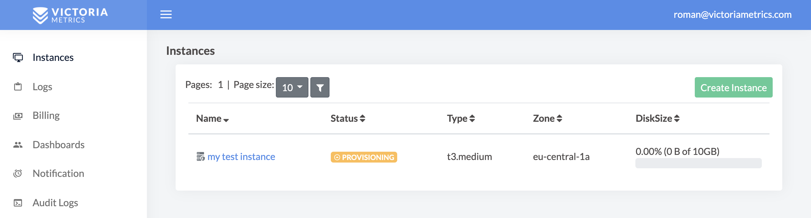
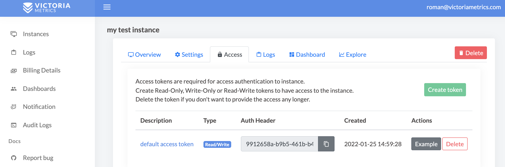

# Quick Start

Managed VictoriaMetrics - is a database-as-a-service platform, where users can run the VictoriaMetrics 
that they know and love on AWS without the need to perform typical DevOps tasks such as proper configuration, 
monitoring, logs collection, access protection, software updates, backups, etc.

## How to register

Managed VictoriaMetrics id distributed via [AWS Marketplace](https://aws.amazon.com/marketplace/pp/prodview-4tbfq5icmbmyc).
To start using the service, one should have already registered AWS account 
and visit [VictoriaMetrics product page](https://aws.amazon.com/marketplace/pp/prodview-4tbfq5icmbmyc).
See more details [here](https://dbaas.victoriametrics.com/howToRegister).

## How to restore password

If you forgot your password you can restore it the following steps:
1. Click on `Forgot your password?` link at https://dbaas.victoriametrics.com/signIn

<p>
  
</p>

2. Enter your email in the field and press button `Send Email`

<p>
  
</p>

Follow the instruction sent to the specified email address:
```
Victoria Metrics Cloud password restore
Follow https://dbaas.victoriametrics.com/login_by_link/{id} the link in order to restore access to Victoria Metrics Cloud.
Access link expires once you login successfully or after 30min.
You can change your password after login https://dbaas.victoriametrics.com/profile profile
Please, ignore this email if you didn't init this action on Victoria Metrics Cloud.<br>

In case of questions contact our support support@victoriametrics.com
```

3. To change you password visit Profile page in the top right corner of the web page

<p>
  
</p>

4. At the Profile page, enter new password and repeat it in the next field and press `Save` button.

<p>
  
</p>


## Creating instance

Instances is a page where user can list and manage VictoriaMetrics single-node instances. 
To create an instance click on the button `Create`:

<p>
  
</p>

In the opened form, choose parameters of the new instance such as:

* `Instance type` from preset of AWS instances (you always can change the type later);
* `Region` and `Zone` where instance should run;
* Desired `disk size` for storing metrics (you always can expand disk size later);
* `Retention` period for stored metrics.

<p>
  
</p>

Once created, instance will remain for a short period of time in `PROVISIONING` status 
while the hardware spins-up, just wait for a couple of minutes and reload the page. 
You'll also be notified via email once provisioning is finished:

<p>
  
</p>

## Access

After transition from `PROVISIONING` to `RUNNING` state, VictoriaMetrics is fully operational 
and ready to accept write or read requests. But first, click on instance name to get the access token:

<p>
  
</p>

Access tokens are used in token-based authentication to allow an application to access the VictoriaMetrics API. 
Supported token types are `Read-Only`, `Write-Only` and `Read-Write`. Click on token created by default 
to see usage examples:

<p>
  
</p>

Follow usage example in order to configure access to VictoriaMetrics for your Prometheus, 
Grafana or any other software.

## Modifying

Remember, you always can add, remove or modify existing instances by changing their type or increasing the disk space. 
However, such an update requires an instance restart and may result into a couple of minutes of downtime.
