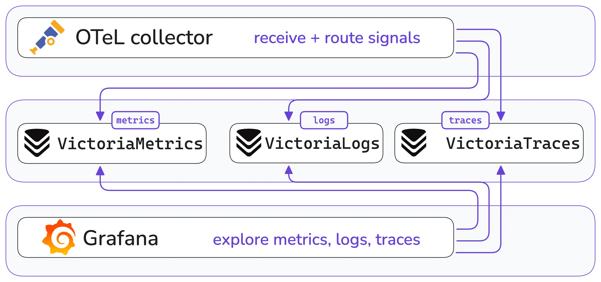

VictoriaMetrics software provides native [OpenTelemetry](https://opentelemetry.io/) ingestion across **metrics**, **logs**, and **traces** via dedicated components.
This allows running OpenTelemetry-based observability pipeline with VictoriaMetrics software as your backend.

VictoriaMetrics provides a dedicated database for each [signal type](https://opentelemetry.io/docs/concepts/signals/):

- [VictoriaMetrics](https://docs.victoriametrics.com/victoriametrics/) for [Metrics](https://opentelemetry.io/docs/concepts/signals/metrics/);
- [VictoriaLogs](https://docs.victoriametrics.com/victorialogs/) for [Logs](https://opentelemetry.io/docs/concepts/signals/logs/);
- [VictoriaTraces](https://docs.victoriametrics.com/victoriatraces/) for [Traces](https://opentelemetry.io/docs/concepts/signals/traces/).

{width="700"}

Each database is optimized for its own signal and usage scenario to improve maintainability and efficiency.

Resources:
* [OpenTelemetry Astronomy Shop demo](https://github.com/VictoriaMetrics-Community/opentelemetry-demo) with integrated VictoriaMetrics backends.
* Live [Grafana Playground](https://play-grafana.victoriametrics.com/) with OTeL demo and VictoriaMetrics components.
* [Full-Stack Observability with VictoriaMetrics in the OTel Demo](https://victoriametrics.com/blog/victoriametrics-full-stack-observability-otel-demo/) blogpost.

---

## Metrics (VictoriaMetrics)

VictoriaMetrics single-node, vmagent and vminsert components support ingestion of metrics via OpenTelemetry Protocol (OTLP) 
from [OpenTelemetry Collector](https://opentelemetry.io/docs/collector/) and applications instrumented with [OpenTelemetry SDKs](https://opentelemetry.io/docs/languages/). 

See the detailed description about protocol support [here](https://docs.victoriametrics.com/victoriametrics/#sending-data-via-opentelemetry).

> See a practical guide [How to use OpenTelemetry metrics with VictoriaMetrics](https://docs.victoriametrics.com/guides/getting-started-with-opentelemetry/).

Once metrics are ingested into VictoriaMetrics, they can be read via the following tools:
1. [vmui](https://docs.victoriametrics.com/victoriametrics/#vmui) - VictoriaMetrics User Interface for ad-hoc queries
  and data exploration.
1. [Grafana](https://docs.victoriametrics.com/victoriametrics/integrations/grafana/) - integrates with VictoriaMetrics
  using [Prometheus datasource](https://grafana.com/docs/grafana/latest/datasources/prometheus/)
  or [VictoriaMetrics datasource](https://grafana.com/grafana/plugins/victoriametrics-metrics-datasource/) plugins.
1. [Perses](https://docs.victoriametrics.com/victoriametrics/integrations/perses/) - integrates with VictoriaMetrics
  via [Prometheus plugins](https://perses.dev/plugins/docs/prometheus/).
1. [vmalert](https://docs.victoriametrics.com/victoriametrics/vmalert/) - is an alerting tool for VictoriaMetrics. 
  It executes a list of the given alerting or recording rules and sends notifications to Alertmanager.

   
## Logs (VictoriaLogs)

VictoriaLogs single-node, vlagent and vlinsert components support ingestion of metrics via OpenTelemetry Protocol (OTLP) from [OpenTelemetry Collector](https://opentelemetry.io/docs/collector/)
and applications instrumented with [OpenTelemetry SDKs](https://opentelemetry.io/docs/languages/). 

See the detailed description about protocol support [here](https://docs.victoriametrics.com/victorialogs/data-ingestion/opentelemetry/).

> See a practical guide
[How to use OpenTelemetry metrics with VictoriaLogs](https://docs.victoriametrics.com/guides/getting-started-with-opentelemetry/).

Once logs are ingested into Victorialogs, they can be read via the following tools:
1. [vmui](https://docs.victoriametrics.com/victorialogs/querying/#web-ui) - VictoriaLogs User Interface for ad-hoc queries
   and data exploration.
1. [Grafana](https://docs.victoriametrics.com/victorialogs/integrations/grafana/) - integrates with VictoriaLogs
   using [VictoriaLogs datasource](https://grafana.com/grafana/plugins/victoriametrics-logs-datasource/) plugin.
1. [Perses](https://docs.victoriametrics.com/victorialogs/integrations/perses/) - integrates with VictoriaLogs
   via [VictoriaLogs plugins](https://perses.dev/plugins/docs/victorialogs/).
1. [vmalert](https://docs.victoriametrics.com/victorialogs/vmalert/) - is an alerting tool for VictoriaLogs.
   It executes a list of the given alerting and sends notifications to Alertmanager. It can convert LogsQL queries
   into metrics via recording rules and persist them into VictoriaMetrics.

## Traces (VictoriaTraces)

VictoriaTraces single-node and vtinsert components support ingestion of traces via OpenTelemetry Protocol (OTLP) from [OpenTelemetry Collector](https://opentelemetry.io/docs/collector/)
and applications instrumented with [OpenTelemetry SDKs](https://opentelemetry.io/docs/languages/).

See the detailed description about protocol support [here](https://docs.victoriametrics.com/victoriatraces/data-ingestion/opentelemetry/).

Once traces are ingested into VictoriaTraces, they can be read via the following tools:
1. [Grafana](https://docs.victoriametrics.com/victorialogs/integrations/grafana/) - integrates with VictoriaTraces
   using [Jaeger datasource](https://grafana.com/docs/grafana/latest/datasources/jaeger/) plugin.
1. [Jaeger frontend](https://www.jaegertracing.io/docs/2.6/deployment/frontend-ui/) - integrates with VictoriaTraces
   via [Jaeger Query Service JSON APIs](https://www.jaegertracing.io/docs/2.6/apis/#internal-http-json).
1. [vmalert](https://docs.victoriametrics.com/victoriatraces/vmalert/) - is an alerting tool for VictoriaTraces.
   It executes a list of the given alerting and sends notifications to Alertmanager. It can convert LogsQL queries
   into metrics via recording rules and persist them into VictoriaMetrics.

## Correlations

Signals can be correlated together if they share the same list of attributes, so they can uniquely identify the
same system or event. The recommended user interface for correlations is Grafana thanks to its [correlation interfaces](https://grafana.com/docs/grafana/latest/administration/correlations/).
See below various scenarios of correlating signals in Grafana using VictoriaMetrics, VictoriaLogs and VictoriaTraces as backends.

Depending on the Grafana datasource plugin there could be multiple correlations avaiable:
1. Trace to logs, log to trace, log to metrics - see [correlations via VictoriaLogs plugin](https://docs.victoriametrics.com/victorialogs/integrations/grafana/#correlations).
1. Trace to metrics, metric to logs, metric to traces - see [correlations via VictoriaMetrics plugin](https://docs.victoriametrics.com/victoriametrics/integrations/grafana/datasource/#correlations).
1. Metrics to logs or traces correlations are possible via Prometheus datasource as well.
1. Plugins Tempo, Jaeger, and Zipkin can correlate with logs or metrics using [Trace to logs](https://grafana.com/docs/grafana/latest/explore/trace-integration/#trace-to-logs)
  and [Trace to metrics](https://grafana.com/docs/grafana/latest/visualizations/explore/trace-integration/#trace-to-metrics) feature.