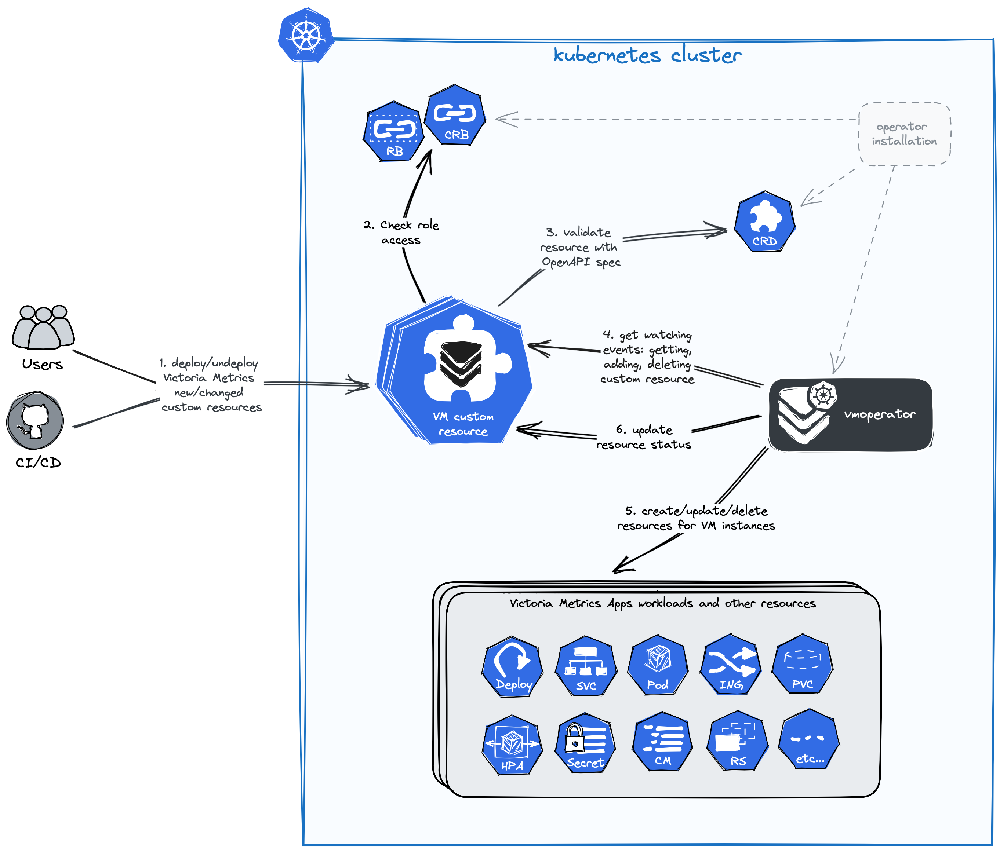

# VictoriaMetrics Operator

Operator serves to make running VictoriaMetrics applications on top of Kubernetes as easy as possible while preserving Kubernetes-native configuration options.

VictoriaMetrics Operator (`vmoperator`) is the classic kubernetes-operator for VictoriaMetrics with many [great features](#features).
It allows you to manage Victoria Metrics components in Kubernetes or OpenShift clusters
in a declarative style according to [GitOps](https://www.redhat.com/en/topics/devops/what-is-gitops)
and [IaC](https://en.wikipedia.org/wiki/Infrastructure_as_code) concepts.

VictoriaMetrics also provides [helm charts](https://github.com/VictoriaMetrics/helm-charts) without operator.
Operator makes the same, simplifies it and provides [advanced features](#features).

Learn more about [key concepts](#key-concepts) of `vmoperator` and follow the **[quick start guide](./quick-start.md)** for a better experience.

## Features of vmoperator

- Deployment and management in a kubernetes clusters of any number of VictoriaMetrics applications (like vmsingle/vmcluster instances and another components like vmauth, vmagent, vmalert, etc...)
- Seamless [migration from prometheus-operator](./migration.md) with auto-conversion of prometheus [custom resources](#custom-resources)
- Simple VictoriaMetrics cluster installation, configuring, upgrading and managing with [crd-objects](./resources/README.md).
- Ability to delegate the configuration (parts of configuration) of applications monitoring to the end-users and managing access to different configurations or configuration sections.
- Integration with VictoriaMetrics [vmbackupmanager](https://docs.victoriametrics.com/vmbackupmanager.html) - advanced tools for making backups. Check [Backup automation for VMSingle](./resources/vmsingle.md#backup-automation) or [Backup automation for VMCluster](./resources/vmcluster.md#backup-automation).
- Everything you need for monitoring out of the box in [k8s-stack helm chart](https://victoriametrics.github.io/helm-charts/charts/victoria-metrics-k8s-stack/) with ready-made usecases and solutions.
- Ability to template your own deployment scenarios.

## Key Concepts

### Kubernetes-operators

[Kubernetes-operators](https://kubernetes.io/docs/concepts/extend-kubernetes/operator/) are software extensions
for Kubernetes that make use of [custom resources](#custom-resources) to manage applications and their components.
Operators follow Kubernetes principles, notably the control loop.
It can be said that operators are custom controllers for Kubernetes that allow you to create business logic for custom resources.

Design and implementation of `vmoperator` inspired by [prometheus-operator](https://github.com/prometheus-operator/prometheus-operator).

Useful links:
- [Custom resources](https://kubernetes.io/docs/concepts/extend-kubernetes/api-extension/custom-resources/)
- [Custom resource definitions](https://kubernetes.io/docs/tasks/extend-kubernetes/custom-resources/custom-resource-definitions/)
- [Operator pattern](https://kubernetes.io/docs/concepts/extend-kubernetes/operator/)
- [Operator best practices](https://sdk.operatorframework.io/docs/best-practices/)

### Custom resources

Kubernetes-Operators use [custom resources](https://kubernetes.io/docs/concepts/extend-kubernetes/api-extension/custom-resources/)
for interaction. Custom resources are a mechanism built into Kubernetes that allows you to create your own extensions for Kubernetes,
working on the same principles as those built into Kubernetes APIs. Custom resources make Kubernetes so modular and extensible.

In addition, thanks to CRD ([Custom Resource Definitions](https://kubernetes.io/docs/tasks/extend-kubernetes/custom-resources/custom-resource-definitions/)),
the mechanism of custom resources allows you to declare an API in the format of the OpenAPI specification and verify that the resources correspond to this API.

### Reconciliation cycle

The main task of the operator is to bring the state of the cluster in line with what is declared by the user in the custom resources.
This process of constant monitoring and adjustment is called the "Reconciliation cycle" - it is the operator's workflow.

The basic workflow of working with the operator can be simplified as the following diagram:

- Operator declares and owns [resources of Victoria Metrics](./resources/README.md).
- Kubernetes validates of the resource according to the specification from CRD (see more in [custom resources](#custom-resources)).
- Operator subscribed to change events (`create`, `update`, `delete`) for related resources.
- When an event occurs, the operator reacts and updates the state of the objects in the cluster.
- For some objects in the cluster the reconciliation cycle is performed at a given interval, even without the occurrence of change events (see `VM_FORCERESYNCINTERVAL`).

### Next steps

- [Quick Start Guide](./quick-start.md)
- [Setup](./setup.md)
- [Security](./security.md)
- [Configuration](./configuration.md)
- [Migration from Prometheus](./migration.md)
- [Monitoring](./monitoring.md)
- [Authorization and exposing components](./auth.md)
- [High Availability](./high-availability.md)
- [Enterprise](./enterprise.md)
- [Custom resources](./resources/README.md)

If you have any questions, check out our [FAQ](./FAQ.md) 
and feel free to can ask them:
- [VictoriaMetrics Slack](https://victoriametrics.slack.com/)
- [VictoriaMetrics Telegram](https://t.me/VictoriaMetrics_en)

If you have any suggestions or find a bug, please create an issue
on [GitHub](https://github.com/VictoriaMetrics/operator/issues/new).
