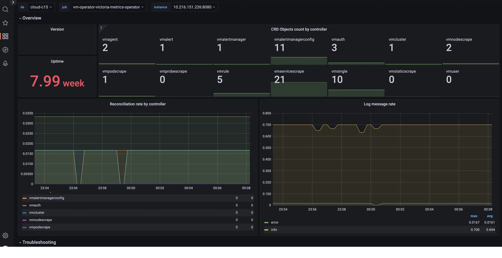

VictoriaMetrics operator exports internal metrics in Prometheus exposition format at `/metrics` page.

These metrics can be scraped via [vmagent](https://docs.victoriametrics.com/operator/resources/vmagent) or Prometheus.

## Dashboard

Official Grafana dashboard available for [vmoperator](https://grafana.com/grafana/dashboards/17869-victoriametrics-operator/).



Graphs on the dashboards contain useful hints - hover the `i` icon in the top left corner of each graph to read it.

## Alerting rules

Alerting rules for VictoriaMetrics operator are available [here](https://github.com/VictoriaMetrics/operator/blob/master/config/alerting/vmoperator-rules.yaml).

## Configuration

### Helm-chart victoria-metrics-k8s-stack

In [victoria-metrics-k8s-stack](https://docs.victoriametrics.com/helm/victoriametrics-k8s-stack/) helm-chart operator self-scrapes metrics by default.

This helm-chart also includes [official grafana dashboard for operator](#dashboard) and [official alerting rules for operator](#alerting-rules).

### Helm-chart victoria-metrics-operator

With [victoria-metrics-operator](https://docs.victoriametrics.com/helm/victoriametrics-operator) you can use following parameter in `values.yaml`:

```yaml
# values.yaml
#...
# -- configures monitoring with serviceScrape. VMServiceScrape must be pre-installed
serviceMonitor:
  enabled: true
```

This parameter makes helm-chart to create a scrape-object for installed operator instance.

You will also need to deploy a (vmsingle)[https://docs.victoriametrics.com/operator/resources/vmsingle] where the metrics will be collected.

### Pure operator installation

With pure operator installation you can use config with separate vmsingle and scrape object for operator like that:

```yaml
apiVersion: operator.victoriametrics.com/v1beta1
kind: VMServiceScrape
metadata:
  name: vmoperator
  namespace: monitoring
spec:
  selector:
    matchLabels:
      app.kubernetes.io/instance: vm-operator
      app.kubernetes.io/name: victoria-metrics-operator
  endpoints:
    - port: http
  namespaceSelector:
    matchNames:
      - monitoring
```

See more info about object [VMServiceScrape](https://docs.victoriametrics.com/operator/resources/vmservicescrape).

You will also need a [vmsingle](https://docs.victoriametrics.com/operator/resources/vmsingle) where the metrics will be collected.

