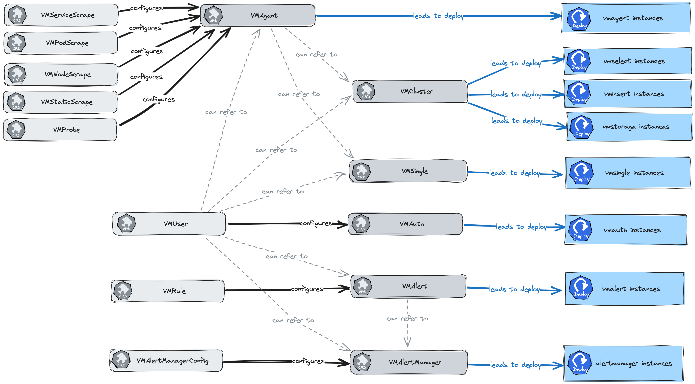

#  Custom resource kinds

This documentation section describes the design and interaction between the custom resource definitions (CRD) that the Victoria
Metrics Operator introduces.

[Operator](../README.md) introduces the following custom resources:

- [VMAgent](./vmagent.md)
- [VMAlert](./vmalert.md)
- [VMAlertManager](./vmalertmanager.md)
- [VMAlertManagerConfig](./vmalertmanagerconfig.md)
- [VMAuth](./vmauth.md)
- [VMCluster](./vmcluster.md)
- [VMNodeScrape](./vmnodescrape.md)
- [VMPodScrape](./vmpodscrape.md)
- [VMProbe](./vmprobe.md)
- [VMRule](./vmrule.md)
- [VMServiceScrape](./vmservicescrape.md)
- [VMStaticScrape](./vmstaticscrape.md)
- [VMSingle](./vmsingle.md)
- [VMUser](./vmuser.md)
- [VMScrapeConfig](./vmscrapeconfig.md)

Here is the scheme of relations between the custom resources:



## Specification

You can find the specification for the custom resources on **[API Docs](../api.md)**.

### Extra arguments

If you can't find necessary field in the specification of custom resource, 
you can use `extraArgs` field for passing additional arguments to the application.

Field `extraArgs` is supported for the following custom resources:

- [VMAgent spec](../api.md#vmagentspec)
- [VMAlert spec](../api.md#vmalertspec)
- [VMAlertManager spec](../api.md#vmalertmanagerspec)
- [VMAuth spec](../api.md#vmauthspec)
- [VMCluster/vmselect spec](../api.md#vmselect)
- [VMCluster/vminsert spec](../api.md#vminsert)
- [VMCluster/vmstorage spec](../api.md#vmstorage)
- [VMSingle spec](../api.md#vmsinglespec)

Supported flags for each application can be found the in the corresponding documentation:

- [VMAgent flags](https://docs.victoriametrics.com/vmagent.html#advanced-usage)
- [VMAlert](https://docs.victoriametrics.com/vmalert.html#configuration)
- [VMAuth](https://docs.victoriametrics.com/vmauth.html#advanced-usage)
- [VMCluster](https://docs.victoriametrics.com/Cluster-VictoriaMetrics.html#list-of-command-line-flags)
- [VMSingle](https://docs.victoriametrics.com/Single-server-VictoriaMetrics.html#list-of-command-line-flags)

Usage example:

```yaml
apiVersion: operator.victoriametrics.com/v1beta1
kind: VMSingle
metadata:
  name: vmsingle-example-exrtaargs
spec:
  retentionPeriod: "1"
  extraArgs:
    dedup.minScrapeInterval: 60s
  # ...
```

### Extra environment variables

Flag can be replaced with environment variable, it's useful for retrieving value from secret. 
You can use `extraEnvs` field for passing additional arguments to the application.

Usage example:

```yaml
kind: VMSingle
metadata:
  name: vmsingle-example--exrtaenvs
spec:
  retentionPeriod: "1"
  extraEnvs:
    - name: DEDUP_MINSCRAPEINTERVAL
      valueFrom:
        secretKeyRef:
          name: vm-secret
          key: dedup
```

This feature really useful for using with 
[`-envflag.enable` command-line argument](https://docs.victoriametrics.com/Single-server-VictoriaMetrics.html#environment-variables).

## Examples

Page for every custom resource contains examples section:

- [VMAgent examples](./vmagent.md#examples)
- [VMAlert examples](./vmalert.md#examples)
- [VMAlertmanager examples](./vmalertmanager.md#examples)
- [VMAlertmanagerConfig examples](./vmalertmanagerconfig.md#examples)
- [VMAuth examples](./vmauth.md#examples)
- [VMCluster examples](./vmcluster.md#examples)
- [VMNodeScrape examples](./vmnodescrape.md#examples)
- [VMPodScrape examples](./vmpodscrape.md#examples)
- [VMProbe examples](./vmprobe.md#examples)
- [VMRule examples](./vmrule.md#examples)
- [VMServiceScrape examples](./vmservicescrape.md#examples)
- [VMStaticScrape examples](./vmstaticscrape.md#examples)
- [VMSingle examples](./vmsingle.md#examples)
- [VMUser examples](./vmuser.md#examples)
- [VMScrapeConfig examples](./vmscrapeconfig.md#examples)

In addition, you can find examples of the custom resources for VIctoriMetrics operator in 
the **[examples directory](https://github.com/VictoriaMetrics/operator/tree/master/config/examples) of operator repository**.

## Managing versions of VM

Every custom resource with deployable application has a fields for specifying version (docker image) of component:

- [Managing versions for VMAgent](./vmagent.md#version-management)
- [Managing versions for VMAlert](./vmalert.md#version-management)
- [Managing versions for VMAlertmanager](./vmalertmanager.md#version-management)
- [Managing versions for VMAuth](./vmauth.md#version-management)
- [Managing versions for VMCluster](./vmcluster.md#version-management)
- [Managing versions for VMSingle](./vmsingle.md#version-management)

## Managing resources

Every custom resource with deployable application has a fields and operator parameters for specifying resources for the component:

- [Managing versions for VMAgent](./vmagent.md#resource-management)
- [Managing versions for VMAlert](./vmalert.md#resource-management)
- [Managing versions for VMAlertmanager](./vmalertmanager.md#resource-management)
- [Managing versions for VMAuth](./vmauth.md#resource-management)
- [Managing versions for VMCluster](./vmcluster.md#resource-management)
- [Managing versions for VMSingle](./vmsingle.md#resource-management)

## High availability

VictoriaMetrics operator support high availability for each component of the monitoring stack:

- [VMAgent](./vmagent.md#high-availability)
- [VMAlert](./vmalert.md#high-availability)
- [VMAlertmanager](./vmalertmanager.md#high-availability)
- [VMAuth](./vmauth.md#high-availability)
- [VMCluster](./vmcluster.md#high-availability)

In addition, these CRD support common features, that can be used to increase high availability - resources above have the following fields:

- `affinity` - to schedule pods on different nodes ([affinity and anti-affinity in kubernetes docs](https://kubernetes.io/docs/concepts/scheduling-eviction/assign-pod-node/#affinity-and-anti-affinity)),
- `tolerations` - to schedule pods on nodes with taints ([taints and tolerations in kubernetes docs](https://kubernetes.io/docs/concepts/scheduling-eviction/taint-and-toleration/)),
- `nodeSelector` - to schedule pods on nodes with specific labels ([node selector in kubernetes docs](https://kubernetes.io/docs/concepts/scheduling-eviction/assign-pod-node/#nodeselector)),
- `topologySpreadConstraints` - to schedule pods on different nodes in the same topology ([topology spread constraints in kubernetes docs](https://kubernetes.io/docs/concepts/scheduling-eviction/assign-pod-node/#pod-topology-spread-constraints)).

See details about these fields in the [Specification](#specification).

## Enterprise features

Operator supports following [Enterprise features for VictoriaMetrics components](https://docs.victoriametrics.com/enterprise.html):

- [VMAgent Enterprise features](./vmagent.md#enterprise-features):
    - [Reading metrics from kafka](./vmagent.md#reading-metrics-from-kafka)
    - [Writing metrics to kafka](./vmagent.md#writing-metrics-to-kafka)
- [VMAlert Enterprise features](./vmalert.md#enterprise-features):
    - [Reading rules from object storage](./vmalert.md#reading-rules-from-object-storage)
    - [Multitenancy](./vmalert.md#multitenancy)
- [VMAuth Enterprise features](./vmauth.md#enterprise-features)
    - [IP Filters](./vmauth.md#ip-filters)
- [VMCluster Enterprise features](./vmcluster.md#enterprise-features)
    - [Downsampling](./vmcluster.md#downsampling)
    - [Multiple retentions / Retention filters](./vmcluster.md#retention-filters)
    - [Advanced per-tenant statistic](./vmcluster.md#advanced-per-tenant-statistic)
    - [mTLS protection](./vmcluster.md#mtls-protection)
    - [Backup atomation](./vmcluster.md#backup-atomation)
- [VMRule Enterprise features](./vmrule.md#enterprise-features)
    - [Multitenancy](./vmrule.md#multitenancy)
- [VMSingle Enterprise features](./vmsingle.md#enterprise-features)
    - [Downsampling](./vmsingle.md#downsampling)
    - [Retention filters](./vmsingle.md#retention-filters)
    - [Backup atomation](./vmsingle.md#backup-atomation)
- [VMUser Enterprise features](./vmuser.md#enterprise-features)
    - [IP Filters](./vmuser.md#ip-filters)

More information about enterprise features you can read
on [VictoriaMetrics Enterprise page](https://docs.victoriametrics.com/enterprise.html#victoriametrics-enterprise).

## Configuration synchronization

### Basic concepts

VictoriaMetrics applications, like many other applications with configuration file deployed at Kubernetes, uses `ConfigMaps` and `Secrets` for configuration files.
Usually, it's out of application scope to watch for configuration on-disk changes.
Applications reload their configuration by a signal from a user or some other tool, that knows how to watch for updates.
At Kubernetes, the most popular design for this case is a sidecar container, that watches for configuration file changes and sends an HTTP request to the application.

`Configmap` or `Secret` that mounted at `Pod` holds a copy of its content.
Kubernetes component `kubelet` is responsible for content synchronization between an object at Kubernetes API and a file served on disk.
It's not efficient to sync its content immediately, and `kubelet` eventually synchronizes it. There is a configuration option, that controls this period.

That's why, applications managed by operator don't receive changes immediately. It usually takes 1-2 min, before content will be updated.

It may trigger errors when an application was deleted, but [`VMAgent`](./vmagent.md) still tries to scrape it.

### Possible mitigations

The naive solution for this case decrease the synchronization period. But it configures globally and may be hard for operator users.

That's why operator uses a few hacks.

For `ConfigMap` updates, operator changes annotation with a time of `Configmap` content update. It triggers `ConfigMap`'s content synchronization by kubelet immediately.
It's the case for `VMAlert`, it uses `ConfigMap` as a configuration source.

For `Secret` it doesn't work. And operator offers its implementation for side-car container. It can be configured with env variable for operator:

```
- name: VM_USECUSTOMCONFIGRELOADER
  value: "true"
```

If it's defined, operator uses own [config-reloader](https://github.com/VictoriaMetrics/operator/tree/master/internal/config-reloader)
instead of [prometheus-config-reload](https://github.com/prometheus-operator/prometheus-operator/tree/main/cmd/prometheus-config-reloader).

It watches corresponding `Secret` for changes with Kubernetes API watch call and writes content into emptyDir.
This emptyDir shared with the application.
In case of content changes, `config-reloader` sends HTTP requests to the application.
It greatly reduces the time for configuration synchronization.
