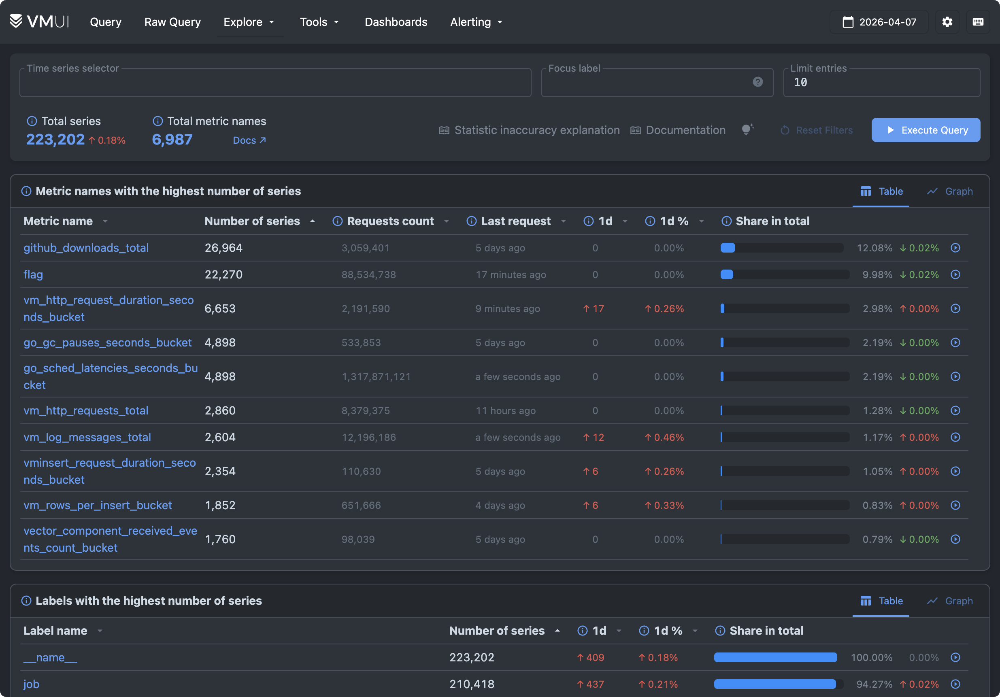
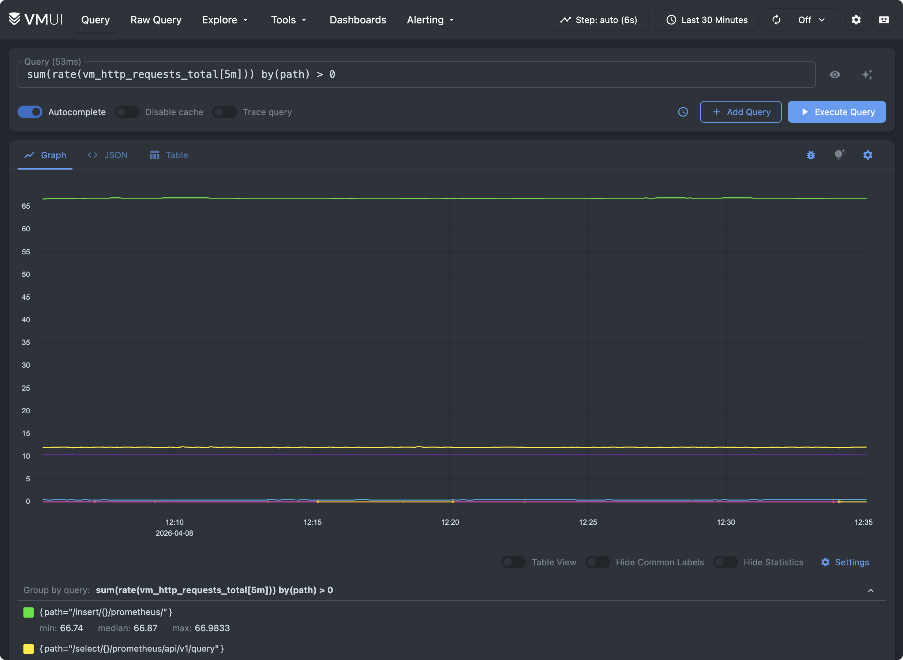
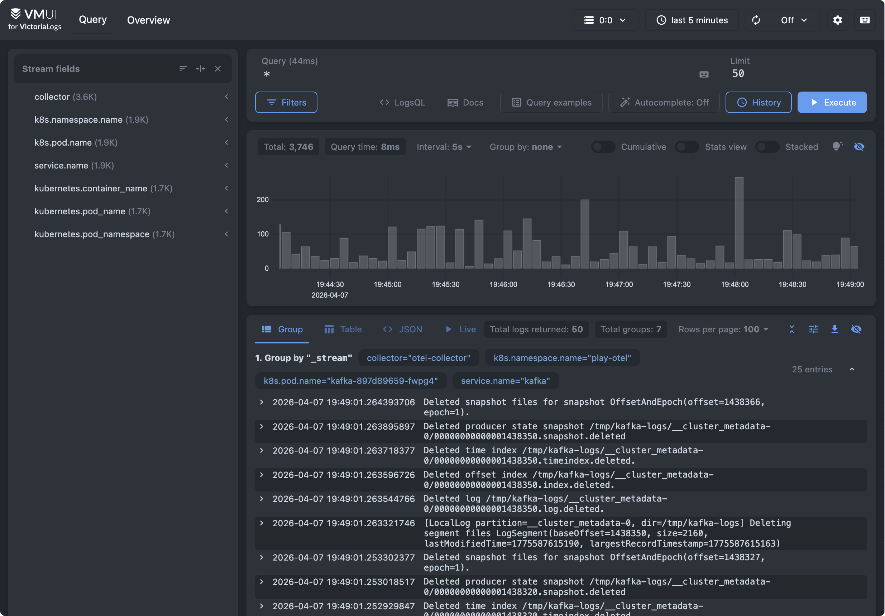
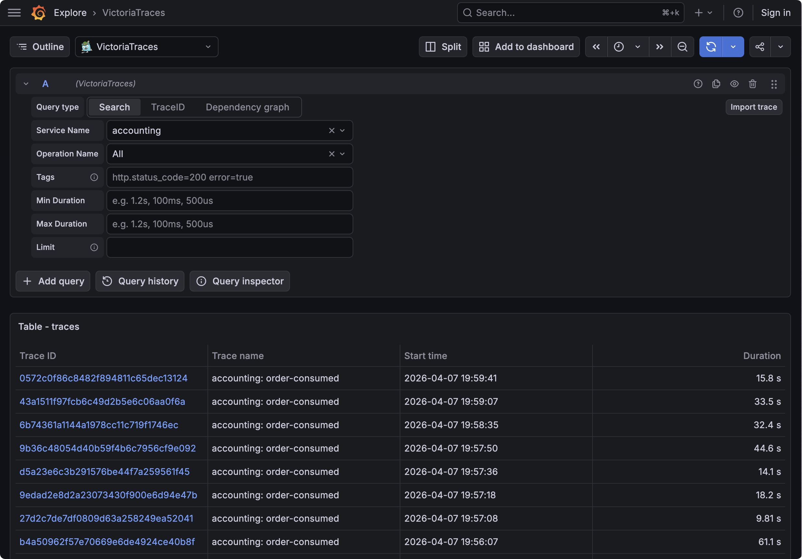
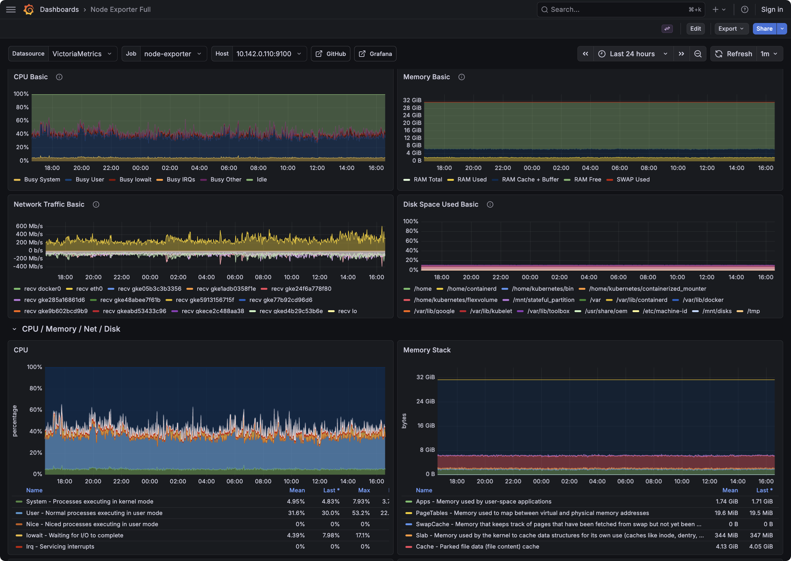
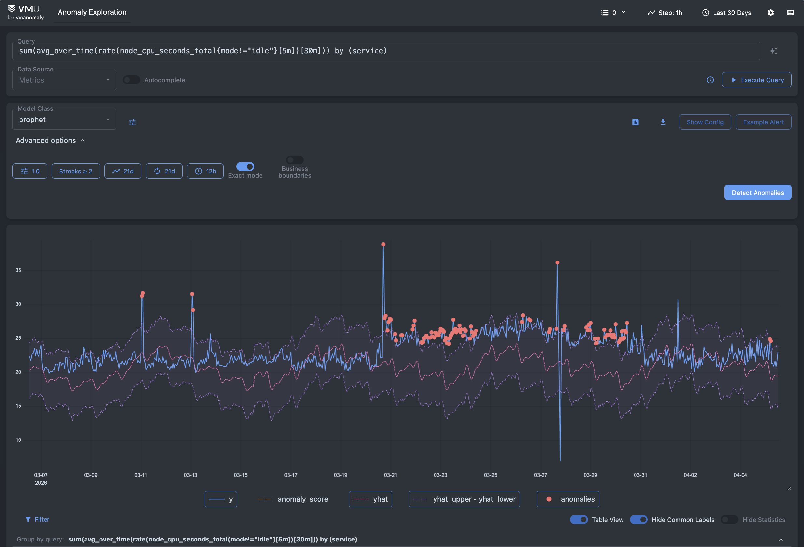
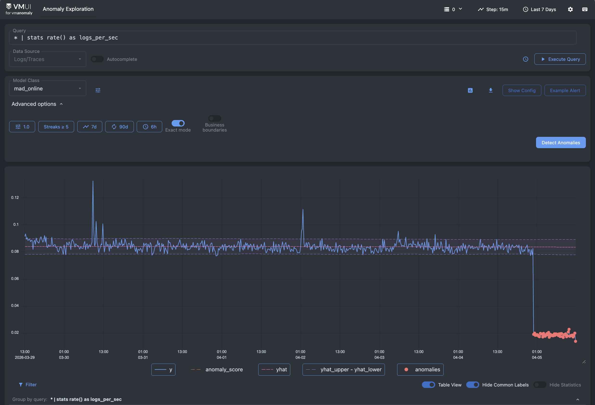
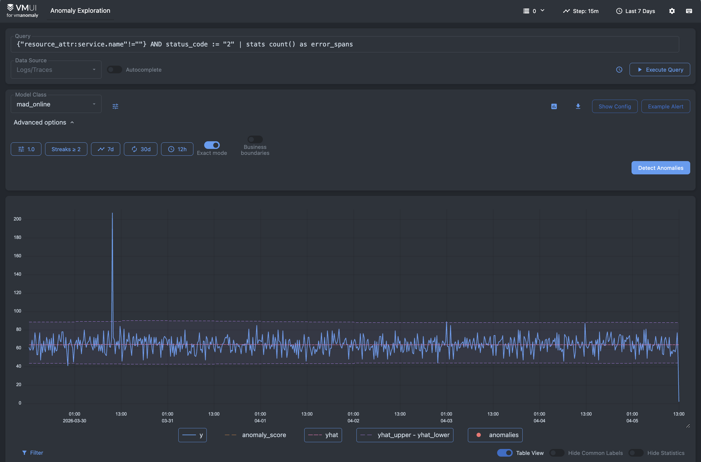

VictoriaMetrics offers public playgrounds where you can try the full observability stack online.

Some playgrounds are based on the [OpenTelemetry Astronomy Shop demo](https://github.com/open-telemetry/opentelemetry-demo), a sample microservices application that generates realistic metrics, logs, and traces. Other playgrounds use benchmark workloads such as [prometheus-benchmark](https://github.com/VictoriaMetrics/prometheus-benchmark) to demonstrate ingestion and query performance for Prometheus-compatible systems.

These playgrounds are ideal for:

- Learning [MetricsQL](https://docs.victoriametrics.com/victoriametrics/metricsql/) and [LogsQL](https://docs.victoriametrics.com/victorialogs/logsql/)
- Trying out dashboards and queries interactively
- Demonstrating features in talks or workshops

In the following sections, we'll walk through each playground, explain its purpose, and link to the corresponding GitHub repositories.

## VictoriaMetrics Playground

A fast, cost-effective, and scalable monitoring solution and time series database designed for collecting, storing, querying, and alerting on metrics.

- Try it: <https://play.victoriametrics.com/>
- Documentation: <https://docs.victoriametrics.com/victoriametrics/>

The playground is represented by [cluster version of VictoriaMetrics](https://docs.victoriametrics.com/victoriametrics/cluster-victoriametrics/).
It collects metrics from [OpenTelemetry Astronomy Shop demo](https://github.com/open-telemetry/opentelemetry-demo) and
various services in our Kubernetes playground namespace.

VictoriaMetrics web UI is represented via [VMUI](https://docs.victoriametrics.com/victoriametrics/single-server-victoriametrics/#vmui).
It allows querying metrics, plotting graphs, exploring cardinality, viewing alerting and recording rules, debugging relabeling rules, etc.

The best place to get started is with the [Cardinality Explorer](https://play.victoriametrics.com/select/0/prometheus/graph/#/cardinality) page, found under **Explore** > **Explore Cardinality**.
This view shows what's stored in the database for the specified day, lets you browse top metrics and labels in the dataset, and lets you drill down into them without writing a single line of MetricsQL.

<figcaption style="text-align: center; font-style: italic;">Cardinality Explorer in VictoriaMetrics</figcaption>

Try plotting graphs on the **Query** tab - [`sum(rate(vm_http_requests_total[5m])) by(path) > 0`](https://play.victoriametrics.com/select/0/prometheus/graph/#/?g0.range_input=30m&g0.relative_time=last_30_minutes&g0.tab=0&g0.expr=sum%28rate%28vm_http_requests_total%5B5m%5D%29%29+by%28path%29+%3E+0):

> VictoriaMetrics is also represented as a datasource in [Grafana playground](#grafana-playground).

## VictoriaLogs Playground

High-performance, lightweight, zero-config, schema-free database for logs that is easy to use and scales both vertically and horizontally, 
from very small setups to large-scale deployments handling terabytes per day.

- Try it: <https://play-vmlogs.victoriametrics.com/>
- Documentation: <https://docs.victoriametrics.com/victorialogs/>

The playground is represented by [cluster version of VictoriaLogs](https://docs.victoriametrics.com/victorialogs/cluster/).
It stores logs from [OpenTelemetry Astronomy Shop demo](https://github.com/open-telemetry/opentelemetry-demo) and various
other services that run in our k8s playground namespace.

VictoriaLogs [web UI](https://docs.victoriametrics.com/victorialogs/querying/#web-ui) allows querying log entries, plotting graphs,
exploring stored datasets, live tailing.

To start exploring the data, look at the sidebar. It shows the stream fields available in the dataset, 
and clicking any field or value automatically applies a filter, so you can browse the logs before writing your own query.

On the `Query` tab, click on the `Query examples` button to see examples of the most common search queries to start with.

> VictoriaLogs is also represented as a datasource in [Grafana playground](#grafana-playground).

## VictoriaTraces Playground

VictoriaTraces is a fast and scalable database for traces, built on top of VictoriaLogs.

- Try it: <https://play-grafana.victoriametrics.com/explore> (choose `Jaeger` datasource)
- Documentation: <https://docs.victoriametrics.com/victoriatraces/>

> [!NOTE]
> VictoriaTraces doesn't have its own web UI. Instead, it implements Jaeger API for [integrating with Jaeger UI or Grafana](https://docs.victoriametrics.com/victoriatraces/querying/).

VictoriaTraces playground stores traces from [OpenTelemetry Astronomy Shop demo](https://github.com/open-telemetry/opentelemetry-demo).

To view trace data, follow these steps:
1. On the [Grafana Playground](https://play-grafana.victoriametrics.com/), select **Explore** in the sidebar
2. Select VictoriaTraces / Jaeger in the combo box near the top-left corner
3. In **Query Type** select "Search"
4. Select one of the services and press **Run Query**

> VictoriaTraces is also represented as a datasource in [Grafana playground](#grafana-playground).

## Grafana Playground

- Try it: <https://play-grafana.victoriametrics.com>

Grafana playground contains examples of dashboards and datasources for VictoriaMetrics, VictoriaLogs, and VictoriaTraces.
It allows viewing metrics, logs, and traces generated by [OpenTelemetry Astronomy Shop demo](https://github.com/open-telemetry/opentelemetry-demo).

Try viewing available dashboards or just browse via Grafana's explore page to query and [correlate signals](https://docs.victoriametrics.com/opentelemetry/#correlations).

## VMAnomaly Playground

VMAnomaly analyzes metrics, logs, or traces using VictoriaMetrics' built-in anomaly detection model to generate an [anomaly score](https://docs.victoriametrics.com/anomaly-detection/faq/#what-is-anomaly-score). An `anomaly_score > 1` indicates an anomalous condition that deserves attention.

The [anomaly metrics playground](https://play-vmanomaly.victoriametrics.com/metrics/) shows anomalies in CPU utilization.

<figcaption style="text-align: center; font-style: italic;">Exploring anomalies on metric data on CPU utilization</figcaption>

The [anomaly logs playground](https://play-vmanomaly.victoriametrics.com/logs/) shows by default anomalies in log ingestion.

<figcaption style="text-align: center; font-style: italic;">Finding anomalies in log ingestion</figcaption>

And the [anomaly trace playground](https://play-vmanomaly.victoriametrics.com/traces/) analyzes spans with error status.

<figcaption style="text-align: center; font-style: italic;">Analyzing traces for service error anomalies</figcaption>

## Docker Compose Playgrounds

We provide Docker Compose examples for:

- [VictoriaMetrics](https://github.com/VictoriaMetrics/VictoriaMetrics/tree/master/deployment/docker/README.md)
- [VictoriaLogs](https://github.com/VictoriaMetrics/VictoriaLogs/blob/master/deployment/docker/README.md)
- [VictoriaTraces](https://github.com/VictoriaMetrics/VictoriaTraces/blob/master/deployment/docker/README.md) 

The Docker Compose examples demonstrate how various components could be configured, provisioned, and interconnected.
These examples aren't intended for production use.

## VictoriaMetrics Cloud

VictoriaMetrics UIs are also included in the [Explore](https://docs.victoriametrics.com/victoriametrics-cloud/exploring-data/) section of VictoriaMetrics and VictoriaLogs deployments, embedded in VictoriaMetrics Cloud.

You can experiment with your own data during the month‑long trial without deploying VictoriaStack in your infrastructure. To get started, follow [this guide](https://docs.victoriametrics.com/victoriametrics-cloud/get-started/quickstart/).

