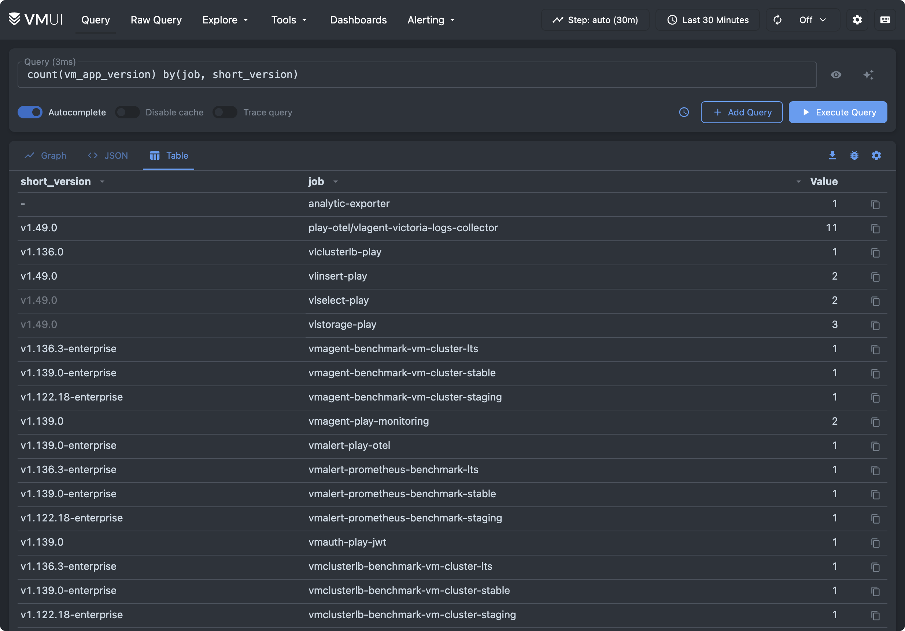

VictoriaMetrics offers public playgrounds where you can try the full observability stack online.

Some playgrounds are based on the [OpenTelemetry Astronomy Shop demo](https://github.com/open-telemetry/opentelemetry-demo), a sample microservices application that generates realistic metrics, logs, and traces. Other playgrounds use benchmark workloads such as [prometheus-benchmark](https://github.com/VictoriaMetrics/prometheus-benchmark) to demonstrate ingestion and query performance for Prometheus-compatible systems.

These playgrounds are ideal for:

- Learning [MetricsQL](https://docs.victoriametrics.com/victoriametrics/metricsql/) and [LogsQL](https://docs.victoriametrics.com/victorialogs/logsql/)
- Trying out dashboards and queries interactively
- Demonstrating features in talks or workshops

In the following sections, we’ll walk through each playground, explain its purpose, and link to the corresponding GitHub repositories.

## VictoriaMetrics Playground

- Try it: <https://play.victoriametrics.com/>
- Query language reference: [MetricsQL](https://docs.victoriametrics.com/victoriametrics/metricsql/)
- GitHub: <https://github.com/VictoriaMetrics/VictoriaMetrics>

This is the primary playground for VictoriaMetrics, powered by [VMUI](https://docs.victoriametrics.com/victoriametrics/single-server-victoriametrics/#vmui) and backed by a VictoriaMetrics cluster installation. It allows querying metrics, plotting graphs, exploring cardinality, defining alerting rules, debugging relabeling rules, and viewing query traces.

The best place to get started is with the [Cardinality Explorer](https://play.victoriametrics.com/select/0/prometheus/graph/#/cardinality?date=2026-04-07) tab, found under **Explore** > **Explore Cardinality**. This view shows overall statistics, lets you browse top metrics and labels in the dataset, and lets you drill down into them without writing a single line of MetricsQL.

<figcaption style="text-align: center; font-style: italic;">Cardinality Explorer in VictoriaMetrics</figcaption>

Once you are familiar with the available metrics, you can go to the **Query** tab and type a query. [The following example] shows the current version for every job in the dataset using: `count(vm_app_version) by(job, short_version)`.

<figcaption style="text-align: center; font-style: italic;">Table view of app versions per job</figcaption>

Other interesting queries you may try:
- Average CPU usage per job: `sum(rate(process_cpu_seconds_total[5m])) by (job)`
- HTTP requests per-second rate: `sum(rate(vm_http_requests_total[5m]))`
- Top 5 CPU intensive jobs: `topk(5, sum(rate(process_cpu_seconds_total[5m])) by (job))`

## VictoriaLogs Playground

- Try it: <https://play-vmlogs.victoriametrics.com/>
- Query language reference: [LogsQL](https://docs.victoriametrics.com/victorialogs/logsql/)
- GitHub: <https://github.com/VictoriaMetrics/VictoriaLogs>

This playground uses the [OpenTelemetry Astronomy Shop demo](https://github.com/open-telemetry/opentelemetry-demo). It is a good way to understand how VictoriaLogs handles high-volume logs with low operational overhead.

To start exploring the data, look at the sidebar. It shows the stream fields available in the dataset, and clicking any field or value automatically applies a filter, so you can browse the logs before writing your own query.

You can try these queries to get started:
- Show every log message: `*`
- Show messages with "error" in the last 24 hours: `error AND _time:24h`

## VictoriaTraces Playground

- Try it: <https://play-vtraces.victoriametrics.com/>
- Query language reference: [LogsQL](https://docs.victoriametrics.com/victorialogs/logsql/)
- GitHub: <https://github.com/VictoriaMetrics/VictoriaTraces>

> [!NOTE]
> This playground is a work in progress because VictoriaTraces is still under development.

VictoriaTraces provides a UI for browsing trace data by span. This playground is a live demo using real VictoriaTraces data. Explore how trace spans are structured, stored, and queried.

<figcaption style="text-align: center; font-style: italic;">VMUI for VictoriaTraces</figcaption>

## VMAnomaly Playground

> [!NOTE]
> VictoriaTraces is under active development and does not yet have its own web interface.

VMAnomaly analyzes metrics, logs, or traces using VictoriaMetrics’ built-in anomaly detection model to generate an [anomaly score](https://docs.victoriametrics.com/anomaly-detection/faq/#what-is-anomaly-score). An `anomaly_score > 1` indicates an anomalous condition that deserves attention.

Since there is no specialized UI for traces yet, you can visualize and track traces directly in the [Grafana playground](https://play-grafana.victoriametrics.com/explore?schemaVersion=1&panes=%7B%22w7z%22:%7B%22datasource%22:%22P14D5514F5CCC0D1C%22,%22queries%22:%5B%7B%22refId%22:%22A%22,%22datasource%22:%7B%22type%22:%22jaeger%22,%22uid%22:%22P14D5514F5CCC0D1C%22%7D,%22queryType%22:%22search%22,%22service%22:%22accounting%22%7D%5D,%22range%22:%7B%22from%22:%22now-1h%22,%22to%22:%22now%22%7D,%22compact%22:false%7D%7D&orgId=1).

To view trace data, follow these steps:
1. On the [Grafana Playground](https://play-grafana.victoriametrics.com/), select **Explore** in the sidebar
2. Select VictoriaTraces / Jaeger in the combo box near the top-left corner
3. In **Query Type** select "Search"
4. Select one of the services and press **Run Query** 

## Docker Compose Playgrounds

We provide Docker Compose files for:

- [VictoriaMetrics](https://github.com/VictoriaMetrics/VictoriaMetrics/tree/master/deployment/docker/README.md)
- [VictoriaLogs](https://github.com/VictoriaMetrics/VictoriaLogs/blob/master/deployment/docker/README.md)
- [VictoriaTraces](https://github.com/VictoriaMetrics/VictoriaTraces/blob/master/deployment/docker/README.md) 

The compose files are already configured, provisioned, and interconnected.

## VictoriaMetrics Cloud

VictoriaMetrics UIs are also included in the [Explore](https://docs.victoriametrics.com/victoriametrics-cloud/exploring-data/) section of VictoriaMetrics and VictoriaLogs deployments, embedded in VictoriaMetrics Cloud.

You can experiment with your own data during the month‑long trial without deploying VictoriaStack in your infrastructure. To get started, follow [this guide](https://docs.victoriametrics.com/victoriametrics-cloud/get-started/quickstart/).

