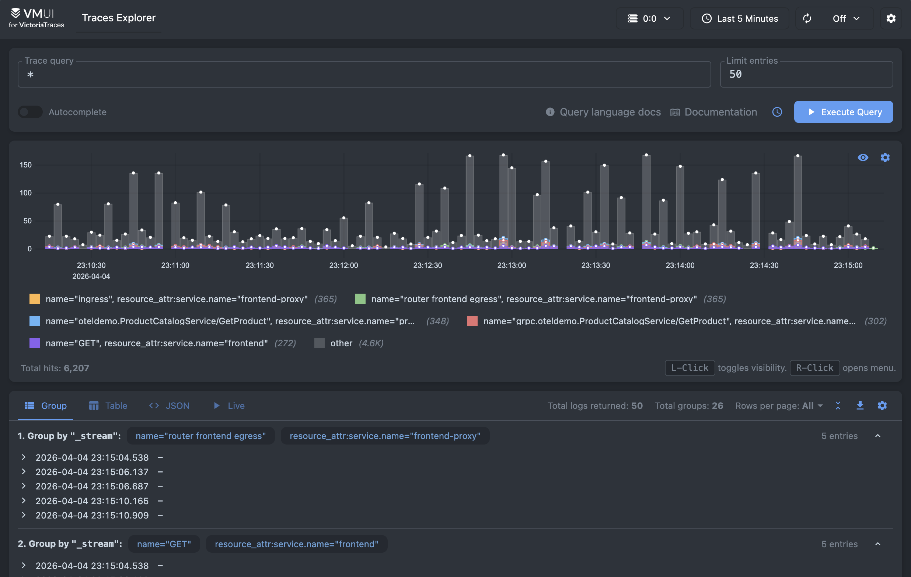

VictoriaMetrics offers public playgrounds where you can try the full observability stack online.

Some playgrounds are based on the [OpenTelemetry Astronomy Shop demo](https://github.com/open-telemetry/opentelemetry-demo), a sample microservices application that generates realistic metrics, logs, and traces. Other playgrounds use benchmark workloads such as [prometheus-benchmark](https://github.com/VictoriaMetrics/prometheus-benchmark) to demonstrate ingestion and query performance for Prometheus-compatible systems.

These playgrounds are ideal for:

- Learning [MetricsQL](https://docs.victoriametrics.com/victoriametrics/metricsql/) and [LogsQL](https://docs.victoriametrics.com/victorialogs/logsql/)
- Trying out dashboards and queries interactively
- Demonstrating features in talks or workshops

In the following sections, we’ll walk through each playground, explain its purpose, and provide links to the corresponding GitHub repositories.

## VictoriaMetrics Playground

- Try it: <https://play.victoriametrics.com/>
- Query language reference: [MetricsQL](https://docs.victoriametrics.com/victoriametrics/metricsql/)
- GitHub: <https://github.com/VictoriaMetrics/VictoriaMetrics>

This is the primary playground for VictoriaMetrics, powered by [VMUI](https://docs.victoriametrics.com/victoriametrics/single-server-victoriametrics/#vmui) and backed by a VictoriaMetrics cluster installation. Turn on Autocomplete and start typing to discover time series.

You can try these to get started:

- Average CPU usage per job: sum(rate(process_cpu_seconds_total[5m])) by (job)

    
    <figcaption style="text-align: center; font-style: italic;">VictoriaMetrics playground</figcaption>

- HTTP requests per-second rate: sum(rate(vm_http_requests_total[5m]))

    
    <figcaption style="text-align: center; font-style: italic;">Average CPU usage per job</figcaption>

- Top 5 CPU intensive jobs topk(5, sum(rate(process_cpu_seconds_total[5m])) by (job))

    
    <figcaption style="text-align: center; font-style: italic;">HTTP requests per second</figcaption>

## VictoriaLogs Playground

- Try it: <https://play-vmlogs.victoriametrics.com/>
- Query language reference: [LogsQL](https://docs.victoriametrics.com/victorialogs/logsql/)
- GitHub: <https://github.com/VictoriaMetrics/VictoriaLogs>

This playground lets you test VictoriaLogs with a demo log set, highlighting efficient handling of high-volume log data and low operational overhead.

You can try these to get started:

- Type `*` in the Query to show every log message

    
    <figcaption style="text-align: center; font-style: italic;">Showing all logs entries</figcaption>

- Typing `error AND _time:24h` shows you the entries containing the string “error” during the last 24 hours.

    
    <figcaption style="text-align: center; font-style: italic;">Messages with string "error" in the last 24 hours</figcaption>

- The Overview gives a quick view of logs in VictoriaLogs. It helps you see log volume, structure, trends, frequent fields, and spot unusual streams.

    
    <figcaption style="text-align: center; font-style: italic;">Overview page</figcaption>

## VictoriaTraces Playground

- Try it: <https://play-vtraces.victoriametrics.com/>
- Query language reference: [LogsQL](https://docs.victoriametrics.com/victorialogs/logsql/)
- GitHub: <https://github.com/VictoriaMetrics/VictoriaTraces>

> [!NOTE]
> This playground is in progress, as VictoriaTraces is still under development.

VictoriaTraces provides a UI for browsing trace data by span. This playground is a live demo using real VictoriaTraces data. Explore how trace spans are structured, stored, and queried.

<figcaption style="text-align: center; font-style: italic;">VMUI for VictoriaTraces</figcaption>

## VMAnomaly Playground

- Try it: 
  - vmanomaly for metrics: <https://play-vmanomaly.victoriametrics.com/metrics/>
  - vmanomaly for logs: <https://play-vmanomaly.victoriametrics.com/logs/>
  - vmanomaly for traces: <https://play-vmanomaly.victoriametrics.com/traces/>
- [UI Guide](https://docs.victoriametrics.com/anomaly-detection/ui/#example-usage)
- [Installation guide](https://docs.victoriametrics.com/anomaly-detection/quickstart/)
This playground shows automatic [anomaly detection](https://docs.victoriametrics.com/anomaly-detection/). 

VMAnomaly analyzes metrics, logs, or traces using a machine learning model to generate an [anomaly score](https://docs.victoriametrics.com/anomaly-detection/faq/#what-is-anomaly-score). A value of `anomaly_score > 1` indicates an anomalous condition that deserves attention.

- The metrics anomaly playground shows anomalies in CPU utilization.

    
    <figcaption style="text-align: center; font-style: italic;">Exploring anomalies on metric data on CPU utilization</figcaption>

- VMAnomaly also analyzes VictoriaLogs data. The logs playground displays anomalies in log ingestion.

    
    <figcaption style="text-align: center; font-style: italic;">Finding anomalies in log ingestion</figcaption>

- You can run vmanomaly on VictoriaTraces. By default, the traces playground analyzes service spans with an error status.

    
    <figcaption style="text-align: center; font-style: italic;">Analyzing traces for service error anomalies</figcaption>

## Docker Compose Demos

We provide Docker Compose files for:

- [VictoriaMetrics](https://github.com/VictoriaMetrics/VictoriaMetrics/tree/master/deployment/docker/README.md)
- [VictoriaLogs](https://github.com/VictoriaMetrics/VictoriaLogs/blob/master/deployment/docker/README.md)
- [VictoriaTraces](https://github.com/VictoriaMetrics/VictoriaTraces/blob/master/deployment/docker/README.md). 

The compose files are already configured, provisioned, and interconnected.

## VictoriaMetrics Cloud

VictoriaMetrics UIs are also included in the [Explore](https://docs.victoriametrics.com/victoriametrics-cloud/exploring-data/) section of VictoriaMetrics and VictoriaLogs deployments, embedded in VictoriaMetrics Cloud.

You can experiment with your own data without deploying VictoriaStack in your infrastructure during the month-long trial period by following [this guide](https://docs.victoriametrics.com/victoriametrics-cloud/get-started/quickstart/).
