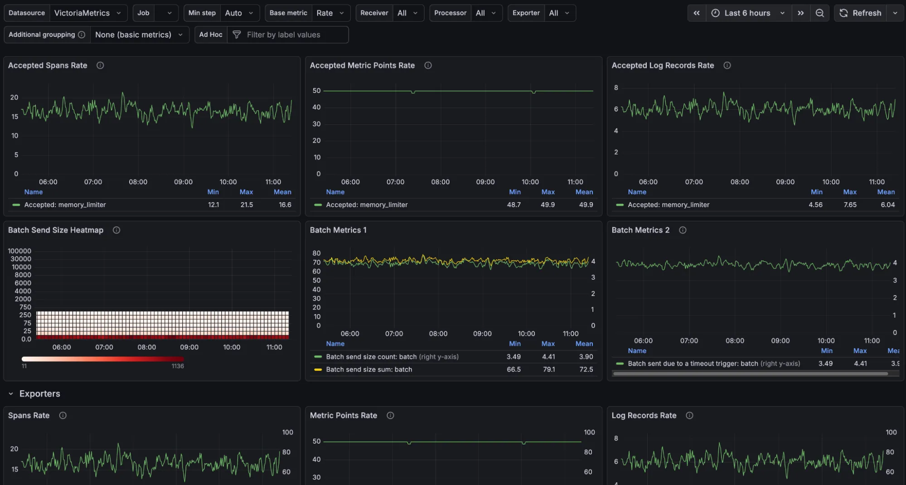

          
- Try it: <https://play-grafana.victoriametrics.com/>

This playground is particularly useful if you already use Grafana and want to see how VictoriaMetrics integrates into existing workflows. It provides a hosted Grafana instance preconfigured with:

- [VictoriaMetrics](https://docs.victoriametrics.com/victoriametrics/) as a metrics data source
- [VictoriaLogs](https://docs.victoriametrics.com/victorialogs/) as a logs data source
- [VictoriaTraces](https://docs.victoriametrics.com/victoriatraces/) as a Jaeger data source for traces

## What can you do here?

- Explore [real dashboards](https://play-grafana.victoriametrics.com/dashboards) built on top of VictoriaMetrics
- See how [MetricsQL](https://docs.victoriametrics.com/victoriametrics/metricsql/) and [LogsQL](https://docs.victoriametrics.com/victorialogs/logsql/) are used in Grafana panels
- Explore correlation with the help of the [OpenTelemetry Collector dashboard](https://play-grafana.victoriametrics.com/d/BKf2sowmj/opentelemetry-collector)
- Learn dashboard design and visualization best practices

<figcaption style="text-align: center; font-style: italic;">Grafana dashboard in the playground</figcaption>

The OpenTelemetry Collector dashboard is built on the official [OpenTelemetry Astronomy Shop demo](https://github.com/VictoriaMetrics-Community/opentelemetry-demo). It lets you visualize and understand telemetry data alongside VictoriaMetrics Stack observability signals, using VictoriaMetrics for metrics, VictoriaLogs for logs, and VictoriaTraces for traces. 

For an always-updated list of dashboards, bookmark this playground.

## Distribution

Relevant GitHub:
- VictoriaMetrics Grafana datasource: <https://github.com/VictoriaMetrics/victoriametrics-datasource>
- VictoriaLogs Grafana datasource: <https://github.com/VictoriaMetrics/victorialogs-datasource>

