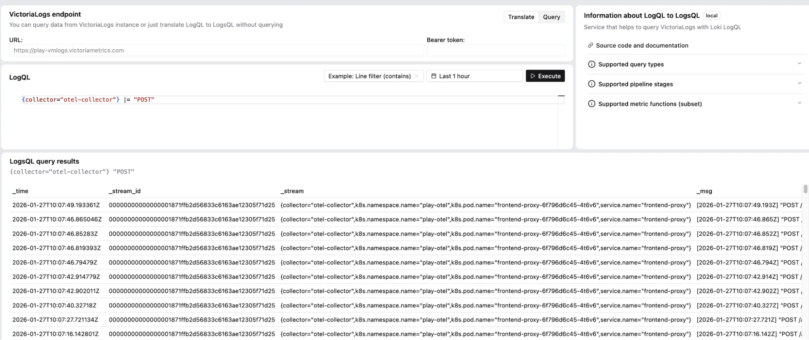

- Try it: <https://play-logql.victoriametrics.com/>

For teams migrating from Grafana Loki, this simple UI provides a useful [translator from LogQL to LogsQL](https://docs.victoriametrics.com/victorialogs/logql-to-logsql/).



## What can you do here?

The query-language translation tool automatically converts Loki queries into VictoriaLogs queries, reducing friction when adopting VictoriaLogs in environments already using Loki.

Type your LogQL query and press **Execute**.

For example, this LogQL query:

```text
{collector="otel-collector"} |= "POST"
```

Translates into the equivalent [LogsQL](https://docs.victoriametrics.com/victorialogs/logsql/)

```text
{collector="otel-collector"} "POST"
```

## Distribution

- GitHub: <https://github.com/VictoriaMetrics-Community/logql-to-logsql>
