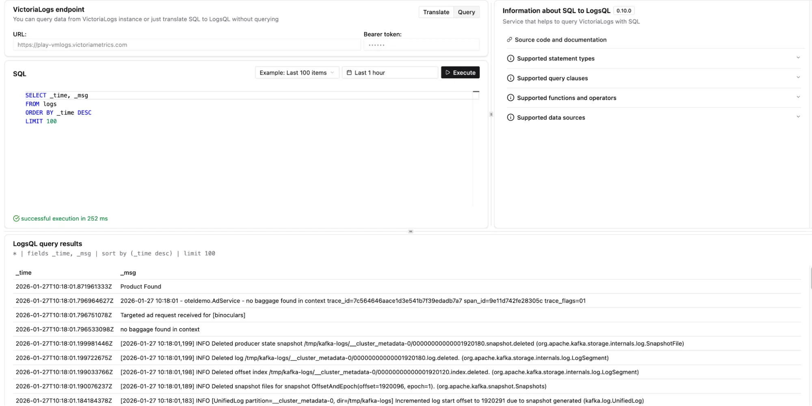

- Try it: <https://play-sql.victoriametrics.com/>

This playground enables you to query data from a VictoriaLogs instance or translate SQL to [LogsQL](https://docs.victoriametrics.com/victorialogs/logsql/) without querying.



## What can you do here?

First, run `SHOW TABLES;` to view all the existing tables in the SQL database and their equivalent query in [LogsQL](https://docs.victoriametrics.com/victorialogs/logsql/).

Then, type your SQL query and press **Execute**. 

For example, this query:

```sql
SELECT _time, _msg
FROM logs
WHERE _msg LIKE 'error'
ORDER BY _time DESC
LIMIT 100
```

Translates into:

```text
_msg:error | fields _time, _msg | sort by (_time desc) | limit 100
```

## Distribution

- GitHub: <https://github.com/VictoriaMetrics/sql-to-logsql>
