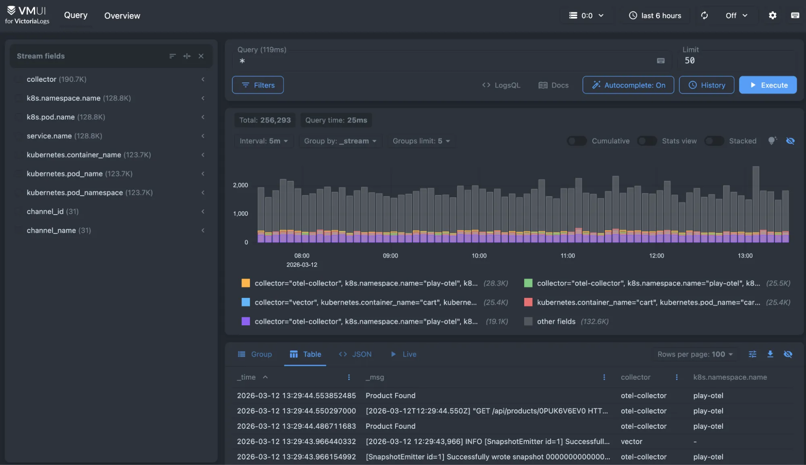
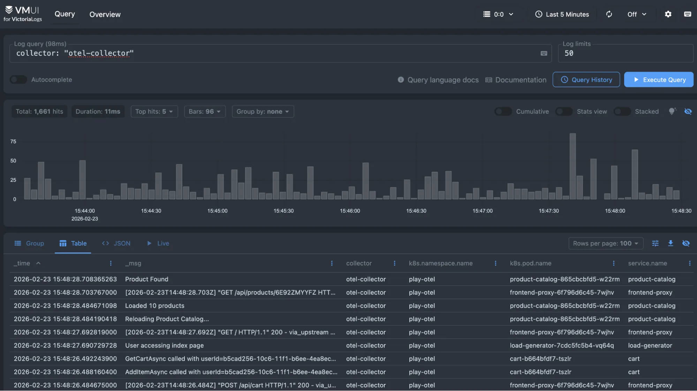
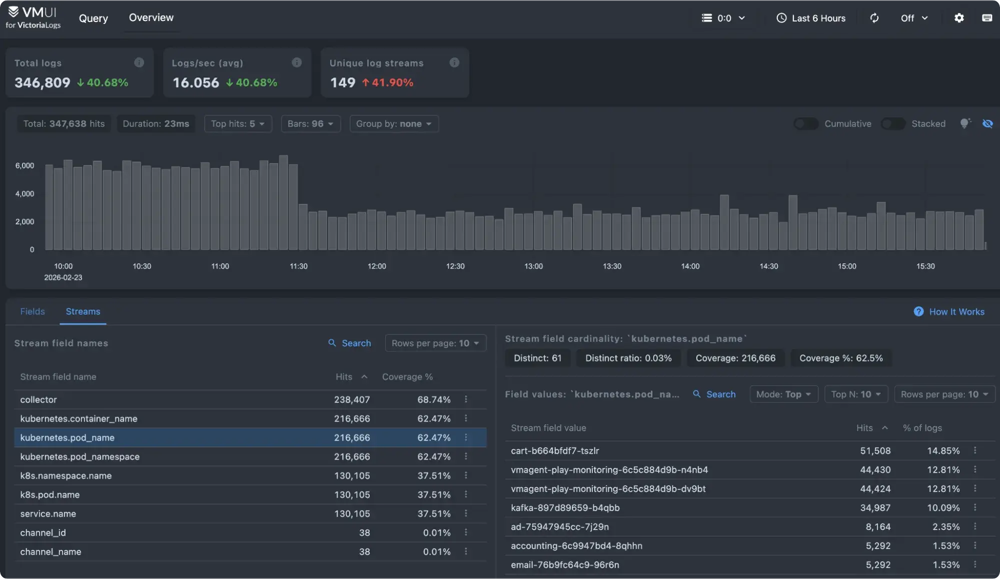
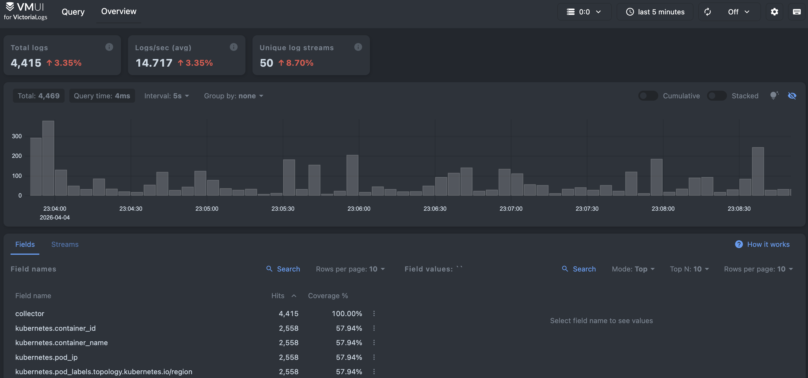

- Try it: <https://play-vmlogs.victoriametrics.com/>
- Query language reference: [LogsQL](https://docs.victoriametrics.com/victorialogs/logsql/)

This playground focuses on VictoriaLogs and lets you test the query engine on a demo log set. The playground demonstrates how VictoriaLogs handles high-volume log data with predictable performance and low operational overhead.

<figcaption style="text-align: center; font-style: italic;">VictoriaLogs playground</figcaption>

## What can you do here?

The WebUI provides the following modes for displaying query results:
- Group: results are displayed as a table with rows grouped by stream fields.
- Table: displays query results as a table.
- JSON: displays raw JSON response from `/select/logsql/query` HTTP API.
- Live: displays live tailing results for the given query.

As a starting point, you can type `collector: "otel-collector"` in the query field to search for entries collected by OpenTelemetry.

<figcaption style="text-align: center; font-style: italic;">Log entries collected with the OpenTelemetry collector</figcaption>

Typing `error AND _time:24h` shows you the entries containing the text "error" during the last 24 hours.

The **Overview** provides a quick, high-level look at the logs stored in VictoriaLogs. It helps you understand the volume and structure of your log data before diving into detailed queries. You can see log ingestion trends, identify the most common fields and values, and quickly spot noisy or unusual streams. From here, you can click on fields or values to automatically apply filters and start exploring your data with LogsQL.

## Distribution

- GitHub: <https://github.com/VictoriaMetrics/VictoriaLogs>
