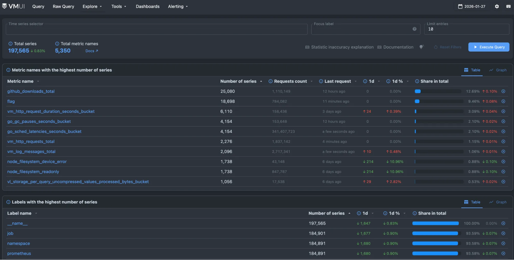
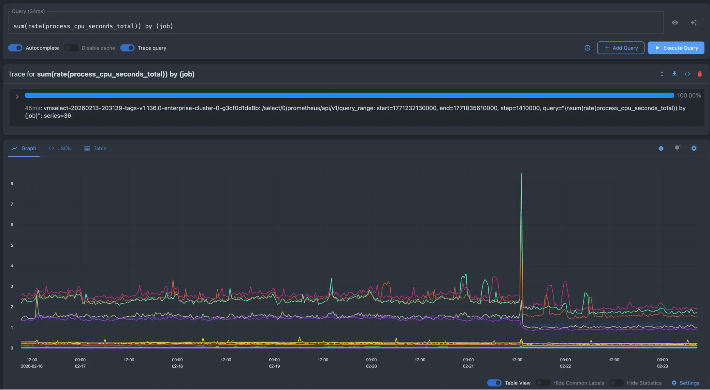
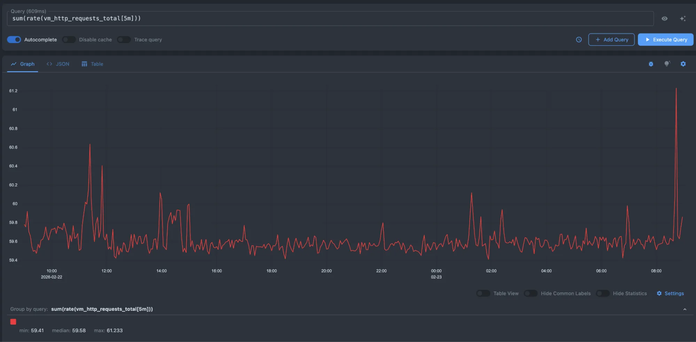
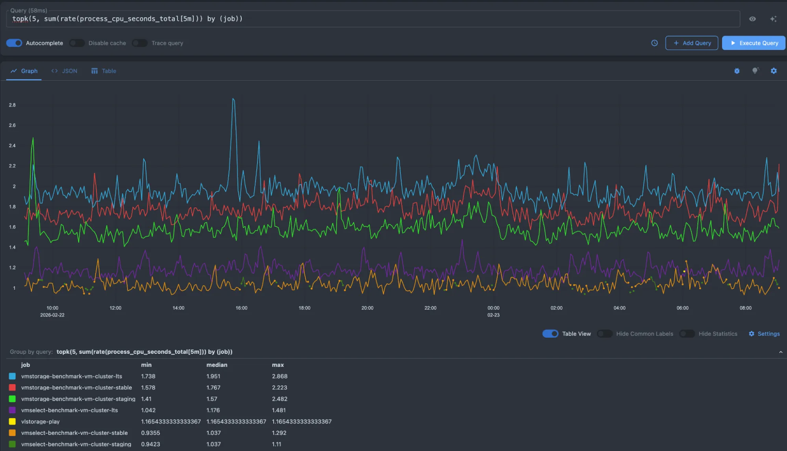

- Try it: <https://play.victoriametrics.com/>
- Query language reference: [MetricsQL](https://docs.victoriametrics.com/victoriametrics/metricsql/)

This is the primary playground for VictoriaMetrics, powered by VMUI and backed by a VictoriaMetrics cluster installation. Use it to experiment with the query engine, see available pages, or try tools such as the relabeling debugger. 

This playground is the best starting point for understanding how VictoriaMetrics stores and queries metrics at scale.


<figcaption style="text-align: center; font-style: italic;">VictoriaMetrics playground</figcaption>

## What can you do here?

The query tab provides a sandbox to experiment with [MetricsQL](https://docs.victoriametrics.com/victoriametrics/metricsql/). Turn on Autocomplete and start typing to discover time series. You can add multiple queries and compare them.

You can try these to get started:

- Average CPU usage per job: `sum(rate(process_cpu_seconds_total[5m])) by (job)`
- HTTP requests per-second rate: `sum(rate(vm_http_requests_total[5m]))`
- Top 5 CPU intensive jobs `topk(5, sum(rate(process_cpu_seconds_total[5m])) by (job))`

Below is an example of average CPU usage per job:

```text
sum(rate(process_cpu_seconds_total[5m])) by (job)
```


<figcaption style="text-align: center; font-style: italic;">Average CPU usage per job</figcaption>

Here, we are requesting the per-second rate of HTTP requests:

```text
sum(rate(vm_http_requests_total[5m]))
```


<figcaption style="text-align: center; font-style: italic;">HTTP requests per second</figcaption>

And here is an example for obtaining the top 5 high CPU jobs:

```text
topk(5, sum(rate(process_cpu_seconds_total[5m])) by (job))  
```


<figcaption style="text-align: center; font-style: italic;">Top 5 CPU intensive jobs</figcaption>

For a deep dive into all the features of this playground, please visit the [VMUI](https://docs.victoriametrics.com/victoriametrics/single-server-victoriametrics/#vmui) page.

## Distribution

- GitHub: <https://github.com/VictoriaMetrics/VictoriaMetrics>
