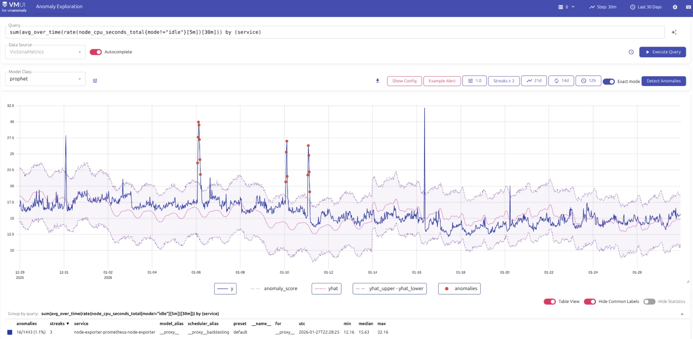

- Try it: <https://play-vmanomaly.victoriametrics.com/metrics/vmui/>
- UI Guide: <https://docs.victoriametrics.com/anomaly-detection/ui/#example-usage>

The playground demonstrates automatic [anomaly detection](https://docs.victoriametrics.com/anomaly-detection/).

<figcaption style="text-align: center; font-style: italic;">Exploring model fit for CPU usage series</figcaption>

The playground showcases anomaly detection data (native timeseries or converted to timeseries) using VictoriaMetrics, VictoriaLogs, or VictoriaTraces datasources, respectively:

- <https://play-vmanomaly.victoriametrics.com/metrics/>
- <https://play-vmanomaly.victoriametrics.com/logs/>
- <https://play-vmanomaly.victoriametrics.com/traces/>

## What can you do here?

The Anomaly Detection playground lets you:
- Understand how [MetricsQL](https://docs.victoriametrics.com/victoriametrics/metricsql/) and [LogsQL](https://docs.victoriametrics.com/victorialogs/logsql/) are used to generate input data for anomaly detection.
- Explore metrics data enriched with anomaly scores, predictions, and confidence intervals.
- Visualize anomalies directly in VMUI, including consecutive anomalies that last over time rather than being a single point, to imitate how alerting rules trigger on such data.
- Learn how anomaly scores can be used for alerting purposes by exploring generated alerting rules.

## Distribution & setup

VMAnomaly is distributed through various channels:

- [Installation guide](https://docs.victoriametrics.com/anomaly-detection/quickstart/)
- Docker containers available in [Docker Hub](https://hub.docker.com/r/victoriametrics/vmanomaly) and [Quay.io](https://quay.io/repository/victoriametrics/vmanomaly)
- [Helm charts](https://github.com/VictoriaMetrics/helm-charts) (including anomaly setups)
- [VM Operator](https://docs.victoriametrics.com/operator/resources/vmanomaly/)

