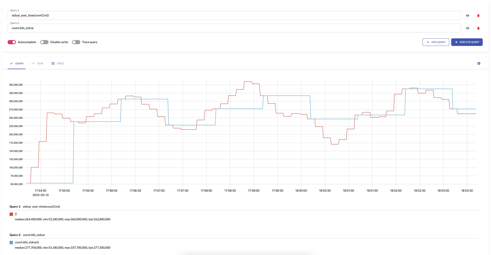

[vmagent](https://docs.victoriametrics.com/vmagent/) and [single-node VictoriaMetrics](https://docs.victoriametrics.com/single-server-victoriametrics/)
can aggregate incoming [samples](https://docs.victoriametrics.com/keyconcepts/#raw-samples) in streaming mode by time and by labels before data is written to remote storage
(or local storage for single-node VictoriaMetrics).
The aggregation is applied to all the metrics received via any [supported data ingestion protocol](https://docs.victoriametrics.com/#how-to-import-time-series-data)
and/or scraped from [Prometheus-compatible targets](https://docs.victoriametrics.com/#how-to-scrape-prometheus-exporters-such-as-node-exporter)
after applying all the configured [relabeling stages](https://docs.victoriametrics.com/vmagent/#relabeling).

**By default, stream aggregation ignores timestamps associated with the input [samples](https://docs.victoriametrics.com/keyconcepts/#raw-samples).
It expects that the ingested samples have timestamps close to the current time. See [how to ignore old samples](#ignoring-old-samples).**

# Use cases

Stream aggregation can be used in the following cases:

* [Statsd alternative](#statsd-alternative)
* [Recording rules alternative](#recording-rules-alternative)
* [Reducing the number of stored samples](#reducing-the-number-of-stored-samples)
* [Reducing the number of stored series](#reducing-the-number-of-stored-series)

## Statsd alternative

Stream aggregation can be used as [statsd](https://github.com/statsd/statsd) alternative in the following cases:

* [Counting input samples](#counting-input-samples)
* [Summing input metrics](#summing-input-metrics)
* [Quantiles over input metrics](#quantiles-over-input-metrics)
* [Histograms over input metrics](#histograms-over-input-metrics)
* [Aggregating histograms](#aggregating-histograms)

Currently, streaming aggregation is available only for [supported data ingestion protocols](https://docs.victoriametrics.com/#how-to-import-time-series-data)
and not available for [Statsd metrics format](https://github.com/statsd/statsd/blob/master/docs/metric_types.md).

## Recording rules alternative

Sometimes [alerting queries](https://docs.victoriametrics.com/vmalert/#alerting-rules) may require non-trivial amounts of CPU, RAM,
disk IO and network bandwidth at metrics storage side. For example, if `http_request_duration_seconds` histogram is generated by thousands
of application instances, then the alerting query `histogram_quantile(0.99, sum(increase(http_request_duration_seconds_bucket[5m])) without (instance)) > 0.5`
can become slow, since it needs to scan too big number of unique [time series](https://docs.victoriametrics.com/keyconcepts/#time-series)
with `http_request_duration_seconds_bucket` name. This alerting query can be accelerated by pre-calculating
the `sum(increase(http_request_duration_seconds_bucket[5m])) without (instance)` via [recording rule](https://docs.victoriametrics.com/vmalert/#recording-rules).
But this recording rule may take too much time to execute too. In this case the slow recording rule can be substituted
with the following [stream aggregation config](#stream-aggregation-config):

```yaml
- match: 'http_request_duration_seconds_bucket'
  interval: 5m
  without: [instance]
  outputs: [total]
```

This stream aggregation generates `http_request_duration_seconds_bucket:5m_without_instance_total` output series according to [output metric naming](#output-metric-names).
Then these series can be used in [alerting rules](https://docs.victoriametrics.com/vmalert/#alerting-rules):

```metricsql
histogram_quantile(0.99, last_over_time(http_request_duration_seconds_bucket:5m_without_instance_total[5m])) > 0.5
```

This query is executed much faster than the original query, because it needs to scan much lower number of time series.

See [the list of aggregate output](#aggregation-outputs), which can be specified at `output` field.
See also [aggregating by labels](#aggregating-by-labels).

Field `interval` is recommended to be set to a value at least several times higher than your metrics collect interval.

## Reducing the number of stored samples

If per-[series](https://docs.victoriametrics.com/keyconcepts/#time-series) samples are ingested at high frequency,
then this may result in high disk space usage, since too much data must be stored to disk. This also may result
in slow queries, since too much data must be processed during queries.

This can be fixed with the stream aggregation by increasing the interval between per-series samples stored in the database.

For example, the following [stream aggregation config](#stream-aggregation-config) reduces the frequency of input samples
to one sample per 5 minutes per each input time series (this operation is also known as downsampling):

```yaml
  # Aggregate metrics ending with _total with `total` output.
  # See https://docs.victoriametrics.com/stream-aggregation/#aggregation-outputs
- match: '{__name__=~".+_total"}'
  interval: 5m
  outputs: [total]

  # Downsample other metrics with `count_samples`, `sum_samples`, `min` and `max` outputs
  # See https://docs.victoriametrics.com/stream-aggregation/#aggregation-outputs
- match: '{__name__!~".+_total"}'
  interval: 5m
  outputs: [count_samples, sum_samples, min, max]
```

The aggregated output metrics have the following names according to [output metric naming](#output-metric-names):

```text
# For input metrics ending with _total
some_metric_total:5m_total

# For input metrics not ending with _total
some_metric:5m_count_samples
some_metric:5m_sum_samples
some_metric:5m_min
some_metric:5m_max
```

See [the list of aggregate output](#aggregation-outputs), which can be specified at `output` field.
See also [aggregating histograms](#aggregating-histograms) and [aggregating by labels](#aggregating-by-labels).

## Reducing the number of stored series

Sometimes applications may generate too many [time series](https://docs.victoriametrics.com/keyconcepts/#time-series).
For example, the `http_requests_total` metric may have `path` or `user` label with too big number of unique values.
In this case the following stream aggregation can be used for reducing the number metrics stored in VictoriaMetrics:

```yaml
- match: 'http_requests_total'
  interval: 30s
  without: [path, user]
  outputs: [total]
```

This config specifies labels, which must be removed from the aggregate output, in the `without` list.
See [these docs](#aggregating-by-labels) for more details.

The aggregated output metric has the following name according to [output metric naming](#output-metric-names):

```text
http_requests_total:30s_without_path_user_total
```

See [the list of aggregate output](#aggregation-outputs), which can be specified at `output` field.
See also [aggregating histograms](#aggregating-histograms).

## Counting input samples

If the monitored application generates event-based metrics, then it may be useful to count the number of such metrics
at stream aggregation level.

For example, if an advertising server generates `hits{some="labels"} 1` and `clicks{some="labels"} 1` metrics
per each incoming hit and click, then the following [stream aggregation config](#stream-aggregation-config)
can be used for counting these metrics per every 30 second interval:

```yaml
- match: '{__name__=~"hits|clicks"}'
  interval: 30s
  outputs: [count_samples]
```

This config generates the following output metrics for `hits` and `clicks` input metrics
according to [output metric naming](#output-metric-names):

```text
hits:30s_count_samples count1
clicks:30s_count_samples count2
```

See [the list of aggregate output](#aggregation-outputs), which can be specified at `output` field.
See also [aggregating by labels](#aggregating-by-labels).

## Summing input metrics

If the monitored application calculates some events and then sends the calculated number of events to VictoriaMetrics
at irregular intervals or at too high frequency, then stream aggregation can be used for summing such events
and writing the aggregate sums to the storage at regular intervals.

For example, if an advertising server generates `hits{some="labels} N` and `clicks{some="labels"} M` metrics
at irregular intervals, then the following [stream aggregation config](#stream-aggregation-config)
can be used for summing these metrics per every minute:

```yaml
- match: '{__name__=~"hits|clicks"}'
  interval: 1m
  outputs: [sum_samples]
```

This config generates the following output metrics according to [output metric naming](#output-metric-names):

```text
hits:1m_sum_samples sum1
clicks:1m_sum_samples sum2
```

See [the list of aggregate output](#aggregation-outputs), which can be specified at `output` field.
See also [aggregating by labels](#aggregating-by-labels).

## Quantiles over input metrics

If the monitored application generates measurement metrics per each request, then it may be useful to calculate
the pre-defined set of [percentiles](https://en.wikipedia.org/wiki/Percentile) over these measurements.

For example, if the monitored application generates `request_duration_seconds N` and `response_size_bytes M` metrics
per each incoming request, then the following [stream aggregation config](#stream-aggregation-config)
can be used for calculating 50th and 99th percentiles for these metrics every 30 seconds:

```yaml
- match:
  - request_duration_seconds
  - response_size_bytes
  interval: 30s
  outputs: ["quantiles(0.50, 0.99)"]
```

This config generates the following output metrics according to [output metric naming](#output-metric-names):

```text
request_duration_seconds:30s_quantiles{quantile="0.50"} value1
request_duration_seconds:30s_quantiles{quantile="0.99"} value2

response_size_bytes:30s_quantiles{quantile="0.50"} value1
response_size_bytes:30s_quantiles{quantile="0.99"} value2
```

See [the list of aggregate output](#aggregation-outputs), which can be specified at `output` field.
See also [histograms over input metrics](#histograms-over-input-metrics) and [aggregating by labels](#aggregating-by-labels).

## Histograms over input metrics

If the monitored application generates measurement metrics per each request, then it may be useful to calculate
a [histogram](https://docs.victoriametrics.com/keyconcepts/#histogram) over these metrics.

For example, if the monitored application generates `request_duration_seconds N` and `response_size_bytes M` metrics
per each incoming request, then the following [stream aggregation config](#stream-aggregation-config)
can be used for calculating [VictoriaMetrics histogram buckets](https://valyala.medium.com/improving-histogram-usability-for-prometheus-and-grafana-bc7e5df0e350)
for these metrics every 60 seconds:

```yaml
- match:
  - request_duration_seconds
  - response_size_bytes
  interval: 60s
  outputs: [histogram_bucket]
```

This config generates the following output metrics according to [output metric naming](#output-metric-names).

```text
request_duration_seconds:60s_histogram_bucket{vmrange="start1...end1"} count1
request_duration_seconds:60s_histogram_bucket{vmrange="start2...end2"} count2
...
request_duration_seconds:60s_histogram_bucket{vmrange="startN...endN"} countN

response_size_bytes:60s_histogram_bucket{vmrange="start1...end1"} count1
response_size_bytes:60s_histogram_bucket{vmrange="start2...end2"} count2
...
response_size_bytes:60s_histogram_bucket{vmrange="startN...endN"} countN
```

The resulting histogram buckets can be queried with [MetricsQL](https://docs.victoriametrics.com/metricsql/) in the following ways:

1. An estimated 50th and 99th [percentiles](https://en.wikipedia.org/wiki/Percentile) of the request duration over the last hour:

   ```metricsql
   histogram_quantiles("quantile", 0.50, 0.99, sum(increase(request_duration_seconds:60s_histogram_bucket[1h])) by (vmrange))
   ```

   This query uses [histogram_quantiles](https://docs.victoriametrics.com/metricsql/#histogram_quantiles) function.

1. An estimated [standard deviation](https://en.wikipedia.org/wiki/Standard_deviation) of the request duration over the last hour:

   ```metricsql
   histogram_stddev(sum(increase(request_duration_seconds:60s_histogram_bucket[1h])) by (vmrange))
   ```

   This query uses [histogram_stddev](https://docs.victoriametrics.com/metricsql/#histogram_stddev) function.

1. An estimated share of requests with the duration smaller than `0.5s` over the last hour:

   ```metricsql
   histogram_share(0.5, sum(increase(request_duration_seconds:60s_histogram_bucket[1h])) by (vmrange))
   ```

   This query uses [histogram_share](https://docs.victoriametrics.com/metricsql/#histogram_share) function.

See [the list of aggregate output](#aggregation-outputs), which can be specified at `output` field.
See also [quantiles over input metrics](#quantiles-over-input-metrics) and [aggregating by labels](#aggregating-by-labels).

## Aggregating histograms

[Histogram](https://docs.victoriametrics.com/keyconcepts/#histogram) is a set of [counter](https://docs.victoriametrics.com/keyconcepts/#counter)
metrics with different `vmrange` or `le` labels. As they're counters, the applicable aggregation output is
[total](https://docs.victoriametrics.com/stream-aggregation/#total):

```yaml
- match: 'http_request_duration_seconds_bucket'
  interval: 1m
  without: [instance]
  outputs: [total]
```

This config generates the following output metrics according to [output metric naming](#output-metric-names):

```text
http_request_duration_seconds_bucket:1m_without_instance_total{le="0.1"} value1
http_request_duration_seconds_bucket:1m_without_instance_total{le="0.2"} value2
http_request_duration_seconds_bucket:1m_without_instance_total{le="0.4"} value3
http_request_duration_seconds_bucket:1m_without_instance_total{le="1"}   value4
http_request_duration_seconds_bucket:1m_without_instance_total{le="3"}   value5
http_request_duration_seconds_bucket:1m_without_instance_total{le="+Inf" value6
```

The resulting metrics can be passed to [histogram_quantile](https://docs.victoriametrics.com/metricsql/#histogram_quantile)
function:

```metricsql
histogram_quantile(0.9, sum(rate(http_request_duration_seconds_bucket:1m_without_instance_total[5m])) by(le))
```

Please note, histograms can be aggregated if their `le` labels are configured identically.
[VictoriaMetrics histogram buckets](https://valyala.medium.com/improving-histogram-usability-for-prometheus-and-grafana-bc7e5df0e350)
have no such requirement.

See [the list of aggregate output](#aggregation-outputs), which can be specified at `output` field.
See also [histograms over input metrics](#histograms-over-input-metrics) and [quantiles over input metrics](#quantiles-over-input-metrics).

# Configuration

Stream aggregation can be configured via the following command-line flags:

- `-streamAggr.config` at [single-node VictoriaMetrics](https://docs.victoriametrics.com/single-server-victoriametrics/)
  and at [vmagent](https://docs.victoriametrics.com/vmagent/).
- `-remoteWrite.streamAggr.config` at [vmagent](https://docs.victoriametrics.com/vmagent/) only. This flag can be specified individually
  per each `-remoteWrite.url`, so the aggregation happens independently per each remote storage destination.
  This allows writing different aggregates to different remote storage systems.

These flags must point to a file containing [stream aggregation config](#stream-aggregation-config).
The file may contain `%{ENV_VAR}` placeholders which are substituted by the corresponding `ENV_VAR` environment variable values.

By default, the following data is written to the storage when stream aggregation is enabled:

- the aggregated samples;
- the raw input samples, which didn't match any `match` option in the provided [config](#stream-aggregation-config).

This behaviour can be changed via the following command-line flags:

- `-streamAggr.keepInput` at [single-node VictoriaMetrics](https://docs.victoriametrics.com/single-server-victoriametrics/) 
  and [vmagent](https://docs.victoriametrics.com/vmagent/). At [vmagent](https://docs.victoriametrics.com/vmagent/)
  `-remoteWrite.streamAggr.keepInput` flag can be specified individually per each `-remoteWrite.url`.
  If one of these flags is set, then all the input samples are written to the storage alongside the aggregated samples.
- `-streamAggr.dropInput` at [single-node VictoriaMetrics](https://docs.victoriametrics.com/single-server-victoriametrics/) 
  and [vmagent](https://docs.victoriametrics.com/vmagent/). At [vmagent](https://docs.victoriametrics.com/vmagent/)
  `-remoteWrite.streamAggr.dropInput` flag can be specified individually per each `-remoteWrite.url`.
  If one of these flags are set, then all the input samples are dropped, while only the aggregated samples are written to the storage.

## Aggregation outputs

The aggregations are calculated during the `interval` specified in the [config](#stream-aggregation-config)
and then sent to the storage once per `interval`. The aggregated samples are named according to [output metric naming](#output-metric-names).

If `by` and `without` lists are specified in the [config](#stream-aggregation-config),
then the [aggregation by labels](#aggregating-by-labels) is performed additionally to aggregation by `interval`.

Below are aggregation functions that can be put in the `outputs` list at [stream aggregation config](#stream-aggregation-config):

* [avg](#avg)
* [count_samples](#count_samples)
* [count_series](#count_series)
* [histogram_bucket](#histogram_bucket)
* [increase](#increase)
* [increase_prometheus](#increase_prometheus)
* [last](#last)
* [max](#max)
* [min](#min)
* [rate_avg](#rate_avg)
* [rate_sum](#rate_sum)
* [stddev](#stddev)
* [stdvar](#stdvar)
* [sum_samples](#sum_samples)
* [total](#total)
* [total_prometheus](#total_prometheus)
* [unique_samples](#unique_samples)
* [quantiles](#quantiles)

### avg

`avg` returns the average over input [sample values](https://docs.victoriametrics.com/keyconcepts/#raw-samples).
`avg` makes sense only for aggregating [gauges](https://docs.victoriametrics.com/keyconcepts/#gauge).

The results of `avg` is equal to the following [MetricsQL](https://docs.victoriametrics.com/metricsql/) query:

```metricsql
sum(sum_over_time(some_metric[interval])) / sum(count_over_time(some_metric[interval]))
```

For example, see below time series produced by config with aggregation interval `1m` and `by: ["instance"]` and  the regular query:


See also:

- [max](#max)
- [min](#min)
- [quantiles](#quantiles)
- [sum_samples](#sum_samples)
- [count_samples](#count_samples)

### count_samples

`count_samples` counts the number of input [samples](https://docs.victoriametrics.com/keyconcepts/#raw-samples) over the given `interval`.

The results of `count_samples` is equal to the following [MetricsQL](https://docs.victoriametrics.com/metricsql/) query:

```metricsql
sum(count_over_time(some_metric[interval]))
```

See also:

- [count_series](#count_series)
- [sum_samples](#sum_samples)

### count_series

`count_series` counts the number of unique [time series](https://docs.victoriametrics.com/keyconcepts/#time-series) over the given `interval`.

The results of `count_series` is equal to the following [MetricsQL](https://docs.victoriametrics.com/metricsql/) query:

```metricsql
count(last_over_time(some_metric[interval]))
```

See also:

- [count_samples](#count_samples)
- [unique_samples](#unique_samples)

### histogram_bucket

`histogram_bucket` returns [VictoriaMetrics histogram buckets](https://valyala.medium.com/improving-histogram-usability-for-prometheus-and-grafana-bc7e5df0e350)
for the input [sample values](https://docs.victoriametrics.com/keyconcepts/#raw-samples) over the given `interval`.
`histogram_bucket` makes sense only for aggregating [gauges](https://docs.victoriametrics.com/keyconcepts/#gauge).
See how to aggregate regular histograms [here](#aggregating-histograms).

The results of `histogram_bucket` is equal to the following [MetricsQL](https://docs.victoriametrics.com/metricsql/) query:

Aggregating irregular and sporadic metrics (received from [Lambdas](https://aws.amazon.com/lambda/)
or [Cloud Functions](https://cloud.google.com/functions)) can be controlled via [staleness_interval](#staleness) option.

```metricsql
sum(histogram_over_time(some_histogram_bucket[interval])) by (vmrange)
```

See also:

- [quantiles](#quantiles)
- [avg](#avg)
- [max](#max)
- [min](#min)

### increase

`increase` returns the increase of input [time series](https://docs.victoriametrics.com/keyconcepts/#time-series) over the given 'interval'.
`increase` makes sense only for aggregating [counters](https://docs.victoriametrics.com/keyconcepts/#counter).

The results of `increase` is equal to the following [MetricsQL](https://docs.victoriametrics.com/metricsql/) query:

```metricsql
sum(increase_pure(some_counter[interval]))
```

`increase` assumes that all the counters start from 0. For example, if the first seen sample for new [time series](https://docs.victoriametrics.com/keyconcepts/#time-series)
is `10`, then `increase` assumes that the time series has been increased by `10`. If you need ignoring the first sample for new time series,
then take a look at [increase_prometheus](#increase_prometheus).

For example, see below time series produced by config with aggregation interval `1m` and `by: ["instance"]` and the regular query:


Aggregating irregular and sporadic metrics (received from [Lambdas](https://aws.amazon.com/lambda/)
or [Cloud Functions](https://cloud.google.com/functions)) can be controlled via [staleness_interval](#staleness) option.

See also:

- [increase_prometheus](#increase_prometheus)
- [total](#total)
- [rate_avg](#rate_avg)
- [rate_sum](#rate_sum)

### increase_prometheus

`increase_prometheus` returns the increase of input [time series](https://docs.victoriametrics.com/keyconcepts/#time-series) over the given `interval`.
`increase_prometheus` makes sense only for aggregating [counters](https://docs.victoriametrics.com/keyconcepts/#counter).

The results of `increase_prometheus` is equal to the following [MetricsQL](https://docs.victoriametrics.com/metricsql/) query:

```metricsql
sum(increase_prometheus(some_counter[interval]))
```

`increase_prometheus` skips the first seen sample value per each [time series](https://docs.victoriametrics.com/keyconcepts/#time-series).
If you need taking into account the first sample per time series, then take a look at [increase](#increase).

Aggregating irregular and sporadic metrics (received from [Lambdas](https://aws.amazon.com/lambda/)
or [Cloud Functions](https://cloud.google.com/functions)) can be controlled via [staleness_interval](#staleness) option.

See also:

- [increase](#increase)
- [rate_avg](#rate_avg)
- [rate_sum](#rate_sum)
- [total](#total)
- [total_prometheus](#total_prometheus)

### last

`last` returns the last input [sample value](https://docs.victoriametrics.com/keyconcepts/#raw-samples) over the given `interval`.

The results of `last` is roughly equal to the following [MetricsQL](https://docs.victoriametrics.com/metricsql/) query:

```metricsql
last_over_time(some_metric[interval])
```

See also:

- [avg](#avg)
- [max](#max)
- [min](#min)
- [quantiles](#quantiles)

### max

`max` returns the maximum input [sample value](https://docs.victoriametrics.com/keyconcepts/#raw-samples) over the given `interval`.

The results of `max` is equal to the following [MetricsQL](https://docs.victoriametrics.com/metricsql/) query:

```metricsql
max(max_over_time(some_metric[interval]))
```

For example, see below time series produced by config with aggregation interval `1m` and the regular query:


See also:

- [min](#min)
- [avg](#avg)
- [last](#last)
- [quantiles](#quantiles)

### min

`min` returns the minimum input [sample value](https://docs.victoriametrics.com/keyconcepts/#raw-samples) over the given `interval`.

The results of `min` is equal to the following [MetricsQL](https://docs.victoriametrics.com/metricsql/) query:

```metricsql
min(min_over_time(some_metric[interval]))
```

For example, see below time series produced by config with aggregation interval `1m` and the regular query:


See also:

- [max](#max)
- [avg](#avg)
- [last](#last)
- [quantiles](#quantiles)

### rate_avg

`rate_avg` returns the average of average per-second increase rates across input [time series](https://docs.victoriametrics.com/keyconcepts/#time-series) over the given `interval`.
`rate_avg` makes sense only for aggregating [counters](https://docs.victoriametrics.com/keyconcepts/#counter).

The results of `rate_avg` are equal to the following [MetricsQL](https://docs.victoriametrics.com/metricsql/) query:

```metricsql
avg(rate(some_counter[interval]))
```

See also:

- [rate_sum](#rate_sum)
- [increase](#increase)
- [total](#total)

### rate_sum

`rate_sum` returns the sum of average per-second increase rates across input [time series](https://docs.victoriametrics.com/keyconcepts/#time-series) over the given `interval`.
`rate_sum` makes sense only for aggregating [counters](https://docs.victoriametrics.com/keyconcepts/#counter).

The results of `rate_sum` are equal to the following [MetricsQL](https://docs.victoriametrics.com/metricsql/) query:

```metricsql
sum(rate(some_counter[interval]))
```

See also:

- [rate_avg](#rate_avg)
- [increase](#increase)
- [total](#total)

### stddev

`stddev` returns [standard deviation](https://en.wikipedia.org/wiki/Standard_deviation) for the input [sample values](https://docs.victoriametrics.com/keyconcepts/#raw-samples)
over the given `interval`.
`stddev` makes sense only for aggregating [gauges](https://docs.victoriametrics.com/keyconcepts/#gauge).

The results of `stddev` is roughly equal to the following [MetricsQL](https://docs.victoriametrics.com/metricsql/) query:

```metricsql
histogram_stddev(sum(histogram_over_time(some_metric[interval])) by (vmrange))
```

See also:

- [stdvar](#stdvar)
- [avg](#avg)
- [quantiles](#quantiles)

### stdvar

`stdvar` returns [standard variance](https://en.wikipedia.org/wiki/Variance) for the input [sample values](https://docs.victoriametrics.com/keyconcepts/#raw-samples)
over the given `interval`.
`stdvar` makes sense only for aggregating [gauges](https://docs.victoriametrics.com/keyconcepts/#gauge).

The results of `stdvar` is roughly equal to the following [MetricsQL](https://docs.victoriametrics.com/metricsql/) query:

```metricsql
histogram_stdvar(sum(histogram_over_time(some_metric[interval])) by (vmrange))
```

For example, see below time series produced by config with aggregation interval `1m` and the regular query:



See also:

- [stddev](#stddev)
- [avg](#avg)
- [quantiles](#quantiles)

### sum_samples

`sum_samples` sums input [sample values](https://docs.victoriametrics.com/keyconcepts/#raw-samples) over the given `interval`.
`sum_samples` makes sense only for aggregating [gauges](https://docs.victoriametrics.com/keyconcepts/#gauge).

The results of `sum_samples` is equal to the following [MetricsQL](https://docs.victoriametrics.com/metricsql/) query:

```metricsql
sum(sum_over_time(some_metric[interval]))
```

For example, see below time series produced by config with aggregation interval `1m` and the regular query:


See also:

- [count_samples](#count_samples)
- [count_series](#count_series)

### total

`total` generates output [counter](https://docs.victoriametrics.com/keyconcepts/#counter) by summing the input counters over the given `interval`.
`total` makes sense only for aggregating [counters](https://docs.victoriametrics.com/keyconcepts/#counter).

The results of `total` is roughly equal to the following [MetricsQL](https://docs.victoriametrics.com/metricsql/) query:

```metricsql
sum(running_sum(increase_pure(some_counter)))
```

`total` assumes that all the counters start from 0. For example, if the first seen sample for new [time series](https://docs.victoriametrics.com/keyconcepts/#time-series)
is `10`, then `total` assumes that the time series has been increased by `10`. If you need ignoring the first sample for new time series,
then take a look at [total_prometheus](#total_prometheus).

For example, see below time series produced by config with aggregation interval `1m` and `by: ["instance"]` and the regular query:


`total` is not affected by [counter resets](https://docs.victoriametrics.com/keyconcepts/#counter) -
it continues to increase monotonically with respect to the previous value.
The counters are most often reset when the application is restarted.

For example:


The same behavior occurs when creating or deleting new series in an aggregation group -
`total` output increases monotonically considering the values of the series set.
An example of changing a set of series can be restarting a pod in the Kubernetes.
This changes pod name label, but the `total` accounts for such a scenario and doesn't reset the state of aggregated metric.

Aggregating irregular and sporadic metrics (received from [Lambdas](https://aws.amazon.com/lambda/)
or [Cloud Functions](https://cloud.google.com/functions)) can be controlled via [staleness_interval](#staleness) option.

See also:

- [total_prometheus](#total_prometheus)
- [increase](#increase)
- [increase_prometheus](#increase_prometheus)
- [rate_sum](#rate_sum)
- [rate_avg](#rate_avg)

### total_prometheus

`total_prometheus` generates output [counter](https://docs.victoriametrics.com/keyconcepts/#counter) by summing the input counters over the given `interval`.
`total_prometheus` makes sense only for aggregating [counters](https://docs.victoriametrics.com/keyconcepts/#counter).

The results of `total_prometheus` is roughly equal to the following [MetricsQL](https://docs.victoriametrics.com/metricsql/) query:

```metricsql
sum(running_sum(increase_prometheus(some_counter)))
```

`total_prometheus` skips the first seen sample value per each [time series](https://docs.victoriametrics.com/keyconcepts/#time-series).
If you need taking into account the first sample per time series, then take a look at [total](#total).

`total_prometheus` is not affected by [counter resets](https://docs.victoriametrics.com/keyconcepts/#counter) -
it continues to increase monotonically with respect to the previous value.
The counters are most often reset when the application is restarted.

Aggregating irregular and sporadic metrics (received from [Lambdas](https://aws.amazon.com/lambda/)
or [Cloud Functions](https://cloud.google.com/functions)) can be controlled via [staleness_interval](#staleness) option.

See also:

- [total](#total)
- [increase](#increase)
- [increase_prometheus](#increase_prometheus)
- [rate_sum](#rate_sum)
- [rate_avg](#rate_avg)

### unique_samples

`unique_samples` counts the number of unique sample values over the given `interval`.
`unique_samples` makes sense only for aggregating [gauges](https://docs.victoriametrics.com/keyconcepts/#gauge).

The results of `unique_samples` is equal to the following [MetricsQL](https://docs.victoriametrics.com/metricsql/) query:

```metricsql
count(count_values_over_time(some_metric[interval]))
```

See also:

- [sum_samples](#sum_samples)
- [count_series](#count_series)

### quantiles

`quantiles(phi1, ..., phiN)` returns [percentiles](https://en.wikipedia.org/wiki/Percentile) for the given `phi*`
over the input [sample values](https://docs.victoriametrics.com/keyconcepts/#raw-samples) on the given `interval`.
`phi` must be in the range `[0..1]`, where `0` means `0th` percentile, while `1` means `100th` percentile.
`quantiles(...)` makes sense only for aggregating [gauges](https://docs.victoriametrics.com/keyconcepts/#gauge).

The results of `quantiles(phi1, ..., phiN)` is equal to the following [MetricsQL](https://docs.victoriametrics.com/metricsql/) query:

```metricsql
histogram_quantiles("quantile", phi1, ..., phiN, sum(histogram_over_time(some_metric[interval])) by (vmrange))
```

See also:

- [histogram_bucket](#histogram_bucket)
- [avg](#avg)
- [max](#max)
- [min](#min)

## Stream aggregation config

Below is the format for stream aggregation config file, which may be referred via `-streamAggr.config` command-line flag at
[single-node VictoriaMetrics](https://docs.victoriametrics.com/single-server-victoriametrics/) and [vmagent](https://docs.victoriametrics.com/vmagent/).
At [vmagent](https://docs.victoriametrics.com/vmagent/) `-remoteWrite.streamAggr.config` command-line flag can be
specified individually per each `-remoteWrite.url`:

```yaml

  # name is an optional name of the given streaming aggregation config.
  #
  # If it is set, then it is used as `name` label in the exposed metrics
  # for the given aggregation config at /metrics page.
  # See https://docs.victoriametrics.com/vmagent/#monitoring and https://docs.victoriametrics.com/#monitoring
- name: 'foobar'

  # match is an optional filter for incoming samples to aggregate.
  # It can contain arbitrary Prometheus series selector
  # according to https://docs.victoriametrics.com/keyconcepts/#filtering .
  # If match isn't set, then all the incoming samples are aggregated.
  #
  # match also can contain a list of series selectors. Then the incoming samples are aggregated
  # if they match at least a single series selector.
  #
  match: 'http_request_duration_seconds_bucket{env=~"prod|staging"}'

  # interval is the interval for the aggregation.
  # The aggregated stats is sent to remote storage once per interval.
  #
  interval: 1m

  # dedup_interval is an optional interval for de-duplication of input samples before the aggregation.
  # Samples are de-duplicated on a per-series basis. See https://docs.victoriametrics.com/keyconcepts/#time-series
  # and https://docs.victoriametrics.com/#deduplication
  # The deduplication is performed after input_relabel_configs relabeling is applied.
  # By default, the deduplication is disabled unless -remoteWrite.streamAggr.dedupInterval or -streamAggr.dedupInterval
  # command-line flags are set.
  #
  # dedup_interval: 30s

  # staleness_interval is an optional interval for resetting the per-series state if no new samples
  # are received during this interval for the following outputs:
  # - histogram_bucket
  # - increase
  # - increase_prometheus
  # - rate_avg
  # - rate_sum
  # - total
  # - total_prometheus
  # See https://docs.victoriametrics.com/stream-aggregation/#staleness for more details.
  #
  # staleness_interval: 2m
  
  # no_align_flush_to_interval disables aligning of flush times for the aggregated data to multiples of interval.
  # By default, flush times for the aggregated data is aligned to multiples of interval.
  # For example:
  # - if `interval: 1m` is set, then flushes happen at the end of every minute,
  # - if `interval: 1h` is set, then flushes happen at the end of every hour
  #
  # no_align_flush_to_interval: false

  # flush_on_shutdown instructs to flush aggregated data to the storage on the first and the last intervals
  # during vmagent starts, restarts or configuration reloads.
  # Incomplete aggregated data isn't flushed to the storage by default, since it is usually confusing.
  #
  # flush_on_shutdown: false

  # without is an optional list of labels, which must be removed from the output aggregation.
  # See https://docs.victoriametrics.com/stream-aggregation/#aggregating-by-labels
  #
  # without: [instance]

  # by is an optional list of labels, which must be preserved in the output aggregation.
  # See https://docs.victoriametrics.com/stream-aggregation/#aggregating-by-labels
  #
  # by: [job, vmrange]

  # outputs is the list of unique aggregations to perform on the input data.
  # See https://docs.victoriametrics.com/stream-aggregation/#aggregation-outputs
  #
  outputs: [total]

  # keep_metric_names instructs keeping the original metric names for the aggregated samples.
  # This option can't be enabled together with `-streamAggr.keepInput` or `-remoteWrite.streamAggr.keepInput`.
  # This option can be set only if outputs list contains a single output.
  # By default, a special suffix is added to original metric names in the aggregated samples.
  # See https://docs.victoriametrics.com/stream-aggregation/#output-metric-names
  #
  # keep_metric_names: false

  # ignore_old_samples instructs ignoring input samples with old timestamps outside the current aggregation interval.
  # See https://docs.victoriametrics.com/stream-aggregation/#ignoring-old-samples
  # See also -remoteWrite.streamAggr.ignoreOldSamples and -streamAggr.ignoreOldSamples command-line flag.
  #
  # ignore_old_samples: false

  # ignore_first_intervals instructs ignoring the first N aggregation intervals after process start.
  # See https://docs.victoriametrics.com/stream-aggregation/#ignore-aggregation-intervals-on-start
  # See also -remoteWrite.streamAggr.ignoreFirstIntervals and -streamAggr.ignoreFirstIntervals command-line flags.
  #
  # ignore_first_intervals: N

  # drop_input_labels instructs dropping the given labels from input samples.
  # The labels' dropping is performed before input_relabel_configs are applied.
  # This also means that the labels are dropped before de-duplication ( https://docs.victoriametrics.com/stream-aggregation/#deduplication )
  # and stream aggregation.
  #
  # drop_input_labels: [replica, availability_zone]

  # input_relabel_configs is an optional relabeling rules,
  # which are applied to the incoming samples after they pass the match filter
  # and before being aggregated.
  # See https://docs.victoriametrics.com/stream-aggregation/#relabeling
  #
  input_relabel_configs:
  - target_label: vmaggr
    replacement: before

  # output_relabel_configs is an optional relabeling rules,
  # which are applied to the aggregated output metrics.
  #
  output_relabel_configs:
  - target_label: vmaggr
    replacement: after
```

The file can contain multiple aggregation configs. The aggregation is performed independently
per each specified config entry.

### Configuration update

[vmagent](https://docs.victoriametrics.com/vmagent/) and [single-node VictoriaMetrics](https://docs.victoriametrics.com/single-server-victoriametrics/)
support the following approaches for hot reloading stream aggregation configs from `-remoteWrite.streamAggr.config` and `-streamAggr.config`:

* By sending `SIGHUP` signal to `vmagent` or `victoria-metrics` process:

  ```sh
  kill -SIGHUP `pidof vmagent`
  ```

* By sending HTTP request to `/-/reload` endpoint (e.g. `http://vmagent:8429/-/reload` or `http://victoria-metrics:8428/-/reload).

# Routing

[Single-node VictoriaMetrics](https://docs.victoriametrics.com/single-server-victoriametrics/) supports relabeling,
deduplication and stream aggregation for all the received data, scraped or pushed. 
The processed data is then stored in local storage and **can't be forwarded further**.

[vmagent](https://docs.victoriametrics.com/vmagent/) supports relabeling, deduplication and stream aggregation for all 
the received data, scraped or pushed. Then, the collected data will be forwarded to specified `-remoteWrite.url` destinations.
The data processing order is the following:

1. all the received data is relabeled according to the specified [`-remoteWrite.relabelConfig`](https://docs.victoriametrics.com/vmagent/#relabeling) (if it is set)
1. all the received data is deduplicated according to specified [`-streamAggr.dedupInterval`](https://docs.victoriametrics.com/stream-aggregation/#deduplication)
   (if it is set to duration bigger than 0)
1. all the received data is aggregated according to specified [`-streamAggr.config`](https://docs.victoriametrics.com/stream-aggregation/#configuration) (if it is set)
1. the resulting data is then replicated to each `-remoteWrite.url`
1. data sent to each `-remoteWrite.url` can be additionally relabeled according to the corresponding `-remoteWrite.urlRelabelConfig` (set individually per URL)
1. data sent to each `-remoteWrite.url` can be additionally deduplicated according to the corresponding `-remoteWrite.streamAggr.dedupInterval` (set individually per URL)
1. data sent to each `-remoteWrite.url` can be additionally aggregated according to the corresponding `-remoteWrite.streamAggr.config` (set individually per URL)
   It isn't recommended using `-streamAggr.config` and `-remoteWrite.streamAggr.config` simultaneously, unless you understand the complications.

Typical scenarios for data routing with `vmagent`:

1. **Aggregate incoming data and replicate to N destinations**. Specify [`-streamAggr.config`](https://docs.victoriametrics.com/stream-aggregation/#configuration) command-line flag
   to aggregate the incoming data before replicating it to all the configured `-remoteWrite.url` destinations.
2. **Individually aggregate incoming data for each destination**. Specify [`-remoteWrite.streamAggr.config`](https://docs.victoriametrics.com/stream-aggregation/#configuration)
   command-line flag for each `-remoteWrite.url` destination. [Relabeling](https://docs.victoriametrics.com/vmagent/#relabeling) via `-remoteWrite.urlRelabelConfig`
   can be used for routing only the selected metrics to each `-remoteWrite.url` destination.

# Deduplication

[vmagent](https://docs.victoriametrics.com/vmagent/) supports online [de-duplication](https://docs.victoriametrics.com/#deduplication) of samples
before sending them to the configured `-remoteWrite.url`. The de-duplication can be enabled via the following options:

- By specifying the desired de-duplication interval via `-streamAggr.dedupInterval` command-line flag for all received data 
  or via `-remoteWrite.streamAggr.dedupInterval` command-line flag for the particular `-remoteWrite.url` destination.
  For example, `./vmagent -remoteWrite.url=http://remote-storage/api/v1/write -remoteWrite.streamAggr.dedupInterval=30s` instructs `vmagent` to leave
  only the last sample per each seen [time series](https://docs.victoriametrics.com/keyconcepts/#time-series) per every 30 seconds.
  The de-deduplication is performed after applying [relabeling](https://docs.victoriametrics.com/vmagent/#relabeling) and
  before performing the aggregation.

- By specifying `dedup_interval` option individually per each [stream aggregation config](#stream-aggregation-config) 
  in `-remoteWrite.streamAggr.config` or `-streamAggr.config` configs.

[Single-node VictoriaMetrics](https://docs.victoriametrics.com/single-server-victoriametrics/) supports two types of de-duplication:
- After storing the duplicate samples to local storage. See [`-dedup.minScrapeInterval`](https://docs.victoriametrics.com/#deduplication) command-line option.
- Before storing the duplicate samples to local storage. This type of de-duplication can be enabled via the following options:
  - By specifying the desired de-duplication interval via `-streamAggr.dedupInterval` command-line flag.
    For example, `./victoria-metrics -streamAggr.dedupInterval=30s` instructs VictoriaMetrics to leave only the last sample per each
    seen [time series](https://docs.victoriametrics.com/keyconcepts/#time-series) per every 30 seconds.
    The de-duplication is performed after applying `-relabelConfig` [relabeling](https://docs.victoriametrics.com/#relabeling).

  - By specifying `dedup_interval` option individually per each [stream aggregation config](#stream-aggregation-config) at `-streamAggr.config`.

It is possible to drop the given labels before applying the de-duplication. See [these docs](#dropping-unneeded-labels).

The online de-duplication uses the same logic as [`-dedup.minScrapeInterval` command-line flag](https://docs.victoriametrics.com/#deduplication) at VictoriaMetrics.

# Relabeling

It is possible to apply [arbitrary relabeling](https://docs.victoriametrics.com/vmagent/#relabeling) to input and output metrics
during stream aggregation via `input_relabel_configs` and `output_relabel_configs` options in [stream aggregation config](#stream-aggregation-config).

Relabeling rules inside `input_relabel_configs` are applied to samples matching the `match` filters before optional [deduplication](#deduplication).
Relabeling rules inside `output_relabel_configs` are applied to aggregated samples before sending them to the remote storage.

For example, the following config removes the `:1m_sum_samples` suffix added [to the output metric name](#output-metric-names):

```yaml
- interval: 1m
  outputs: [sum_samples]
  output_relabel_configs:
  - source_labels: [__name__]
    target_label: __name__
    regex: "(.+):.+"
```

Another option to remove the suffix, which is added by stream aggregation, is to add `keep_metric_names: true` to the config:

```yaml
- interval: 1m
  outputs: [sum_samples]
  keep_metric_names: true
```

See also [dropping unneeded labels](#dropping-unneeded-labels).

# Advanced usage

## Ignoring old samples

By default, all the input samples are taken into account during stream aggregation. If samples with old timestamps 
outside the current [aggregation interval](#stream-aggregation-config) must be ignored, then the following options can be used:

- To pass `-streamAggr.ignoreOldSamples` command-line flag to [single-node VictoriaMetrics](https://docs.victoriametrics.com/)
  or to [vmagent](https://docs.victoriametrics.com/vmagent/). At [vmagent](https://docs.victoriametrics.com/vmagent/)
  `-remoteWrite.streamAggr.ignoreOldSamples` flag can be specified individually per each `-remoteWrite.url`.
  This enables ignoring old samples for all the [aggregation configs](#stream-aggregation-config).

- To set `ignore_old_samples: true` option at the particular [aggregation config](#stream-aggregation-config).
  This enables ignoring old samples for that particular aggregation config.

## Ignore aggregation intervals on start

Streaming aggregation results may be incorrect for some time after the restart of [vmagent](https://docs.victoriametrics.com/vmagent/)
or [single-node VictoriaMetrics](https://docs.victoriametrics.com/) until all the buffered [samples](https://docs.victoriametrics.com/keyconcepts/#raw-samples)
are sent from remote sources to the `vmagent` or single-node VictoriaMetrics via [supported data ingestion protocols](https://docs.victoriametrics.com/vmagent/#how-to-push-data-to-vmagent).
In this case it may be a good idea to drop the aggregated data during the first `N` [aggregation intervals](#stream-aggregation-config)
just after the restart of `vmagent` or single-node VictoriaMetrics. This can be done via the following options:

- The `-streamAggr.ignoreFirstIntervals=N` command-line flag at `vmagent` and single-node VictoriaMetrics. This flag instructs skipping the first `N`
  [aggregation intervals](#stream-aggregation-config) just after the restart across all the [configured stream aggregation configs](#configuration).

  The `-remoteWrite.streamAggr.ignoreFirstIntervals` command-line flag can be specified individually per each `-remoteWrite.url` at [vmagent](https://docs.victoriametrics.com/vmagent/).

- The `ignore_first_intervals: N` option at the particular [aggregation config](#stream-aggregation-config).

See also:

- [Flush time alignment](#flush-time-alignment)
- [Ignoring old samples](#ignoring-old-samples)

## Flush time alignment

By default, the time for aggregated data flush is aligned by the `interval` option specified in [aggregate config](#stream-aggregation-config).

For example:

- if `interval: 1m` is set, then the aggregated data is flushed to the storage at the end of every minute
- if `interval: 1h` is set, then the aggregated data is flushed to the storage at the end of every hour

If you do not need such an alignment, then set `no_align_flush_to_interval: true` option in the [aggregate config](#stream-aggregation-config).
In this case aggregated data flushes will be aligned to the `vmagent` start time or to [config reload](#configuration-update) time.

The aggregated data on the first and the last interval is dropped during `vmagent` start, restart or [config reload](#configuration-update),
since the first and the last aggregation intervals are incomplete, so they usually contain incomplete confusing data.
If you need preserving the aggregated data on these intervals, then set `flush_on_shutdown: true` option in the [aggregate config](#stream-aggregation-config).

See also:

- [Ignore aggregation intervals on start](#ignore-aggregation-intervals-on-start)
- [Ignoring old samples](#ignoring-old-samples)

## Output metric names

Output metric names for stream aggregation are constructed according to the following pattern:

```text
<metric_name>:<interval>[_by_<by_labels>][_without_<without_labels>]_<output>
```

- `<metric_name>` is the original metric name.
- `<interval>` is the interval specified in the [stream aggregation config](#stream-aggregation-config).
- `<by_labels>` is `_`-delimited sorted list of `by` labels specified in the [stream aggregation config](#stream-aggregation-config).
  If the `by` list is missing in the config, then the `_by_<by_labels>` part isn't included in the output metric name.
- `<without_labels>` is an optional `_`-delimited sorted list of `without` labels specified in the [stream aggregation config](#stream-aggregation-config).
  If the `without` list is missing in the config, then the `_without_<without_labels>` part isn't included in the output metric name.
- `<output>` is the aggregate used for constructing the output metric. The aggregate name is taken from the `outputs` list
  at the corresponding [stream aggregation config](#stream-aggregation-config).

Both input and output metric names can be modified if needed via relabeling according to [these docs](#relabeling).

It is possible to leave the original metric name after the aggregation by specifying `keep_metric_names: true` option at [stream aggregation config](#stream-aggregation-config).
The `keep_metric_names` option can be used if only a single output is set in [`outputs` list](#aggregation-outputs).

## Aggregating by labels

All the labels for the input metrics are preserved by default in the output metrics. For example,
the input metric `foo{app="bar",instance="host1"}` results to the output metric `foo:1m_sum_samples{app="bar",instance="host1"}`
when the following [stream aggregation config](#stream-aggregation-config) is used:

```yaml
- interval: 1m
  outputs: [sum_samples]
```

The input labels can be removed via `without` list specified in the config. For example, the following config
removes the `instance` label from output metrics by summing input samples across all the instances:

```yaml
- interval: 1m
  without: [instance]
  outputs: [sum_samples]
```

In this case the `foo{app="bar",instance="..."}` input metrics are transformed into `foo:1m_without_instance_sum_samples{app="bar"}`
output metric according to [output metric naming](#output-metric-names).

It is possible specifying the exact list of labels in the output metrics via `by` list.
For example, the following config sums input samples by the `app` label:

```yaml
- interval: 1m
  by: [app]
  outputs: [sum_samples]
```

In this case the `foo{app="bar",instance="..."}` input metrics are transformed into `foo:1m_by_app_sum_samples{app="bar"}`
output metric according to [output metric naming](#output-metric-names).

The labels used in `by` and `without` lists can be modified via `input_relabel_configs` section - see [these docs](#relabeling).

See also [aggregation outputs](#aggregation-outputs).

## Dropping unneeded labels

If you need dropping some labels from input samples before [input relabeling](#relabeling), [de-duplication](#deduplication)
and [stream aggregation](#aggregation-outputs), then the following options exist:

- To specify comma-separated list of label names to drop in `-streamAggr.dropInputLabels` command-line flag
  or via `-remoteWrite.streamAggr.dropInputLabels` individually per each `-remoteWrite.url`.
  For example, `-streamAggr.dropInputLabels=replica,az` instructs to drop `replica` and `az` labels from input samples
  before applying de-duplication and stream aggregation.

- To specify `drop_input_labels` list with the labels to drop in [stream aggregation config](#stream-aggregation-config).
  For example, the following config drops `replica` label from input samples with the name `process_resident_memory_bytes`
  before calculating the average over one minute:

  ```yaml
  - match: process_resident_memory_bytes
    interval: 1m
    drop_input_labels: [replica]
    outputs: [avg]
    keep_metric_names: true
  ```

Typical use case is to drop `replica` label from samples, which are received from high availability replicas.

# Troubleshooting

- [Unexpected spikes for `total` or `increase` outputs](#staleness).
- [Lower than expected values for `total_prometheus` and `increase_prometheus` outputs](#staleness).
- [High memory usage and CPU usage](#high-resource-usage).
- [Unexpected results in vmagent cluster mode](#cluster-mode).

## Staleness

The following outputs track the last seen per-series values in order to properly calculate output values:

- [histogram_bucket](#histogram_bucket)
- [increase](#increase)
- [increase_prometheus](#increase_prometheus)
- [rate_avg](#rate_avg)
- [rate_sum](#rate_sum)
- [total](#total)
- [total_prometheus](#total_prometheus)

The last seen per-series value is dropped if no new samples are received for the given time series during two consecutive aggregation
intervals specified in [stream aggregation config](#stream-aggregation-config) via `interval` option.
If a new sample for the existing time series is received after that, then it is treated as the first sample for a new time series.
This may lead to the following issues:

- Lower than expected results for [total_prometheus](#total_prometheus) and [increase_prometheus](#increase_prometheus) outputs,
  since they ignore the first sample in a new time series.
- Unexpected spikes for [total](#total) and [increase](#increase) outputs, since they assume that new time series start from 0.

These issues can be fixed in the following ways:

- By increasing the `interval` option at [stream aggregation config](#stream-aggregation-config), so it covers the expected
  delays in data ingestion pipelines.
- By specifying the `staleness_interval` option at [stream aggregation config](#stream-aggregation-config), so it covers the expected
  delays in data ingestion pipelines. By default, the `staleness_interval` equals to `2 x interval`.

## High resource usage

The following solutions can help reducing memory usage and CPU usage during streaming aggregation:

- To use more specific `match` filters at [streaming aggregation config](#stream-aggregation-config), so only the really needed
  [raw samples](https://docs.victoriametrics.com/keyconcepts/#raw-samples) are aggregated.
- To increase aggregation interval by specifying bigger duration for the `interval` option at [streaming aggregation config](#stream-aggregation-config).
- To generate lower number of output time series by using less specific [`by` list](#aggregating-by-labels) or more specific [`without` list](#aggregating-by-labels).
- To drop unneeded long labels in input samples via [input_relabel_configs](#relabeling).

## Cluster mode

If you use [vmagent in cluster mode](https://docs.victoriametrics.com/vmagent/#scraping-big-number-of-targets) for streaming aggregation
then be careful when using [`by` or `without` options](#aggregating-by-labels) or when modifying sample labels
via [relabeling](#relabeling), since incorrect usage may result in duplicates and data collision.

For example, if more than one `vmagent` instance calculates [increase](#increase) for `http_requests_total` metric
with `by: [path]` option, then all the `vmagent` instances will aggregate samples to the same set of time series with different `path` labels.
The proper fix would be [adding a unique label](https://docs.victoriametrics.com/vmagent/#adding-labels-to-metrics) for all the output samples
produced by each `vmagent`, so they are aggregated into distinct sets of [time series](https://docs.victoriametrics.com/keyconcepts/#time-series).
These time series then can be aggregated later as needed during querying.

If `vmagent` instances run in Docker or Kubernetes, then you can refer `POD_NAME` or `HOSTNAME` environment variables
as a unique label value per each `vmagent` via `-remoteWrite.label=vmagent=%{HOSTNAME}` command-line flag.
See [these docs](https://docs.victoriametrics.com/#environment-variables) on how to refer environment variables in VictoriaMetrics components.

## Common mistakes

### Put aggregator behind load balancer

When configuring the aggregation rule, make sure that `vmagent` receives all the required data to satisfy the `match` rule.
If traffic to the vmagent goes through the load balancer, it could happen that vmagent will be receiving only fraction of the data
and produce incomplete aggregations.

To keep aggregation results consistent, make sure that vmagent receives all the required data for aggregation. In case if you need to 
split the load across multiple vmagents, try sharding the traffic among them via metric names or labels.
For example, see how vmagent could consistently [shard data across remote write destinations](https://docs.victoriametrics.com/vmagent/#sharding-among-remote-storages)
via `-remoteWrite.shardByURL.labels` or `-remoteWrite.shardByURL.ignoreLabels` cmd-line flags.

### Create aggregator per each recording rule

Stream aggregation can be used as alternative for [recording rules](#recording-rules-alternative).
But creating an aggregation rule per each recording rule can lead to elevated resource usage on the vmagent,
because the ingestion stream should be matched against every configured aggregation rule.

To optimize this, we recommend merging together aggregations which only differ in match expressions. 
For example, let's see the following list of recording rules:

```yaml
- expr: sum(rate(node_cpu_seconds_total{mode!="idle",mode!="iowait",mode!="steal"}[3m])) BY (instance)
  record: instance:node_cpu:rate:sum
- expr: sum(rate(node_network_receive_bytes_total[3m])) BY (instance)
  record: instance:node_network_receive_bytes:rate:sum
- expr: sum(rate(node_network_transmit_bytes_total[3m])) BY (instance)
  record: instance:node_network_transmit_bytes:rate:sum
```

These rules can be effectively converted into a single aggregation rule:

```yaml
- match:
  - node_cpu_seconds_total{mode!="idle",mode!="iowait",mode!="steal"}
  - node_network_receive_bytes_total
  - node_network_transmit_bytes_total
  interval: 3m
  outputs: [rate_sum]  
  by:
  - instance
  output_relabel_configs:
    - source_labels: [__name__]
      target_label: __name__
      regex: "(.+):.+"
      replacement: "instance:$1:rate:sum"
```

**Note**: having separate aggregator for a certain `match` expression can only be justified when aggregator cannot keep up with all
the data pushed to an aggregator within an aggregation interval.

### Use identical --remoteWrite.streamAggr.config for all remote writes

Each specified `-remoteWrite.streamAggr.config` aggregation config is processed independently on the copy of the data stream.
So if you want to aggregate incoming data and replicate it across multiple destinations, it would be more efficient
to use a global `-streamAggr.config` instead. In this way, vmagent will perform aggregation only once and then will replicate it
across multiple `-remoteWrite.url`.

### Use aggregated metrics like original ones

Stream aggregation allows keeping original metric names after aggregation by using `keep_metric_names` setting.
But the "meaning" of aggregated metrics is usually different to original ones after the aggregation.
Make sure that you updated queries in your alerting rules and dashboards accordingly if you used `keep_metric_names` setting.