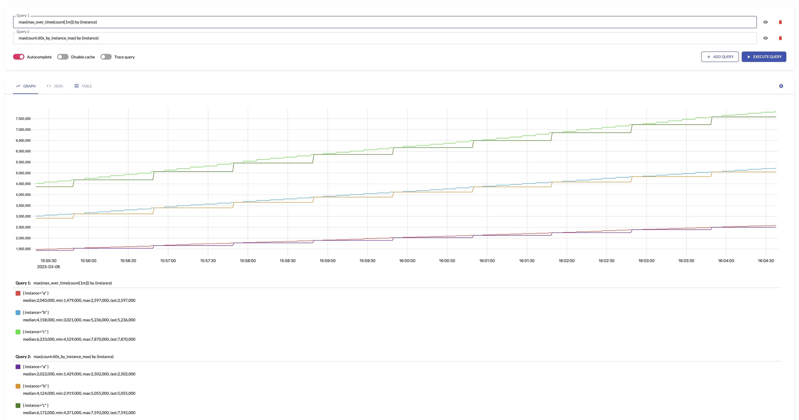

The aggregations are calculated during the [`interval`](../#interval) and then sent to the storage once
per [`interval`](../#interval). The aggregated samples are named according to [`output metric naming`](../#output-metric-names).
If [`by`](../#by) and [`without`](../#without) lists are set then the [`aggregation by labels`](../#aggregating-by-labels) is performed additionally to aggregation by `interval`.

Below are aggregation functions that can be set in the [`outputs`](../#outputs):

## avg
`avg` returns the average over input [sample values](https://docs.victoriametrics.com/keyconcepts#raw-samples).
`avg` makes sense only for aggregating [gauges](https://docs.victoriametrics.com/keyconcepts#gauge).

For example, see below time series produced by config with [`aggregation interval:`](../#interval) `1m` and [`by:`](../#by) `[instance]` and  the regular query:


 
### Example

```yaml
match:
- some_counter
interval: 1m
outputs:
- avg
```

### MetricsQL

```metricsql
sum(sum_over_time(some_metric[interval])) / sum(count_over_time(some_metric[5m]))
```

### See also

- [`min`](#min)
- [`max`](#max)
- [`sum_samples`](#sum_samples)
- [`count_samples`](#count_samples)

## count_samples

`count_samples` counts the number of input [samples](https://docs.victoriametrics.com/keyconcepts#raw-samples) over the given [`interval`](../#interval).

### Example

```yaml
match:
- some_counter
interval: 1m
outputs:
- count_samples
```

### MetricsQL
  
```metricsql
sum(count_over_time(some_metric[interval]))
```

### See also

- [`count_series`](#count_series)
- [`sum_samples`](#sum_samples)

## count_series

`count_series` counts the number of unique [time series](https://docs.victoriametrics.com/keyconcepts#time-series) over the given [`interval`](../#interval).

### Example

```yaml
match:
- some_counter
interval: 1m
outputs:
- count_series
```

### MetricsQL

```metricsql
count(last_over_time(some_metric[interval]))
```

### See also

- [`count_samples`](#count_samples)
- [`unique_samples`](#unique_samples)

## histogram_bucket

`histogram_bucket` returns [VictoriaMetrics histogram buckets](https://valyala.medium.com/improving-histogram-usability-for-prometheus-and-grafana-bc7e5df0e350)
  for the input [sample values](https://docs.victoriametrics.com/keyconcepts#raw-samples) over the given [`interval`](../#interval).
`histogram_bucket` makes sense only for aggregating [gauges](https://docs.victoriametrics.com/keyconcepts#gauge).
See how to aggregate regular histograms [here](#aggregating-histograms).

The results of `histogram_bucket` is equal to the following [MetricsQL](../../MetricsQL.md) query:

Aggregating irregular and sporadic metrics (received from [Lambdas](https://aws.amazon.com/lambda/)
or [Cloud Functions](https://cloud.google.com/functions)) can be controlled via [staleness_interval](#staleness) option.

### Example

```yaml
match:
- some_histogram_bucket
interval: 1m
outputs:
- histogram_bucket
```

### MetricsQL

```metricsql
sum(histogram_over_time(some_histogram_bucket[1m])) by (vmrange)
```

### See also

- [quantiles](#quantiles)
- [min](#min)
- [max](#max)
- [avg](#avg)

## increase

`increase` returns the increase of input [time series](https://docs.victoriametrics.com/keyconcepts#time-series) over the given [`interval`](../#interval).
`increase` makes sense only for aggregating [counters](https://docs.victoriametrics.com/keyconcepts#counter).
   
`increase` assumes that all the counters start from 0. For example, if the first seen sample for new [time series](https://docs.victoriametrics.com/keyconcepts#time-series)
is `10`, then `increase` assumes that the time series has been increased by `10`. If you need ignoring the first sample for new time series,
then take a look at [increase_prometheus](#increase_prometheus).
  
For example, see below time series produced by config with [`aggregation interval`](../#interval) `1m` and `by: ["instance"]` and the regular query:


Aggregating irregular and sporadic metrics (received from [Lambdas](https://aws.amazon.com/lambda/)
or [Cloud Functions](https://cloud.google.com/functions)) can be controlled via [staleness_interval](../#staleness") option.

### Example

```yaml
match:
- some_counter
interval: 2m
outputs:
- increase
```

### MetricsQL
   
```metricsql
sum(increase_pure(some_counter[2m]))
```

### See also

- [`increase_prometheus`](#increase_prometheus)
- [`total`](#total)

## increase_prometheus

`increase_prometheus` returns the increase of input [time series](https://docs.victoriametrics.com/keyconcepts#time-series) over the given [`interval`](../#interval).
`increase_prometheus` makes sense only for aggregating [counters](https://docs.victoriametrics.com/keyconcepts#counter).

`increase_prometheus` skips the first seen sample value per each [time series](https://docs.victoriametrics.com/keyconcepts#time-series).
If you need taking into account the first sample per time series, then take a look at [increase](../#increase).

Aggregating irregular and sporadic metrics (received from [Lambdas](https://aws.amazon.com/lambda/)
or [Cloud Functions](https://cloud.google.com/functions)) can be controlled via [staleness_interval](../#staleness) option.

### Example

```yaml
match:
- some_counter
interval: 5m
outputs:
- increase_prometheus
```

### MetricsQL

```metricsql
sum(increase_prometheus(some_counter[5m]))
```

### See also

- [increase](#increase)
- [total](#total)
- [total_prometheus](#total_prometheus)

## last
`last` returns the last input [sample value](https://docs.victoriametrics.com/keyconcepts#raw-samples) over the given [`interval`](../#interval).

### Example

```yaml
match:
- some_metric
interval: 5m
outputs:
- last
```

### MetricsQL

```metricsql
last_over_time(some_metric[interval])
```

### See also

- [`min`](#min)
- [`max`](#max)
- [`avg`](#avg).

## max

`max` returns the maximum input [sample value](https://docs.victoriametrics.com/keyconcepts#raw-samples) over the given [`interval`](../#interval).

For example, see below time series produced by config with [`aggregation interval:`](../#interval) `1m` and the regular query:



### Example

```yaml
match:
- some_metric
interval: 5m
outputs:
- max
```

### MetricsQL

```metricsql
max(max_over_time(some_metric[interval]))
```

### See also

- [`min`](#min)
- [`avg`](#avg)

## min

`min` returns the minimum input [sample value](https://docs.victoriametrics.com/keyconcepts#raw-samples) over the given `interval`.

For example, see below time series produced by config with [`aggregation interval:`](../#interval) `1m` and the regular query:


### Example

```yaml
match:
- some_metric
interval: 5m
outputs:
- min
```

### MetricsQL

```metricsql
min(min_over_time(some_metric[5m]))
```

### See also

- [`max`](#max)
- [`avg`](#avg)

## quantiles

`quantiles(phi1, ..., phiN)` returns [percentiles](https://en.wikipedia.org/wiki/Percentile) for the given `phi*`
over the input [sample values](https://docs.victoriametrics.com/keyconcepts#raw-samples) on the given `interval`.
`phi` must be in the range `[0..1]`, where `0` means `0th` percentile, while `1` means `100th` percentile.
`quantiles(...)` makes sense only for aggregating [gauges](https://docs.victoriametrics.com/keyconcepts#gauge).

### Example

```yaml
match:
- temperature
interval: 24h
outputs:
- quantiles(0.55, 0.99)
```

### MetricsQL

```metricsql
histogram_quantiles("quantile", 0.55, 0.99, sum(histogram_over_time(temperature[24h])) by (vmrange))
```

### See also

- [`histogram_bucket`](#histogram_bucket)
- [`min`](#min)
- [`avg`](#avg)

## rate_avg

`rate_avg` returns the average of average per-second of input [time series](https://docs.victoriametrics.com/keyconcepts#time-series) over the given [`interval`](../#interval).
`rate_avg` makes sense only for aggregating [counters](https://docs.victoriametrics.com/keyconcepts#counter).

See also [rate_sum](#rate_sum) and [total](#total) outputs.

### Example

```yaml
match:
- some_counter
interval: 5m
outputs:
- rate_avg
```

### MetricsQL

```metricsql
avg(rate(some_counter[5m]))
```

## rate_sum

`rate_sum` returns the sum of average per-second change of input [time series](https://docs.victoriametrics.com/keyconcepts#time-series) over the given [`interval`](../#interval).
`rate_sum` makes sense only for aggregating [counters](https://docs.victoriametrics.com/keyconcepts#counter).

### Example

```yaml
match:
- some_counter
interval: 2m
outputs:
- rate_sum
```

### MetricsQL

```metricsql
sum(rate(some_counter[2m]))
```

### See also

- [`rate_avg`](#rate_avg)
- [`total`](#total)

## stddev
`stddev` returns [standard deviation](https://en.wikipedia.org/wiki/Standard_deviation) for the input [sample values](https://docs.victoriametrics.com/keyconcepts#raw-samples)
over the given [`interval`](../#interval).
`stddev` makes sense only for aggregating [gauges](https://docs.victoriametrics.com/keyconcepts#gauge).

### Example

```yaml
match:
- some_metric
interval: 2m
outputs:
- stddev
```

### MetricsQL

```metricsql
histogram_stddev(sum(histogram_over_time(some_metric[2m])) by (vmrange))
```

### See also

- [`stdvar`](#stdvar)
- [`avg`](#avg).

## stdvar

`stdvar` returns [standard variance](https://en.wikipedia.org/wiki/Variance) for the input [sample values](https://docs.victoriametrics.com/keyconcepts#raw-samples)
over `he given [`interval`](../#interval).
`stdvar` makes sense only for aggregating [gauges](https://docs.victoriametrics.com/keyconcepts#gauge).

For example, see below time series produced by config with [`aggregation interval`](../#interval) `1m` and the regular query:


### Example

```yaml
match:
- some_metric
interval: 10m
outputs:
- stdvar
```

### MetricsQL

```metricsql 
histogram_stdvar(sum(histogram_over_time(some_metric[10m])) by (vmrange))
```

### See also

- [`stddev`](#stddev)
- [`avg`](#avg)

## sum_samples

`sum_samples` sums input [sample values](https://docs.victoriametrics.com/keyconcepts#raw-samples) over the given [`interval`](../#interval).
`sum_samples` makes sense only for aggregating [gauges](https://docs.victoriametrics.com/keyconcepts#gauge).

For example, see below time series produced by config with [`aggregation interval`](../#interval) `1m` and the regular query:


### Example

```yaml
match:
- some_metric
interval: 5m
outputs:
- sum_samples
```

### MetricsQL
 
```metricsql 
sum(sum_over_time(some_metric[5m]))
```

### See also

- [`count_samples`](#count_samples)
- [`count_series`](#count_series)

## total

`total` generates output [counter](https://docs.victoriametrics.com/keyconcepts#counter) by summing the input counters over the given [`interval`](../#interval).
`total` makes sense only for aggregating [counters](https://docs.victoriametrics.com/keyconcepts#counter).

`total` assumes that all the counters start from 0. For example, if the first seen sample for new [time series](https://docs.victoriametrics.com/keyconcepts#time-series)
is `10`, then `total` assumes that the time series has been increased by `10`. If you need ignoring the first sample for new time series,
then take a look at [total_prometheus](#total_prometheus).

For example, see below time series produced by config with [`aggregation interval:`](../#interval) `1m` and [`by:`](../#by) `[instance]` and the regular query:


`total` is not affected by [counter resets](https://docs.victoriametrics.com/keyconcepts#counter) -
it continues to increase monotonically with respect to the previous value.
The counters are most often reset when the application is restarted.

For example:


The same behavior occurs when creating or deleting new series in an aggregation group -
`total` output increases monotonically considering the values of the series set.
An example of changing a set of series can be restarting a pod in the Kubernetes.
This changes pod name label, but the `total` accounts for such a scenario and doesn't reset the state of aggregated metric.

Aggregating irregular and sporadic metrics (received from [Lambdas](https://aws.amazon.com/lambda/)
or [Cloud Functions](https://cloud.google.com/functions)) can be controlled via [staleness_interval](../#staleness) option.

### Example

```yaml
match:
- some_counter
interval: 1m
outputs:
- total
```

### MetricsQL

```metricsql
sum(running_sum(increase_pure(some_counter[1m])))
```

### See also

- [`total_prometheus`](#total_prometheus)
- [`increase`](#increase)
- [`increase_prometheus`](#increase_prometheus)

## total_prometheus

`total_prometheus` generates output [counter](https://docs.victoriametrics.com/keyconcepts#counter) by summing the input counters over the given [`interval`](../#interval).
`total_prometheus` makes sense only for aggregating [counters](https://docs.victoriametrics.com/keyconcepts#counter).

`total_prometheus` skips the first seen sample value per each [time series](https://docs.victoriametrics.com/keyconcepts#time-series).
If you need taking into account the first sample per time series, then take a look at [total](#total).

`total_prometheus` is not affected by [counter resets](https://docs.victoriametrics.com/keyconcepts#counter) -
it continues to increase monotonically with respect to the previous value.
The counters are most often reset when the application is restarted.

Aggregating irregular and sporadic metrics (received from [Lambdas](https://aws.amazon.com/lambda/)
or [Cloud Functions](https://cloud.google.com/functions)) can be controlled via [staleness_interval](#staleness) option.

### Example

```yaml
match:
- some_counter
interval: 1m
outputs:
- total_prometheus
```

### MetricsQL

```metricsql
sum(running_sum(increase_prometheus(some_counter[1m])))
```

### See also

- [`total`](#total)
- [`increase`](#increase)
- [`increase_prometheus`](#increase_prometheus)
  
## unique_samples

`unique_samples` counts the number of unique sample values over the given [`interval`](../#interval).
`unique_samples` makes sense only for aggregating [gauges](https://docs.victoriametrics.com/keyconcepts#gauge).

### Example

```yaml
match:
- some_metric
interval: 2m
outputs:
- unique_samples
```

### MetricsQL

```metricsql
count(count_values_over_time(some_metric[2m]))
```

### See also

- [`sum_samples`](#sum_samples)
- [`count_series`](#count_series)
