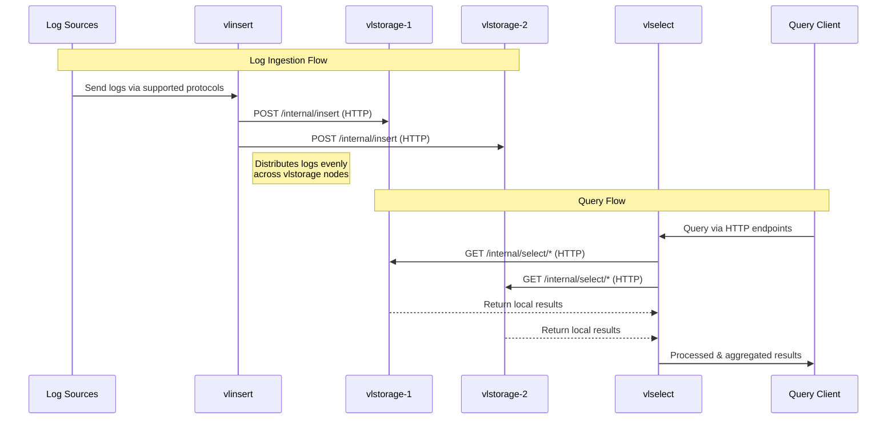
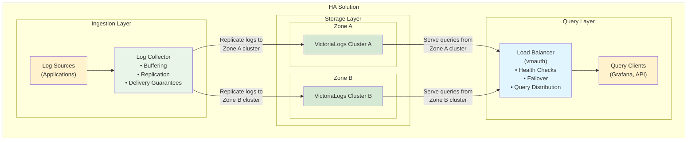

Cluster mode in VictoriaLogs provides horizontal scaling to many nodes when [single-node VictoriaLogs](https://docs.victoriametrics.com/victorialogs/)
reaches vertical scalability limits of a single host. If you have an ability to run a single-node VictoriaLogs on a host with more CPU / RAM / storage space / storage IO,
then it is preferred to do this instead of switching to cluster mode, since a single-node VictoriaLogs instance has the following advantages over cluster mode:

- It is easier to configure, manage and troubleshoot, since it consists of a single self-contained component.
- It provides better performance and capacity on the same hardware, since it doesn't need
  to transfer data over the network between cluster components.

The migration path from a single-node VictoriaLogs to cluster mode is very easy - just [upgrade](https://docs.victoriametrics.com/victorialogs/#upgrading)
a single-node VictoriaLogs executable to the [latest available release](https://docs.victoriametrics.com/victorialogs/changelog/) and add it to the list of `vlstorage` nodes
passed via `-storageNode` command-line flag to `vlinsert` and `vlselect` components of the cluster mode. See [cluster architecture](#architecture)
for more details about VictoriaLogs cluster components.

See [quick start guide](#quick-start) on how to start working with VictoriaLogs cluster.

## Architecture

VictoriaLogs in cluster mode is composed of three main components: `vlinsert`, `vlselect`, and `vlstorage`.



- `vlinsert` handles log ingestion via [all supported protocols](https://docs.victoriametrics.com/victorialogs/data-ingestion/).  
  It distributes incoming logs evenly across `vlstorage` nodes, as specified by the `-storageNode` command-line flag.

- `vlselect` receives queries through [all supported HTTP query endpoints](https://docs.victoriametrics.com/victorialogs/querying/).  
  It fetches the required data from the configured `vlstorage` nodes, processes the queries, and returns the results.

- `vlstorage` performs two key roles:
  - It stores logs received from `vlinsert` at the directory defined by the `-storageDataPath` flag.  
    See [storage configuration docs](https://docs.victoriametrics.com/victorialogs/#storage) for details.
  - It handles queries from `vlselect` by retrieving and transforming the requested data locally before returning results.

Each `vlstorage` node operates as a self-contained VictoriaLogs instance.  
Refer to the [single-node and cluster mode duality](#single-node-and-cluster-mode-duality) documentation for more information.  
This design allows you to reuse existing single-node VictoriaLogs instances by listing them in the `-storageNode` flag for `vlselect`, enabling unified querying across all nodes.

All VictoriaLogs components are horizontally scalable and can be deployed on hardware best suited to their respective workloads.  
`vlinsert` and `vlselect` can be run on the same node, which allows the minimal cluster to consist of just one `vlstorage` node and one node acting as both `vlinsert` and `vlselect`.  
However, for production environments, it is recommended to separate `vlinsert` and `vlselect` roles to avoid resource contention — for example, to prevent heavy queries from interfering with log ingestion.

Communication between `vlinsert` / `vlselect` and `vlstorage` is done via HTTP over the port specified by the `-httpListenAddr` flag:

- `vlinsert` sends data to the `/internal/insert` endpoint on `vlstorage`.
- `vlselect` sends queries to endpoints under `/internal/select/` on `vlstorage`.

This HTTP-based communication model allows you to use reverse proxies for authorization, routing, and encryption between components.  
Use of [vmauth](https://docs.victoriametrics.com/victoriametrics/vmauth/) is recommended for managing access control.

For advanced setups, refer to the [multi-level cluster setup](#multi-level-cluster-setup) documentation.

## High availability

In the cluster setup, the following rules apply:

- The `vlselect` component requires **all relevant vlstorage nodes to be available** in order to return complete and correct query results. 

  - If even one of the vlstorage nodes is temporarily unavailable, `vlselect` cannot safely return a full response, since some of the required data may reside on the missing node. Rather than risk delivering partial or misleading query results, which can cause confusion, trigger false alerts, or produce incorrect metrics, VictoriaLogs chooses to return an error instead. 

- The `vlinsert` component continues to function normally when some vlstorage nodes are unavailable. It automatically routes new logs to the remaining available nodes to ensure that data ingestion remains uninterrupted and newly received logs are not lost.

> [!NOTE] Insight  
> In most real-world cases, `vlstorage` nodes become unavailable during planned maintenance such as upgrades, config changes, or rolling restarts. These are typically infrequent (weekly or monthly) and brief (a few minutes).  
> A short period of query downtime during such events is acceptable and fits well within most SLAs. For example, 60 minutes of downtime per month still provides around 99.86% availability, which often outperforms complex HA setups that rely on opaque auto-recovery and may fail unpredictably.

VictoriaLogs itself does not handle replication at the storage level. Instead, it relies on an external log shipper, such as [vector](https://docs.victoriametrics.com/victorialogs/data-ingestion/vector/) or [vlagent](https://github.com/VictoriaMetrics/VictoriaMetrics/pull/9034), to send the same log stream to multiple independent VictoriaLogs instances:



In this HA solution:

- A log shipper at the top receives logs and replicates them in parallel to two VictoriaLogs clusters.
  - If one cluster fails completely (i.e., **all** of its storage nodes become unavailable), the log shipper continues to send logs to the remaining healthy cluster and buffers any logs that cannot be delivered. When the failed cluster becomes available again, the log shipper resumes sending both buffered and new logs to it.
- On the read path, a load balancer (e.g., vmauth) sits in front of the VictoriaLogs clusters and routes query requests to any healthy cluster.
  - If one cluster fails (i.e., **at least one** of its storage nodes is unavailable), the load balancer detects this and automatically redirects all query traffic to the remaining healthy cluster.

There's no hidden coordination logic or consensus algorithm. You can scale it horizontally and operate it safely, even in bare-metal Kubernetes clusters using local PVs, as long as the log shipper handles reliable replication and buffering.
  
## Single-node and cluster mode duality

Every `vlstorage` node can be used as a single-node VictoriaLogs instance:

- It can accept logs via [all the supported data ingestion protocols](https://docs.victoriametrics.com/victorialogs/data-ingestion/).
- It can accept `select` queries via [all the supported HTTP querying endpoints](https://docs.victoriametrics.com/victorialogs/querying/).

A single-node VictoriaLogs instance can be used as `vlstorage` node in VictoriaLogs cluster:

- It accepts data ingestion requests from `vlinsert` via `/internal/insert` HTTP endpoint at the TCP port specified via `-httpListenAddr` command-line flag.
- It accepts queries from `vlselect` via `/internal/select/*` HTTP endpoints at the TCP port specified via `-httpListenAddr` command-line flags.

It is possible to disallow access to `/internal/insert` and `/internal/select/*` endpoints at single-node VictoriaLogs instance
by running it with `-internalinsert.disable` and `-internalselect.disable` command-line flags.

## Multi-level cluster setup

- `vlinsert` can send the ingested logs to other `vlinsert` nodes if they are specified via `-storageNode` command-line flag.
  This allows building multi-level data ingestion schemes when top-level `vlinsert` spreads the incoming logs evenly among multiple lower-level clusters of VictoriaLogs.

- `vlselect` can send queries to other `vlselect` nodes if they are specified via `-storageNode` command-line flag.
  This allows building multi-level cluster schemes when top-level `vlselect` queries multiple lower-level clusters of VictoriaLogs.

See [security docs](#security) on how to protect communications between multiple levels of `vlinsert` and `vlselect` nodes.

## Security

All the VictoriaLogs cluster components must run in protected internal network without direct access from the Internet.
`vlstorage` must have no access from the Internet. HTTP authorization proxies such as [vmauth](https://docs.victoriametrics.com/victoriametrics/vmauth/)
must be used in front of `vlinsert` and `vlselect` for authorizing access to these components from the Internet.

By default `vlinsert` and `vlselect` communicate with `vlstorage` via unencrypted HTTP. This is OK if all these components are located
in the same protected internal network. This isn't OK if these components communicate over the Internet, since a third party can intercept / modify
the transferred data. It is recommended switching to HTTPS in this case:

- Specify `-tls`, `-tlsCertFile` and `-tlsKeyFile` command-line flags at `vlstorage`, so it accepts incoming requests over HTTPS instead of HTTP at the corresponding `-httpListenAddr`:

  ```sh
  ./victoria-logs-prod -httpListenAddr=... -storageDataPath=... -tls -tlsCertFile=/path/to/certfile -tlsKeyFile=/path/to/keyfile
  ```

- Specify `-storageNode.tls` command-line flag at `vlinsert` and `vlselect`, which communicate with the `vlstorage` over untrusted networks such as Internet:

  ```sh
  ./victoria-logs-prod -storageNode=... -storageNode.tls
  ```

It is also recommended authorizing HTTPS requests to `vlstorage` via Basic Auth:

- Specify `-httpAuth.username` and `-httpAuth.password` command-line flags at `vlstorage`, so it verifies the Basic Auth username + password in HTTPS requests received via `-httpListenAddr`:

  ```sh
  ./victoria-logs-prod -httpListenAddr=... -storageDataPath=... -tls -tlsCertFile=... -tlsKeyFile=... -httpAuth.username=... -httpAuth.password=...
  ```

- Specify `-storageNode.username` and `-storageNode.password` command-line flags at `vlinsert` and `vlselect`, which communicate with the `vlostorage` over untrusted networks:

  ```sh
  ./victoria-logs-prod -storageNode=... -storageNode.tls -storageNode.username=... -storageNode.password=...
  ```

Another option is to use third-party HTTP proxies such as [vmauth](https://docs.victoriametrics.com/victoriametrics/vmauth/), `nginx`, etc. for authorizing and encrypting communications
between VictoriaLogs cluster components over untrusted networks.

By default, all the logs component (vlinsert, vlselect, vlstorage) support all the HTTP endpoints including `/insert/*` and `/select/*`. It's recommended to disable select endpoints on `vlinsert` and insert endpoints on `vlselect`:

```sh
# Disable select endpoints on vlinsert
./victoria-logs-prod -storageNode=... -select.disable

# Disable insert endpoints on vlselect
./victoria-logs-prod -storageNode=... -insert.disable
```

This helps prevent sending select requests to `vlinsert` nodes or insert requests to `vlselect` nodes in case of misconfiguration in the authorization proxy in front of the `vlinsert` and `vlselect` nodes.

## Quick start

The following guide covers the following topics for Linux host:

- How to download VictoriaLogs executable.
- How to start VictoriaLogs cluster, which consists of two `vlstorage` nodes, a single `vlinsert` node and a single `vlselect` node
  running on a localhost according to [cluster architecture](#architecture).
- How to ingest logs into the cluster.
- How to query the ingested logs.

Download and unpack the latest VictoriaLogs release:

```sh
curl -L -O https://github.com/VictoriaMetrics/VictoriaMetrics/releases/download/v1.24.0-victorialogs/victoria-logs-linux-amd64-v1.24.0-victorialogs.tar.gz
tar xzf victoria-logs-linux-amd64-v1.24.0-victorialogs.tar.gz
```

Start the first [`vlstorage` node](#architecture), which accepts incoming requests at the port `9491` and stores the ingested logs at `victoria-logs-data-1` directory:

```sh
./victoria-logs-prod -httpListenAddr=:9491 -storageDataPath=victoria-logs-data-1 &
```

This command and all the following commands start cluster components as background processes.
Use `jobs`, `fg`, `bg` commands for manipulating the running background processes. Use `kill` command and/or `Ctrl+C` for stopping the running processes when they no longer needed.
See [these docs](https://tldp.org/LDP/abs/html/x9644.html) for details.

Start the second `vlstorage` node, which accepts incoming requests at the port `9492` and stores the ingested logs at `victoria-logs-data-2` directory:

```sh
./victoria-logs-prod -httpListenAddr=:9492 -storageDataPath=victoria-logs-data-2 &
```

Start `vlinsert` node, which [accepts logs](https://docs.victoriametrics.com/victorialogs/data-ingestion/) at the port `9481` and spreads them evenly among the two `vlstorage` nodes started above:

```sh
./victoria-logs-prod -httpListenAddr=:9481 -storageNode=localhost:9491,localhost:9492 &
```

Start `vlselect` node, which [accepts incoming queries](https://docs.victoriametrics.com/victorialogs/querying/) at the port `9471` and requests the needed data from `vlstorage` nodes started above:

```sh
./victoria-logs-prod -httpListenAddr=:9471 -storageNode=localhost:9491,localhost:9492 &
```

Note that all the VictoriaLogs cluster components - `vlstorage`, `vlinsert` and `vlselect` - share the same executable - `victoria-logs-prod`.
Their roles depend on whether the `-storageNode` command-line flag is set - if this flag is set, then the executable runs in `vlinsert` and `vlselect` modes.
Otherwise, it runs in `vlstorage` mode, which is identical to a [single-node VictoriaLogs mode](https://docs.victoriametrics.com/victorialogs/).

Let's ingest some logs (aka [wide events](https://jeremymorrell.dev/blog/a-practitioners-guide-to-wide-events/))
from [GitHub archive](https://www.gharchive.org/) into the VictoriaLogs cluster with the following command:

```sh
curl -s https://data.gharchive.org/$(date -d '2 days ago' '+%Y-%m-%d')-10.json.gz \
        | curl -T - -X POST -H 'Content-Encoding: gzip' 'http://localhost:9481/insert/jsonline?_time_field=created_at&_stream_fields=type'
```

Let's query the ingested logs via [`/select/logsql/query` HTTP endpoint](https://docs.victoriametrics.com/victorialogs/querying/#querying-logs).
For example, the following command returns the number of stored logs in the cluster:

```sh
curl http://localhost:9471/select/logsql/query -d 'query=* | count()'
```

See [these docs](https://docs.victoriametrics.com/victorialogs/querying/#command-line) for details on how to query logs from command line.

Logs also can be explored and queried via [built-in Web UI](https://docs.victoriametrics.com/victorialogs/querying/#web-ui).
Open `http://localhost:9471/select/vmui/` in the web browser, select `last 7 days` time range in the top right corner and explore the ingested logs.
See [LogsQL docs](https://docs.victoriametrics.com/victorialogs/logsql/) to familiarize yourself with the query language.

Every `vmstorage` node can be queried individually because [it is equivalent to a single-node VictoriaLogs](#single-node-and-cluster-mode-duality).
For example, the following command returns the number of stored logs at the first `vmstorage` node started above:

```sh
curl http://localhost:9491/select/logsql/query -d 'query=* | count()'
```

It is recommended reading [key concepts](https://docs.victoriametrics.com/victorialogs/keyconcepts/) before you start working with VictoriaLogs.

See also [security docs](#security).

## Performance tuning

Cluster components of VictoriaLogs automatically adjust their settings for the best performance and the lowest resource usage on the given hardware.
So there is no need in any tuning of these components in general. The following options can be used for achieving higher performance / lower resource
usage on systems with constrained resources:

- `vlinsert` limits the number of concurrent requests to every `vlstorage` node. The default concurrency works great in most cases.
  Sometimes it can be increased via `-insert.concurrency` command-line flag at `vlinsert` in order to achieve higher data ingestion rate
  at the cost of higher RAM usage at `vlinsert` and `vlstorage` nodes.

- `vlinsert` compresses the data sent to `vlstorage` nodes in order to reduce network bandwidth usage at the cost of slightly higher CPU usage
  at `vlinsert` ant `vlstorage` nodes. The compression can be disabled by passing `-insert.disableCompression` command-line flag to `vlinsert`.
  This reduces CPU usage at `vlinsert` and `vlstorage` nodes at the cost of significantly higher network bandwidth usage.

- `vlselect` requests compressed data from `vlstorage` nodes in order to reduce network bandwidth usage at the cost of slightly higher CPU usage
  at `vlselect` and `vlstorage` nodes. The compression can be disabled by passing `-select.disableCompression` command-line flag to `vlselect`.
  This reduces CPU usage at `vlselect` and `vlstorage` nodes at the cost of significanlty higher network bandwidth usage.

## Advanced usage

Cluster components of VictoriaLogs provide various settings, which can be configured via command-line flags if needed.
Default values for all the command-line flags work great in most cases, so it isn't recommended
tuning them without the real need. See [the list of supported command-line flags at VictoriaLogs](https://docs.victoriametrics.com/victorialogs/#list-of-command-line-flags).
