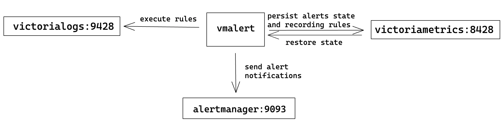

[vmalert](https://docs.victoriametrics.com/vmalert/){} integrates with VictoriaLogs {} via stats APIs [`/select/logsql/stats_query`](https://docs.victoriametrics.com/victorialogs/querying/#querying-log-stats)
and [`/select/logsql/stats_query_range`](https://docs.victoriametrics.com/victorialogs/querying/#querying-log-range-stats).
These endpoints return the log stats in a format compatible with [Prometheus querying API](https://prometheus.io/docs/prometheus/latest/querying/api/#instant-queries). 
It allows using VictoriaLogs as the datasource in vmalert, creating alerting and recording rules via [LogsQL](https://docs.victoriametrics.com/victorialogs/logsql/).

_Note: This page provides only integration instructions for vmalert and VictoriaLogs. See the full textbook for vmalert [here](https://docs.victoriametrics.com/vmalert)._

## Quick Start

Run vmalert with the following settings:
```sh
./bin/vmalert -rule=alert.rules                  \  # Path to the files or http url with alerting and/or recording rules in YAML format.
    -datasource.url=http://victorialogs:9428     \  # VictoriaLogs address.
    -notifier.url=http://alertmanager:9093       \  # AlertManager URL (required if alerting rules are used)
    -remoteWrite.url=http://victoriametrics:8428 \  # Remote write compatible storage to persist recording rules and alerts state info
    -remoteRead.url=http://victoriametrics:8428  \  # Prometheus HTTP API compatible datasource to restore alerts state from
```

> Note: By default, vmalert assumes all configured rules have `prometheus` type and will validate them accordingly. 
> For rules in [LogsQL](https://docs.victoriametrics.com/victorialogs/logsql/) specify `type: vlogs` on [Group level](#groups). 
> Or set `-rule.defaultRuleType=vlogs` cmd-line flag to apply `type: vlogs` to all configured groups.

Each `-rule` file may contain arbitrary number of [groups](https://docs.victoriametrics.com/vmalert/#groups). 
See examples in [Groups](#groups) section. See the full list of configuration flags and their descriptions in [configuration](#configuration) section.

With configuration example above, vmalert will perform the following interactions:


1. Rules listed in `-rule` file are executed against VictoriaLogs service configured via `-datasource.url`;
1. Triggered alerting notifications are sent to [Alertmanager](https://github.com/prometheus/alertmanager) service configured via `-notifier.url`;
1. Results of recording rules expressions and alerts state are persisted to Prometheus-compatible remote-write endpoint
   (i.e. VictoriaMetrics) configured via `-remoteWrite.url`;
1. On vmalert restarts, alerts state [can be restored](https://docs.victoriametrics.com/vmalert/#alerts-state-on-restarts)
   by querying Prometheus-compatible HTTP API endpoint (i.e. VictoriaMetrics) configured via `-remoteRead.url`.

## Configuration

### Flags

For a complete list of command-line flags, visit https://docs.victoriametrics.com/vmalert/#flags or execute `./vmalert --help` command.
The following are key flags related to integration with VictoriaLogs:

```shellhelp
-datasource.url string
   Datasource address supporting log stats APIs, which can be a single VictoriaLogs node or a proxy in front of VictoriaLogs. Supports address in the form of IP address with a port (e.g., http://127.0.0.1:8428) or DNS SRV record.
-notifier.url array
   Prometheus Alertmanager URL, e.g. http://127.0.0.1:9093. List all Alertmanager URLs if it runs in the cluster mode to ensure high availability.
   Supports an array of values separated by comma or specified via multiple flags.
   Value can contain comma inside single-quoted or double-quoted string, {}, [] and () braces.
-remoteWrite.url string
   Optional URL to VictoriaMetrics or vminsert where to persist alerts state and recording rules results in form of timeseries. Supports address in the form of IP address with a port (e.g., http://127.0.0.1:8428) or DNS SRV record. For example, if -remoteWrite.url=http://127.0.0.1:8428 is specified, then the alerts state will be written to http://127.0.0.1:8428/api/v1/write . See also -remoteWrite.disablePathAppend, '-remoteWrite.showURL'.
-remoteRead.url string
   Optional URL to datasource compatible with MetricsQL. It can be single node VictoriaMetrics or vmselect.Remote read is used to restore alerts state.This configuration makes sense only if vmalert was configured with `remoteWrite.url` before and has been successfully persisted its state. Supports address in the form of IP address with a port (e.g., http://127.0.0.1:8428) or DNS SRV record. See also '-remoteRead.disablePathAppend', '-remoteRead.showURL'.
-rule array
   Path to the files or http url with alerting and/or recording rules in YAML format.
   Supports hierarchical patterns and regexpes.
   Examples:
    -rule="/path/to/file". Path to a single file with alerting rules.
    -rule="http://<some-server-addr>/path/to/rules". HTTP URL to a page with alerting rules.
    -rule="dir/*.yaml" -rule="/*.yaml" -rule="gcs://vmalert-rules/tenant_%{TENANT_ID}/prod".
    -rule="dir/**/*.yaml". Includes all the .yaml files in "dir" subfolders recursively.
   Rule files support YAML multi-document. Files may contain %{ENV_VAR} placeholders, which are substituted by the corresponding env vars.
   Enterprise version of vmalert supports S3 and GCS paths to rules.
   For example: gs://bucket/path/to/rules, s3://bucket/path/to/rules
   S3 and GCS paths support only matching by prefix, e.g. s3://bucket/dir/rule_ matches
   all files with prefix rule_ in folder dir.
   Supports an array of values separated by comma or specified via multiple flags.
   Value can contain comma inside single-quoted or double-quoted string, {}, [] and () braces.
-rule.defaultRuleType
   Default type for rule expressions, can be overridden by type parameter inside the rule group. Supported values: "graphite", "prometheus" and "vlogs".
   Default is "prometheus", change it to "vlogs" if all of the rules are written with LogsQL.
-rule.evalDelay time
   Adjustment of the time parameter for rule evaluation requests to compensate intentional data delay from the datasource. Normally, should be equal to `-search.latencyOffset` (cm d-line flag configured for VictoriaMetrics single-node or vmselect).
   Since there is no intentional search delay in VictoriaLogs, `-rule.evalDelay` can be reduced to a few seconds to accommodate network and ingestion time.
```

See full list of configuration options [here](https://docs.victoriametrics.com/vmalert/#configuration).

### Groups

Check the complete group attributes [here](https://docs.victoriametrics.com/vmalert/#groups).

#### Alerting rules

Examples:
```yaml
groups:
  - name: ServiceLog
    type: vlogs
    interval: 5m
    rules:
      - alert: HasErrorLog
        expr: 'env: "prod" AND status:~"error|warn" | stats by (service, kubernetes.pod) count() as errorLog | filter errorLog:>0'
        annotations:
          description: 'Service {{$labels.service}} (pod {{ index $labels "kubernetes.pod" }}) generated {{$labels.errorLog}} error logs in the last 5 minutes'

  - name: ServiceRequest
    type: vlogs
    interval: 5m
    rules:
      - alert: TooManyFailedRequest
        expr: '* | extract "ip=<ip> " | extract "status_code=<code>;" | stats by (ip) count() if (code:~4.*) as failed, count() as total| math failed / total as failed_percentage| filter failed_percentage :> 0.01 | fields ip,failed_percentage'
        annotations:
          description: "Connection from address {{$labels.ip}} has {{$value}}% failed requests in last 5 minutes"
```

#### Recording rules

Examples:
```yaml
groups:
  - name: RequestCount
    type: vlogs
    interval: 5m
    rules:
      - record: nginxRequestCount
        expr: 'env: "test" AND service: "nginx" | stats count(*) as requests'
        annotations:
          description: "Service nginx on env test accepted {{$labels.requests}} requests in the last 5 minutes"
      - record: prodRequestCount
        expr: 'env: "prod" | stats by (service) count(*) as requests'
        annotations:
          description: "Service {{$labels.service}} on env prod accepted {{$labels.requests}} requests in the last 5 minutes"
```

## Time filter

It's recommended to omit the [time filter](https://docs.victoriametrics.com/victorialogs/logsql/#time-filter) in rule expression.
By default, vmalert automatically appends the time filter `_time: <group_interval>` to the expression.
For instance, the rule below will be evaluated every 5 minutes, and will return the result with logs from the last 5 minutes:
```yaml
groups:
    - name: Requests
      type: vlogs
      interval: 5m
      rules:
        - alert: TooManyFailedRequest
          expr: '* | extract "ip=<ip> " | extract "status_code=<code>;" | stats by (ip) count() if (code:~4.*) as failed, count() as total| math failed / total as failed_percentage| filter failed_percentage :> 0.01 | fields ip,failed_percentage'
          annotations: 
            description: "Connection from address {{$labels.ip}} has {{$value}}% failed requests in last 5 minutes"
```

User can specify a customized time filter if needed. For example, rule below will be evaluated every 5 minutes,
but will calculate result over the logs from the last 10 minutes.
```yaml
groups:
    - name: Requests
      type: vlogs
      interval: 5m
      rules:
        - alert: TooManyFailedRequest
          expr: '_time: 10m | extract "ip=<ip> " | extract "status_code=<code>;" | stats by (ip) count() if (code:~4.*) as failed, count() as total| math failed / total as failed_percentage| filter failed_percentage :> 0.01 | fields ip,failed_percentage'
          annotations:
           description: "Connection from address {{$labels.ip}} has {{$value}}% failed requests in last 10 minutes"
```

_Please note, vmalert doesn't support [backfilling](#rules-backfilling) for rules with a customized time filter now. (Might be added in future)._

## Rules backfilling

vmalert supports alerting and recording rules backfilling (aka replay) against VictoriaLogs as the datasource. 
```sh
./bin/vmalert -rule=path/to/your.rules \        # path to files with rules you usually use with vmalert
    -datasource.url=http://localhost:9428 \     # VictoriaLogs address.
    -rule.defaultRuleType=vlogs \               # Set default rule type to VictoriaLogs.
    -remoteWrite.url=http://localhost:8428 \    # Remote write compatible storage to persist rules and alerts state info
    -replay.timeFrom=2021-05-11T07:21:43Z \     # to start replay from
    -replay.timeTo=2021-05-29T18:40:43Z         # to finish replay by, is optional
```

See more details about backfilling [here](https://docs.victoriametrics.com/vmalert/#rules-backfilling).

## Performance tip

LogsQL allows users to obtain multiple stats from a single expression. For instance, the following query calculates 
50th, 90th and 99th percentiles for the `request_duration_seconds` field over logs for the last 5 minutes:

```logsql
_time:5m | stats
  quantile(0.5, request_duration_seconds) p50,
  quantile(0.9, request_duration_seconds) p90,
  quantile(0.99, request_duration_seconds) p99
```

This expression can also be used in recording rules as follows:
```yaml
groups:
  - name: requestDuration
    type: vlogs
    interval: 5m
    rules:
      - record: requestDurationQuantile
        expr: '* | stats by (service) quantile(0.5, request_duration_seconds) p50, quantile(0.9, request_duration_seconds) p90, quantile(0.99, request_duration_seconds) p99'
```

This creates three metrics for each service:
```
requestDurationQuantile{stats_result="p50", service="service-1"}
requestDurationQuantile{stats_result="p90", service="service-1"}
requestDurationQuantile{stats_result="p99", service="service-1"}

requestDurationQuantile{stats_result="p50", service="service-2"}
requestDurationQuantile{stats_result="p90", service="service-2"}
requestDurationQuantile{stats_result="p00", service="service-2"}
...
```

For additional tips on writing LogsQL, refer to this [doc](https://docs.victoriametrics.com/victorialogs/logsql/#performance-tips).

## Frequently Asked Questions

### How to use [multitenancy](https://docs.victoriametrics.com/victorialogs/#multitenancy) in rules?

vmalert doesn't support multi-tenancy for VictoriaLogs in the same way as it [supports it for VictoriaMetrics in ENT version](https://docs.victoriametrics.com/vmalert/#multitenancy).
However, it is possible to specify the queried tenant from VictoriaLogs datasource via `headers` param in [Group config](https://docs.victoriametrics.com/vmalert/#groups).
For example, the following config will execute all the rules within the group against tenant with `AccountID=1` and `ProjectID=2`:
```yaml
    groups:
    - name: MyGroup
      headers:
      - "AccountID: 1"
      - "ProjectID: 2"
      rules: ...
```
By default, vmalert persists all results to the specific tenant in VictoriaMetrics that specified by `-remotewrite.url`. For example, if the `-remotewrite.url=http://vminsert:8480/insert/0/prometheus/`, all data goes to tenant `0`.
To persist different rule results to different tenants in VictoriaMetrics, there are following approaches:
1. To use the [multitenant endpoint of vminsert](https://docs.victoriametrics.com/cluster-victoriametrics/#multitenancy-via-labels) as the `-remoteWrite.url`, and add tenant labels under the group configuration. 

    For example, run vmalert with:
    ```
    ./bin/vmalert -datasource.url=http://localhost:9428 -remoteWrite.url=http://vminsert:8480/insert/multitenant/prometheus ...
    ```
    With the rules below, `recordingTenant123` will be queried from VictoriaLogs tenant `123` and persisted to tenant `123` in VictoriaMetrics, while `recordingTenant123-456:789` will be queried from VictoriaLogs tenant `124` and persisted to tenant `456:789` in VictoriaMetrics.
    ```
    groups:
      - name: recordingTenant123
        type: vlogs
        headers:
          - "AccountID: 123"
        labels:
          vm_account_id: 123
        rules:
          - record: recordingTenant123
            expr: 'tags.path:/var/log/httpd OR tags.path:/var/log/nginx | stats by (tags.host) count() requests'
      - name: recordingTenant124-456:789
        type: vlogs
        headers:
          - "AccountID: 124"
        labels:
          vm_account_id: 456
          vm_project_id: 789
        rules:
        - record: recordingTenant124-456:789
            expr: 'tags.path:/var/log/httpd OR tags.path:/var/log/nginx | stats by (tags.host) count() requests'
    ```

2. To run [enterprise version of vmalert](https://docs.victoriametrics.com/enterprise/) with `-clusterMode` enabled, and specify tenant parameter per each group.

    For example, run vmalert with:
    ```
    ./bin/vmalert -datasource.url=http://localhost:9428 -clusterMode=true -remoteWrite.url=http://vminsert:8480/ ...
    ```
    With the rules below, `recordingTenant123` will be queried from VictoriaLogs tenant `123` and persisted to tenant `123` in VictoriaMetrics, while `recordingTenant123-456:789` will be queried from VictoriaLogs tenant `124` and persisted to tenant `456:789` in VictoriaMetrics.
    ```
    groups:
      - name: recordingTenant123
        type: vlogs
        headers:
          - "AccountID: 123"
        tenant: "123"
        rules:
          - record: recordingTenant123
            expr: 'tags.path:/var/log/httpd OR tags.path:/var/log/nginx | stats by (tags.host) count() requests'
      - name: recordingTenant124-456:789
        type: vlogs
        headers:
          - "AccountID: 124"
        tenant: "456:789"
        rules:
        - record: recordingTenant124-456:789
            expr: 'tags.path:/var/log/httpd OR tags.path:/var/log/nginx | stats by (tags.host) count() requests'
    ```

### How to use one vmalert for VictoriaLogs and VictoriaMetrics rules in the same time?

We recommend running separate instances of vmalert for VictoriaMetrics and VictoriaLogs.
However, vmalert allows having many groups with different rule types (`vlogs`, `prometheus`, `graphite`).
But only one `-datasource.url` cmd-line flag can be specified, so it can't be configured with more than 1 datasource.
VictoriaMetrics and VictoriaLogs datasources have different query path prefixes, so it is possible to use
[vmauth](https://docs.victoriametrics.com/vmauth/) to route requests of different types between datasources.
See example of vmauth config for such routing below:
```yaml
    unauthorized_user:
      url_map:
        - src_paths:
          - "/api/v1/query.*"
          url_prefix: "http://victoriametrics:8428"
        - src_paths:
          - "/select/logsql/.*"
          url_prefix: "http://victorialogs:9428"
```
Now, vmalert can be configured with `--datasource.url=http://vmauth:8427/` to send queries to vmauth, 
and vmauth will route them to the specified destinations as in configuration example above.
