The user management system enables admins to control user access and onboard and offboard users to the VictoriaMetrics Cloud. It organizes users according to their needs and role.

The document covers the following topics
- [User list](#user-list)
- [How to Add User](#how-to-add-user)
- [How to Update User](#how-to-update-user)
- [How to Delete User](#how-to-delete-user)
- [How to resend invitation](#how-to-resend-invitation)

## User list

It shows all users with different roles, and you can apply provided actions with them.

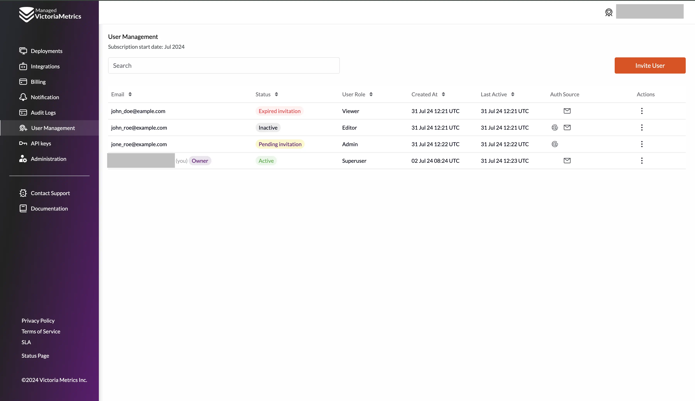

In the table, there is additional information about the users:

<table class="params">
  <tr>
   <td>Email:</td>
   <td>Registration user email</td>
  </tr>
  <tr>
   <td>Status:</td>
   <td>Active, Inactive or Pending Invitation</td>
  </tr>
  <tr>
   <td>User Role:</td>
   <td>Admin, Editor or Viewer</td>
  </tr>
  <tr>
   <td>Created At:</td>
   <td>When user was created</td>
  </tr>
  <tr>
   <td>Last Active:</td>
   <td>Last login date and time</td>
  </tr>
  <tr>
   <td>Auth method:</td>
   <td>Auth options to login into the VictoriaMetrics Cloud</td>
  </tr>
  <tr>
   <td>Actions:</td>
   <td>Actions to manipulate with users</td>
  </tr>
</table>

## How to Add User

Click on `Invite user` button 
the user invitation button and fill out the form in the modal, which will appear after you click. All fields are mandatory.

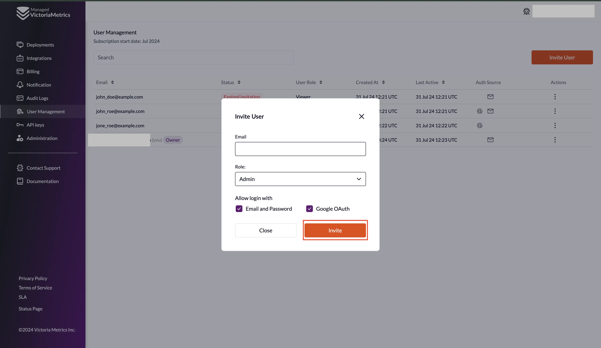

After filling out the form, click on the `Invite` button. 
The user will be saved, and an invitation email to the provided email address will be sent. As a confirmation, you will see the success message.

**The invitation link is only active for 24 hours.**

The user will be at Pending Invitation status. After accepting the invitation user status changes to Active.

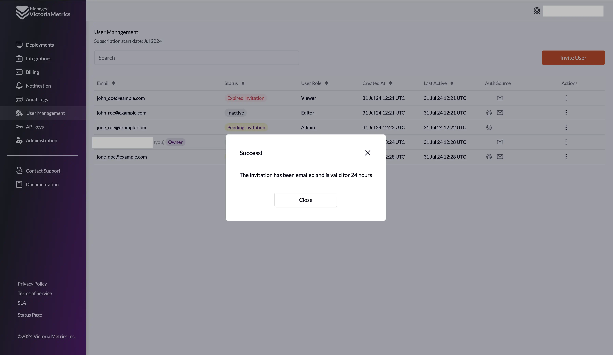

## How to Update User

To edit the user role and details, activate or deactivate a user, and click on

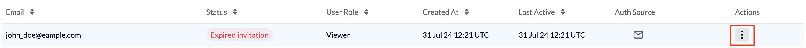

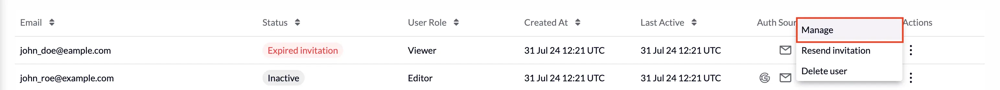

User editing form:

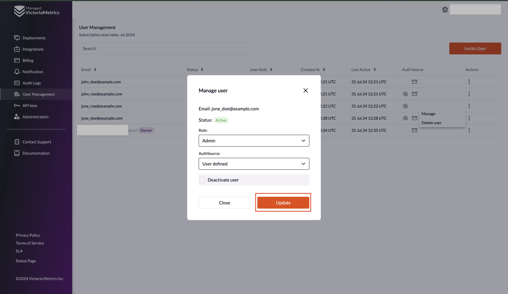

To save changes, click the `Update` button. If changes are saved successfully, you will see a message at the top of the page.

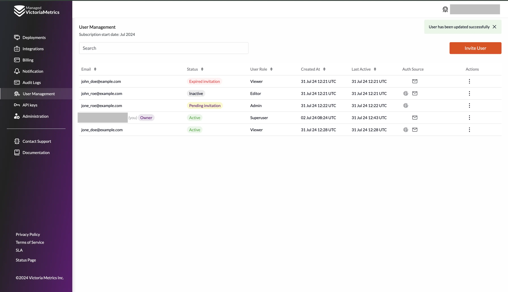

## How to Delete User

You can delete a user from your account. However, you will need to invite them again if you want to give them access.

Click on `Delete` button to delete the user.

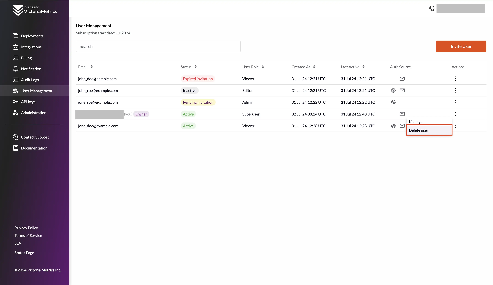

To confirm the deletion of a user, you will need to re-enter their email address and press the **Confirm** button

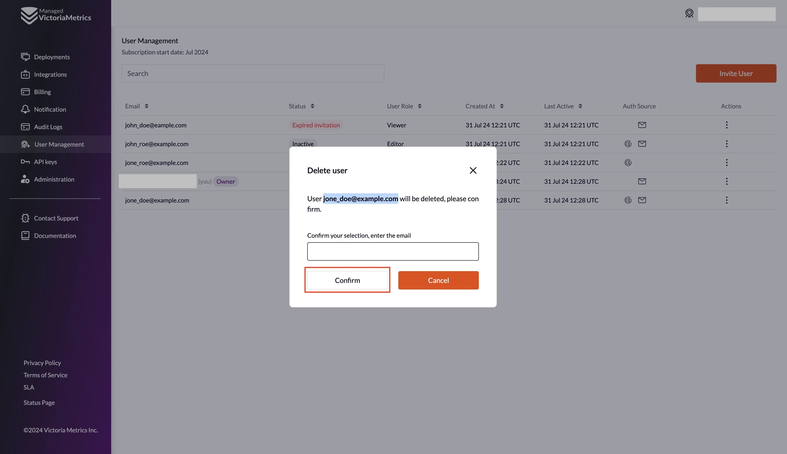

If the user is deleted successfully, you will see a success message

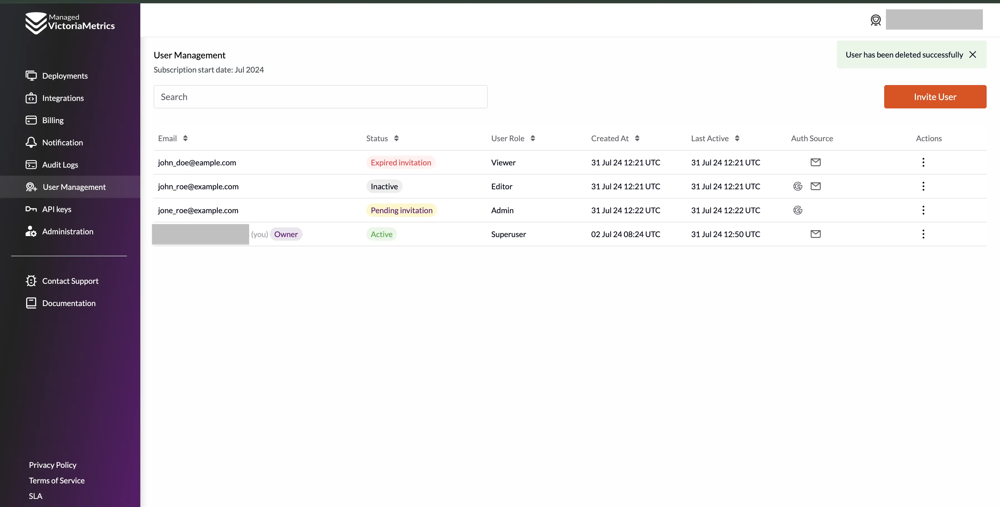

## How to resend invitation

If the invitation is expired, it is possible to resend email to the user

Click `Resend invitation` button

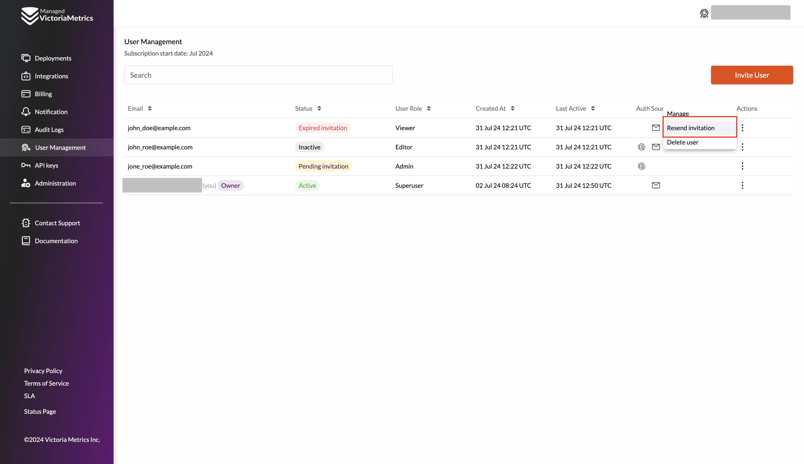

Confirm resend invitation by clicking `Confirm` button in the modal dialog

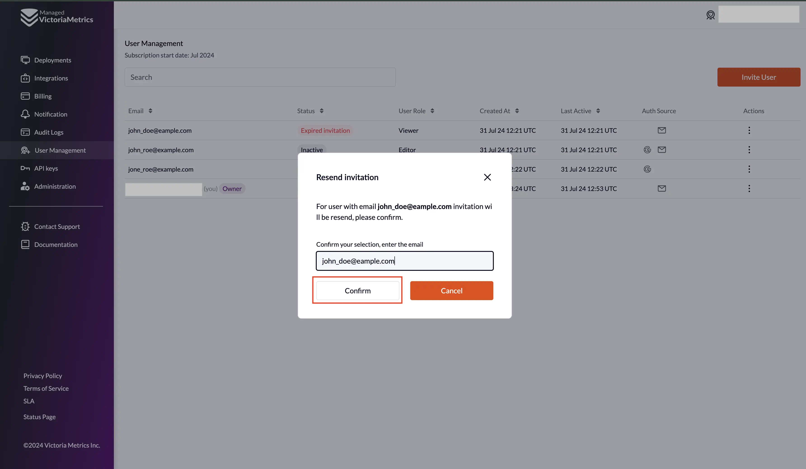

If invitation successfully resented to the user success message will appear

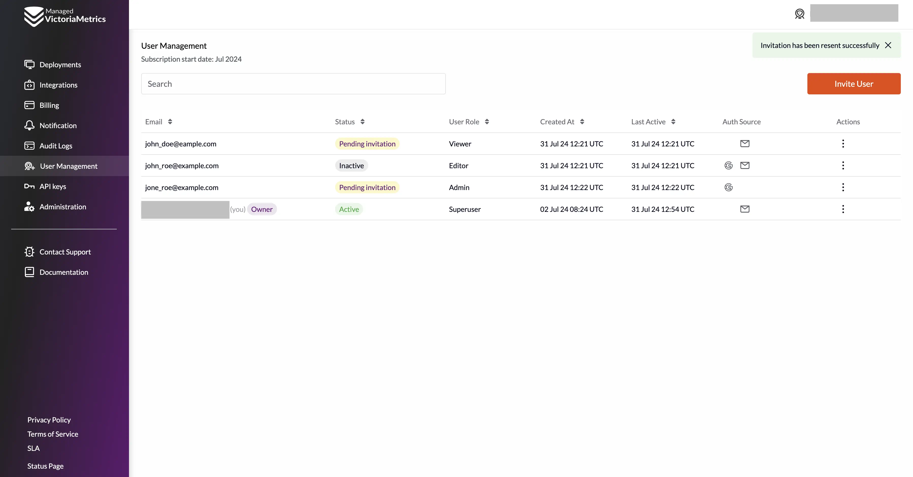
