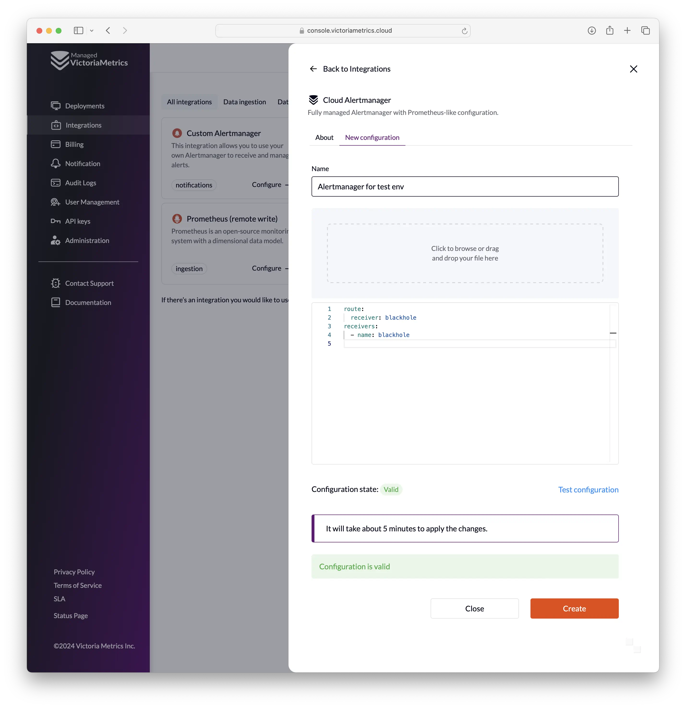
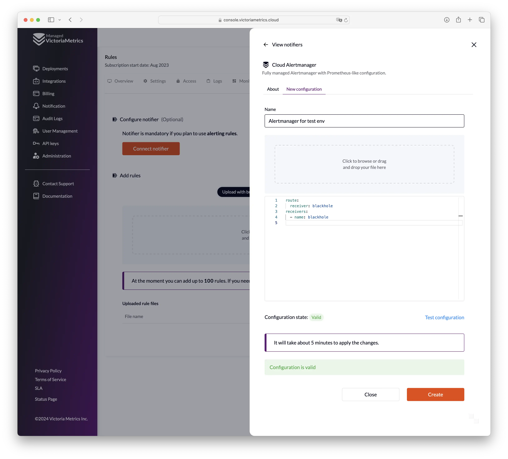
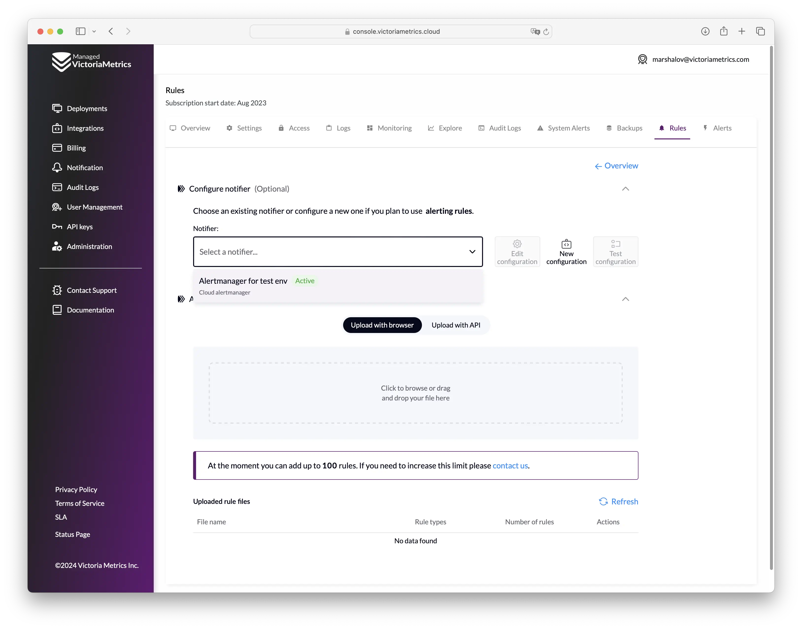
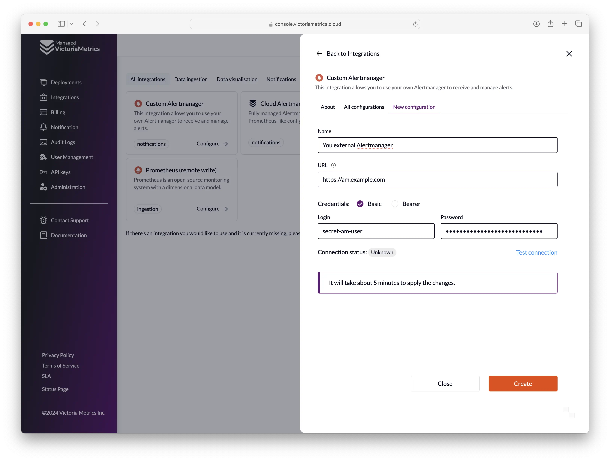
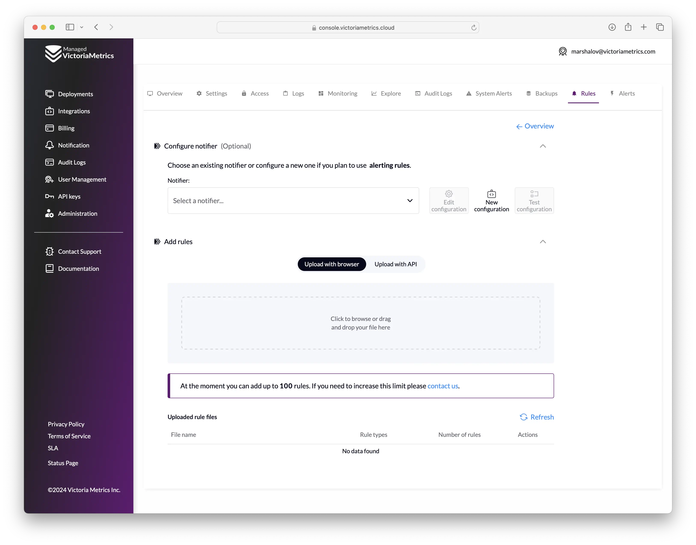
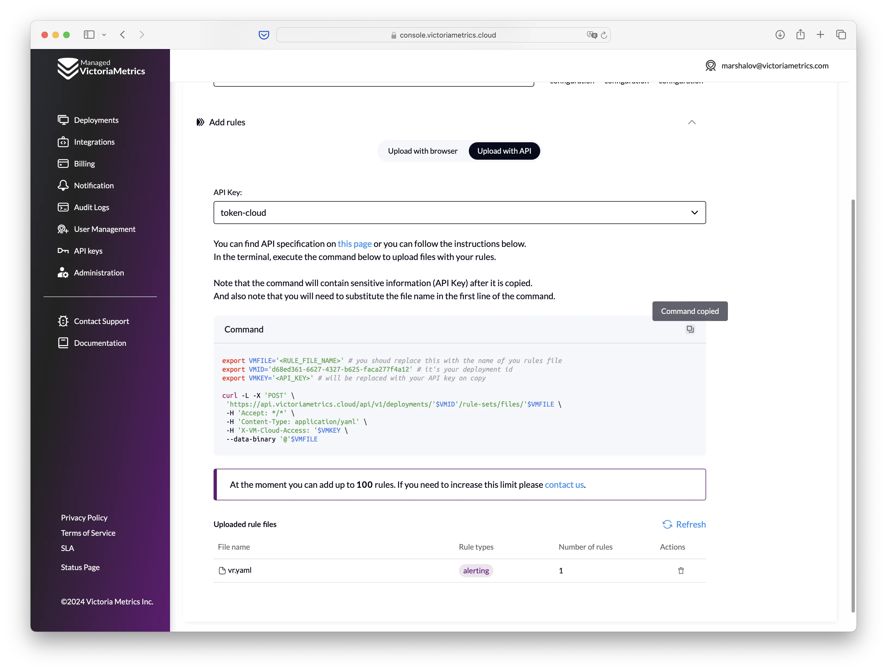
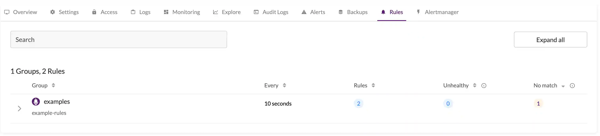
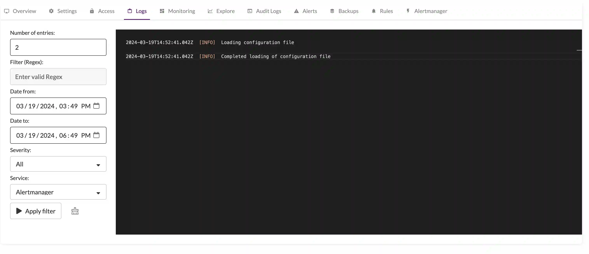

VictoriaMetrics Cloud supports configuring alerting rules, powered by vmalert, and sending notifications with hosted Alertmanager.

## Configure Alertmanager

You have two options to configure Cloud Alertmanager:

1. From integrations section: Menu **"Integrations" `->` "Cloud Alertmanager" `->` "New configuration"**:
   
2. From deployment page: **"Deployment page" `->` "Rules" tab `->` "Settings" `->` "Connect notifier" `/` "New notifier"**: 
   

For creating a new configuration, you need to provide the following parameters:

- **Name of the configuration** (it only affects the display in the user interface)
- **Configuration file** in [specified format](#alertmanager-config-specification)

Before saving the configuration, you can validate it by clicking the "Test configuration" button.

After creating the configuration, you can connect it to one or multiple deployments.
In order to do this you need to go to the "Deployment page" `->` "Rules" tab `->` "Settings" `,
select the created notifier and confirm the action:



Alertmanager is now set up for your deployment, and you be able to get notifications from it.

### Alertmanager config specification

VictoriaMetrics Cloud supports Alertmanager with standard [configuration specification](https://prometheus.io/docs/alerting/latest/configuration/).

But with respect to the specification, there are the following limitations:

1. Only allowed receivers:
   * `discord_configs`
   * `pagerduty_configs`
   * `slack_configs`
   * `webhook_configs`
   * `opsgenie_configs`
   * `wechat_configs`
   * `pushover_configs`
   * `victorops_configs`
   * `telegram_configs`
   * `webex_configs`
   * `msteams_configs`
2. All configuration params with `_file` suffix are not allowed for security reasons.
3. The maximum file size is 20mb.

### Configuration example

Here is an example of Alertmanager configuration:

```yaml
route:
 receiver: slack-infra
 repeat_interval: 1m
 group_interval: 30s
 routes:
 - matchers:
   - team = team-1 
   receiver: dev-team-1
   continue: true
 - matchers:
   - team = team-2
   receiver: dev-team-2
   continue: true
receivers:
- name: slack-infra
  slack_configs:
  - api_url: https://hooks.slack.com/services/valid-url
    channel: infra
    title: |-
        [{{ .Status | toUpper -}}
        {{ if eq .Status "firing" }}:{{ .Alerts.Firing | len }}{{- end -}}
        ]
        {{ if ne .Status "firing" -}}
          :lgtm:
          {{- else if eq .CommonLabels.severity "critical" -}}
          :fire:
          {{- else if eq .CommonLabels.severity "warning" -}}
          :warning:
          {{- else if eq .CommonLabels.severity "info" -}}
          :information_source:
          {{- else -}}
          :question:
        {{- end }}
    text: |
        {{ range .Alerts }}
        {{- if .Annotations.summary }}
           Summary:  {{ .Annotations.summary }}
        {{- end }}
        {{- if .Annotations.description }}
            Description: {{ .Annotations.description }}
        {{- end }}
        {{- end }}
    actions:
    - type: button
      text: 'Query :mag:'
      url: '{{ (index .Alerts 0).GeneratorURL }}'
    - type: button
      text: 'Silence :no_bell:'
      url: '{{ template "__silenceURL" . }}'
- name: dev-team-1 
  slack_configs:
  - api_url: https://hooks.slack.com/services/valid-url
    channel: dev-alerts
- name: dev-team-2
  slack_configs:
  - api_url: https://hooks.slack.com/services/valid-url
    channel: dev-alerts
```

### Custom Alertmanager

If for some reason Cloud Alertmanager is not suitable for you, you can use VictoriaMetrics Cloud with any external Alertmanager hosted in your infrastructure.

For that select Custom Alertmanager instead of Cloud Alertmanager when [creating the Alertmanager](#configure-alertmanager):



Limitations for the Custom Alertmanager:

- Your custom Alertmanager should be available from the Internet via **HTTPS** with **Basic authentication** or **Bearer token authentication**.
- You will not be able to use "Alerts" tab on the deployment page.

You can test the connection to your custom Alertmanager by clicking the "Test connection" button.
`/api/v2/status` endpoint is used to verify that connection to Alertmanager is working.

## Configure alerting and recording rules

Alerting and recording rules could be uploaded on **"Deployment page" `->` "Rules" tab `->` "Settings"**:



You can click on the upload area or drag and drop the files with rules there.

Files should be in the [Prometheus alerting rules definition format](https://prometheus.io/docs/prometheus/latest/configuration/alerting_rules/) 
or [Prometheus recording rules definition format](https://prometheus.io/docs/prometheus/latest/configuration/recording_rules/).

There are limitations for the rules files:

1. All files may contain no more than 100 rules in total. If you need to upload more rules contact us via [support@victoriametrics.com](mailto:support@victoriametrics.com).
2. The maximum file size is 20mb.
3. The names of the groups in the files should be unique.

You can also use API for uploading rules. Switch to **"Upload with API"** on the page and follow the instructions:

- Choose the API key for uploading rules
- After that you can copy the curl command for uploading rules and execute it in your terminal



You can use the following API endpoints for the automation with rules:

* POST: `/api/v1/deployments/{deploymentId}/rule-sets/files/{fileName}` - create/update rules file
* DELETE `/api/v1/deployments/{deploymentId}/rule-sets/files/{fileName}` - delete rules file

For more details, please check [OpenAPI Reference](https://console.victoriametrics.cloud/api-docs).

### Example of alerting rules

Here is an example of alerting rules in the Prometheus alerting rules format:

```yaml
groups:
  - name: examples
    concurrency: 2
    interval: 10s
    rules:
      - alert: never-firing
        expr: foobar > 0
        for: 30s
        labels:
          severity: warning
        annotations:
          summary: empty result rule
      - alert: always-firing
        expr: vector(1) > 0 
        for: 30s
        labels:
          severity: critical
        annotations:
          summary: "rule must be always at firing state"
```

## Troubleshooting

### Rules execution state

The state of created rules is located in the `Rules` section of your deployment:



### Debug

It's possible to debug the alerting stack with logs for vmalert and Alertmanager, which are accessible in the `Logs` section of the deployment.



### Monitoring

Alertmanager and vmalert errors are tracked by a built-in monitoring system. 
Deployment's `Alerts` section has information about active incidents and incident history log.
