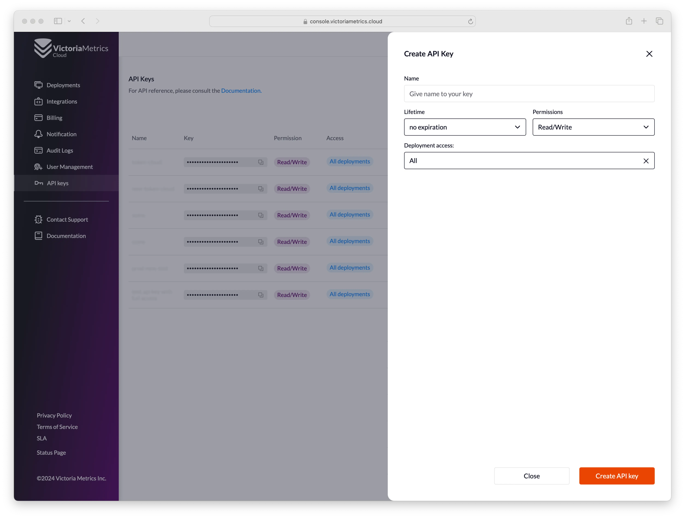

VictoriaMetrics Cloud provides programmatic access for managing cloud resources and is useful for automation with tools like Terraform, OpenTofu, Infrastructure as a Code, GitOps framework, etc.

## Key Concepts

* **API Keys**: Used to manage VictoriaMetrics Cloud resources via API.

**Note: Access Tokens** are used for reading and writing data to deployments. They are separate from API Keys and should not be confused. API Keys are specifically for managing resources via the API, while Access Tokens handle data access for deployments.

## API Swagger/OpenAPI Reference: [https://console.victoriametrics.cloud/api-docs](https://console.victoriametrics.cloud/api-docs)

## API Key Properties:

* **Name**: Human-readable, for team context.
* **Lifetime**: Key expiration date (no expiration is an option).
* **Permissions**: Read-only or Read/Write access.
* **Deployment Access**: Limit access to single, multiple, or all deployments. ***Note**:  selecting all deployments in the list and the “All” option are not the same thing, the “All" option will also apply to future deployments that are created.*
* **Key** or **Key Value**: Programmatically generated identifier. It's sensitive data used for Authentication. Any operation with API keys (including viewing/revealing Key Value), will be recorded in the [Audit Log](https://docs.victoriametrics.com/victoriametrics-cloud/audit-logs/).

## Authentication:

* **API Key Creation**: Required for using the VictoriaMetrics Cloud API. You need to issue the key manually [here](https://console.victoriametrics.cloud/api_keys).
* **HTTP Header**:
    * **Header Name**: `X-VM-Cloud-Access`
    * **Header Value**: `<Key-Value>`

## Alerting & Recording Rules API:

* **List Files**: [API reference](https://console.victoriametrics.cloud/api-docs)
* **View File**: [API reference](https://console.victoriametrics.cloud/api-docs)
* **Upload File**: [API reference](https://console.victoriametrics.cloud/api-docs)
* **Delete File**: [API reference](https://console.victoriametrics.cloud/api-docs)

For detailed setup instructions, check the [VictoriaMetrics Cloud - AlertManager Setup Guide](https://docs.victoriametrics.com/victoriametrics-cloud/alertmanager-setup-for-deployment/).

## Future API Features:

* **Deployments**: Create, Delete, Update, List, Get.
* **Access Token**: Create, Delete, List, Get/Reveal.
* **AlertManager**: Get Config, Upsert Config.
