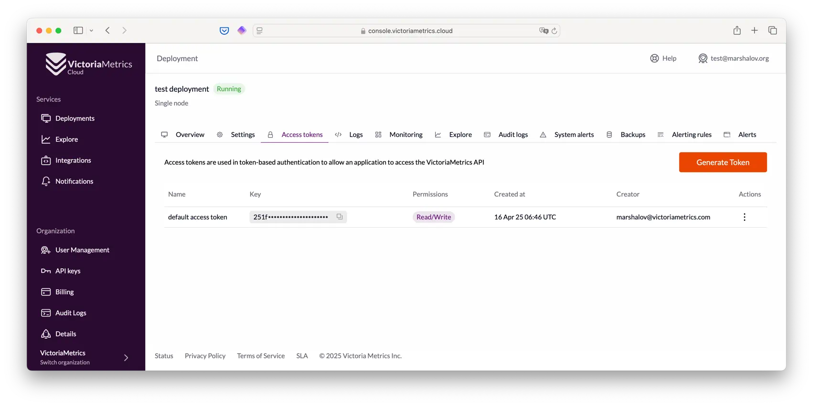
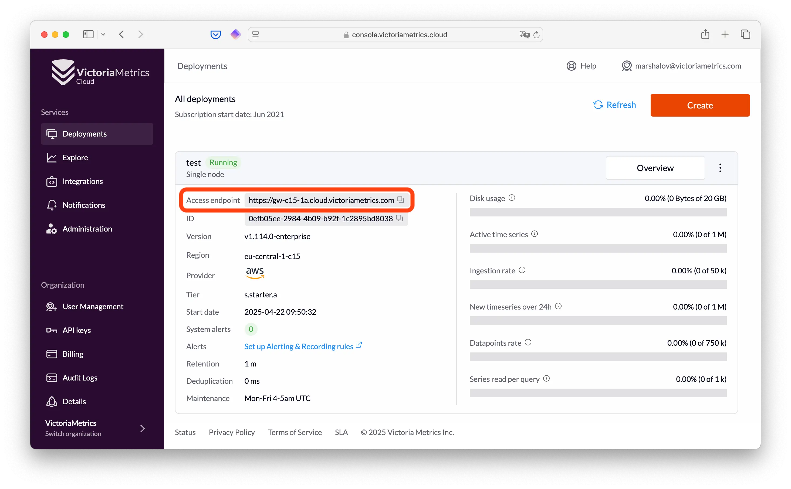

VictoriaMetrics Cloud handles data ingestion and querying in a secure way. That's why we need to
have a way to authorize and authenticate requests. [Access tokens](https://en.wikipedia.org/wiki/Access_token)
are a widely used mechanism to perform such operations. 
You can think of them as _technical credentials for reading and writing data to your deployments_.

In summary, in VictoriaMetrics Cloud, you can create and use different Access tokens (or credentials)
to read or write (or both) for each deployment. By using these tokens, when
a request is received, VictoriaMetrics Cloud is able to both authorize or deny it and direct it to the correct
target deployment. 

Another benefit from this mechanism is that **you only need a url and a token to start sending or
retrieving data** to/from VictoriaMetrics Cloud.

You can easily manage them in the "Access tokens" tab inside the [deployment page](https://console.victoriametrics.cloud/deployments):



One ‘default access token’ will always be automatically created for each deployment.

While you can always make use of this general purpose token, but we strongly
recommend [creating a separate token](#how-to-create-access-tokens) for each individual access unit.
This best practice will help you to, not only enforce security across your platform, but also easily identify
different data sources and take action when/if needed.

For instance, if you have two separate Kubernetes clusters, you can [create separate write access tokens](#how-to-create-access-tokens) 
for [vmagent](https://docs.victoriametrics.com/vmagent/) in each cluster. In this way, every request is easily
identified and managed. The same applies to reading data: you may create separate tokens for different Grafana
instances with read-only access.

It allows to:

- Reduce the blast radius in case of any human error
- Easily diagnose and debug problems
- Manage rights with more granularity in a safer way
- Limit the impact of overloading if limits are exceeded
- Secure access partially in case of a leak

Each Access token has a limit for concurrent requests. You may find more details about it on the [Tier Parameters and Flag Parameters Configuration](../tiers-parameters.md) page.

## How to create Access tokens

1. Go to the "Access tokens" tab on the [deployment page](https://console.victoriametrics.cloud/deployments)
2. Click "Generate Token" button
3. Enter the name of the token (for example "vmagent prod")
4. And select the access level:
   - **Read** - read-only access to the deployment (for data querying tools like Grafana, Perses, etc.)
   - **Write** - write-only access to the deployment (for data collectors like [vmagent](https://docs.victoriametrics.com/vmagent/, Prometheus, OpenTelemetry Collector, Telegraf, etc.)
   - **Read/Write** - read and write access to the deployment (for tools which need to read and write data, like [vmalert](https://docs.victoriametrics.com/vmalert/))
5. For **Cluster deployments** you can also select a specific **tenant** in "Advanced Settings". This will make the token to only work for the specified tenant. Find more details about this option in [How to work with tenants in cluster deployments](#how-to-work-with-tenants-in-cluster-deployments)) section. 
6. Click "Generate" button

After that, you can get a [Secret value of the Access token](#working-with-access-token-secrets) and start using it!

## How to change access token parameters

Access tokens are immutable - this means that you can’t change any parameter set at the Access token creation phase. If you need to perform any changes, you should [revoke it](#how-to-revoke-access-tokens) and [create new one](#how-to-create-access-tokens) with the desired configuration.

## Working with Access token Secrets

For using Access token in your software you need secret value of the Access token:

1. Go to the "Access tokens" tab on the [deployment page](https://console.victoriametrics.cloud/deployments)
2. Find the required token in the list
3. Click on the value under the "Key" column of this Access token. After that, the secret value of the Access token will be in your clipboard.

Please, be careful with this value, treat it like a password - do not store or share it in the open.

This value is the [Bearer token](https://swagger.io/docs/specification/v3_0/authentication/bearer-authentication/), 
you need to pass it as http header in each request in the following format:

```
Authorization: Bearer <SECRET_VAUE>
```

## Access endpoint

Each deployment has one access endpoint, i.e., the URL used to communicate with your deployment's API 
for [writing](#how-to-write-data-with-access-token) and [reading](#how-to-read-data-with-access-token) data.

You can find it in the "Overview" tab on the deployment page:



You can click on the Access endpoint to copy it to the clipboard.

The same Access endpoint can be shared between several deployments. Requests routing to the required deployment is done using Access token.

## How to write data with access token

To use Access token for writing data, the following resources are needed:

- [Secret value of the Access token](#how-to-use-secret-value-of-access-token)
- [Access endpoint](#access-endpoint)
- [Required API path of Victoria Metrics deployment](https://docs.victoriametrics.com/victoriametrics/url-examples/)

You can use the following format for requests to your deployment:

```
POST https://<ACCESS_ENDPOINT>/<API_PATH>
Authotization: Bearer <SECRET_VALUE>
```

Please note that API paths are different for single and cluster deployments, more details about it you can read in [How to work with tenants in cluster deployments](#how-to-work-with-tenants-in-cluster-deployments)) section.

The best way to configure writing data to your deployment is to use the [integrations page](https://console.victoriametrics.cloud/integrations?integrationType=ingestion)
in the [Victoria Metrics Cloud console](https://console.victoriametrics.cloud/integrations) or [Integrations section](../integrations) of the documentation. 
If there’s an integration you would like to use and it is currently missing, please [contact us](mailto:support-cloud@victoriametrics.com).

You can also open examples section of access tokens:

1. Go to the "Access tokens" tab on the [deployment page](https://console.victoriametrics.cloud/deployments)
2. Find the required token in the list
3. Click "..." button in the Actions column next to the required token in the list
4. Click "Examples" button
5. Choose on of available examples: [vmagent](https://docs.victoriametrics.com/vmagent/), prometheus or curl. You can click on the button in the top right corner to copy command or config to clipboard with the access token substituted in it.

## How to read data with access token

To use Access token for writing data you need the following things:

- [Secret value of the Access token](#how-to-use-secret-value-of-access-token)
- [Access endpoint](#access-endpoint)
- [Required API path of Victoria Metrics deployment](https://docs.victoriametrics.com/victoriametrics/url-examples/)

You can use the following format for requests to yo deployment:

```
POST https://<ACCESS_ENDPOINT>/<API_PATH>
Authotization: Bearer <SECRET_VALUE>
```

Please note that API paths are different for single and cluster deployments, more details about it you can read in [How to work with tenants in cluster deployments](#how-to-work-with-tenants-in-cluster-deployments)) section.

The best way to configure writing data to your deployment is to use the [integrations page](https://console.victoriametrics.cloud/integrations?integrationType=visualization)
in the [Victoria Metrics Cloud console](https://console.victoriametrics.cloud/integrations) or [Integrations section](../integrations) of the documentation.
If there’s an integration you would like to use and it is currently missing, please [contact us](mailto:support-cloud@victoriametrics.com).

You can also open examples section of access tokens:

1. Go to the "Access tokens" tab on the [deployment page](https://console.victoriametrics.cloud/deployments)
2. Find the required token in the list
3. Click "..." button in the Actions column next to the required token in the list
4. Click "Examples" button
5. Go to "Read" tab in example dialog
6. Choose on of available examples: grafana or curl. You can click on the button in the top right corner to copy command or config to clipboard with the access token substituted in it.

## How to revoke access token

1. Make sure the token is no longer in use
2. Go to the "Access tokens" tab on the [deployment page](https://console.victoriametrics.cloud/deployments)
3. Find the required token in the list
4. Click "..." button in the Actions column next to the required token in the list
5. Click "Delete" button

## How to work with tenants in Cluster deployments

Please note that API paths are different for Single and Cluster deployments, for example:

| Deployment type    | URL                                                                    |
|--------------------|------------------------------------------------------------------------|
| Single deployment  | `https://<ACCESS_ENDPOINT>/api/v1/write`                               |
| Cluster deployment | `https://<ACCESS_ENDPOINT>/insert/<TENANT_ID>/prometheus/api/v1/write` |

You can read about the difference in [URL format section](https://docs.victoriametrics.com/victoriametrics/cluster-victoriametrics/#url-format) 
and see examples on [URL examples page](https://docs.victoriametrics.com/victoriametrics/url-examples/).

The main difference is that cluster deployments are multitenant by default and a special suffix must be added for them, which contains the component prefix (insert/select) and tenant id.
More details about multitenancy and tenants can be found in [Multitenancy section](https://docs.victoriametrics.com/victoriametrics/cluster-victoriametrics/#multitenancy).

Cluster deployment also allows to [create Access tokens](#how-to-create-access-token) for specific tenants.
In this case, the token will only be able to work with the specified tenant.
In order to create an Access token for a specific tenant, you need to specify the tenant under the "Advanced Settings" section of the [token creation dialog](#how-to-create-access-token).
API paths for such tokens will be the different from not-tenant-specific ones, for example:

| Access token type     | URL                                                                    |
|-----------------------|------------------------------------------------------------------------|
| Regular token         | `https://<ACCESS_ENDPOINT>/insert/<TENANT_ID>/prometheus/api/v1/write` |
| Tenant-specific token | `https://<ACCESS_ENDPOINT>/prometheus/api/v1/write`                    |

Thus for tenant-specific tokens the `/insert/<TENANT>` and `/select/<TENANT>` suffix will be added automatically.

## Difference between Access tokens and API Keys

- Access tokens are used for using your deployment: [reading](#how-to-read-data-with-access-token) and [writing](#how-to-write-data-with-access-token) the data.
- [API keys](../api.md) are used for managing your deployment: creating, updating and deleting it and their resources like Access tokens, alerting rules, etc. 
  This is necessary if you want to manage your monitoring infrastructure (including Victoria Metrics Cloud deployments) as code, for example with Terraform
