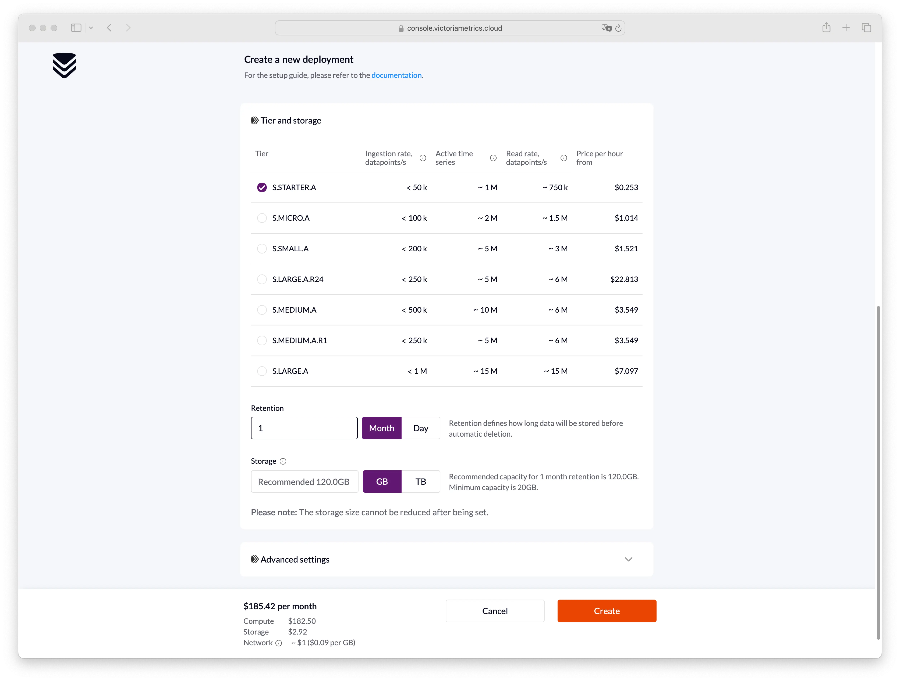

VictoriaMetrics Cloud is a hosted monitoring platform, where users can run the VictoriaMetrics 
that they know and love on AWS without the need to perform typical DevOps tasks such as proper configuration, 
monitoring, logs collection, access protection, software updates, backups, etc.

The document covers the following topics:
1. [Registration](#registration)
1. [Adding a payment method](#adding-a-payment-method)
1. [Restoring a password](#restoring-a-password)
1. [Creating deployments](#creating-deployments)
1. [Start writing and reading data](#start-writing-and-reading-data)
1. [Modifying an existing deployment](#modifying-an-existing-deployment)

## Registration

Start your registration process by visiting the [Sign Up](https://console.victoriametrics.cloud/signUp?utm_source=website&utm_campaign=docs_quickstart) page.

There are two different methods to create an account:
1. Create an account via Google Auth service;
1. Create an account by filling in a registration form.

### Create an account via Google Auth service:

1. Click `Continue with Google` button on the [Sign Up page](https://console.victoriametrics.cloud/signUp?utm_source=website&utm_campaign=docs_quickstart)

   
1. Choose Google account you want to use for registration

1. You will be automatically redirected to the main page of the VictoriaMetrics Cloud

### Create an account by filling in a registration form:
1. Fill in your email, password and password confirmation on [Sign Up page](https://console.victoriametrics.cloud/signUp?utm_source=website&utm_campaign=docs_quickstart).

1.All fields are required. Any errors will be shown in the interface, so it is easy to understand what should be adjusted.
   

1. Press `Sign Up` button when all fields are filled in.
   

You will be redirected to the main page with a notification message to confirm your email.

   

You will also receive an email with a confirmation link as shown on the picture below:
    
It is necessary to confirm your email address. Otherwise, you won't be able to create a deployment.
    

After successful confirmation of your email address, you'll be able to [create your first deployment](#creating-deployments) or [add a payment method](#adding-a-payment-method).

   

## Adding a payment method

1. Navigate to a [Billing](https://console.victoriametrics.cloud/billing?utm_source=website&utm_campaign=docs_quickstart) page:
   
     
   

1. Choose a payment method
   
     
   

### Pay with a card

1. Click on an `Add card` panel and fill in all the fields in the form and press `Add card` button
   
     
   
1. An error message will appear if a card is invalid
   
     
   
1. Successfully added card will be shown on the page as follows:
   
     
   

### Link your AWS billing account via AWS Marketplace

When you need to unify your AWS billing, you can start a subscription on AWS Marketplace.

1. Click on the `Buy on AWS Marketplace` panel:
   
     
   
1. You will be redirected to the <a href="https://aws.amazon.com/marketplace/pp/prodview-4tbfq5icmbmyc" target="_blank">VictoriaMetrics Cloud</a> product page.
1. Click on `View purchase option` button, and you will be redirected to an AWS login page or to a subscribe page on AWS Marketplace.
   
     
   
1. Go to the <a href="https://aws.amazon.com/marketplace/pp/prodview-4tbfq5icmbmyc">VictoriaMetrics Cloud</a> product page and click `Continue to Subscribe` button:
   
     
   
1. Press the `Subscribe` button:
   
     
   
1. After that you will see a success message where you should click `Set up your account` button:
   
     
   
1. You'll be redirected back to VictoriaMetrics Cloud <a href="https://console.victoriametrics.cloud/billing?utm_source=website&utm_campaign=docs_quickstart" target="_blank">billing page</a>:
   
     
   

### Switching between payment methods

If both payment methods are added, it is possible to easily switch between them.
Click on the radio button like on the picture below and confirm the change:

  

  

If the payment method was changed successfully, the following message will appear: 

  

## Password restoration

If you forgot your password, it can be restored in the following way:

1. Click `Forgot password?` link on the [Sign In](https://console.victoriametrics.cloud/signIn?utm_source=website&utm_campaign=docs_quickstart) page:
   
     
   

1. Enter your email and click `Reset password` button:
   
     

     

1. Follow the instructions sent to your email in order to get access to your VictoriaMetrics Cloud account:
   
     
   

1. Navigate to the Profile page by clicking the corresponding link in the top right corner:
   
     
   

1. Enter a new password on the Profile page and press `Save`:
   
     
   

## Creating deployments

On the [Deployments](https://console.victoriametrics.cloud/deployments?utm_source=website&utm_campaign=docs_quickstart) page you 
will see a list of your existing deployments and will be able to manage them. 

To create a deployment click on the button `Start using VictoriaMetrics cloud` button:

  

When you already have at least one deployment you can create a new one by clicking on the `Create` button:

   

On the opened screen, choose parameters of your new deployment:

* `Deployment name` – a unique name for your deployment;
* `Global settings` – choose between:
  * Single - for affordable, performant single-node deployments;
  * Cluster - for highly available and multi-tenant deployments;
  * Cloud provider - for deployments on AWS, GCP, Azure, etc.
  * Region - cloud provider region where deployment will run;
* `Tier and storage` – choose between:
  * [Tier](https://docs.victoriametrics.com/victoriametrics-cloud/tiers-parameters/) – predefined set of parameters for your deployment [based on your needs](https://docs.victoriametrics.com/guides/understand-your-setup-size.html);
  * Retention – desired retention period for stored metrics;
  * Storage - desired storage capacity for storing metrics (you always can expand disk size later);
  
    We provide recommended capacity depends on how much data your ingestion rate and retention period involve, 
    as well as on the size of each data point. We assume each data point is 0.8 byte based on our experience 
    with VictoriaMetrics Cloud and take the ingestion rate and retention period from your deployment configuration.
    We suggest using the recommended capacity for retention periods of one month or less. 
    If you need to keep data longer (6 months or more), you can start with a smaller storage size and increase it over time.
    If you ingest high cardinality data, this increases the data point size, and you may need more storage than we recommend.
    Please note that while you can increase storage size, you cannot reduce it due to AWS limitations. 
    We charge $0.09 per GB-month for SSD storage.
    Since VictoriaMetrics Cloud doesn’t charge extra for storage, we recommend using enterprise features like [downsampling](https://docs.victoriametrics.com/#downsampling)
    and [retention filters](https://docs.victoriametrics.com/#retention-filters) to optimize disk space.
    You can find the formula for calculating the recommended storage [here](https://docs.victoriametrics.com/guides/understand-your-setup-size/#retention-perioddisk-space).  
    Feel free to adjust parameters as needed.

* `Advanced settings` – additional parameters for your deployment:
  * `Deduplication` – defines interval when deployment leaves a single raw sample with the biggest timestamp per each discrete interval;
  * `Maintenance Window` – when deployment should start an upgrade process if needed;

Also see the [Tier Parameters and Flag Parameters Configuration](https://docs.victoriametrics.com/victoriametrics-cloud/tiers-parameters/).
This document provides an overview of tier parameters and predefined flag settings for VictoriaMetrics Cloud.

When all parameters are configured, click on the `Create` button, and deployment will be created.

Once created, deployment will remain for a short period of time in `PROVISIONING` status 
while the hardware spins-up, just wait for a couple of minutes and reload the page. 
You'll also be notified via email once your deployment is ready to use:

  

  

## Start writing and reading data

After transition from `PROVISIONING` to `RUNNING` state, VictoriaMetrics Cloud deployment is fully operational 
and is ready to accept write and read requests. 

Click on right three dots and navigate to the Access menu to get the access token:

  

Click on the `Generate token`. Fill `Name` field. Select token `Permission` and click `Generate` button:
  
  

Generated token will be shown in the list of access tokens. Click on the three dots and choose `Show examples` to see the usage examples:

  

Access tokens are used in token-based authentication to allow an application to access the VictoriaMetrics API. 
Supported token types are `Read-Only`, `Write-Only` and `Read-Write`. Click on three dots in `Actions` and select `Show examples`
in the dropdown to see usage examples:

  
 
  

  

Follow usage examples in order to configure access to VictoriaMetrics for your Prometheus, 
Grafana or any other software.

## Modifying an existing deployment

Remember, you can always add, remove or modify existing deployment by changing its size or any parameters on the 
deployment's page. 
It is important to know that downgrade for cluster is currently not available.

  

 
To discover additional configuration options click on `Advanced Settings` button, so you should see the following:

  
  

In that section, additional params can be set:

* [`Deduplication`](https://docs.victoriametrics.com/cluster-victoriametrics/#deduplication) defines interval when deployment leaves a single raw sample with the biggest timestamp per each discrete interval;
* `Maintenance Window` when deployment should start an upgrade process if needed;
* `Settings` allow to define different flags for the deployment:

   1. [cluster components flags](https://docs.victoriametrics.com/cluster-victoriametrics/#list-of-command-line-flags).
   2. [single version flags](https://docs.victoriametrics.com/single-server-victoriametrics/#list-of-command-line-flags).

Please note, such an update requires a deployment restart and may result in a short downtime for single-node deployments.
