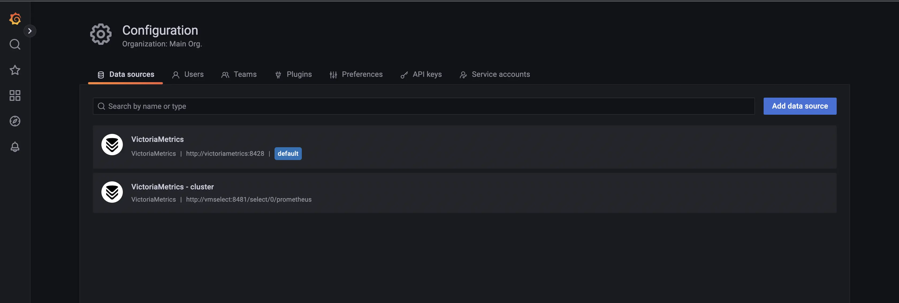

The [VictoriaMetrics datasource plugin](https://grafana.com/grafana/plugins/victoriametrics-metrics-datasource) 
allows to query and visualize data from VictoriaMetrics in Grafana. 

* [Motivation](#motivation)
* [Capabilities](#capabilities)
* [Installation](#installation)
* [How to use WITH templates](#how-to-use-with-templates)
* [How to make new release](#how-to-make-new-release)
* [Frequently Asked Questions](#faq)
* [License](#license)

## Motivation

Thanks to VictoriaMetrics compatibility with Prometheus API most users can use [Prometheus datasource](https://docs.victoriametrics.com/#grafana-setup) 
for Grafana to query data from VictoriaMetrics. But with time, Prometheus and VictoriaMetrics diverge more and more.
The benefits of using VictoriaMetrics plugin are the following:

* [MetricsQL](https://docs.victoriametrics.com/metricsql) functions support;
* Supports [query tracing](https://docs.victoriametrics.com/#query-tracing) in Explore mode or right in panel's expressions;
* Supports [WITH expressions](https://docs.victoriametrics.com/victoriametrics-datasource/#how-to-use-with-templates);
* Plugin fixes [label names validation](https://github.com/grafana/grafana/issues/42615) issue;
* Integration with [vmui](https://docs.victoriametrics.com/#vmui).

## Capabilities

1. Use [MetricsQL](https://docs.victoriametrics.com/metricsql/) to query metrics in Grafana.
1. Use Explore mode with Grafana.
1. Build dashboards and setup alerts.
1. Use Ad Hoc filters.
1. [Template](https://github.com/VictoriaMetrics/victoriametrics-datasource/blob/main/src/README.md#how-to-use-with-templates) queries and expressions.
1. Get insights about query execution bottlenecks via [tracing](https://docs.victoriametrics.com/#query-tracing).
1. Automatically format queries via `Prettify` button.

Try it at [VictoriaMetrics playground](https://play-grafana.victoriametrics.com/d/oS7Bi_0Wz_vm)!

## Installation

For detailed instructions on how to install the plugin on Grafana Cloud or locally, please checkout the [Plugin installation docs](https://grafana.com/grafana/plugins/victoriametrics-metrics-datasource/?tab=installation).

### Install via Docker

[VictoriaMetrics repo](https://github.com/victoriaMetrics/victoriaMetrics) provides a complete [docker-compose](https://github.com/VictoriaMetrics/VictoriaMetrics/tree/master/deployment/docker#grafana) environment to spin-up all required components via Docker.

To begin, clone [VictoriaMetrics](https://github.com/VictoriaMetrics/VictoriaMetrics) repository and follow steps described in the [README](https://github.com/VictoriaMetrics/VictoriaMetrics/tree/master/deployment/docker#docker-compose-environment-for-victoriametrics).

### Grafana Provisioning

Provision of Grafana plugin requires to create [datasource config file](http://docs.grafana.org/administration/provisioning/#datasources).

Example of config file for provisioning VictoriaMetrics datasource is the following:

```yaml
apiVersion: 1

# List of data sources to insert/update depending on what's
# available in the database.
datasources:
  # <string, required> Name of the VictoriaMetrics datasource
  # displayed in Grafana panels and queries.
  - name: VictoriaMetrics
    # <string, required> Sets the data source type.
    type: victoriametrics-metrics-datasource
      # <string, required> Sets the access mode, either
      # proxy or direct (Server or Browser in the UI).
      # Some data sources are incompatible with any setting
    # but proxy (Server).
    access: proxy
    # <string> Sets default URL of the single node version of VictoriaMetrics
    url: http://victoriametrics:8428
    # <string> Sets the pre-selected datasource for new panels.
    # You can set only one default data source per organization.
    isDefault: true

    # <string, required> Name of the VictoriaMetrics datasource
    # displayed in Grafana panels and queries.
  - name: VictoriaMetrics - cluster
    # <string, required> Sets the data source type.
    type: victoriametrics-metrics-datasource
    # <string, required> Sets the access mode, either
    # proxy or direct (Server or Browser in the UI).
    # Some data sources are incompatible with any setting
    # but proxy (Server).
    access: proxy
    # <string> Sets default URL of the cluster version of VictoriaMetrics
    url: http://vmselect:8481/select/0/prometheus
    # <string> Sets the pre-selected datasource for new panels.
    # You can set only one default data source per organization.
    isDefault: false
```

Please find the example of provisioning Grafana instance with VictoriaMetrics datasource below:

1. Create a file at `./provisioning/datasources/vm.yml` with datasource example file.

1. Define Grafana installation via docker-compose:

   ```yaml
     version: '3.0'
     services:
       grafana:
         image: grafana/grafana:11.0.0
         environment:
         - GF_INSTALL_PLUGINS=victoriametrics-metrics-datasource
         ports:
         - 3000:3000/tcp
         volumes:
         - ./provisioning:/etc/grafana/provisioning
   ```

1. Run docker-compose file:

```
docker-compose -f docker-compose.yaml up
```

When Grafana starts successfully datasources should be present on the datasources tab



### Install in Kubernetes

#### Grafana helm chart

Example with Grafana [helm chart](https://github.com/grafana/helm-charts/blob/main/charts/grafana/README.md):

Option 1. Using Grafana provisioning:

``` yaml
env:
  GF_INSTALL_PLUGINS: victoriametrics-metrics-datasource
```

Option 2. Using Grafana plugins section in `values.yaml`:

``` yaml
plugins:
  - victoriametrics-metrics-datasource
```

Option 3. Using init container:
``` yaml
extraInitContainers:
  - name: "load-vm-ds-plugin"
    image: "curlimages/curl:7.85.0"
    command: [ "/bin/sh" ]
    workingDir: "/var/lib/grafana"
    securityContext:
      runAsUser: 472
      runAsNonRoot: true
      runAsGroup: 472
    args:
     - "-c"
     - |
       set -ex
       mkdir -p /var/lib/grafana/plugins/
       ver=$(curl -s -L https://api.github.com/repos/VictoriaMetrics/victoriametrics-datasource/releases/latest | grep -oE 'v[0-9]+\.[0-9]+\.[0-9]+' | head -1)
       curl -L https://github.com/VictoriaMetrics/victoriametrics-datasource/releases/download/$ver/victoriametrics-metrics-datasource-$ver.tar.gz -o /var/lib/grafana/plugins/vm-plugin.tar.gz
       tar -xf /var/lib/grafana/plugins/vm-plugin.tar.gz -C /var/lib/grafana/plugins/
       rm /var/lib/grafana/plugins/vm-plugin.tar.gz
    volumeMounts:
      # For grafana-operator users, change `name: storage` to `name: grafana-data`
      - name: storage
        mountPath: /var/lib/grafana
```

For `grafana-operator` users, the above configuration should be done for the part `/spec/deployment/spec/template/spec/initContainers` of your `kind=Grafana` resource.

This example uses init container to download and install plugin. To allow Grafana using this container as a sidecar set the following config:

```yaml
sidecar:
  datasources:
    initDatasources: true
    enabled: true
```

See more about chart settings [here](https://github.com/grafana/helm-charts/blob/541d97051de87a309362e02d08741ffc868cfcd6/charts/grafana/values.yaml)

Option 4 would be to build custom Grafana image with plugin based on same installation instructions.

#### Grafana operator

Example with Grafana [operator](https://github.com/grafana-operator/grafana-operator):

```yaml
apiVersion: grafana.integreatly.org/v1beta1
kind: Grafana
metadata:
  name: grafana-vm
spec:
  persistentVolumeClaim:
    spec:
      accessModes:
        - ReadWriteOnce
      resources:
        requests:
          storage: 200Mi
  deployment:
    spec:
      template:
        spec:
          initContainers:
            - name: "load-vm-ds-plugin"
              image: "curlimages/curl:7.85.0"
              command: [ "/bin/sh" ]
              workingDir: "/var/lib/grafana"
              securityContext:
                runAsUser: 472
                runAsNonRoot: true
                runAsGroup: 472
              args:
                - "-c"
                - |
                  set -ex
                  mkdir -p /var/lib/grafana/plugins/
                  ver=$(curl -s https://api.github.com/repos/VictoriaMetrics/victoriametrics-datasource/releases/latest | grep -oE 'v[0-9]+\.[0-9]+\.[0-9]+' | head -1)
                  curl -L https://github.com/VictoriaMetrics/victoriametrics-datasource/releases/download/$ver/victoriametrics-metrics-datasource-$ver.tar.gz -o /var/lib/grafana/plugins/vm-plugin.tar.gz
                  tar -xf /var/lib/grafana/plugins/vm-plugin.tar.gz -C /var/lib/grafana/plugins/
                  rm /var/lib/grafana/plugins/vm-plugin.tar.gz
              volumeMounts:
                - name: grafana-data
                  mountPath: /var/lib/grafana
```

See [Grafana operator reference](https://grafana-operator.github.io/grafana-operator/docs/grafana/) to find more about  Grafana operator.
This example uses init container to download and install plugin.

It is also possible to request plugin at `GrafanaDatasource` or `GrafanaDashboard` CRDs.
For example:
```yaml
apiVersion: grafana.integreatly.org/v1beta1
kind: GrafanaDatasource
metadata:
  name: vm-datasource
spec:
  datasource:
    access: proxy
    type: victoriametrics-metrics-datasource
    name: VM
    url: http://vmsingle-vm-stack-victoria-metrics-k8s-stack.monitoring.svc.cluster.local:8429
  instanceSelector:
    matchLabels:
      dashboards: grafana
  plugins:
    - name: victoriametrics-metrics-datasource
      version: "0.13.1"
---
apiVersion: grafana.integreatly.org/v1beta1
kind: GrafanaDashboard
metadata:
  name: vm-dashboard
spec:
  resyncPeriod: 30s
  plugins:
    - name: victoriametrics-metrics-datasource
      version: "0.13.1"
  instanceSelector:
    matchLabels:
      dashboards: "grafana"
  url: "https://raw.githubusercontent.com/VictoriaMetrics/VictoriaMetrics/refs/heads/master/dashboards/vm/victoriametrics.json"
```

### Dev release installation

1. To download plugin build and move contents into Grafana plugins directory:

   ```sh
   ver=$(curl -s https://api.github.com/repos/VictoriaMetrics/victoriametrics-datasource/releases/latest | grep -oE 'v[0-9]+\.[0-9]+\.[0-9]+' | head -1)
   curl -L https://github.com/VictoriaMetrics/victoriametrics-datasource/releases/download/$ver/victoriametrics-metrics-datasource-$ver.tar.gz -o /var/lib/grafana/plugins/vm-plugin.tar.gz
   tar -xf /var/lib/grafana/plugins/vm-plugin.tar.gz -C /var/lib/grafana/plugins/
   rm /var/lib/grafana/plugins/vm-plugin.tar.gz
   ```

1. Restart Grafana

## Getting started development

### 1. Configure Grafana

Installing dev version of Grafana plugin requires to change `grafana.ini` config to allow loading unsigned plugins:

``` ini
# Directory where Grafana will automatically scan and look for plugins
plugins = {{path to directory with plugin}}
```

### 2. Run the plugin

In the project directory, you can run:

```sh
# install dependencies
yarn install

# run the app in the development mode
yarn dev

# build the plugin for production to the `dist` folder and zip build
yarn build:zip
```

### 3. How to build backend plugin

From the root folder of the project run the following command:

```
make vm-backend-plugin-build
```

This command will build executable multi-platform files to the `dist` folder for the following platforms:

* linux/amd64
* linux/arm64
* linux/arm
* linux/386
* amd64
* arm64
* windows

### 4.How to build frontend plugin

From the root folder of the project run the following command:

```
make vm-frontend-plugin-build
```

This command will build all frontend app into `dist` folder.

### 5. How to build frontend and backend parts of the plugin:

When frontend and backend parts of the plugin is required, run the following command from the root folder of the project:

```
make vm-plugin-build
```

This command will build frontend part and backend part or the plugin and locate both parts into `dist` folder.

## How to use WITH templates

The `WITH` templates feature simplifies the construction and management of complex queries. You can try this feature in the [WITH templates playground](https://play.victoriametrics.com/select/accounting/1/6a716b0f-38bc-4856-90ce-448fd713e3fe/expand-with-exprs).

The "WITH templates" section allows you to create expressions with templates that can be used in dashboards.

WITH expressions are stored in the datasource object. If the dashboard gets exported, the associated WITH templates will not be included in the resulting JSON (due to technical limitations) and need to be migrated separately.

### Defining WITH Expressions

1. Navigate to the dashboard where you want to add a template.<br/>
   *Note: templates are available within the dashboard scope.*
1. Click the `WITH templates` button.
1. Enter the expression in the input field. Once done, press the `Save` button to apply the changes. For example:
   ```
   commonFilters = {instance=~"$node:$port",job=~"$job"},

   # `cpuCount` is the number of CPUs on the node
   cpuCount = count(count(node_cpu_seconds_total{commonFilters}) by (cpu)),

   # `cpuIdle` is the sum of idle CPU cores
   cpuIdle = sum(rate(node_cpu_seconds_total{mode='idle',commonFilters}[5m]))
   ```

   You can specify a comment before the variable and use markdown in it. The comment will be displayed as a hint during
   auto-completion. The comment can span multiple lines.

### Using WITH Expressions

After saving the template, you can enter it into the query editor field:

```
((cpuCount - cpuIdle) * 100) / cpuCount
```

Thus, the entire query will look as follows:

```
WITH (
 commonFilters = {instance=~"$node:$port",job=~"$job"},
 cpuCount = count(count(node_cpu_seconds_total{commonFilters}) by (cpu)),
 cpuIdle = sum(rate(node_cpu_seconds_total{mode='idle',commonFilters}[5m]))
)
((cpuCount - cpuIdle) * 100) / cpuCount
```

To view the raw query in the interface, enable the `Raw` toggle.

## How to make new release

1. Make sure there are no open security issues.
1. Change version in `package.json` in a `main` branch
1. Push changes to the github repository and be shure that the `main` branch is up to date.
1. Trigger [release pipeline](https://github.com/VictoriaMetrics/victoriametrics-datasource/actions/workflows/release.yaml).
1. Go to [releases page](https://github.com/VictoriaMetrics/victoriametrics-datasource/releases) once pipeline is finished and verify release with the name `TAG` has been created and has all the needed binaries and checksums attached.

## FAQ

### How to convert dashboard from Prometheus to VictoriaMetrics datasource?

Make sure that VictoriaMetrics datasource plugin is [installed](#installation), and a new datasource is created from the plugin.

Each panel in Grafana dashboard has a datasource dropdown when in Edit mode. Just choose the VictoriaMetrics datasource instead of Prometheus datasource in dropdown.

If datasource is configured via Grafana variable, then change variable to VictoriaMetrics datasource type.

### Why VictoriaMetrics datasource doesn't support alerting?

Grafana doesn't allow forwarding Alert requests to alerting API /api/v1/rules for plugins which are not of Prometheus or Loki type. See more details [here](https://github.com/VictoriaMetrics/victoriametrics-datasource/issues/59#issuecomment-1541456768).

## License

This project is licensed under
the [AGPL-3.0-only](https://github.com/VictoriaMetrics/victoriametrics-datasource/blob/main/LICENSE).
